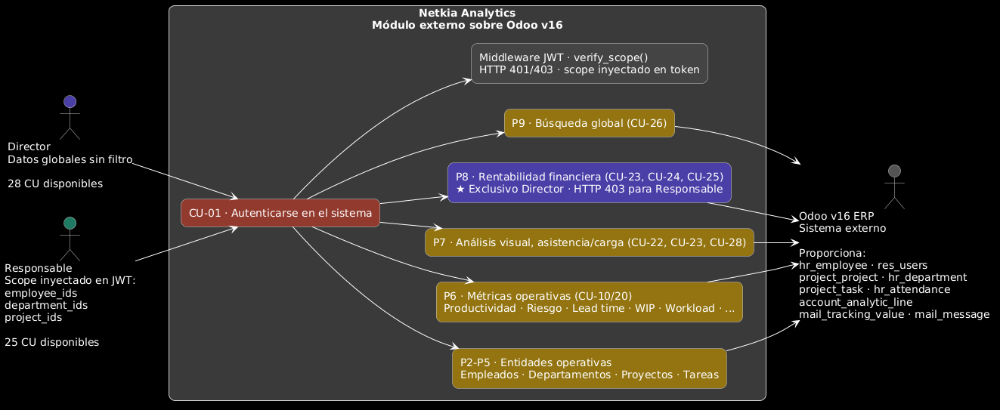
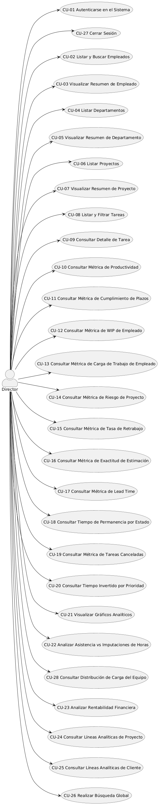
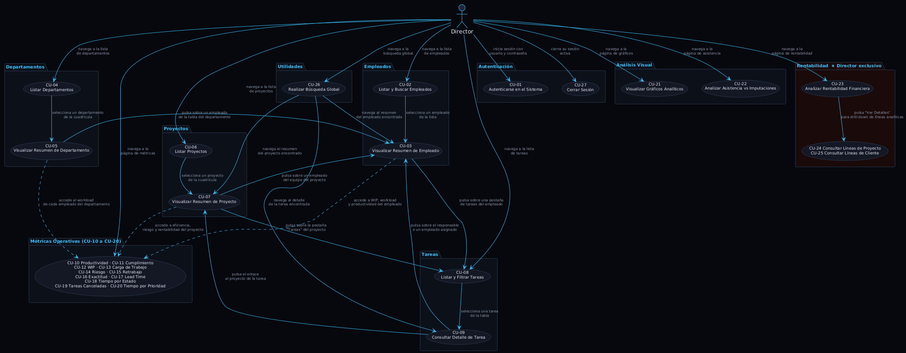
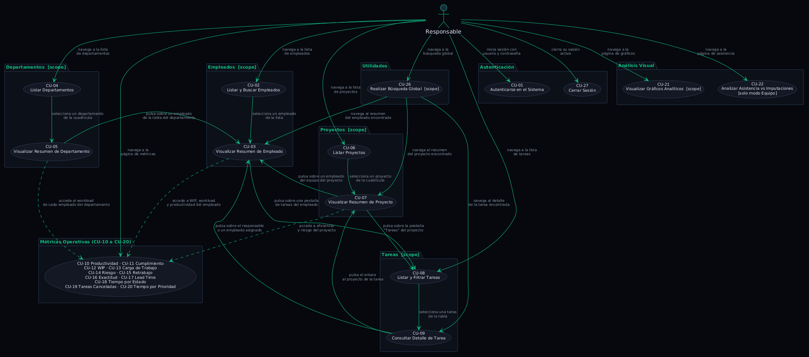

# Disciplina de Requisitos

## Índice

1. [Encontrar Actores y Casos de Uso](#1-encontrar-actores-y-casos-de-uso)
   - 1.1 [Identificación de Actores](#11-identificación-de-actores)
   - 1.2 [Criterio de diseño del modelo](#12-criterio-de-diseño-del-modelo)
   - 1.3 [Lista de Casos de Uso](#13-lista-de-casos-de-uso)
   - 1.4 [Diagramas de Casos de Uso](#14-diagramas-de-casos-de-uso-por-actor)
2. [Priorizar Casos de Uso](#2-priorizar-casos-de-uso)
3. [Detallar Casos de Uso](#3-detallar-casos-de-uso)
4. [Prototipar Casos de Uso](#4-prototipar-casos-de-uso)
5. [Estructurar el Modelo de Casos de Uso](#5-estructurar-el-modelo-de-casos-de-uso)

---

## 1. Encontrar Actores y Casos de Uso

### 1.1 Identificación de Actores

| Actor | Descripción | Identificación en Odoo | Alcance de datos |
|---|---|---|---|
| **Director** | Máximo responsable de la organización. Acceso irrestricto a todo el sistema, incluido el módulo de rentabilidad financiera. | `hr_employee.parent_id == hr_employee.id` (nodo raíz del árbol jerárquico) | Global — sin filtro |
| **Responsable** | Jefe de departamento o responsable de proyecto. Acceso filtrado a su ámbito organizativo calculado en el momento de la autenticación. | Gestiona ≥1 departamento (`hr_department.manager_id`) o proyecto (`project_project.user_id`) | `employee_ids` (CTE recursivo), `department_ids`, `project_ids` embebidos en JWT |

> Los empleados rasos (`role = "empleado"`) **no tienen acceso** al sistema; son redirigidos al login por `ProtectedRoute`.  
> La detección de rol y el cálculo del alcance se realizan en `auth_service.resolve_role_and_scope()` al emitir el JWT.

| Actor externo | Descripción | Conexión |
|---|---|---|
| **Sistema ERP (Odoo v16)** | Actor externo. Fuente única de datos. El módulo de analítica solo lee de su base de datos PostgreSQL. | Solo lectura. No hace peticiones al sistema sino que el sistema lo consulta. |

#### Diagrama de relaciones entre actores y sistema

---

### 1.2 Criterio de diseño del modelo

El modelo se organiza alrededor de un principio de **simetría por entidad**: cada entidad principal del dominio expone exactamente dos casos de uso:

| Entidad | CU de listado/búsqueda | CU de resumen analítico |
|---|---|---|
| Empleado | CU-02 Listar empleados | CU-03 Resumen de empleado |
| Departamento | CU-04 Listar departamentos | CU-05 Resumen de departamento |
| Proyecto | CU-06 Listar proyectos | CU-07 Resumen de proyecto |
| Tarea | CU-08 Listar tareas | CU-09 Detalle de tarea |

Los CU de resumen son el "dashboard analítico" de cada entidad: agregan KPIs, métricas y accesos a recursos relacionados. No son páginas de formulario sino paneles de información. Las métricas operativas (P5) se consumen tanto desde los resúmenes de entidad como desde la página `/métricas`.

---

### 1.3 Identificación de Casos de Uso

A continuación se presenta la lista completa de los 24 casos de uso identificados, organizados en 8 paquetes.

#### Paquete 1 – Autenticación

| ID | Nombre | Actor(es) |
|---|---|---|
| CU-01 | Autenticarse en el Sistema | Director, Responsable |
| CU-27 | Cerrar Sesión | Director, Responsable |

#### Paquete 2 – Entidad: Empleado

| ID | Nombre | Actor(es) | Descripción resumida |
|---|---|---|---|
| CU-02 | Listar y Buscar Empleados | Director, Responsable | Listado paginado con búsqueda, filtro por departamento y estado. Ordenación global server-side. |
| CU-03 | Consultar Resumen de Empleado | Director, Responsable | Dashboard individual: KPIs de WIP, carga de trabajo, productividad 30d y tareas agrupadas por estado (pendientes, completadas, asignadas, responsable). |

#### Paquete 3 – Entidad: Departamento

| ID | Nombre | Actor(es) | Descripción resumida |
|---|---|---|---|
| CU-04 | Listar Departamentos | Director, Responsable | Cuadrícula de departamentos activos con nombre y responsable. |
| CU-05 | Consultar Resumen de Departamento | Director, Responsable | Dashboard de departamento: KPIs de carga (sobrecargados, subcargados, sin tareas), tabla de workload por empleado y nómina. |

#### Paquete 4 – Entidad: Proyecto

| ID | Nombre | Actor(es) | Descripción resumida |
|---|---|---|---|
| CU-06 | Listar Proyectos | Director, Responsable | Cuadrícula de proyectos activos con cliente y código. |
| CU-07 | Consultar Resumen de Proyecto | Director, Responsable | Dashboard de proyecto: KPIs de eficiencia, riesgo y rentabilidad por horas; gráfico est./real; listado de tareas y equipo. |

#### Paquete 5 – Entidad: Tarea

| ID | Nombre | Actor(es) | Descripción resumida |
|---|---|---|---|
| CU-08 | Listar Tareas | Director, Responsable | Punto de acceso único a tareas, con filtros combinables (estado, etapa, proyecto, empleado, fechas, solo padre). El mismo CU se ejecuta desde el contexto global (`/tareas`), desde un proyecto (CU-07) o desde un empleado (CU-03). |
| CU-09 | Consultar Detalle de Tarea | Director, Responsable | Ficha de tarea: info general, personas (responsable + asignados), horas (est./real/restantes con barra de progreso), subtareas. |

#### Paquete 6 – Métricas Operativas

| ID | Nombre | Actor(es) | Descripción resumida |
|---|---|---|---|
| CU-10 | Consultar Productividad | Director, Responsable | Ratio `(planificadas/reales)×100` para tareas cerradas, con ranking y promedio. |
| CU-11 | Consultar Cumplimiento de Plazos | Director, Responsable | Porcentaje de tareas cerradas en fecha (`date_end ≤ date_deadline`). |
| CU-12 | Consultar WIP de Empleado | Director, Responsable | WIP (tareas en paralelo) del empleado, con umbral óptimo ≤3 y estado (OK/Alerta). Requiere empleado. |
| CU-13 | Consultar Carga de Trabajo (Workload) de Empleado | Director, Responsable | Workload `(horas_pend/40h)×100` con estado sobrecargado/normal/subcargado; usado en dashboards de equipo y ficha de empleado. Requiere empleado. |
| CU-14 | Consultar Riesgo de Proyecto | Director, Responsable | Índice de riesgo: tareas vencidas o con ≥80% plazo consumido sobre total abiertas. Requiere proyecto. |
| CU-15 | Consultar Tasa de Retrabajo | Director, Responsable | Porcentaje de tareas reabiertas tras cerrarse (análisis de `mail_tracking_value`). |
| CU-16 | Consultar Exactitud de Estimación | Director, Responsable | Ratio medio real/planificado y sesgo (subestima/sobreestima/preciso). Requiere empleado. |
| CU-17 | Consultar Lead Time | Director, Responsable | Días medios entre `date_assign` y `date_end` de tareas cerradas. |
| CU-18 | Consultar Tiempo por Estado | Director, Responsable | Tabla de etapas con horas medias de permanencia (calculado a partir de `mail_tracking_value`). |
| CU-19 | Consultar Tareas Canceladas | Director, Responsable | % de tareas cuya etapa se llama "Cancelado". |
| CU-20 | Consultar Tiempo por Prioridad | Director, Responsable | Horas medias invertidas por nivel de prioridad (Normal / Urgente). |

#### Paquete 7 – Análisis Visual

| ID | Nombre | Actor(es) | Descripción resumida |
|---|---|---|---|
| CU-21 | Visualizar Gráficos Analíticos | Director, Responsable | Tres gráficos interactivos: evolución de tareas, distribución por estado y horas por cliente (solo Director). |
| CU-22 | Consultar Asistencia vs Imputaciones | Director, Responsable | Comparativa fichadas (`hr_attendance`) vs imputadas (`account_analytic_line`) con serie diaria por empleado. |

#### Paquete 8 – Rentabilidad Financiera _(exclusivo para el director)_

| ID | Nombre | Actor(es) | Descripción resumida |
|---|---|---|---|
| CU-23 | Consultar Rentabilidad Financiera | Director | Análisis completo basado en `amount` de partes analíticos: resumen global, desglose por proyecto, por cliente, drill-down por responsable. |
| CU-24 | Consultar Líneas Analíticas de Proyecto | Director | Drill-down desde CU-23: lista detallada de ingresos y gastos por proyecto, con fechas, nombres y montos individuales de `account_analytic_line`. |
| CU-25 | Consultar Líneas Analíticas de Cliente | Director | Drill-down desde CU-23: lista detallada de ingresos y gastos por cliente, agregando líneas de todos sus proyectos asociados. |

#### Paquete 9 – Utilidades

| ID | Nombre | Actor(es) | Descripción resumida |
|---|---|---|---|
| CU-26 | Realizar Búsqueda Global | Director, Responsable | Búsqueda en tiempo real (debounce 350 ms, ≥2 caracteres) de tareas, proyectos y empleados por nombre/código. |

---

### 1.4 Diagramas de Casos de Uso por Actor

|Director|Responsable|
|--------|-----------|
|||
|[Ver código](./diagramas/actorDirector.puml)|[Ver código](./diagramas/actorResponsable.puml)|

Ambos actores comparten la mayoría de los casos de uso, pero el Director tiene acceso exclusivo al módulo de rentabilidad financiera (CU-23). El Responsable tiene un alcance de datos filtrado en todos los casos de uso, mientras que el Director accede a datos globales sin restricciones.

**Resumen rápido:**
- **Director:** Acceso a los 24 CU sin restricciones (incluido CU-23 de rentabilidad exclusivo).
- **Responsable:** Acceso a CU-01 hasta CU-22 y CU-24, con filtrado automático por scope; HTTP 403 para CU-23.

---

## 2. Priorizar Casos de Uso

### 2.1 Criterios

| Criterio | Descripción | Escala |
|---|---|---|
| **Criticidad** | ¿Bloquea la ejecución de otros CU? | 1–3 |
| **Valor de negocio** | ¿Apoya decisiones estratégicas o tácticas? | 1–3 |
| **Frecuencia de uso** | ¿Se ejecuta en cada sesión o esporádicamente? | 1–3 |
| **Riesgo técnico** | ¿Implica lógica compleja o integración crítica con Odoo? | 1–3 |

### 2.2 Tabla de Priorización

#### Prioridad Alta

| ID | Nombre | Crit. | V.Neg. | Frec. | R.Téc. | **Prioridad** |
|---|---|:---:|:---:|:---:|:---:|:---:|
| CU-02 | Listar Empleados | 2 | 3 | 3 | 1 | **Alta** |
| CU-03 | Resumen Empleado | 2 | 3 | 3 | 2 | **Alta** |
| CU-06 | Listar Proyectos | 2 | 3 | 3 | 1 | **Alta** |
| CU-07 | Resumen Proyecto | 2 | 3 | 2 | 2 | **Alta** |
| CU-08 | Listar Tareas | 3 | 3 | 3 | 2 | **Alta** |
| CU-23 | Rentabilidad Financiera | 3 | 3 | 2 | 3 | **Alta** |
| CU-24 | Líneas Analíticas Proyecto | 1 | 3 | 1 | 2 | **Alta** |
| CU-25 | Líneas Analíticas Cliente | 1 | 3 | 1 | 2 | **Alta** |

#### Prioridad Media

| ID | Nombre | Crit. | V.Neg. | Frec. | R.Téc. | **Prioridad** |
|---|---|:---:|:---:|:---:|:---:|:---:|
| CU-01 | Autenticarse | 1 | 2 | 3 | 2 | **Media** |
| CU-04 | Listar Departamentos | 2 | 2 | 2 | 1 | **Media** |
| CU-05 | Resumen Departamento | 2 | 3 | 2 | 1 | **Media** |
| CU-09 | Detalle de Tarea | 2 | 2 | 3 | 1 | **Media** |
| CU-10 | Productividad | 2 | 3 | 2 | 2 | **Media** |
| CU-11 | Cumplimiento | 2 | 3 | 2 | 1 | **Media** |
| CU-12 | WIP (Empleado) | 2 | 3 | 2 | 2 | **Media** |
| CU-13 | Workload (Empleado) | 2 | 3 | 2 | 2 | **Media** |
| CU-14 | Riesgo Proyecto | 2 | 3 | 2 | 2 | **Media** |
| CU-15 | Retrabajo | 1 | 2 | 1 | 3 | **Media** |
| CU-16 | Exactitud Estimación | 1 | 2 | 1 | 2 | **Media** |
| CU-17 | Lead Time | 2 | 3 | 2 | 2 | **Media** |
| CU-18 | Tiempo por Estado | 2 | 3 | 2 | 2 | **Media** |
| CU-21 | Gráficos Analíticos | 2 | 3 | 2 | 2 | **Media** |
| CU-22 | Asistencia vs Imputaciones | 2 | 3 | 2 | 2 | **Media** |
| CU-26 | Búsqueda Global | 1 | 2 | 3 | 1 | **Media** |
| CU-27 | Cerrar Sesión | 1 | 1 | 3 | 1 | **Media** |

#### Prioridad Baja

| ID | Nombre | Crit. | V.Neg. | Frec. | R.Téc. | **Prioridad** |
|---|---|:---:|:---:|:---:|:---:|:---:|
| CU-19 | Tareas Canceladas | 1 | 2 | 1 | 2 | **Baja** |
| CU-20 | Tiempo por Prioridad | 1 | 2 | 1 | 2 | **Baja** |

> **Prioridad estratégica:** CU-23 (rentabilidad) tiene alta prioridad aunque uso menos frecuente (Director exclusivo). Los sub-flujos de líneas analíticas por proyecto y por cliente se integran dentro del propio CU-23.
> 
> **Riesgo técnico:** CU-15 a CU-20 dependen de `mail_tracking_value` (análisis de etapas), lo que requiere integración cuidadosa con Odoo. CU-23 depende de `account_analytic_line` (partes analíticos).

---

## 3. Detallar Casos de Uso

Todos los casos de uso existentes para esta solución están documentados aquí: [Disciplina de Requisitos – Casos de Uso Detallados](./docs/CasosDeUsoDetallados.md)

### CU-01 – Autenticarse en el Sistema

| Campo | Valor |
|---|---|
| **Actores** | Director, Responsable |
| **Precondición** | El usuario tiene credenciales válidas (login y contraseña) en `res_users` con un `hr_employee` activo vinculado en Odoo. |
| **Postcondición** | JWT almacenado en `localStorage`, cabecera `Authorization: Bearer` inyectada en el cliente Axios. Usuario redirigido a la página principal (`/`). |

**Flujo principal:**
1. El actor navega a `/login` e introduce su **usuario** (login) y **contraseña**.
2. `POST /auth/token {username, password}` → el sistema valida las credenciales contra `res_users`.
3. Si las credenciales son correctas, el sistema localiza el empleado activo vinculado (`res_users.id` → `hr_employee.user_id`).
4. `resolve_role_and_scope()` determina el rol: si `employee.parent_id == employee.id` → `director`; si gestiona departamentos o proyectos → `responsable`; en otro caso → `empleado` (sin acceso).
5. Para el responsable, se calcula el scope mediante CTE recursivo: `employee_ids`, `department_ids`, `project_ids`.
6. Se emite JWT `HS256` (8 h) con `{user_id, employee_id, role, employee_ids, department_ids, project_ids}`.
7. El frontend almacena el token y redirige a `/`.

**Flujos alternativos:**
- `FA-01`: Credenciales incorrectas → HTTP 401, mensaje de error, permanece en login.
- `FA-02`: Sin empleado activo → HTTP 404, permanece en login.
- `FA-03`: Rol `"empleado"` → acceso denegado, mensaje informativo.
- `FA-04`: Token expirado → interceptor Axios detecta HTTP 401, limpia `localStorage`, redirige a `/login`.

**Relaciones:** CU-01 es **precondición** de todos los demás CU.

---

### CU-02 – Listar y Buscar Empleados

| Campo | Valor |
|---|---|
| **Actores** | Director, Responsable |
| **Precondición** | CU-01 completado. |
| **Postcondición** | El actor localiza el empleado buscado y puede navegar a CU-03. |

**Flujo principal:**
1. `GET /employees/` con parámetros `page`, `page_size`, `search`, `department_id`, `active`, `sort_by`, `sort_order`.
2. Tabla paginada (50/página): nombre, departamento, cargo, email, coste/h, badge activo/inactivo.
3. Búsqueda por nombre con debounce de 300 ms. Filtro por departamento (select). Toggle para mostrar solo activos.
4. Ordenación global server-side por cualquier columna (nombre, departamento, cargo, coste/h).
5. Click en fila → CU-03.
6. El Responsable solo visualiza empleados incluidos en su `employee_ids`.

**Relaciones:** Navega a CU-03.

---

### CU-03 – Consultar Resumen de Empleado

| Campo | Valor |
|---|---|
| **Actores** | Director, Responsable |
| **Precondición** | CU-01 completado. El empleado está en el alcance del actor. |
| **Postcondición** | El actor conoce el estado completo del empleado: carga, WIP, productividad y tareas. |

**Flujo principal:**
1. El actor accede a `/empleados/{id}` (desde CU-02 o CU-05).
2. El sistema verifica `verify_employee_scope`. Carga en paralelo: `GET /employees/{id}` y `GET /dashboards/summary/employee/{id}` (que internamente ejecuta WorkloadService, WIPService y ProductivityService).
3. Cabecera con avatar de inicial, nombre, cargo, departamento, email, coste/h y badge de estado de carga.
4. 4 KPIs: tareas pendientes + horas pendientes · vencidas sin cerrar · WIP actual · productividad últimos 30d.
5. Sección "Hoy": tarjeta de tareas asignadas hoy (filtradas client-side por `isToday(date_assign)`) y tarjeta de vencidas sin cerrar. Cada tarjeta abre CU-08 con filtros pre-rellenados.
6. Sección de tareas con cuatro pestañas, cada una ejecutando `GET /tasks/filter` con parámetros distintos:
   - **Pendientes**: `?employee_id={id}&status=pending` con filtro de fecha opcional.
   - **Completadas**: `?employee_id={id}&status=completed` con filtro de fecha opcional.
   - **Asignadas**: `?employee_id={id}` con filtro de fecha y toggle Todas/Abiertas/Cerradas.
   - **Responsable**: `?employee_id={id}&responsable=true` con filtro de fecha opcional.
7. Click en tarea → CU-09.

**Flujos alternativos:**
- `FA-01`: Empleado fuera del scope → HTTP 403.
- `FA-02`: Empleado sin `user_id` vinculado → pestañas vacías, workload y WIP a 0.

**Relaciones:** `<<extend>>` por CU-08 (listados de tareas contextuales). Navega a CU-09.

---

### CU-04 – Listar Departamentos

| Campo | Valor |
|---|---|
| **Actores** | Director, Responsable |
| **Precondición** | CU-01 completado. |
| **Postcondición** | El actor localiza el departamento y puede navegar a CU-05. |

**Flujo principal:**
1. `GET /departments/` → lista de departamentos activos.
2. El Responsable solo visualiza los departamentos incluidos en su `department_ids`.
3. Cuadrícula de tarjetas con nombre, manager y nombre jerárquico completo.
4. Click en tarjeta → CU-05.

**Flujos alternativos:**
- `FA-01`: Sin departamentos en el scope → estado vacío.

**Relaciones:** Navega a CU-05.

---

### CU-05 – Consultar Resumen de Departamento

| Campo | Valor |
|---|---|
| **Actores** | Director, Responsable |
| **Precondición** | CU-01 completado. El departamento está en el alcance del actor. |
| **Postcondición** | El actor conoce el estado de carga del departamento y puede navegar a sus empleados. |

**Flujo principal:**
1. El actor accede a `/departamentos/{id}` (desde CU-04).
2. El sistema verifica `verify_department_scope`. Carga en paralelo: `GET /departments/{id}` y `GET /departments/{id}/workload-summary`.
3. Cabecera con nombre del departamento y manager.
4. 4 KPIs: total empleados · sobrecargados · subcargados · sin tareas.
5. Si hay empleados sobrecargados → banner rojo con sus nombres.
6. **Pestaña Carga de trabajo**: tabla ordenable con nombre, tareas pendientes, horas pendientes, tareas completadas, barra de % de carga y badge de estado. Click en empleado → CU-03.
7. **Pestaña Empleados**: `GET /departments/{id}/employees` → tabla con cargo, email, coste/h y badge activo. Click en empleado → CU-03.

**Flujos alternativos:**
- `FA-01`: Responsable sin acceso al departamento → HTTP 403.
- `FA-02`: Departamento sin empleados activos → pestañas vacías.

**Relaciones:** Navega a CU-03.

---

### CU-06 – Listar Proyectos

| Campo | Valor |
|---|---|
| **Actores** | Director, Responsable |
| **Precondición** | CU-01 completado. |
| **Postcondición** | El actor localiza el proyecto y puede navegar a CU-07. |

**Flujo principal:**
1. `GET /projects/` → lista de proyectos activos.
2. El Responsable solo visualiza los proyectos incluidos en su `project_ids`.
3. Cuadrícula de tarjetas con nombre del proyecto, cliente (`partner_name`) y código.
4. Click en tarjeta → CU-07.

**Flujos alternativos:**
- `FA-01`: Sin proyectos en el scope → estado vacío.

**Relaciones:** Navega a CU-07.

---

### CU-07 – Consultar Resumen de Proyecto

| Campo | Valor |
|---|---|
| **Actores** | Director, Responsable |
| **Precondición** | CU-01 completado. El proyecto está en el alcance del actor. |
| **Postcondición** | El actor conoce el estado completo del proyecto: eficiencia, riesgo, rentabilidad, tareas y equipo. |

**Flujo principal:**
1. El actor accede a `/proyectos/{id}` (desde CU-06 o resultado de CU-26).
2. El sistema verifica `verify_project_scope`. Carga en paralelo: `GET /projects/{id}`, `/dashboards/summary/project/{id}` y `/tasks/stages`.
3. Cabecera con nombre, cliente y badges de estado: Rentable/Pérdidas y nivel de riesgo bajo/medio/alto.
4. 4 KPIs: índice de eficiencia · índice de riesgo % · rentabilidad % · total tareas.
5. Gráfico de barras: horas estimadas vs. reales.
6. **Pestaña Tareas**: `GET /projects/{id}/tasks` con paginación, filtro por estado (Todas/Pendientes) y por etapa. Click en tarea → CU-09.
7. **Pestaña Equipo**: `GET /projects/{id}/employees` → empleados con horas imputadas y coste/h. Click en empleado → CU-03.

**Flujos alternativos:**
- `FA-01`: Sin horas imputadas → rentabilidad y eficiencia a 0.
- `FA-02`: Responsable sin acceso al proyecto → HTTP 403.

**Relaciones:** Navega a CU-03 y CU-09.

---

### CU-08 – Listar Tareas

| Campo | Valor |
|---|---|
| **Actores** | Director, Responsable |
| **Precondición** | CU-01 completado. |
| **Postcondición** | El actor localiza las tareas buscadas o accede al detalle (CU-09). |

**Flujo principal:**
1. Se ejecuta desde tres contextos:
   - **Global** (`/tareas`): el actor configura filtros manualmente.
   - **Desde CU-07**: `project_id` pre-rellenado.
   - **Desde CU-03**: `employee_id` (y opcionalmente `status`) pre-rellenados.
2. `GET /tasks/filter` con parámetros combinables: `status`, `stage_id`, `project_id`, `employee_id`, `date_from`, `date_to`, `date_assign`, `root_only`, `sort_by`, `sort_order`, `page`, `page_size`. Si `stage_id` está presente, tiene prioridad sobre `status`.
3. Tabla paginada (25/página): nombre, etapa (badge), horas estimadas, deadline (rojo+⚠ si vencida y abierta), fecha cierre, estado (badge).
4. Ordenación global server-side. Click en tarea → CU-09.
5. El Responsable tiene sus tareas restringidas automáticamente a sus `project_ids`.

**Flujos alternativos:**
- `FA-01`: Sin tareas con los filtros aplicados → estado vacío con mensaje.
- `FA-02`: Responsable filtrando por proyecto fuera de su scope → HTTP 403.

**Relaciones:** Navega a CU-09.

---

### CU-09 – Consultar Detalle de Tarea

| Campo | Valor |
|---|---|
| **Actores** | Director, Responsable |
| **Precondición** | CU-01 completado. La tarea pertenece a un proyecto en el alcance del actor. |
| **Postcondición** | El actor conoce todos los datos de la tarea. |

**Flujo principal:**
1. `GET /tasks/{id}` → `TaskService.get_task_detail()` devuelve la ficha completa.
2. Cabecera con nombre, badges de etapa, vencida (si aplica), subtarea (si `parent_id`) y número de subtareas.
3. **Sección Información general**: proyecto (link a CU-07), deadline (rojo si vencida), fecha de cierre, fecha de asignación.
4. **Sección Personas**: responsable como pill clickable (link a CU-03) y empleados asignados como pills clickables (links a CU-03).
5. **Sección Horas** (solo si `planned_hours > 0`): KPIs de horas estimadas, invertidas y restantes; barra de progreso (roja si >100%); métrica de productividad `(estimadas/reales)×100`.
6. **Sección Subtareas** (si las hay): lista de subtareas clickables, cada una abre CU-09 recursivamente.
7. Si `parent_id` existe → enlace a la tarea padre (CU-09). Panel lateral con metadatos: ID, prioridad, kanban state.

**Flujos alternativos:**
- `FA-01`: Tarea no encontrada → HTTP 404.
- `FA-02`: Responsable con tarea fuera de sus proyectos → HTTP 403.

**Relaciones:** Navega a CU-03, CU-07, CU-09 (recursivo en subtareas).

---

### CU-10 – Consultar Productividad

| Campo | Valor |
|---|---|
| **Actores** | Director, Responsable |
| **Precondición** | CU-01. |
| **Postcondición** | El actor conoce la eficiencia de ejecución frente a la estimación. |

**Flujo principal:**
1. El actor navega a `/métricas`. Se pre-cargan datos de soporte: `GET /employees/?page_size=200` y `GET /projects/`.
2. Al hacer click en la tarjeta "Productividad" se ejecuta `GET /metrics/productivity` con filtros opcionales por empleado, proyecto y rango de fechas.
3. `ProductivityService.calculate()` obtiene tareas cerradas con `planned_hours > 0` y `actual_hours > 0`. Fórmula: `(planned / actual) × 100`.
4. Gauge con % promedio y total de tareas; gráfico de barras horizontal con el top 8 de tareas.
5. El Responsable sin filtros recibe el agregado ponderado de todos sus proyectos.

**Relaciones:** Accesible desde `/métricas`.

---

### CU-11 a CU-20 – Métricas restantes

> Los CU-11 (Cumplimiento), CU-12 (WIP), CU-13 (Workload), CU-14 (Riesgo), CU-15 (Retrabajo), CU-16 (Exactitud Estimación), CU-17 (Lead Time), CU-18 (Tiempo por Estado), CU-19 (Tareas Canceladas) y CU-20 (Tiempo por Prioridad) se documentan con el mismo nivel de detalle en [Casos de Uso Detallados](./docs/CasosDeUsoDetallados.md). Todos comparten el patrón de acceso a través de `/métricas` y se presentan en tarjetas interactivas con panel de detalle lateral.

---

### CU-21 – Visualizar Gráficos Analíticos

| Campo | Valor |
|---|---|
| **Actores** | Director, Responsable |
| **Precondición** | CU-01. |
| **Postcondición** | El actor analiza tendencias y distribuciones visualmente. |

**Flujo principal:**
1. El actor navega a `/gráficos`. Al cargar se obtienen: `GET /employees/`, `GET /departments/`, `GET /projects/`.
2. El actor configura el rango de fechas (atajos 30d/3m/6m/1a), agrupación (semana/mes) y tipo de filtro (empresa/empleado/departamento/proyecto).
3. Se cargan tres gráficos en paralelo: `GET /charts/task-evolution`, `GET /charts/task-distribution`, `GET /metrics/client-distribution` (solo Director).
4. **Gráfico 1** (LineChart): evolución de tareas completadas / abiertas / vencidas por período.
5. **Gráfico 2** (PieChart): distribución de tareas por etapa con % inline.
6. **Gráfico 3** (BarChart horizontal): horas registradas por cliente — solo visible para el Director.
7. Al cambiar agrupación o filtros, se recalcula con una nueva petición.

**Flujos alternativos:**
- `FA-01`: Sin datos en el período → cada gráfico muestra "Sin datos".
- `FA-02`: El Responsable no ve `client-distribution`; datos filtrados por `project_ids`.

**Relaciones:** `<<include>>` CU-02 (empleados), CU-04 (departamentos), CU-06 (proyectos) para los selectores de filtro.

---

### CU-22 – Consultar Asistencia vs Imputaciones

| Campo | Valor |
|---|---|
| **Actores** | Director, Responsable |
| **Precondición** | CU-01. |
| **Postcondición** | El actor detecta discrepancias entre la presencia física y las horas imputadas. |

**Flujo principal:**
1. El actor navega a `/asistencia`. Rango por defecto: mes actual.
2. Al cargar: `GET /employees/managers/list` y `GET /departments/`.
3. Modo de vista: **Equipo global** o **Por responsable** (solo Director). Filtros de rango de fechas y departamento.
4. Equipo global: `GET /employees/attendance/comparison?date_from&date_to [&department_id]`. Por responsable: `GET /employees/attendance/manager/{id}?date_from&date_to`.
5. Por empleado: `attendance_hours`, `timesheet_hours`, `diff`, `coverage_pct = (timesheet / attendance) × 100`.
6. 4 KPIs · gráfico de barras (top 15) · tabla con badge de cobertura (OK ≥95 % · Revisar ≥80 % · Alerta <80 %).
7. Click en empleado → `GET /employees/attendance/{id}/daily` → panel expandido con serie diaria.

**Flujos alternativos:**
- `FA-01`: Sin datos → KPIs a 0 y tabla vacía.
- `FA-02`: Responsable → no dispone del modo "Por responsable".

**Relaciones:** `<<include>>` CU-02 (empleados), CU-04 (departamentos) para los selectores de filtro.

---

### CU-23 – Consultar Rentabilidad Financiera

| Campo | Valor |
|---|---|
| **Actores** | **Director** (exclusivo) |
| **Precondición** | CU-01 con `role = "director"`. |
| **Postcondición** | El Director conoce la rentabilidad real por proyecto, cliente y responsable. |

**Flujo principal:**
1. El actor navega a `/rentabilidad`. Selecciona rango de fechas y modo de filtro: Global · Por proyecto · Por responsable.
2. Datos de `account_analytic_line.amount` (positivo = ingreso, negativo = gasto).
3. `GET /metrics/profitability/summary` → 4 KPIs: ingresos · gastos · neto · rentabilidad %.
4. Gráfico de barras agrupadas (ingresos vs. gastos por proyecto, top 12) y donut de estados (Ganancia/Neutro/Pérdida).
5. **Pestaña Por proyecto**: `GET /metrics/profitability/per-project` con botón "Ver Detalles" (extiende a CU-24).
6. **Pestaña Por cliente**: `GET /metrics/profitability/per-client` con botón "Ver Detalles" (extiende a CU-25).
7. En modo "Por responsable": selector de manager; botón "Ver detalle →" carga panel individual con `GET /metrics/profitability/manager/{id}`.

**Flujos alternativos:**
- `FA-01`: Sin partes analíticos → todo a 0.
- `FA-02`: Responsable intentando acceder → HTTP 403, pantalla "Acceso restringido".

**Relaciones:** `<<extend>>` por CU-24 (líneas por proyecto) y CU-25 (líneas por cliente).

---

### CU-24 – Consultar Líneas Analíticas de Proyecto

| Campo | Valor |
|---|---|
| **Actores** | **Director** (exclusivo) |
| **Precondición** | CU-01 con `role = "director"`. Proyecto seleccionado en CU-23. |
| **Postcondición** | El Director conoce el desglose de ingresos y gastos individuales del proyecto. |

**Flujo principal:**
1. Desde CU-23, el actor hace click en "Ver Detalles" en una fila de proyecto.
2. `GET /metrics/profitability/per-project/{project_id}/lines` con filtros opcionales de fecha y manager.
3. Las líneas de `account_analytic_line` se separan en `incomes` (amount ≥ 0) y `expenses` (amount < 0).
4. Dos tablas: **Ingresos** y **Gastos** con fecha · nombre · importe · horas.

**Flujos alternativos:**
- `FA-01`: Sin líneas en el período → tablas vacías.

**Relaciones:** `<<extend>>` desde CU-23.

---

### CU-25 – Consultar Líneas Analíticas de Cliente

| Campo | Valor |
|---|---|
| **Actores** | **Director** (exclusivo) |
| **Precondición** | CU-01 con `role = "director"`. Cliente seleccionado en CU-23. |
| **Postcondición** | El Director conoce el desglose de ingresos y gastos individuales del cliente. |

**Flujo principal:**
1. Desde CU-23, el actor hace click en "Ver Detalles" en una fila de cliente.
2. `GET /metrics/profitability/per-client/{client_id}/lines` con filtros opcionales de fecha, proyecto y manager.
3. Líneas de todos los proyectos del cliente, separadas en `incomes` y `expenses`.
4. Dos tablas con fecha · nombre · importe · horas · project_id.

**Flujos alternativos:**
- `FA-01`: Sin líneas → tablas vacías.

**Relaciones:** `<<extend>>` desde CU-23.

---

### CU-26 – Realizar Búsqueda Global

| Campo | Valor |
|---|---|
| **Actores** | Director, Responsable |
| **Precondición** | CU-01. Mínimo 2 caracteres. |
| **Postcondición** | Localiza recurso y navega a su detalle. |

**Flujo principal:**
1. Navega a `/buscar` o acceso directo en sidebar.
2. ≥ 2 caracteres → debounce 350 ms.
3. `GET /search/?q=texto&entity=all` → tareas, proyectos, empleados; máx. 10 por tipo.
4. Responsable: filtrado por scope.
5. Botones [Todos][Tareas][Proyectos][Empleados].
6. Click: tarea → CU-09 · proyecto → CU-07 · empleado → CU-03.

**Flujos alternativos:**
- `FA-01`: Sin resultados → estado vacío.

**Relaciones:** Navega a CU-03, CU-07, CU-09.

---

## 4. Prototipar Casos de Uso

Los prototipos de baja fidelidad presentados a continuación representan la disposición visual de cada pantalla del sistema. Cada prototipo ilustra la estructura de la interfaz, la organización de los datos y los puntos de interacción disponibles para el usuario, sirviendo como referencia para la implementación del frontend en React.

### Prototipo CU-01 – Autenticarse
Formulario de login centrado con campos de usuario y contraseña, botón de acceso y área de mensajes de error. Incluye el logo de la aplicación y la indicación de acceso restringido.

---

### Prototipo CU-02 – Listar Empleados
Tabla paginada con barra de búsqueda por nombre, selector de departamento y toggle de empleados activos. Las columnas incluyen nombre, departamento, cargo, email, coste/h y badge de estado. Cada fila es clickable para acceder al resumen del empleado.

---

### Prototipo CU-03 – Resumen de Empleado
Dashboard individual con cabecera de perfil (avatar, nombre, cargo, badge de carga), cuatro KPIs principales y sección "Hoy" con tarjetas de asignadas y vencidas. En la parte inferior, cuatro pestañas de tareas (pendientes, completadas, asignadas, responsable) con filtro de fechas.

---
### Prototipo CU-04 – Listar Departamentos
Cuadrícula de tarjetas con el nombre del departamento, el manager asignado y el nombre jerárquico. Cada tarjeta navega al resumen del departamento.

---
### Prototipo CU-05 – Resumen de Departamento
Dashboard de departamento con cabecera (nombre + manager), cuatro KPIs de distribución de carga, banner de alerta para empleados sobrecargados y dos pestañas: carga de trabajo (tabla ordenable con barra de %) y listado de empleados.

---
### Prototipo CU-06 – Listar Proyectos
Cuadrícula de tarjetas similar a CU-04, mostrando nombre del proyecto, cliente asociado y código. Cada tarjeta navega al resumen del proyecto.

---
### Prototipo CU-07 – Resumen de Proyecto
Dashboard de proyecto con cabecera (nombre, cliente, badges de rentabilidad y riesgo), cuatro KPIs (eficiencia, riesgo, rentabilidad, total tareas), gráfico de barras estimadas vs. reales y dos pestañas: tareas del proyecto (con filtro por etapa) y equipo (con horas imputadas).

---
### Prototipo CU-08 – Listar Tareas
Tabla paginada con barra de filtros combinables: selector de estado, selector de etapa, selector de proyecto, rango de fechas y checkbox "solo tareas padre". Columnas: nombre, etapa, horas estimadas, deadline (con indicador de vencida), fecha cierre y estado.

---
### Prototipo CU-09 – Detalle de Tarea
Ficha de tarea organizada en dos columnas. Izquierda: información general (proyecto, deadline, fechas), personas (responsable y asignados como pills clickables), horas (tres KPIs + barra de progreso + productividad) y subtareas. Derecha: panel de metadatos (ID, prioridad, tarea padre).

---
### Prototipo P6 – Métricas Operativas (CU-10 a CU-20)
Página `/métricas` con layout de dos columnas: izquierda con cuadrícula de tarjetas métricas (cada una con icono, valor preview y mini gráfico), derecha con panel de detalle de la métrica seleccionada (gráficos, KPIs y texto explicativo). Panel superior de filtros con selector de empleado/proyecto y rango de fechas. Agrupación por categoría (todas, por proyecto, por empleado, generales).

---
### Prototipo CU-21 – Gráficos Analíticos
Página `/gráficos` con barra de filtros (fechas, agrupación semana/mes, tipo de entidad) y tres gráficos en cuadrícula 2×2: evolución de tareas, distribución por etapa y horas por cliente (solo Director).

---
### Prototipo CU-22 – Asistencia vs Imputaciones
Página `/asistencia` con filtro por equipo global o por responsable, filtros de fecha y departamento. Sección superior con cuatro KPIs, gráfico de barras agrupadas (fichadas vs. imputadas, top 15) y tabla de empleados con badge de cobertura. Al hacer click en un empleado se expande un panel inferior con serie diaria y línea de diferencia.

---
### Prototipo CU-23 – Rentabilidad Financiera
Página `/rentabilidad` con filtros de fecha y modo (global/proyecto/responsable). Cuatro KPIs superiores (ingresos, gastos, neto, rentabilidad %), gráfico de barras agrupadas (top 12) y donut de estados. Dos pestañas: por proyecto y por cliente, ambas con tabla y botón "Ver Detalles" para drill-down a líneas analíticas (CU-24/CU-25).

---
### Prototipo CU-24/CU-25 – Líneas Analíticas por Proyecto/Cliente
Panel de drill-down accesible desde CU-23 que muestra dos tablas paralelas: ingresos y gastos, con columnas de fecha, descripción, importe y horas. En el caso de líneas por cliente se añade la columna de proyecto.

---
### Prototipo CU-26 – Búsqueda Global
Página `/buscar` con campo de búsqueda prominente y botones de filtro por tipo de entidad (Todos, Tareas, Proyectos, Empleados). Los resultados se muestran como tarjetas con icono del tipo, nombre, código y badge de categoría. Cada resultado navega directamente al detalle correspondiente.

---

## 5. Estructurar el Modelo de Casos de Uso

### 5.1 Diagrama de Contexto – Director

El Director tiene acceso a todos los casos de uso sin restricciones de alcance. Además, es el único actor que puede acceder a CU-23 (Rentabilidad Financiera).

---

### 5.2 Diagrama de Contexto – Responsable

El Responsable tiene acceso a la mayoría de los casos de uso, pero con restricciones de alcance basadas en sus `employee_ids`, `department_ids` y `project_ids`.

---

### 5.3 Relaciones Include / Extend del Modelo

Para la correcta interpretación del modelo, se han definido dos tipos de relaciones fundamentales:

#### 1. Relaciones de Inclusión `<<include>>`
Representan comportamientos **obligatorios y reutilizados** que se insertan en el flujo de un caso de uso base.
* **Nota sobre autenticación:** CU-01 se trata como **precondición transversal** (sesión/JWT) y **no** como `<<include>>`.
* **Ejemplos reales:**
  - *"obtener lista de departamentos para filtro"* (CU-21/CU-22 incluyen CU-04).
  - *"cargar lista de empleados y proyectos para selectores"* (CU-21 incluye CU-02 y CU-06).

#### 2. Relaciones de Extensión `<<extend>>`
Representan funcionalidades **opcionales/condicionales** donde un caso de uso base incorpora el comportamiento de otro.

| Caso de Uso Base | Caso de Uso Extendido (`<<extend>>`) | Condición de Extensión |
| :--- | :--- | :--- |
| **CU-03** (Resumen Empleado) | **CU-08** (Listar Tareas) | Cuando el actor pulsa tarjetas/pestañas para ver listados de tareas con filtros. |
| **CU-23** (Rentabilidad) | **CU-24** (Líneas por Proyecto) | Cuando el actor solicita el drill-down de líneas analíticas por Proyecto. |
| **CU-23** (Rentabilidad) | **CU-25** (Líneas por Cliente) | Cuando el actor solicita el drill-down de líneas analíticas por Cliente. |