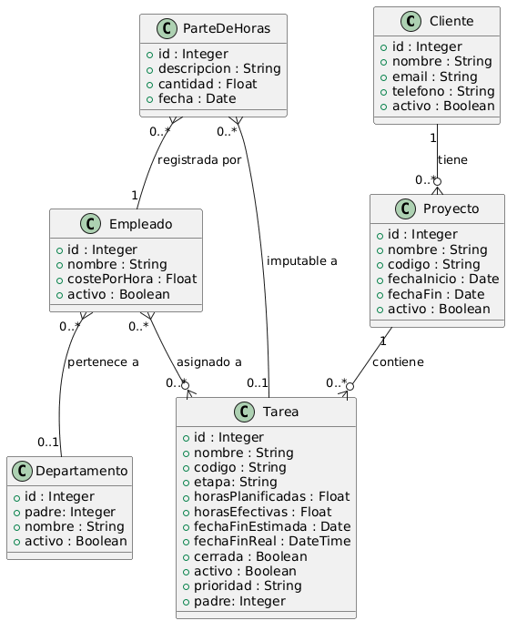
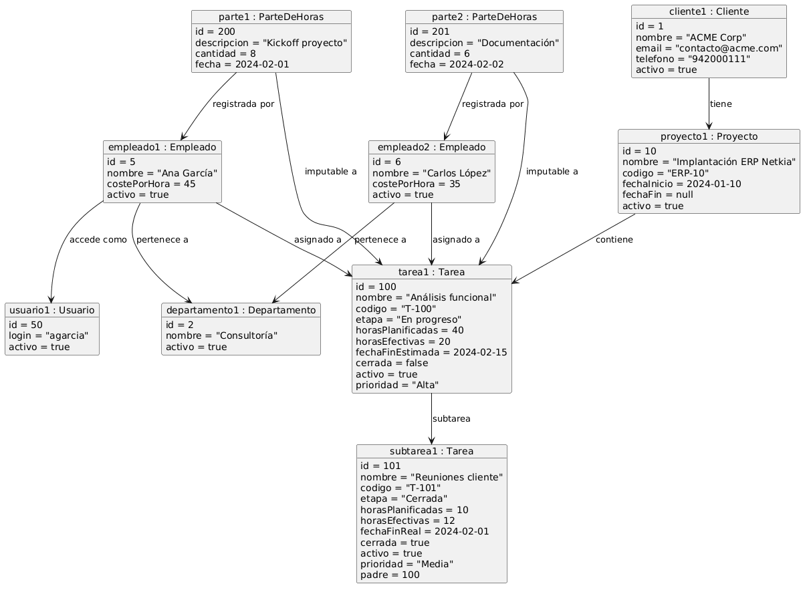
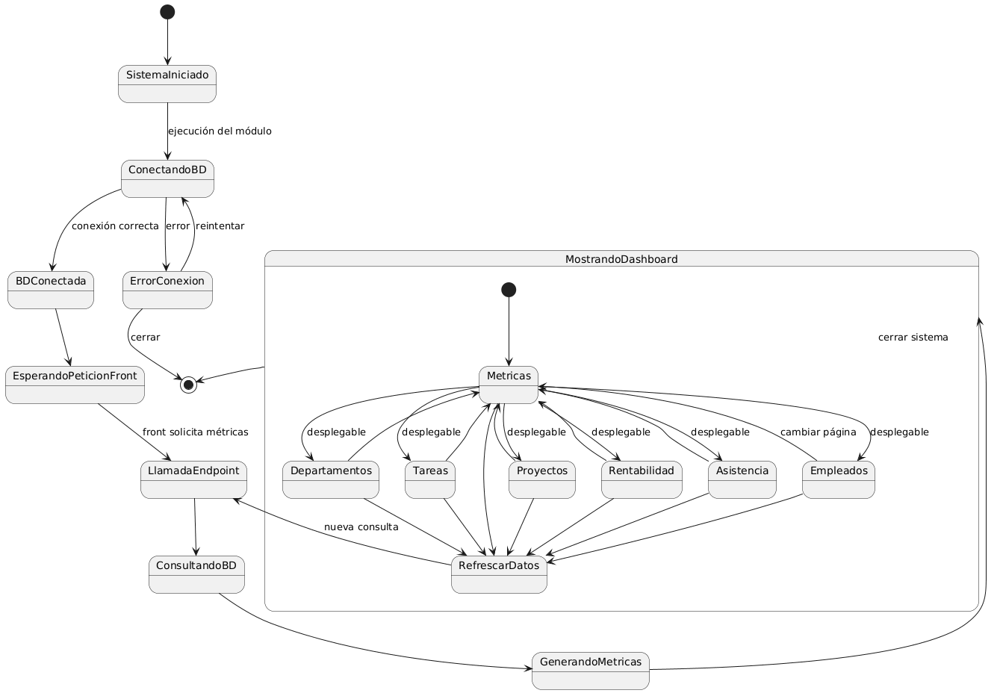
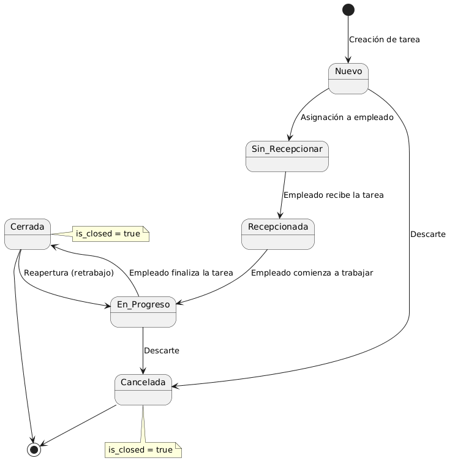

# 2.1 Modelo del Dominio

El sistema se compone de una aplicación web analítica conectada a la base de datos del ERP en modo lectura, cuya función principal es consumir los datos del ERP Odoo, estructurarlos y transformarlos en información útil para la toma de decisiones. Por ello, el modelo del dominio no introduce nuevas entidades de negocio, sino que se apoya en las ya existentes en Odoo, garantizando coherencia con la base de datos corporativa y evitando inconsistencias.

En las siguientes secciones se presentan los diferentes diagramas que conforman el modelo del dominio: el diagrama de clases, el diagrama de objetos, el diagrama de estados y el glosario de términos, proporcionando una visión completa de la estructura conceptual del sistema.

## 2.1.1 Diagrama de Clases

En el contexto de Netkia, el diagrama de clases está directamente alineado con la estructura de datos del ERP Odoo v16, lo que garantiza la consistencia entre la información almacenada en el sistema de gestión y los indicadores generados por el módulo analítico. Cada clase representa una entidad real del entorno organizativo, como clientes, proyectos, tareas, empleados o departamentos, y refleja los atributos necesarios para calcular métricas de productividad, carga de trabajo y rentabilidad.

Las relaciones entre las clases permiten entender la jerarquía y dependencia entre los elementos del sistema. Por ejemplo, un cliente puede tener múltiples proyectos, cada proyecto puede contener varias tareas, y cada tarea puede estar asociada a diferentes empleados y partes de horas. Esta estructura refleja el flujo natural del trabajo dentro de la empresa y facilita la obtención de indicadores agregados.

## 2.1.2 Diagrama de Objetos

El diagrama de objetos complementa al diagrama de clases mostrando una instancia concreta del modelo del dominio en un escenario realista dentro de Netkia SL. Mientras que el diagrama de clases describe la estructura general del sistema, el diagrama de objetos permite observar cómo se materializan esas clases en situaciones reales de uso.

En este caso, se representa un proyecto real con sus correspondientes tareas, subtareas, empleados asignados y partes de horas registrados. Esta representación facilita la comprensión del funcionamiento del sistema, ya que muestra cómo los datos se relacionan en la práctica y cómo se organizan dentro del ERP.

El objetivo principal de este diagrama es ilustrar el flujo de información desde el cliente hasta las tareas y los registros de horas, permitiendo visualizar de forma clara la interacción entre los distintos elementos del dominio. De esta forma, se puede entender cómo el sistema es capaz de generar métricas a partir de los datos reales de trabajo, como la productividad, la carga de trabajo o la eficiencia de los proyectos.

## 2.1.3 Diagrama de Estados

En este apartado se presentan dos diagramas de estados: el primero describe el comportamiento general del sistema de métricas y dashboards, mientras que el segundo representa el ciclo de vida de una tarea dentro del sistema de gestión de proyectos.

### Diagrama de estados del sistema

Este diagrama representa el comportamiento general del sistema desde que se ejecuta el módulo hasta que el usuario navega por los distintos dashboards de métricas permitiendo comprender el flujo completo de funcionamiento del sistema, desde la conexión con la base de datos hasta la visualización de la información en los dashboards.

El sistema comienza en el estado SistemaIniciado, momento en el que se ejecuta el backend y el frontend. A continuación, el sistema pasa al estado ConectandoBD, donde se establece la conexión con la base de datos PostgreSQL. Si la conexión se realiza correctamente, el sistema pasa a BDConectada y queda en espera de peticiones del frontend en el estado EsperandoPeticionFront. En caso de error, se transita al estado ErrorConexion, desde donde se puede reintentar la conexión o cerrar el sistema.

Cuando el frontend solicita información mediante llamadas a los endpoints del backend, el sistema pasa al estado LlamadaEndpoint, donde se procesa la petición. Posteriormente, se accede a la base de datos en el estado ConsultandoBD, se calculan las métricas en GenerandoMetricas y finalmente se muestran los resultados en el estado MostrandoDashboard.

Dentro del estado MostrandoDashboard, el usuario puede navegar entre las distintas páginas del sistema mediante un desplegable, accediendo a los dashboards de métricas, empleados, departamentos, tareas, proyectos, rentabilidad y asistencia. Además, en cualquier momento se pueden refrescar los datos, lo que provoca una nueva llamada a los endpoints y una nueva consulta a la base de datos.

El sistema finaliza cuando el usuario cierra el módulo, pasando al estado final.

### Diagrama de estados de una tarea

Este diagrama refleja las transiciones más comunes dentro de su ciclo de vida, como la creación de la tarea, su asignación a un empleado, el inicio del trabajo, su finalización o su cancelación. Además, contempla la posibilidad de reapertura de tareas cerradas, lo que permite modelar situaciones de retrabajo o correcciones dentro del sistema.

Aunque el módulo de métricas no gestiona directamente la creación o modificación de tareas, las métricas y dashboards dependen del estado en el que se encuentran, por lo que es necesario comprender su evolución.
Este diagrama permite interpretar correctamente los datos obtenidos de la base de datos y entender cómo influyen en los indicadores mostrados en el sistema.

## 2.1.4 Glosario de términos

Con el objetivo de facilitar la comprensión del modelo del dominio, se presentan dos glosarios: uno general que describe los conceptos del sistema y del ERP, y otro específico que define las métricas utilizadas en los dashboards analíticos.

### 2.1.4.1 Glosario general
| Término | Definición  |
| ------------------------------ | -------------------------------------------------------------------------------------------------------------------------------------------------------------------------------------------------------------- |
| **ERP Odoo** | Sistema de planificación de recursos empresariales utilizado por la empresa para gestionar proyectos, tareas, empleados, clientes y registros de horas. El módulo analítico consume sus datos en modo lectura. |
| **PostgreSQL**   | Sistema de gestión de base de datos utilizado por Odoo para almacenar toda la información del ERP.      |
| **Modo lectura** | Forma de acceso a la base de datos en la que el sistema solo consulta datos sin modificarlos, garantizando la integridad de la información del ERP. |
| **Proyecto**  | Conjunto de tareas asociadas a un cliente o área de trabajo que permite organizar y controlar el desarrollo de actividades.  |
| **Tarea**  | Unidad de trabajo dentro de un proyecto que puede ser asignada a uno o varios empleados y sobre la que se registran partes de horas.   |
| **Tarea raíz**                 | Tarea sin `parent_id`, que representa una unidad de trabajo principal dentro de un proyecto.               |
| **Subtarea**  | Tarea cuyo campo `parent_id` apunta a otra tarea, permitiendo descomponer el trabajo en actividades más pequeñas.   |
| **Empleado**  | Usuario del sistema que puede estar asignado a tareas y registrar partes de horas en el ERP. |
| **Departamento**               | Unidad organizativa que agrupa empleados y permite analizar la actividad por áreas de trabajo. |
| **Cliente** | Entidad externa para la cual se desarrollan proyectos o tareas dentro del sistema. |
| **Parte de horas (Timesheet)** | Registro del tiempo trabajado por un empleado en una tarea o proyecto en una fecha concreta, almacenado en `account_analytic_line`.|
| **Etapa**                      | Estado funcional de una tarea dentro del flujo de trabajo del proyecto (kanban). Puede marcarse como cerrada. |
| **Responsable**| Empleado encargado del seguimiento de una tarea o proyecto. |
| **Endpoint** | Punto de acceso del backend que permite al frontend solicitar información mediante peticiones HTTP.|
| **API REST** | Interfaz de comunicación entre frontend y backend para obtener datos del ERP y generar métricas. |
| **Dashboard** | Interfaz visual que agrupa indicadores y métricas para facilitar la supervisión y la toma de decisiones. |
| **KPI** | Indicador clave de rendimiento utilizado para medir la eficiencia de empleados, tareas o proyectos.  |
| **Métrica**  | Valor calculado a partir de los datos del ERP que permite analizar el rendimiento del sistema o de la organización. |

### 2.1.4.2 Glosario de métricas
| Métrica  | Definición |
| --------------------------------------------------- | -------------------------------------------------------------------------------------------------------------------------------------------------------------------------- |
| **Asistencia (Attendance)** | Compara las horas fichadas por los empleados con las horas trabajadas en tareas para medir el nivel real de actividad y presencia en el sistema.|
| **Tareas canceladas (Cancelled Tasks)**  | Número o porcentaje de tareas que han sido canceladas en un periodo determinado, utilizado para analizar la calidad de la planificación y la estabilidad de los proyectos. |
| **Distribución por cliente (Client Distribution)**  | Muestra cómo se reparten los proyectos o tareas entre los distintos clientes, permitiendo analizar la carga de trabajo y la dependencia de determinados clientes.|
| **Cumplimiento de plazos (Compliance)** | Mide el grado en que las tareas o proyectos se completan dentro de los plazos establecidos. |
| **Precisión de estimaciones (Estimation Accuracy)** | Evalúa la diferencia entre las horas planificadas y las horas reales trabajadas para medir la exactitud de las estimaciones.|
| **Tiempo de ciclo (Lead Time)** | Tiempo transcurrido desde la asignación de una tarea hasta su cierre, utilizado para medir la velocidad de ejecución del trabajo. |
| **Tiempo por prioridad (Priority Time)** | Tiempo dedicado a tareas según su nivel de prioridad, permitiendo analizar cómo se distribuye el esfuerzo en función de la importancia de las tareas.|
| **Productividad (Productivity)**| Relación entre las horas planificadas y las horas reales trabajadas para medir la eficiencia del trabajo de empleados o proyectos.                                         |
| **Rentabilidad (Profitability)**| Indicador que mide la eficiencia económica de un proyecto o tarea en función del tiempo invertido y los recursos utilizados.                                               |
| **Eficiencia del proyecto (Project Efficiency)** | Métrica que evalúa el rendimiento global de un proyecto considerando tareas cerradas, tiempo de ejecución y productividad.|
| **Tasa de retrabajo (Rework Rate)** | Porcentaje de tareas que han sido reabiertas después de cerrarse, indicando la existencia de correcciones o problemas en la planificación.|
| **Índice de riesgo (Risk Index)**| Porcentaje de tareas abiertas que están vencidas o cercanas a su fecha límite dentro de un proyecto.|
| **Tiempo por estado (State Time)** | Tiempo que una tarea permanece en cada estado del flujo de trabajo (nuevo, en progreso, cerrada, etc.).|
| **Trabajo en curso (WIP)** | Número de tareas abiertas asignadas a un empleado o proyecto en un momento determinado. |
| **Carga de trabajo (Workload)**                     | Cantidad de trabajo pendiente de un empleado calculada a partir de las horas restantes en sus tareas abiertas.   |