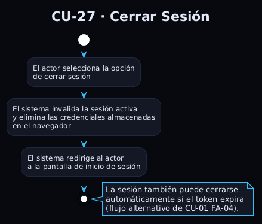

# Casos de Uso Detallados

## CU-01 – Autenticarse en el Sistema

| Campo | Valor |
|---|---|
| **Actores** | Director, Responsable |
| **Precondición** | El usuario dispone de credenciales válidas en el ERP con un empleado activo vinculado. |
| **Postcondición** | El usuario tiene una sesión activa y accede al sistema con el rol y ámbito que le corresponden. |

**Flujo principal:**
1. El actor accede a la pantalla de inicio de sesión e introduce sus credenciales.
2. El sistema valida las credenciales contra el ERP.
3. El sistema verifica que existe un empleado activo asociado al usuario.
4. El sistema determina el rol: Director (acceso global) o Responsable (acceso filtrado a su ámbito).
5. Para el Responsable, el sistema calcula su ámbito organizativo.
6. Se crea la sesión y se redirige al actor a la pantalla principal.

**Flujos alternativos:**
- `FA-01`: Credenciales incorrectas → mensaje de error, permanece en el login.
- `FA-02`: Sin empleado activo vinculado → acceso denegado.
- `FA-03`: Usuario sin permisos de acceso → acceso denegado con mensaje informativo.
- `FA-04`: Sesión expirada → el sistema cierra la sesión y redirige al login.

**Relaciones:** Precondición de todos los demás CU.

---

## CU-02 – Listar y Buscar Empleados

| Campo | Valor |
|---|---|
| **Actores** | Director, Responsable |
| **Precondición** | CU-01 completado. |
| **Postcondición** | El actor localiza el empleado y puede navegar a CU-03. |

**Flujo principal:**
1. El actor accede al listado de empleados.
2. El sistema muestra los empleados disponibles según su rol y ámbito.
3. El actor puede filtrar por nombre, departamento o estado activo/inactivo.
4. El sistema actualiza el listado paginado.
5. El actor selecciona un empleado para consultar su resumen.

**Flujos alternativos:**
- `FA-01`: Sin resultados con los filtros aplicados → estado vacío.

**Relaciones:** Navega a CU-03.

---

## CU-03 – Consultar Resumen de Empleado

| Campo | Valor |
|---|---|
| **Actores** | Director, Responsable |
| **Precondición** | CU-01 completado. Empleado en el ámbito del actor. |
| **Postcondición** | El actor conoce carga, WIP, productividad y tareas del empleado. |

**Flujo principal:**
1. El actor selecciona un empleado desde CU-02 o CU-05.
2. El sistema verifica que el empleado pertenece al ámbito del actor.
3. El sistema muestra el perfil con indicadores de rendimiento.
4. El actor navega por las pestañas de tareas (pendientes, completadas, asignadas, como responsable).
5. El actor puede aplicar filtros de fechas y seleccionar una tarea para ver su detalle.

**Flujos alternativos:**
- `FA-01`: Fuera del ámbito → acceso denegado.
- `FA-02`: Sin usuario vinculado → indicadores a 0, tareas vacías.

**Relaciones:** `<<extend>>` por CU-08. Navega a CU-09.

---

## CU-04 – Listar Departamentos

| Campo | Valor |
|---|---|
| **Actores** | Director, Responsable |
| **Precondición** | CU-01 completado. |
| **Postcondición** | El actor localiza el departamento y navega a CU-05. |

**Flujo principal:**
1. El actor accede al listado de departamentos.
2. El sistema muestra los departamentos activos disponibles según su ámbito.
3. El actor selecciona un departamento.

**Flujos alternativos:**
- `FA-01`: Sin departamentos en el ámbito → estado vacío.

**Relaciones:** Navega a CU-05.

---

## CU-05 – Consultar Resumen de Departamento

| Campo | Valor |
|---|---|
| **Actores** | Director, Responsable |
| **Precondición** | CU-01. Departamento en el ámbito del actor. |
| **Postcondición** | El actor conoce la carga del departamento y puede navegar a sus empleados. |

**Flujo principal:**
1. El actor selecciona un departamento desde CU-04.
2. El sistema verifica el ámbito y muestra el panel con indicadores de carga.
3. El sistema alerta visualmente si hay empleados sobrecargados.
4. El actor consulta la carga de trabajo o el listado de empleados por pestañas.
5. El actor puede seleccionar un empleado para acceder a su resumen.

**Flujos alternativos:**
- `FA-01`: Fuera del ámbito → acceso denegado.
- `FA-02`: Sin empleados → pestañas vacías.

**Relaciones:** Navega a CU-03.

---

## CU-06 – Listar Proyectos

| Campo | Valor |
|---|---|
| **Actores** | Director, Responsable |
| **Precondición** | CU-01 completado. |
| **Postcondición** | El actor localiza el proyecto y navega a CU-07. |

**Flujo principal:**
1. El actor accede al listado de proyectos.
2. El sistema muestra los proyectos activos disponibles según su ámbito.
3. El actor selecciona un proyecto.

**Flujos alternativos:**
- `FA-01`: Sin proyectos en el ámbito → estado vacío.

**Relaciones:** Navega a CU-07.

---

## CU-07 – Consultar Resumen de Proyecto

| Campo | Valor |
|---|---|
| **Actores** | Director, Responsable |
| **Precondición** | CU-01. Proyecto en el ámbito del actor. |
| **Postcondición** | El actor conoce eficiencia, riesgo, rentabilidad, tareas y equipo del proyecto. |

**Flujo principal:**
1. El actor selecciona un proyecto desde CU-06 o desde CU-26.
2. El sistema verifica el ámbito y muestra el panel con indicadores del proyecto.
3. El actor puede consultar tareas o miembros del equipo por pestañas.
4. El actor puede seleccionar una tarea o un empleado para ver su detalle.

**Flujos alternativos:**
- `FA-01`: Sin horas registradas → eficiencia y rentabilidad a 0.
- `FA-02`: Fuera del ámbito → acceso denegado.

**Relaciones:** Navega a CU-03 y CU-09.

---

## CU-08 – Listar Tareas

| Campo | Valor |
|---|---|
| **Actores** | Director, Responsable |
| **Precondición** | CU-01 completado. |
| **Postcondición** | El actor localiza tareas y accede a CU-09. |

**Flujo principal:**
1. El actor accede al listado de tareas desde el contexto global, desde CU-07 o desde CU-03.
2. El sistema muestra las tareas disponibles en el ámbito del actor, con filtros preseleccionados si los hay.
3. El actor puede combinar filtros: estado, etapa, proyecto, empleado, fechas y tareas principales.
4. El sistema actualiza el listado paginado.
5. El actor selecciona una tarea.

**Flujos alternativos:**
- `FA-01`: Sin resultados → estado vacío.
- `FA-02`: Proyecto o empleado fuera del ámbito → acceso denegado.

**Relaciones:** Navega a CU-09.

---

## CU-09 – Consultar Detalle de Tarea

| Campo | Valor |
|---|---|
| **Actores** | Director, Responsable |
| **Precondición** | CU-01. Tarea en el ámbito del actor. |
| **Postcondición** | El actor conoce todos los datos de la tarea. |

**Flujo principal:**
1. El actor selecciona una tarea desde CU-08, CU-03 o CU-07.
2. El sistema verifica el ámbito y muestra la ficha completa.
3. El actor puede navegar al proyecto, a los empleados implicados, a las subtareas o a la tarea padre.

**Flujos alternativos:**
- `FA-01`: No encontrada → error.
- `FA-02`: Fuera del ámbito → acceso denegado.

**Relaciones:** Navega a CU-03, CU-07, CU-09 (recursivo).

---

## CU-10 – Consultar Productividad

| Campo | Valor |
|---|---|
| **Actores** | Director, Responsable |
| **Precondición** | CU-01. |
| **Postcondición** | Conoce la eficiencia de ejecución frente a la estimación. |

**Flujo principal:**
1. El actor accede a la página de métricas y selecciona Productividad.
2. El actor puede filtrar por empleado, proyecto y fechas.
3. El sistema calcula el ratio estimado/real sobre tareas cerradas.
4. El sistema muestra el promedio y el ranking de tareas.

---

## CU-11 – Consultar Cumplimiento de Plazos

| Campo | Valor |
|---|---|
| **Actores** | Director, Responsable |
| **Precondición** | CU-01. |
| **Postcondición** | Conoce la fiabilidad de entrega a tiempo. |

**Flujo principal:**
1. El actor selecciona la métrica de Cumplimiento de Plazos.
2. El actor puede filtrar por empleado o proyecto.
3. El sistema calcula el porcentaje de tareas cerradas dentro de su fecha límite.
4. El sistema muestra la tasa de cumplimiento con semáforo de color.

---

## CU-12 – Consultar WIP de Empleado

| Campo | Valor |
|---|---|
| **Actores** | Director, Responsable |
| **Precondición** | CU-01. Empleado seleccionado. |
| **Postcondición** | Identifica el nivel de paralelismo de tareas del empleado. |

**Flujo principal:**
1. El actor selecciona un empleado y la métrica WIP.
2. El sistema verifica el ámbito y cuenta las tareas abiertas asignadas al empleado.
3. El sistema clasifica el nivel de paralelismo y muestra el recuento con recomendación.

**Flujos alternativos:**
- `FA-01`: Fuera del ámbito → acceso denegado.
- `FA-02`: Sin usuario vinculado → WIP = 0.

---

## CU-13 – Consultar Carga de Trabajo (Workload) de Empleado

| Campo | Valor |
|---|---|
| **Actores** | Director, Responsable |
| **Precondición** | CU-01. Empleado seleccionado. |
| **Postcondición** | Identifica si el empleado está sobre o infracargado. |

**Flujo principal:**
1. El actor selecciona un empleado y la métrica de Carga de Trabajo.
2. El sistema verifica el ámbito y calcula las horas pendientes frente a la jornada de referencia.
3. El sistema clasifica el estado del empleado y muestra el porcentaje de carga con indicadores visuales.

**Flujos alternativos:**
- `FA-01`: Fuera del ámbito → acceso denegado.
- `FA-02`: Sin usuario vinculado → carga = 0.

---

## CU-14 – Consultar Riesgo de Proyecto

| Campo | Valor |
|---|---|
| **Actores** | Director, Responsable |
| **Precondición** | CU-01. Proyecto en el ámbito del actor. |
| **Postcondición** | Identifica tareas con riesgo de incumplimiento. |

**Flujo principal:**
1. El actor selecciona un proyecto y la métrica de Índice de Riesgo.
2. El sistema verifica el ámbito y analiza las tareas abiertas con fecha límite.
3. El sistema clasifica el nivel de riesgo (bajo, medio o alto) y muestra el índice con semáforo.

**Flujos alternativos:**
- `FA-01`: Fuera del ámbito → acceso denegado.
- `FA-02`: Sin tareas abiertas con fecha límite → riesgo = 0.

---

## CU-15 – Consultar Tasa de Retrabajo

| Campo | Valor |
|---|---|
| **Actores** | Director, Responsable |
| **Precondición** | CU-01. |
| **Postcondición** | Detecta problemas de calidad vía tareas reabiertas. |

**Flujo principal:**
1. El actor selecciona la métrica de Tasa de Retrabajo con filtros opcionales.
2. El sistema analiza el historial de cambios de estado y detecta tareas cerradas y posteriormente reabiertas.
3. El sistema muestra la tasa de retrabajo con semáforo de color.

---

## CU-16 – Consultar Exactitud de Estimación

| Campo | Valor |
|---|---|
| **Actores** | Director, Responsable |
| **Precondición** | CU-01. Empleado seleccionado. |
| **Postcondición** | Calibra la fiabilidad de estimaciones del responsable. |

**Flujo principal:**
1. El actor selecciona un empleado y la métrica de Exactitud de Estimación.
2. El sistema verifica el ámbito y compara las horas estimadas y reales de las tareas cerradas.
3. El sistema determina el sesgo (subestima, sobreestima o preciso) y muestra el resultado.

**Flujos alternativos:**
- `FA-01`: Fuera del ámbito → acceso denegado.
- `FA-02`: Sin datos suficientes → sin resultados.

---

## CU-17 – Consultar Lead Time

| Campo | Valor |
|---|---|
| **Actores** | Director, Responsable |
| **Precondición** | CU-01. |
| **Postcondición** | Identifica el tiempo medio de ciclo. |

**Flujo principal:**
1. El actor selecciona la métrica de Lead Time con filtros opcionales.
2. El sistema calcula los días medios entre la asignación y el cierre de las tareas completadas.
3. El sistema muestra el valor en días con indicador de referencia.

---

## CU-18 – Consultar Tiempo por Estado

| Campo | Valor |
|---|---|
| **Actores** | Director, Responsable |
| **Precondición** | CU-01. |
| **Postcondición** | Identifica etapas con tiempos de permanencia excesivos. |

**Flujo principal:**
1. El actor selecciona la métrica de Tiempo por Estado con filtros opcionales.
2. El sistema analiza el historial de cambios de etapa y calcula el tiempo medio en cada una.
3. El sistema muestra la tabla ordenada de etapas con horas medias y número de tareas.

---

## CU-19 – Consultar Tareas Canceladas

| Campo | Valor |
|---|---|
| **Actores** | Director, Responsable |
| **Precondición** | CU-01. |
| **Postcondición** | Evalúa la tasa de cancelación. |

**Flujo principal:**
1. El actor selecciona la métrica de Tareas Canceladas con filtros opcionales.
2. El sistema identifica las tareas en etapa de cancelación y calcula su porcentaje.
3. El sistema muestra la tasa con semáforo de color.

---

## CU-20 – Consultar Tiempo por Prioridad

| Campo | Valor |
|---|---|
| **Actores** | Director, Responsable |
| **Precondición** | CU-01. |
| **Postcondición** | Verifica la distribución del esfuerzo según prioridad. |

**Flujo principal:**
1. El actor selecciona la métrica de Tiempo por Prioridad con filtros opcionales.
2. El sistema agrupa las tareas cerradas por nivel de prioridad y calcula las horas medias.
3. El sistema muestra las horas medias por nivel (Normal / Urgente).

---

## CU-21 – Visualizar Gráficos Analíticos

| Campo | Valor |
|---|---|
| **Actores** | Director, Responsable |
| **Precondición** | CU-01. |
| **Postcondición** | El actor analiza tendencias y distribuciones visualmente. |

**Flujo principal:**
1. El actor accede a la página de gráficos.
2. El actor configura el rango de fechas, la agrupación temporal y la entidad de análisis.
3. El sistema genera: evolución temporal de tareas, distribución por estado y — solo para el Director — distribución por cliente.
4. Al cambiar los filtros, el sistema recalcula los gráficos.

**Flujos alternativos:**
- `FA-01`: Sin datos → mensaje por gráfico.
- `FA-02`: El Responsable no visualiza la distribución por cliente.

**Relaciones:** `<<include>>` CU-02, CU-04, CU-06 para los selectores de filtro.

---

## CU-22 – Consultar Asistencia vs Imputaciones

| Campo | Valor |
|---|---|
| **Actores** | Director, Responsable |
| **Precondición** | CU-01. |
| **Postcondición** | Detecta discrepancias entre presencia registrada y horas imputadas. |

**Flujo principal:**
1. El actor accede a la página de asistencia.
2. El actor configura el rango de fechas. Si es Director, también el modo de visualización.
3. El sistema compara las horas fichadas con las imputadas por empleado.
4. El sistema muestra indicadores globales, gráfico comparativo y tabla con semáforo de cobertura.
5. Al seleccionar un empleado, el sistema muestra su serie diaria.

**Flujos alternativos:**
- `FA-01`: Sin datos → indicadores a 0.
- `FA-02`: El Responsable no accede al modo por responsable.

**Relaciones:** `<<include>>` CU-02, CU-04 para los selectores de filtro.

---

## CU-23 – Consultar Rentabilidad Financiera

| Campo | Valor |
|---|---|
| **Actores** | **Director** (exclusivo) |
| **Precondición** | CU-01 con rol Director. |
| **Postcondición** | El Director conoce la rentabilidad real por proyecto, cliente y responsable. |

**Flujo principal:**
1. El actor accede a la página de rentabilidad.
2. El sistema verifica el rol de Director; en caso contrario, muestra pantalla de acceso restringido.
3. El actor selecciona el rango de fechas y el modo de análisis.
4. El sistema muestra el resumen financiero con ingresos, gastos, neto y rentabilidad.
5. El actor puede desglosar por proyecto o por cliente.
6. Desde cada fila puede solicitar el detalle de líneas analíticas.

**Flujos alternativos:**
- `FA-01`: Sin partes analíticos → todo a 0.
- `FA-02`: Actor sin rol Director → pantalla restringida.

**Relaciones:** `<<extend>>` por CU-24 y CU-25.

---

## CU-24 – Consultar Líneas Analíticas de Proyecto

| Campo | Valor |
|---|---|
| **Actores** | **Director** (exclusivo) |
| **Precondición** | CU-01 con rol Director. Proyecto seleccionado en CU-23. |
| **Postcondición** | El Director conoce el desglose de ingresos y gastos individuales del proyecto. |

**Flujo principal:**
1. Desde CU-23, el actor solicita el detalle de un proyecto.
2. El sistema muestra las líneas de partes analíticos separadas en ingresos y gastos con fecha, descripción, importe y horas.

**Flujos alternativos:**
- `FA-01`: Sin líneas → tablas vacías.

**Relaciones:** `<<extend>>` desde CU-23.

---

## CU-25 – Consultar Líneas Analíticas de Cliente

| Campo | Valor |
|---|---|
| **Actores** | **Director** (exclusivo) |
| **Precondición** | CU-01 con rol Director. Cliente seleccionado en CU-23. |
| **Postcondición** | El Director conoce el desglose de ingresos y gastos de todos los proyectos del cliente. |

**Flujo principal:**
1. Desde CU-23, el actor solicita el detalle de un cliente.
2. El sistema muestra las líneas de todos sus proyectos, separadas en ingresos y gastos, con referencia al proyecto de cada línea.

**Flujos alternativos:**
- `FA-01`: Sin líneas → tablas vacías.

**Relaciones:** `<<extend>>` desde CU-23.

---

## CU-26 – Realizar Búsqueda Global

| Campo | Valor |
|---|---|
| **Actores** | Director, Responsable |
| **Precondición** | CU-01. Mínimo 2 caracteres. |
| **Postcondición** | Localiza el recurso y navega a su detalle. |

**Flujo principal:**
1. El actor introduce un texto de búsqueda.
2. El sistema busca en tareas, proyectos y empleados dentro del ámbito del actor.
3. El sistema muestra los resultados agrupados por tipo.
4. El actor puede filtrar por tipo y seleccionar un resultado para navegar a su detalle.

**Flujos alternativos:**
- `FA-01`: Sin resultados → estado vacío.

**Relaciones:** Navega a CU-03, CU-07, CU-09.

---

## CU-27 – Cerrar Sesión

| Campo | Valor |
|---|---|
| **Actores** | Director, Responsable |
| **Precondición** | CU-01. Usuario autenticado. |
| **Postcondición** | Sesión eliminada. El usuario es redirigido al login. |

**Flujo principal:**
1. El actor selecciona la opción de cerrar sesión.
2. El sistema invalida la sesión activa y elimina las credenciales del navegador.
3. El sistema redirige al actor a la pantalla de inicio de sesión.