# Casos de Uso Detallados

## CU-01 – Autenticarse en el Sistema

| Campo | Valor |
|---|---|
| **Actores** | Director, Responsable |
| **Precondición** | El usuario tiene credenciales válidas (login y contraseña) en `res_users` con un `hr_employee` activo vinculado en Odoo. |
| **Postcondición** | JWT almacenado en `localStorage`, cabecera `Authorization: Bearer` inyectada en el cliente Axios. Usuario redirigido a `/`. |

**Flujo principal:**
1. El actor navega a `/login` e introduce su **usuario** (login) y **contraseña**.
2. `POST /auth/token {username, password}` → valida credenciales contra `res_users`.
3. Localiza el empleado activo vinculado (`res_users.id` → `hr_employee.user_id`).
4. `resolve_role_and_scope()` determina rol: `employee.parent_id == employee.id` → `director`; gestiona depts/proyectos → `responsable`; otro → `empleado` (sin acceso).
5. Para responsable: scope vía CTE recursivo → `employee_ids`, `department_ids`, `project_ids`.
6. JWT `HS256` (8 h) con `{user_id, employee_id, role, employee_ids, department_ids, project_ids}`.
7. Frontend almacena token y redirige a `/`.

**Flujos alternativos:**
- `FA-01`: Credenciales incorrectas → HTTP 401, permanece en login.
- `FA-02`: Sin empleado activo → HTTP 404, permanece en login.
- `FA-03`: Rol `"empleado"` → acceso denegado.
- `FA-04`: Token expirado → interceptor limpia localStorage, redirige a `/login`.

**Relaciones:** Precondición de todos los demás CU.

---

## CU-02 – Listar y Buscar Empleados

| Campo | Valor |
|---|---|
| **Actores** | Director, Responsable |
| **Precondición** | CU-01 completado. |
| **Postcondición** | El actor localiza el empleado y puede navegar a CU-03. |

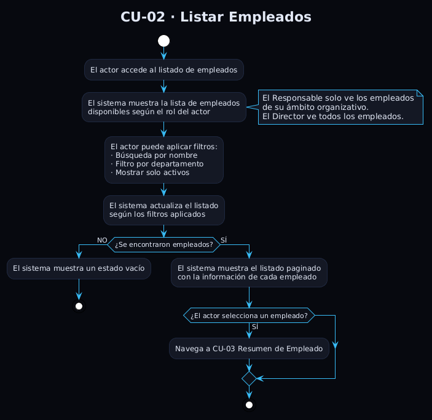

**Flujo principal:**
1. `GET /employees/` con `page`, `page_size`, `search`, `department_id`, `active`, `sort_by`, `sort_order`.
2. Tabla paginada (50/pág.): nombre, departamento, cargo, email, coste/h, badge activo/inactivo.
3. Búsqueda por nombre (debounce 300 ms). Filtro por departamento. Toggle activos.
4. Ordenación global server-side.
5. Click en fila → CU-03.
6. Responsable: solo `employee_ids` del JWT.

**Relaciones:** Navega a CU-03.

---

## CU-03 – Consultar Resumen de Empleado

| Campo | Valor |
|---|---|
| **Actores** | Director, Responsable |
| **Precondición** | CU-01 completado. Empleado en el alcance del actor. |
| **Postcondición** | El actor conoce carga, WIP, productividad y tareas del empleado. |

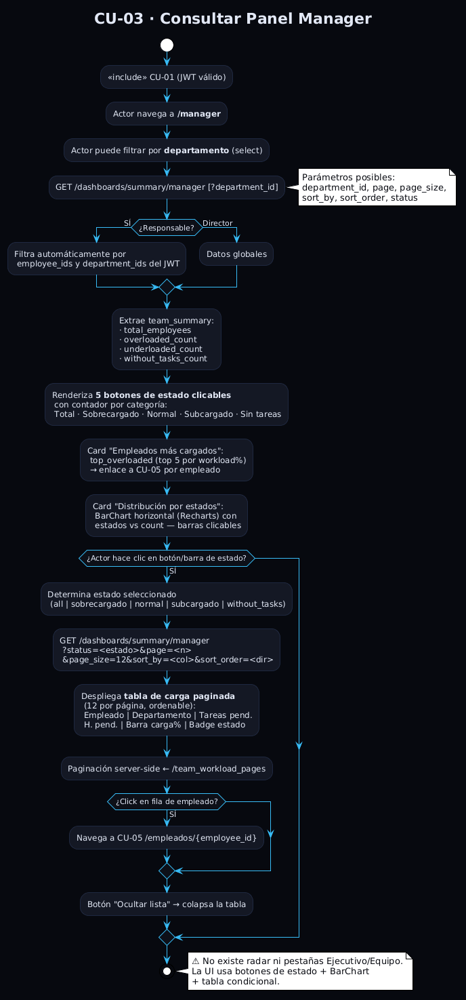

**Flujo principal:**
1. Accede a `/empleados/{id}` (desde CU-02 o CU-05).
2. Verifica `verify_employee_scope`. Carga en paralelo: `GET /employees/{id}` y `GET /dashboards/summary/employee/{id}`.
3. Cabecera: avatar, nombre, cargo, departamento, email, coste/h, badge workload.
4. 4 KPIs: pendientes + horas · vencidas sin cerrar · WIP · productividad 30d.
5. Sección "Hoy": tarjetas clickables → CU-08 con filtros pre-rellenados.
6. 4 pestañas de tareas vía `GET /tasks/filter`:
   - **Pendientes**: `?employee_id={id}&status=pending`.
   - **Completadas**: `?employee_id={id}&status=completed`.
   - **Asignadas**: `?employee_id={id}` + toggle Todas/Abiertas/Cerradas.
   - **Responsable**: `?employee_id={id}&responsable=true`.
7. Click en tarea → CU-09.

**Flujos alternativos:**
- `FA-01`: Fuera del scope → HTTP 403.
- `FA-02`: Sin `user_id` → pestañas vacías, workload y WIP a 0.

**Relaciones:** `<<extend>>` por CU-08. Navega a CU-09.

---

## CU-04 – Listar Departamentos

| Campo | Valor |
|---|---|
| **Actores** | Director, Responsable |
| **Precondición** | CU-01 completado. |
| **Postcondición** | El actor localiza el departamento y navega a CU-05. |

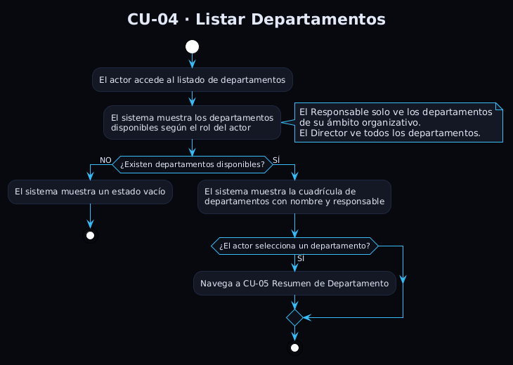

**Flujo principal:**
1. `GET /departments/` → departamentos activos.
2. Responsable: solo `department_ids`.
3. Cuadrícula de tarjetas: nombre, manager, nombre jerárquico.
4. Click → CU-05.

**Flujos alternativos:**
- `FA-01`: Sin departamentos → estado vacío.

**Relaciones:** Navega a CU-05.

---

## CU-05 – Consultar Resumen de Departamento

| Campo | Valor |
|---|---|
| **Actores** | Director, Responsable |
| **Precondición** | CU-01. Departamento en el alcance. |
| **Postcondición** | El actor conoce la carga del departamento y navega a empleados. |

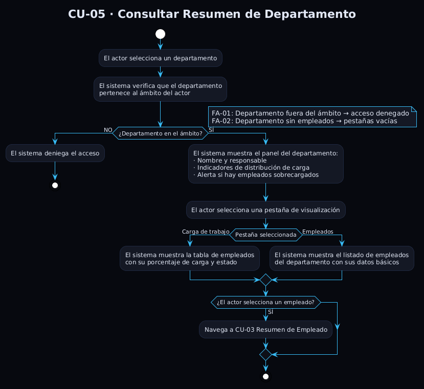

**Flujo principal:**
1. Accede a `/departamentos/{id}` (desde CU-04).
2. Verifica `verify_department_scope`. Carga: `GET /departments/{id}` y `GET /departments/{id}/workload-summary`.
3. Cabecera: nombre + manager.
4. 4 KPIs: total · sobrecargados · subcargados · sin tareas.
5. Banner rojo si hay sobrecargados.
6. **Pestaña Carga**: tabla con workload por empleado. Click → CU-03.
7. **Pestaña Empleados**: `GET /departments/{id}/employees`. Click → CU-03.

**Flujos alternativos:**
- `FA-01`: Fuera de scope → HTTP 403.
- `FA-02`: Sin empleados → pestañas vacías.

**Relaciones:** Navega a CU-03.

---

## CU-06 – Listar Proyectos

| Campo | Valor |
|---|---|
| **Actores** | Director, Responsable |
| **Precondición** | CU-01 completado. |
| **Postcondición** | El actor localiza el proyecto y navega a CU-07. |

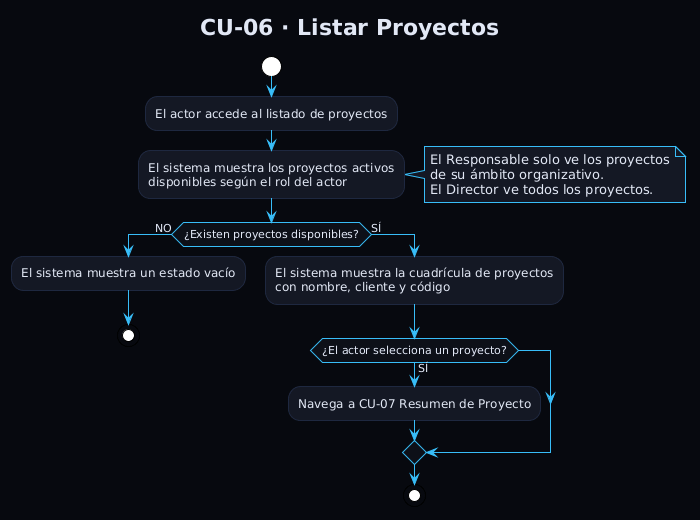

**Flujo principal:**
1. `GET /projects/` → proyectos activos.
2. Responsable: solo `project_ids`.
3. Cuadrícula de tarjetas: nombre, cliente, código.
4. Click → CU-07.

**Flujos alternativos:**
- `FA-01`: Sin proyectos → estado vacío.

**Relaciones:** Navega a CU-07.

---

## CU-07 – Consultar Resumen de Proyecto

| Campo | Valor |
|---|---|
| **Actores** | Director, Responsable |
| **Precondición** | CU-01. Proyecto en el alcance. |
| **Postcondición** | El actor conoce eficiencia, riesgo, rentabilidad, tareas y equipo del proyecto. |

**Flujo principal:**
1. Accede a `/proyectos/{id}` (desde CU-06 o CU-24).
2. Verifica `verify_project_scope`. Carga: `GET /projects/{id}`, `/dashboards/summary/project/{id}`, `/tasks/stages`.
3. Cabecera: nombre, cliente, badges Rentable/Pérdidas y riesgo bajo/medio/alto.
4. 4 KPIs: eficiencia · riesgo % · rentabilidad % · total tareas.
5. Gráfico horas estimadas vs. reales.
6. **Pestaña Tareas**: `GET /projects/{id}/tasks`. Click → CU-09.
7. **Pestaña Equipo**: `GET /projects/{id}/employees`. Click → CU-03.

**Flujos alternativos:**
- `FA-01`: Sin horas → rentabilidad y eficiencia a 0.
- `FA-02`: Fuera de scope → HTTP 403.

**Relaciones:** Navega a CU-03 y CU-09.

---

## CU-08 – Listar Tareas

| Campo | Valor |
|---|---|
| **Actores** | Director, Responsable |
| **Precondición** | CU-01 completado. |
| **Postcondición** | El actor localiza tareas y accede a CU-09. |

**Flujo principal:**
1. Tres contextos: Global (`/tareas`), desde CU-07 (`project_id`), desde CU-03 (`employee_id`).
2. `GET /tasks/filter` con `status`, `stage_id`, `project_id`, `employee_id`, `date_from`, `date_to`, `date_assign`, `root_only`, `sort_by`, `sort_order`, `page`, `page_size`. `stage_id` tiene prioridad sobre `status`.
3. Tabla paginada (25/pág.): nombre, etapa, horas est., deadline, fecha cierre, estado.
4. Ordenación server-side. Click → CU-09.
5. Responsable: restringido a `project_ids`.

**Flujos alternativos:**
- `FA-01`: Sin tareas → estado vacío.
- `FA-02`: Proyecto fuera de scope → HTTP 403.

**Relaciones:** Navega a CU-09.

---

## CU-09 – Consultar Detalle de Tarea

| Campo | Valor |
|---|---|
| **Actores** | Director, Responsable |
| **Precondición** | CU-01. Tarea en proyecto del alcance. |
| **Postcondición** | El actor conoce todos los datos de la tarea. |

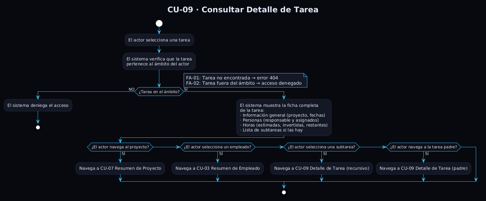

**Flujo principal:**
1. `GET /tasks/{id}` → `TaskService.get_task_detail()`.
2. Cabecera: nombre, badges etapa/vencida/subtarea/nº subtareas.
3. **Info general**: proyecto (→ CU-07), deadline, fecha cierre, fecha asignación.
4. **Personas**: responsable pill (→ CU-03), asignados pills (→ CU-03).
5. **Horas** (si `planned_hours > 0`): est./invertidas/restantes, barra progreso, productividad.
6. **Subtareas**: clickables → CU-09 recursivo.
7. Link a tarea padre si `parent_id`. Panel lateral: ID, prioridad, kanban state.

**Flujos alternativos:**
- `FA-01`: No encontrada → HTTP 404.
- `FA-02`: Fuera de scope → HTTP 403.

**Relaciones:** Navega a CU-03, CU-07, CU-09 (recursivo).

---

## CU-10 – Consultar Productividad

| Campo | Valor |
|---|---|
| **Actores** | Director, Responsable |
| **Precondición** | CU-01. |
| **Postcondición** | Conoce eficiencia de ejecución vs. estimación. |

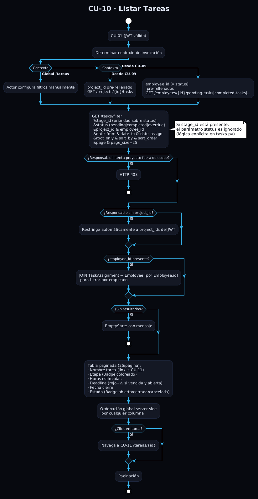

**Flujo principal:**
1. En `/métricas`, click en tarjeta "Productividad".
2. `GET /metrics/productivity` con filtros empleado, proyecto, fechas.
3. Tareas cerradas con `planned_hours > 0` y `actual_hours > 0`. Fórmula: `(planned / actual) × 100`.
4. Gauge + barras top 8.

**Relaciones:** Accesible desde `/métricas`.

---

## CU-11 – Consultar Cumplimiento de Plazos

| Campo | Valor |
|---|---|
| **Actores** | Director, Responsable |
| **Precondición** | CU-01. |
| **Postcondición** | Conoce fiabilidad de entrega a tiempo. |

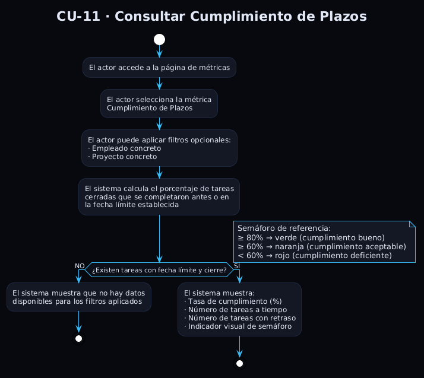

**Flujo principal:**
1. `GET /metrics/compliance` con `employee_id`, `project_id`, `root_only`.
2. `on_time` = `date_end ≤ date_deadline`; `total` = cerradas con ambas fechas.
3. `compliance_rate = (on_time / total) × 100`.
4. Doughnut + KPIs + semáforo (≥80% verde, ≥60% naranja, <60% rojo).

**Relaciones:** Accesible desde `/métricas`.

---

## CU-12 – Consultar WIP de Empleado

| Campo | Valor |
|---|---|
| **Actores** | Director, Responsable |
| **Precondición** | CU-01. Empleado seleccionado. |
| **Postcondición** | Identifica paralelismo de tareas abiertas. |

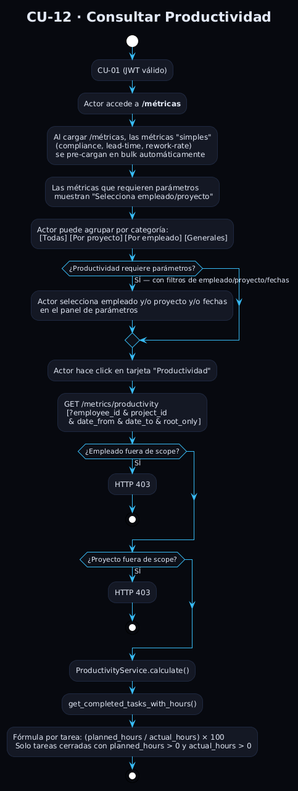

**Flujo principal:**
1. En `/métricas`, selecciona empleado, click "WIP".
2. `GET /metrics/wip?employee_id=X`. Cuenta tareas abiertas asignadas.
3. Umbrales: ≤3 óptimo · ≤5 aceptable · >5 sobrecargado.
4. Recuento, badge, recomendación textual.

**Flujos alternativos:**
- `FA-01`: Fuera de scope → HTTP 403.
- `FA-02`: Sin `user_id` → WIP = 0.

---

## CU-13 – Consultar Carga de Trabajo (Workload) de Empleado

| Campo | Valor |
|---|---|
| **Actores** | Director, Responsable |
| **Precondición** | CU-01. Empleado seleccionado. |
| **Postcondición** | Identifica si el empleado está sobre o infracargado. |

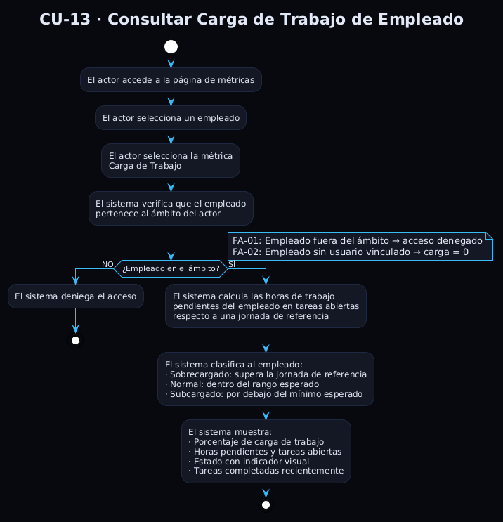

**Flujo principal:**
1. En `/métricas`, selecciona empleado, click "Carga de trabajo".
2. `GET /metrics/workload?employee_id=X`. Suma `max(planned - worked, 0)` por tarea abierta.
3. `workload_pct = (pending_hours / 40h) × 100`. Estado: >120% sobrecargado · 70-120% normal · <70% subcargado.
4. Gauge, barra, KPIs.

**Flujos alternativos:**
- `FA-01`: Fuera de scope → HTTP 403.
- `FA-02`: Sin `user_id` → 0, subcargado.

**Relaciones:** También usado internamente por `GET /dashboards/summary/employee/{id}` (CU-03).

---

## CU-14 – Consultar Riesgo de Proyecto

| Campo | Valor |
|---|---|
| **Actores** | Director, Responsable |
| **Precondición** | CU-01. Proyecto en alcance. |
| **Postcondición** | Identifica tareas con riesgo de incumplimiento. |

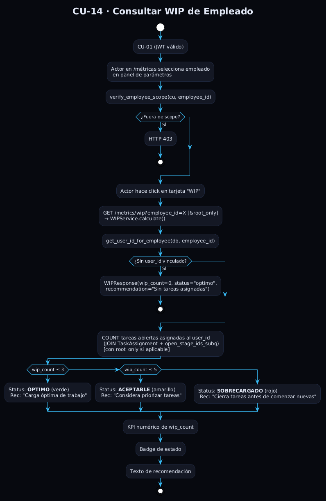

**Flujo principal:**
1. En `/métricas`, selecciona proyecto, click "Índice de riesgo".
2. `GET /metrics/risk-index?project_id=X`. Tareas abiertas con `date_deadline`.
3. En riesgo si: vencida O ≥80% plazo consumido.
4. `risk_index = (en_riesgo / abiertas) × 100`. Doughnut + semáforo (<20% bajo, 20-50% medio, >50% alto).

**Flujos alternativos:**
- `FA-01`: Fuera de scope → HTTP 403.
- `FA-02`: Sin tareas abiertas con deadline → 0.

**Relaciones:** También ejecutado por CU-07 vía `/dashboards/summary/project/{id}`.

---

## CU-15 – Consultar Tasa de Retrabajo

| Campo | Valor |
|---|---|
| **Actores** | Director, Responsable |
| **Precondición** | CU-01. |
| **Postcondición** | Detecta problemas de calidad vía tareas reabiertas. |

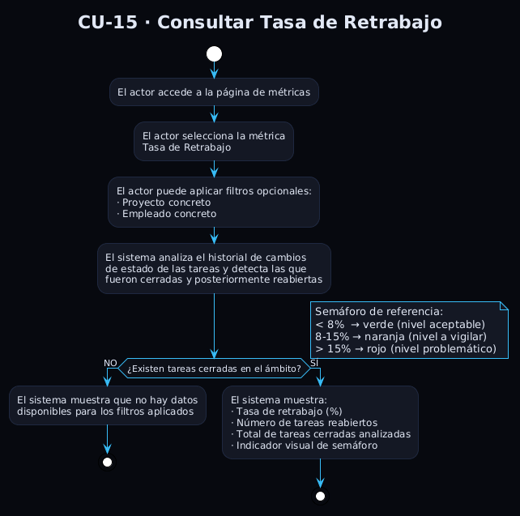

**Flujo principal:**
1. `GET /metrics/rework-rate` con `project_id`, `employee_id`, `root_only`.
2. Analiza `mail_tracking_value`: reabierta = cerrada → abierta.
3. `rework_rate = (reabiertos / cerradas) × 100`.
4. Doughnut + semáforo (<8% verde, 8-15% naranja, >15% rojo).

**Relaciones:** Accesible desde `/métricas`.

---

## CU-16 – Consultar Exactitud de Estimación

| Campo | Valor |
|---|---|
| **Actores** | Director, Responsable |
| **Precondición** | CU-01. Empleado seleccionado. |
| **Postcondición** | Calibra fiabilidad de estimaciones del responsable. |

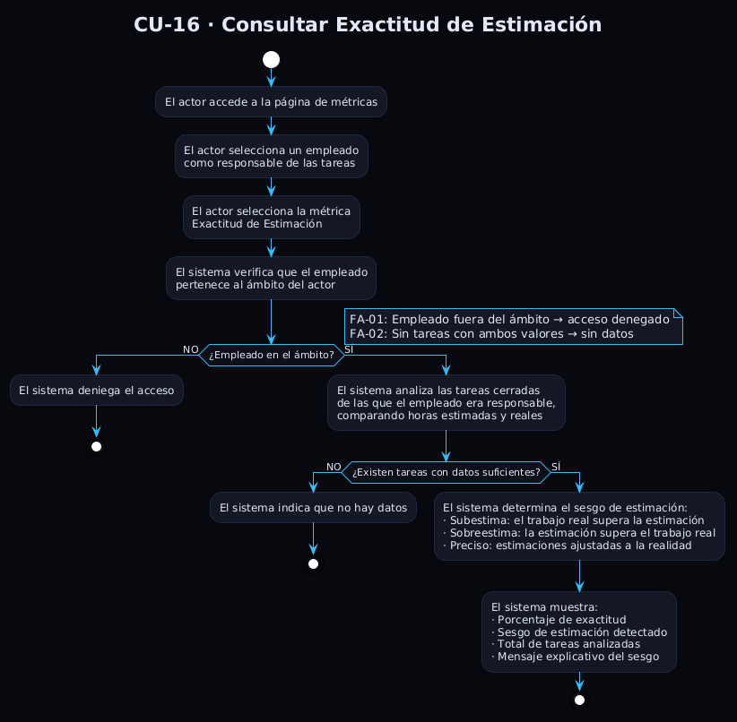

**Flujo principal:**
1. En `/métricas`, selecciona empleado.
2. `GET /metrics/estimation-accuracy?responsable_id=X`. Ratio `actual / planned`.
3. `accuracy_pct = average_ratio × 100`. Sesgo: >110% subestima · <90% sobreestima · 90-110% preciso.
4. Gauge, badge sesgo, ratio, total tareas.

**Flujos alternativos:**
- `FA-01`: Fuera de scope → HTTP 403.
- `FA-02`: Sin datos → sesgo `sin_datos`.

---

## CU-17 – Consultar Lead Time

| Campo | Valor |
|---|---|
| **Actores** | Director, Responsable |
| **Precondición** | CU-01. |
| **Postcondición** | Identifica tiempo medio de ciclo. |

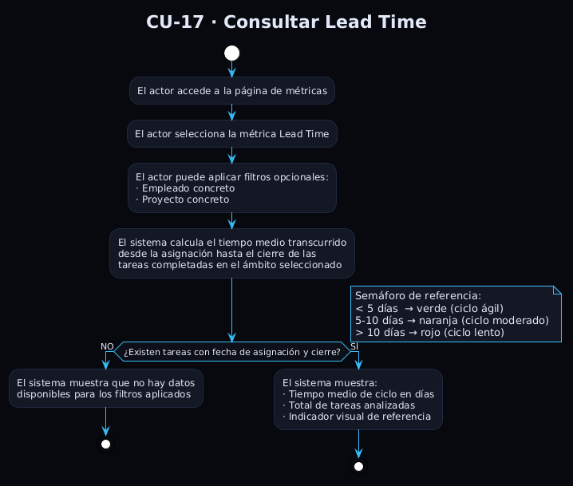

**Flujo principal:**
1. `GET /metrics/lead-time` con `employee_id`, `project_id`, `root_only`.
2. Tareas cerradas con `date_assign` y `date_end`. Días = `(date_end - date_assign) / 86400`.
3. KPI central en días + total tareas.
4. Semáforo: <5d verde · 5-10d naranja · >10d rojo.

**Relaciones:** Accesible desde `/métricas`.

---

## CU-18 – Consultar Tiempo por Estado

| Campo | Valor |
|---|---|
| **Actores** | Director, Responsable |
| **Precondición** | CU-01. |
| **Postcondición** | Identifica etapas con tiempos excesivos. |

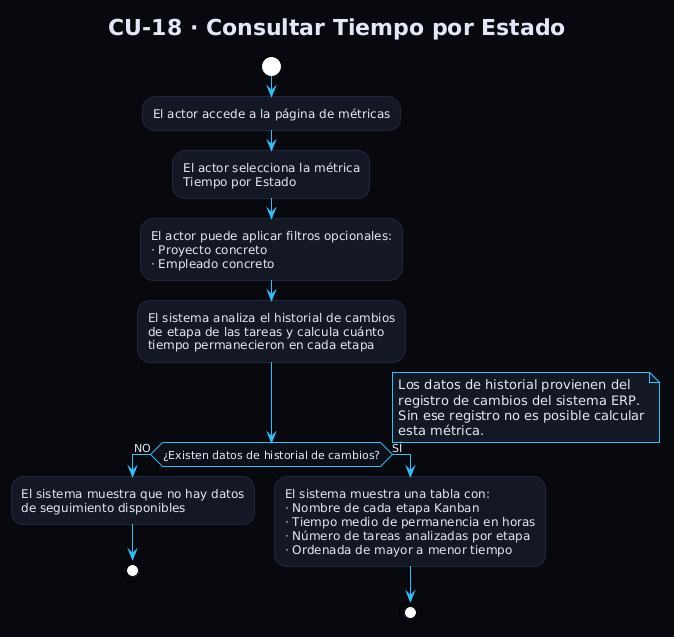

**Flujo principal:**
1. `GET /metrics/state-time` con `project_id`, `employee_id`, `root_only`.
2. Analiza `mail_tracking_value`: horas entre cambios consecutivos de etapa.
3. Agrega por etapa y calcula media.
4. Tabla ordenada: Etapa · Horas medias · Nº tareas.

**Relaciones:** Accesible desde `/métricas`.

---

## CU-19 – Consultar Tareas Canceladas

| Campo | Valor |
|---|---|
| **Actores** | Director, Responsable |
| **Precondición** | CU-01. |
| **Postcondición** | Evalúa tasa de cancelación. |

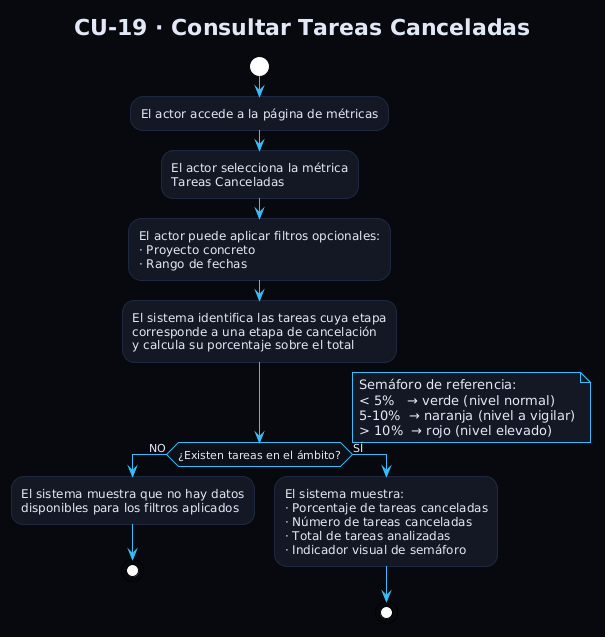

**Flujo principal:**
1. `GET /metrics/cancelled-tasks` con `project_id`, `date_from`, `date_to`, `root_only`.
2. Canceladas = etapa "Cancelado" (case-insensitive). `cancelled_pct = (canceladas / total) × 100`.
3. KPIs + semáforo (<5% verde, 5-10% naranja, >10% rojo).

---

## CU-20 – Consultar Tiempo por Prioridad

| Campo | Valor |
|---|---|
| **Actores** | Director, Responsable |
| **Precondición** | CU-01. |
| **Postcondición** | Verifica distribución de esfuerzo por prioridad. |

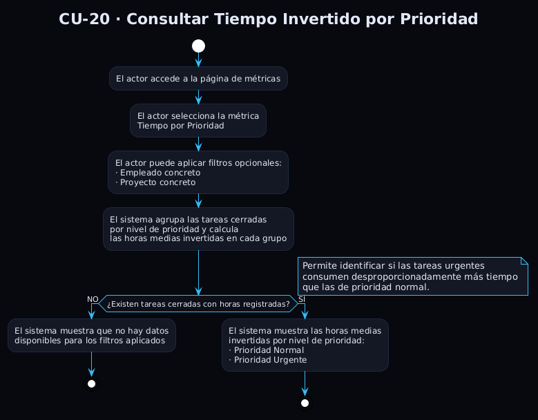

**Flujo principal:**
1. `GET /metrics/priority-time` con `employee_id`, `project_id`, `root_only`.
2. Tareas cerradas agrupadas por `priority` ("0"=Normal, "1"=Urgente).
3. Media de horas por grupo.

---

## CU-21 – Visualizar Gráficos Analíticos

| Campo | Valor |
|---|---|
| **Actores** | Director, Responsable |
| **Precondición** | CU-01. |
| **Postcondición** | Analiza tendencias y distribuciones visualmente. |

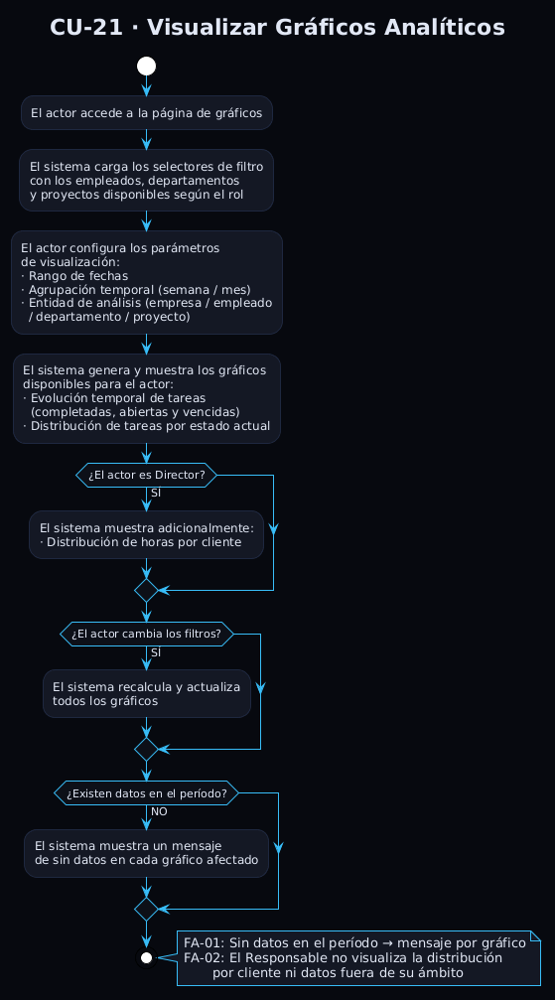

**Flujo principal:**
1. Navega a `/gráficos`. Carga soporte: `GET /employees/`, `/departments/`, `/projects/`.
2. Configura fechas (30d/3m/6m/1a), agrupación (semana/mes), filtro (empresa/empleado/dpto/proyecto).
3. Tres gráficos: `GET /charts/task-evolution`, `/charts/task-distribution`, `/metrics/client-distribution` (solo Director).
4. LineChart evolución · PieChart distribución · BarChart horas por cliente.

**Flujos alternativos:**
- `FA-01`: Sin datos → "Sin datos".
- `FA-02`: Responsable no ve `client-distribution`.

**Relaciones:** `<<include>>` CU-02, CU-04, CU-06 para selectores.

---

## CU-22 – Consultar Asistencia vs Imputaciones

| Campo | Valor |
|---|---|
| **Actores** | Director, Responsable |
| **Precondición** | CU-01. |
| **Postcondición** | Detecta discrepancias fichajes vs. imputaciones. |

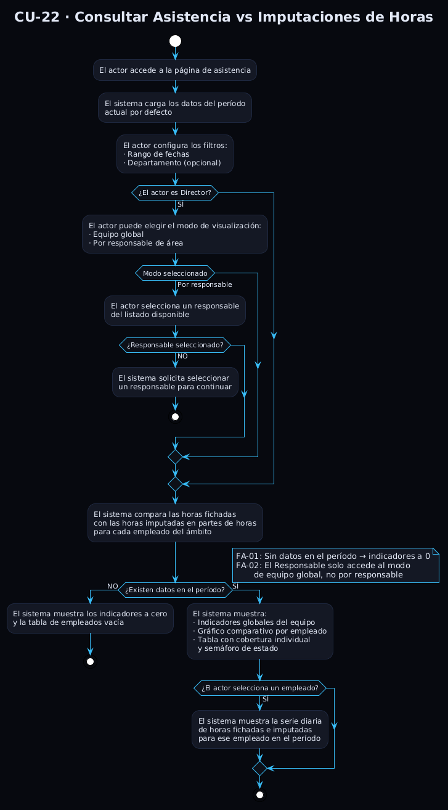

**Flujo principal:**
1. Navega a `/asistencia`. Rango: mes actual.
2. Carga: `GET /employees/managers/list` y `/departments/`.
3. Modo: Equipo global o Por responsable (solo Director).
4. Equipo: `GET /employees/attendance/comparison`. Manager: `GET /employees/attendance/manager/{id}`.
5. Por empleado: `attendance_hours`, `timesheet_hours`, `diff`, `coverage_pct`.
6. 4 KPIs · barras top 15 · tabla con badge cobertura (OK ≥95% · Revisar ≥80% · Alerta <80%).
7. Click empleado → `GET /employees/attendance/{id}/daily` → serie diaria.

**Flujos alternativos:**
- `FA-01`: Sin datos → KPIs a 0.
- `FA-02`: Responsable sin modo "Por responsable".

**Relaciones:** `<<include>>` CU-02, CU-04 para selectores.

---

## CU-23 – Consultar Rentabilidad Financiera

| Campo | Valor |
|---|---|
| **Actores** | **Director** (exclusivo) |
| **Precondición** | CU-01 con `role = "director"`. |
| **Postcondición** | El Director conoce la rentabilidad real por proyecto, cliente y responsable. |

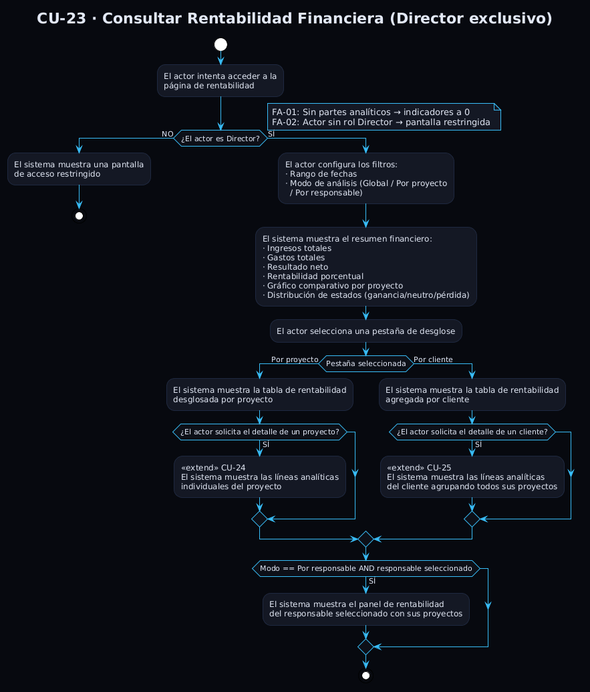

**Flujo principal:**
1. El actor navega a `/rentabilidad`. Selecciona rango de fechas y modo de filtro: Global · Por proyecto · Por responsable.
2. Datos de `account_analytic_line.amount` (positivo = ingreso, negativo = gasto).
3. `GET /metrics/profitability/summary` → 4 KPIs: ingresos · gastos · neto · rentabilidad %.
4. Gráfico de barras agrupadas (ingresos vs. gastos por proyecto, top 12) y donut de estados (Ganancia/Neutro/Pérdida).
5. **Pestaña Por proyecto**: `GET /metrics/profitability/per-project` con botón "Ver Detalles" (extiende a CU-24).
6. **Pestaña Por cliente**: `GET /metrics/profitability/per-client` con botón "Ver Detalles" (extiende a CU-25).
7. En modo "Por responsable": selector de manager; botón "Ver detalle →" carga panel individual con `GET /metrics/profitability/manager/{id}`.

**Flujos alternativos:**
- `FA-01`: Sin partes analíticos → todo a 0.
- `FA-02`: Responsable intentando acceder → HTTP 403, pantalla "Acceso restringido".

**Relaciones:** `<<extend>>` por CU-24 (líneas por proyecto) y CU-25 (líneas por cliente).

---

### CU-24 – Consultar Líneas Analíticas de Proyecto

| Campo | Valor |
|---|---|
| **Actores** | **Director** (exclusivo) |
| **Precondición** | CU-01 con `role = "director"`. Proyecto seleccionado en CU-23. |
| **Postcondición** | El Director conoce el desglose de ingresos y gastos individuales del proyecto. |

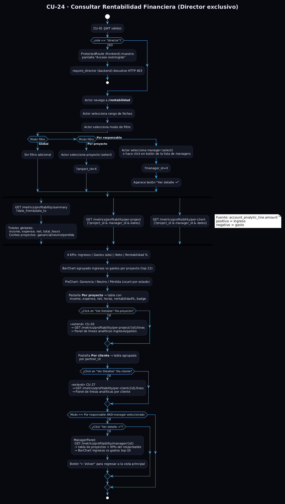

**Flujo principal:**
1. Desde CU-23, el actor hace click en "Ver Detalles" en una fila de proyecto.
2. `GET /metrics/profitability/per-project/{project_id}/lines` con filtros opcionales de fecha y manager.
3. Las líneas de `account_analytic_line` se separan en `incomes` (amount ≥ 0) y `expenses` (amount < 0).
4. Dos tablas: **Ingresos** y **Gastos** con fecha · nombre · importe · horas.

**Flujos alternativos:**
- `FA-01`: Sin líneas en el período → tablas vacías.

**Relaciones:** `<<extend>>` desde CU-23.

---

### CU-25 – Consultar Líneas Analíticas de Cliente

| Campo | Valor |
|---|---|
| **Actores** | **Director** (exclusivo) |
| **Precondición** | CU-01 con `role = "director"`. Cliente seleccionado en CU-23. |
| **Postcondición** | El Director conoce el desglose de ingresos y gastos individuales del cliente. |

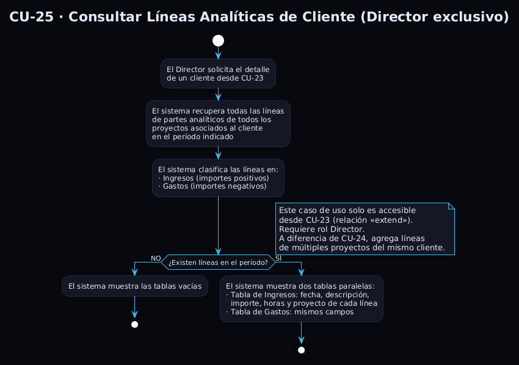

**Flujo principal:**
1. Desde CU-23, el actor hace click en "Ver Detalles" en una fila de cliente.
2. `GET /metrics/profitability/per-client/{client_id}/lines` con filtros opcionales de fecha, proyecto y manager.
3. Líneas de todos los proyectos del cliente, separadas en `incomes` y `expenses`.
4. Dos tablas con fecha · nombre · importe · horas · project_id.

**Flujos alternativos:**
- `FA-01`: Sin líneas → tablas vacías.

**Relaciones:** `<<extend>>` desde CU-23.

---

### CU-26 – Realizar Búsqueda Global

| Campo | Valor |
|---|---|
| **Actores** | Director, Responsable |
| **Precondición** | CU-01. Mínimo 2 caracteres. |
| **Postcondición** | Localiza recurso y navega a su detalle. |

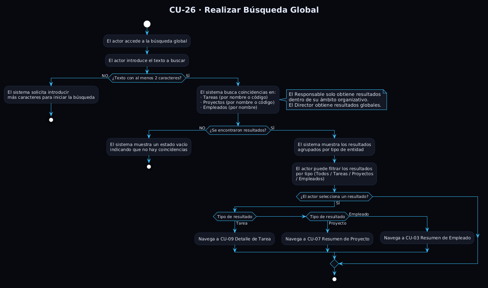

**Flujo principal:**
1. Navega a `/buscar` o acceso directo en sidebar.
2. ≥ 2 caracteres → debounce 350 ms.
3. `GET /search/?q=texto&entity=all` → tareas, proyectos, empleados; máx. 10 por tipo.
4. Responsable: filtrado por scope.
5. Botones [Todos][Tareas][Proyectos][Empleados].
6. Click: tarea → CU-09 · proyecto → CU-07 · empleado → CU-03.

**Flujos alternativos:**
- `FA-01`: Sin resultados → estado vacío.

**Relaciones:** Navega a CU-03, CU-07, CU-09.

### CU-27 – Cerrar Sesión
| Campo | Valor |
|---|---|
| **Actores** | Director, Responsable |
| **Precondición** | CU-01. Usuario autenticado. |
| **Postcondición** | JWT eliminado, cabecera de autenticación limpia, redirigido a login. |

**Flujo principal:**
1. El actor hace click en "Cerrar Sesión" en el menú de usuario.
2. El frontend elimina el JWT de `localStorage` y limpia la cabecera `Authorization` de Axios.
3. Redirige a `/login`.