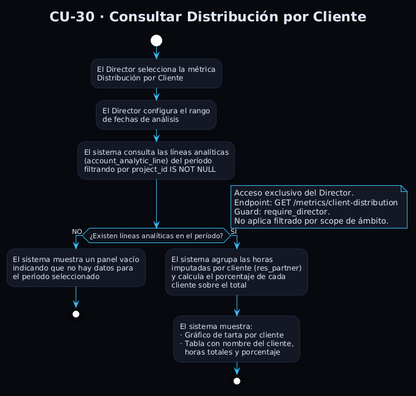
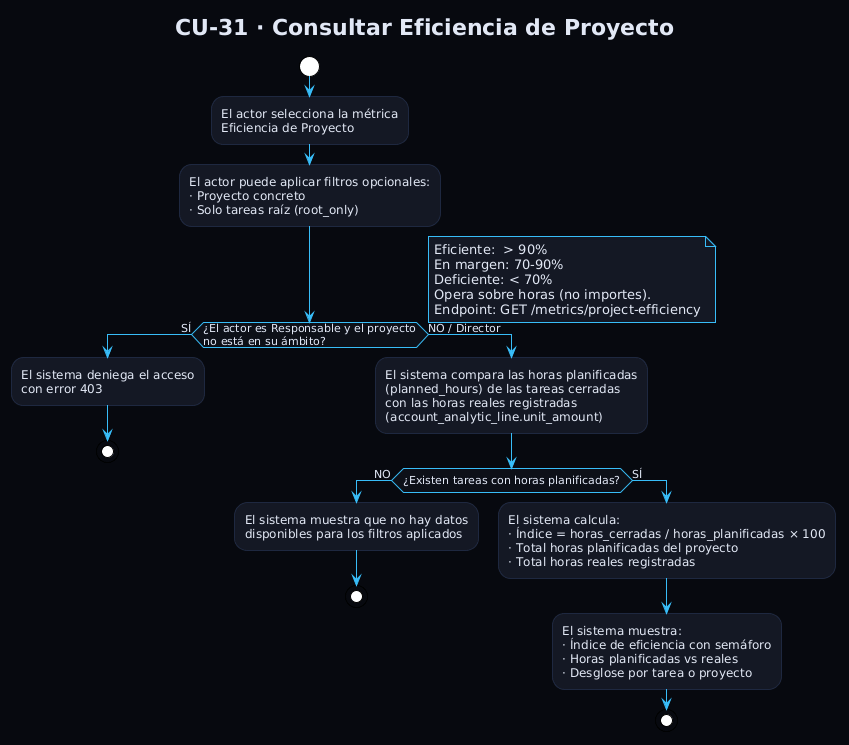
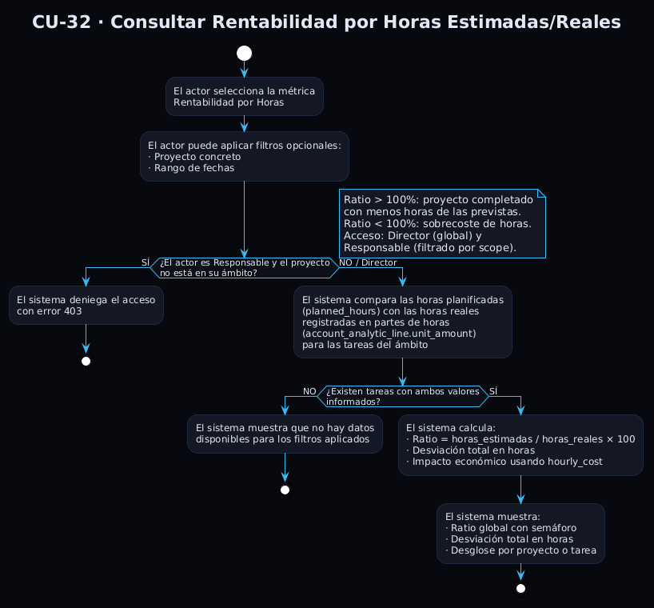

# Casos de Uso de Métricas Operativas (P10)

Este documento detalla cada uno de los **casos de uso** que componen el paquete P10 *Métricas Operativas* (CU-22 a CU-32). Todos ellos son accesibles desde la vista de catálogo de métricas (CU-10 *Consultar catálogo de métricas*), con la que mantienen una relación `<<extend>>`: el actor llega a CU-10, selecciona una métrica concreta y el sistema invoca el caso de uso correspondiente.

Cada caso de uso de este paquete comparte los mismos actores, precondición esencial (sesión activa y parámetros dentro del ámbito) y postcondición (el actor ha consultado el valor de la métrica). Lo que distingue a cada uno es el objeto sobre el que opera —la entidad o dimensión que se analiza—, los parámetros de entrada específicos, la fórmula de cálculo y los umbrales de interpretación.

Los flujos alternativos transversales de CU-10 (parámetro obligatorio sin informar, parámetros fuera del ámbito, sin datos para los filtros) se aplican implícitamente a todos los casos de uso de este paquete y no se repiten en cada ficha.

Todos los casos de uso de este paquete comparten además una relación `<<extend>>` hacia CU-17 *Guardar Snapshot* cuando el actor pulsa «Guardar snapshot» sobre el panel calculado.

## Índice

- [CU-22 — Consultar Productividad](#cu-22--consultar-productividad)
- [CU-23 — Consultar Cumplimiento de Plazos](#cu-23--consultar-cumplimiento-de-plazos)
- [CU-24 — Consultar WIP de Empleado](#cu-24--consultar-wip-de-empleado)
- [CU-25 — Consultar Carga de Trabajo de Empleado](#cu-25--consultar-carga-de-trabajo-de-empleado)
- [CU-26 — Consultar Riesgo de Proyecto](#cu-26--consultar-riesgo-de-proyecto)
- [CU-27 — Consultar Tasa de Retrabajo](#cu-27--consultar-tasa-de-retrabajo)
- [CU-28 — Consultar Exactitud de Estimación](#cu-28--consultar-exactitud-de-estimación)
- [CU-29 — Consultar Lead Time](#cu-29--consultar-lead-time)
- [CU-30 — Consultar Distribución por Cliente](#cu-30--consultar-distribución-por-cliente)
- [CU-31 — Consultar Eficiencia de Proyecto](#cu-31--consultar-eficiencia-de-proyecto)
- [CU-32 — Consultar Rentabilidad por Horas Estimadas/Reales](#cu-32--consultar-rentabilidad-por-horas-estimadasreales)

---

## CU-22 — Consultar Productividad

| Campo | Valor |
|---|---|
| **Actores** | Director, Responsable |
| **Precondición** | CU-01 completado. Si se filtra por empleado o proyecto, ambos deben pertenecer al ámbito del actor. |
| **Postcondición** | El actor ha consultado la productividad media y, si hay datos, el ranking de tareas por productividad. |

**Flujo principal:**
1. El actor selecciona la métrica *Productividad*.
2. El actor puede aplicar filtros opcionales: empleado concreto, proyecto concreto y rango de fechas.
3. El sistema calcula la productividad sobre las tareas cerradas que tengan horas estimadas y horas reales registradas.
4. El sistema muestra la productividad media del conjunto, el total de tareas analizadas y el ranking de tareas ordenadas por productividad.

**Flujos alternativos:**
- `FA-01`: Sin tareas con datos suficientes → el sistema muestra un panel vacío indicando que no hay datos para los filtros aplicados.

**Observación:** La fórmula aplicada es `(horas estimadas / horas reales) × 100`. Solo se consideran tareas cerradas en las que ambos valores son mayores que cero. Valores superiores al 100 % indican que la tarea se completó en menos tiempo del estimado.

**Relaciones:** Invocado desde CU-10 vía `<<extend>>`. `<<extend>>` hacia CU-17 (guardar snapshot del panel calculado).

---

## CU-23 — Consultar Cumplimiento de Plazos

| Campo | Valor |
|---|---|
| **Actores** | Director, Responsable |
| **Precondición** | CU-01 completado. Si se filtra por empleado o proyecto, ambos deben pertenecer al ámbito del actor. |
| **Postcondición** | El actor ha consultado el porcentaje de tareas cerradas a tiempo. |

**Flujo principal:**
1. El actor selecciona la métrica *Cumplimiento de Plazos*.
2. El actor puede aplicar filtros opcionales: empleado concreto y proyecto concreto.
3. El sistema calcula el porcentaje de tareas cerradas que se completaron antes o en la fecha límite establecida.
4. El sistema muestra la tasa de cumplimiento, el número de tareas a tiempo, el número de tareas con retraso y un indicador de semáforo.

**Flujos alternativos:**
- `FA-01`: Sin tareas con fecha límite y fecha de cierre → el sistema indica que no hay datos para los filtros aplicados.

**Observación:** El semáforo de referencia clasifica el cumplimiento como bueno cuando supera el 80 %, aceptable entre el 60 % y el 80 %, y deficiente por debajo del 60 %. Solo se consideran tareas cerradas con `date_end` y `date_deadline` informadas.

**Relaciones:** Invocado desde CU-10 vía `<<extend>>`. `<<extend>>` hacia CU-17.

---

## CU-24 — Consultar WIP de Empleado

| Campo | Valor |
|---|---|
| **Actores** | Director, Responsable |
| **Precondición** | CU-01 completado. El empleado seleccionado pertenece al ámbito del actor. |
| **Postcondición** | El actor conoce el número de tareas en curso del empleado y su nivel de paralelismo. |

**Flujo principal:**
1. El actor selecciona la métrica *WIP*.
2. El sistema verifica que el empleado pertenece al ámbito del actor.
3. El sistema cuenta las tareas abiertas asignadas actualmente al empleado.
4. El sistema clasifica el nivel de paralelismo: óptimo, aceptable o sobrecargado.
5. El sistema muestra el número de tareas en curso, el estado del nivel de paralelismo y una recomendación de gestión.

**Flujos alternativos:**
- `FA-01`: Empleado fuera del ámbito → acceso denegado.
- `FA-02`: Empleado sin usuario vinculado → WIP = 0 con mensaje informativo.

**Observación:** Los umbrales aplicados son: hasta 3 tareas óptimo, hasta 5 tareas aceptable, más de 5 tareas sobrecargado. La métrica refleja la cantidad de cambios de contexto a los que está expuesto el empleado.

**Relaciones:** Invocado desde CU-10 vía `<<extend>>`. `<<extend>>` hacia CU-17.

---

## CU-25 — Consultar Carga de Trabajo de Empleado

| Campo | Valor |
|---|---|
| **Actores** | Director, Responsable |
| **Precondición** | CU-01 completado. El empleado seleccionado pertenece al ámbito del actor. |
| **Postcondición** | El actor conoce la carga de trabajo del empleado y su clasificación. |

**Flujo principal:**
1. El actor selecciona la métrica *Carga de Trabajo*.
2. El sistema verifica que el empleado pertenece al ámbito del actor.
3. El sistema calcula las horas pendientes del empleado en sus tareas abiertas y las contrasta con la jornada de referencia.
4. El sistema clasifica al empleado como sobrecargado, normal o subcargado.
5. El sistema muestra el porcentaje de carga, las horas pendientes, las tareas abiertas, el estado con su indicador visual y las tareas completadas en los últimos 30 días.

**Flujos alternativos:**
- `FA-01`: Empleado fuera del ámbito → acceso denegado.
- `FA-02`: Empleado sin usuario vinculado → carga = 0.

**Observación:** La fórmula aplicada es `(Σ horas_pendientes / 40 horas de jornada de referencia) × 100`, donde las horas pendientes se calculan como `max(planned_hours − worked_hours, 0)` por tarea abierta asignada. Los estados se clasifican como sobrecargado por encima del 120 %, normal entre el 70 % y el 120 %, y subcargado por debajo del 70 %. Este caso de uso opera sobre un único empleado; la vista agregada de equipo queda cubierta por CU-21.

**Relaciones:** Invocado desde CU-10 vía `<<extend>>`. `<<extend>>` hacia CU-17.

---

## CU-26 — Consultar Riesgo de Proyecto

| Campo | Valor |
|---|---|
| **Actores** | Director, Responsable |
| **Precondición** | CU-01 completado. El proyecto seleccionado pertenece al ámbito del actor. |
| **Postcondición** | El actor conoce el índice de riesgo del proyecto y el detalle de tareas en riesgo. |

**Flujo principal:**
1. El actor selecciona la métrica *Índice de Riesgo*.
2. El sistema verifica que el proyecto pertenece al ámbito del actor.
3. El sistema analiza las tareas abiertas del proyecto que tienen fecha límite establecida.
4. El sistema identifica las tareas en riesgo: las vencidas y las que han consumido una parte importante del plazo entre asignación y fecha límite.
5. El sistema clasifica el nivel de riesgo del proyecto como bajo, medio o alto.
6. El sistema muestra el índice de riesgo, el número de tareas en riesgo, el total de tareas abiertas analizadas y el nivel de riesgo con semáforo de color.

**Flujos alternativos:**
- `FA-01`: Proyecto fuera del ámbito → acceso denegado.
- `FA-02`: Sin tareas abiertas con fecha límite → riesgo = 0 con mensaje informativo.

**Observación:** Una tarea se considera en riesgo si su `date_deadline` ya está vencida o si se ha consumido al menos el 80 % del intervalo entre `date_assign` y `date_deadline`. Los niveles del índice se clasifican como bajo por debajo del 20 %, medio entre el 20 % y el 50 %, y alto por encima del 50 %.

**Relaciones:** Invocado desde CU-10 vía `<<extend>>`. `<<extend>>` hacia CU-17.

---

## CU-27 — Consultar Tasa de Retrabajo

| Campo | Valor |
|---|---|
| **Actores** | Director, Responsable |
| **Precondición** | CU-01 completado. Si se filtra por empleado o proyecto, ambos deben pertenecer al ámbito del actor. |
| **Postcondición** | El actor conoce el porcentaje de tareas reabiertas tras su cierre. |

**Flujo principal:**
1. El actor selecciona la métrica *Tasa de Retrabajo*.
2. El actor puede aplicar filtros opcionales: proyecto concreto y empleado concreto.
3. El sistema analiza el historial de cambios de etapa de las tareas y detecta las que fueron cerradas y posteriormente reabiertas.
4. El sistema muestra la tasa de retrabajo, el número de tareas reabiertas, el total de tareas cerradas analizadas y un indicador de semáforo.

**Flujos alternativos:**
- `FA-01`: Sin tareas cerradas en el ámbito → estado vacío con mensaje informativo.

**Observación:** La detección de tareas reabiertas se basa en el historial inmutable de cambios que mantiene Odoo en `mail_tracking_value` sobre el campo de etapa. El semáforo aplicado clasifica el retrabajo como aceptable por debajo del 8 %, a vigilar entre el 8 % y el 15 %, y problemático por encima del 15 %.

**Relaciones:** Invocado desde CU-10 vía `<<extend>>`. `<<extend>>` hacia CU-17.

---

## CU-28 — Consultar Exactitud de Estimación

| Campo | Valor |
|---|---|
| **Actores** | Director, Responsable |
| **Precondición** | CU-01 completado. El empleado seleccionado pertenece al ámbito del actor. |
| **Postcondición** | El actor conoce el sesgo de estimación del empleado en las tareas de las que fue responsable. |

**Flujo principal:**
1. El actor selecciona la métrica *Exactitud de Estimación* y el empleado responsable.
2. El sistema verifica que el empleado pertenece al ámbito del actor.
3. El sistema analiza las tareas cerradas de las que el empleado era responsable y compara horas estimadas con horas reales.
4. El sistema determina el sesgo de estimación: subestima, sobreestima o preciso.
5. El sistema muestra el porcentaje de exactitud, el sesgo detectado, el total de tareas analizadas y un mensaje explicativo.

**Flujos alternativos:**
- `FA-01`: Empleado fuera del ámbito → acceso denegado.
- `FA-02`: Sin tareas con ambos valores informados → sin datos.

**Observación:** El cálculo se basa en el ratio medio `(horas reales / horas estimadas)` de las tareas cerradas en las que el empleado fue responsable. El sesgo se clasifica como subestima cuando la exactitud supera el 110 %, sobreestima por debajo del 90 %, y preciso entre el 90 % y el 110 %.

**Relaciones:** Invocado desde CU-10 vía `<<extend>>`. `<<extend>>` hacia CU-17.

---

## CU-29 — Consultar Lead Time

| Campo | Valor |
|---|---|
| **Actores** | Director, Responsable |
| **Precondición** | CU-01 completado. Si se filtra por empleado o proyecto, ambos deben pertenecer al ámbito del actor. |
| **Postcondición** | El actor conoce el tiempo medio de ciclo de las tareas analizadas. |

**Flujo principal:**
1. El actor selecciona la métrica *Lead Time*.
2. El actor puede aplicar filtros opcionales: empleado concreto y proyecto concreto.
3. El sistema calcula el tiempo medio transcurrido desde la asignación hasta el cierre de las tareas completadas en el ámbito.
4. El sistema muestra el tiempo medio de ciclo en días, el total de tareas analizadas y un indicador de referencia.

**Flujos alternativos:**
- `FA-01`: Sin tareas con fecha de asignación y fecha de cierre → estado vacío.

**Observación:** El cálculo aplica `(date_end − date_assign)` para cada tarea cerrada y promedia los días resultantes. El semáforo de referencia clasifica el ciclo como ágil por debajo de 5 días, moderado entre 5 y 10 días, y lento por encima de 10 días.

**Relaciones:** Invocado desde CU-10 vía `<<extend>>`. `<<extend>>` hacia CU-17.

---

## CU-30 — Consultar Distribución por Cliente

| Campo | Valor |
|---|---|
| **Actores** | Director (exclusivo) |
| **Precondición** | CU-01 completado con rol Director. Rango de fechas válido. |
| **Postcondición** | El Director conoce el porcentaje de horas imputadas por cliente en el período analizado. |

**Flujo principal:**
1. El Director selecciona la métrica *Distribución por Cliente*.
2. El actor configura el rango de fechas de análisis.
3. El sistema agrupa las horas imputadas en partes analíticos por cliente (partner) en el período indicado.
4. El sistema calcula el porcentaje que representa cada cliente sobre el total de horas del período.
5. El sistema muestra un gráfico de tarta y una tabla con el nombre del cliente, las horas totales imputadas y su porcentaje sobre el global.

**Flujos alternativos:**
- `FA-01`: Sin partes analíticos en el período → panel vacío con mensaje informativo.

**Observación:** La agrupación se realiza sobre `account_analytic_line` filtrando por `project_id IS NOT NULL` y uniendo con `res_partner` a través del proyecto. Solo el Director tiene acceso a esta métrica dado que expone datos financieros globales sin restricción de ámbito. El endpoint subyacente es `GET /metrics/client-distribution` con guard `require_director`.

**Relaciones:** Invocado desde CU-10 vía `<<extend>>`. `<<extend>>` hacia CU-17.

---

## CU-31 — Consultar Eficiencia de Proyecto

| Campo | Valor |
|---|---|
| **Actores** | Director, Responsable |
| **Precondición** | CU-01 completado. El proyecto seleccionado pertenece al ámbito del actor. |
| **Postcondición** | El actor conoce la eficiencia horaria del proyecto: cuántas horas planificadas se han ejecutado vs las realmente registradas. |

**Flujo principal:**
1. El actor selecciona la métrica *Eficiencia de Proyecto*.
2. El actor puede aplicar filtros opcionales: proyecto concreto y flag `root_only` para excluir subtareas.
3. El sistema verifica que el proyecto pertenece al ámbito del actor.
4. El sistema compara las horas planificadas (`planned_hours`) de las tareas con las horas reales registradas (`account_analytic_line.unit_amount`).
5. El sistema calcula el índice de eficiencia: `(horas_cerradas / horas_planificadas) × 100`.
6. El sistema muestra el índice de eficiencia, el total de horas planificadas, el total de horas reales y un indicador de semáforo por proyecto o tarea.

**Flujos alternativos:**
- `FA-01`: Proyecto fuera del ámbito del actor → acceso denegado.
- `FA-02`: Sin tareas con horas planificadas → panel vacío con mensaje informativo.

**Observación:** Esta métrica opera sobre horas, no sobre importes económicos (a diferencia de CU-32, que mide rentabilidad económica). El índice se clasifica como eficiente cuando supera el 90 %, en margen cuando se sitúa entre el 70 % y el 90 %, y deficiente por debajo del 70 %. El endpoint subyacente es `GET /metrics/project-efficiency`.

**Relaciones:** Invocado desde CU-10 vía `<<extend>>`. `<<extend>>` hacia CU-17.

## CU-32 — Consultar Rentabilidad por Horas Estimadas/Reales

| Campo | Valor |
|---|---|
| **Actores** | Director, Responsable |
| **Precondición** | CU-01 completado. Si se filtra por proyecto, debe pertenecer al ámbito del actor. |
| **Postcondición** | El actor conoce la desviación entre horas estimadas y horas reales registradas en el proyecto o ámbito analizado, y su impacto en la rentabilidad. |

**Flujo principal:**
1. El actor selecciona la métrica *Rentabilidad por Horas*.
2. El actor puede aplicar filtros opcionales: proyecto concreto y rango de fechas.
3. El sistema compara las horas planificadas (`planned_hours`) con las horas reales registradas en los partes de horas (`account_analytic_line.unit_amount`) para las tareas del ámbito.
4. El sistema calcula el ratio de eficiencia horaria: `horas_estimadas / horas_reales × 100`.
5. El sistema muestra el ratio global, la desviación total en horas, el desglose por proyecto o tarea y un indicador de semáforo.

**Flujos alternativos:**
- `FA-01`: Sin tareas con horas planificadas y reales → panel vacío con mensaje informativo.
- `FA-02`: Proyecto fuera del ámbito del actor → acceso denegado.

**Observación:** Esta métrica permite evaluar si el esfuerzo real invertido en un proyecto se ajusta a la planificación inicial, y cuantificar el impacto económico de las desviaciones usando el coste horario de los empleados (`hourly_cost`). Un ratio superior al 100 % indica que el proyecto consumió menos horas de las previstas; un ratio inferior indica sobrecoste de horas.

**Relaciones:** Invocado desde CU-10 vía `<<extend>>`. `<<extend>>` hacia CU-17.