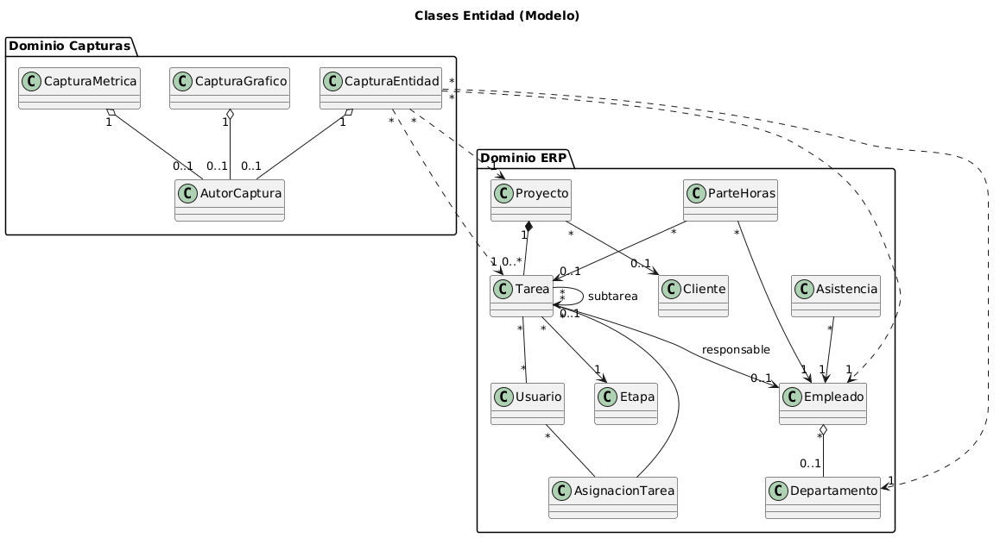
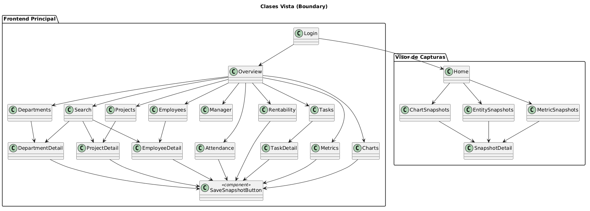
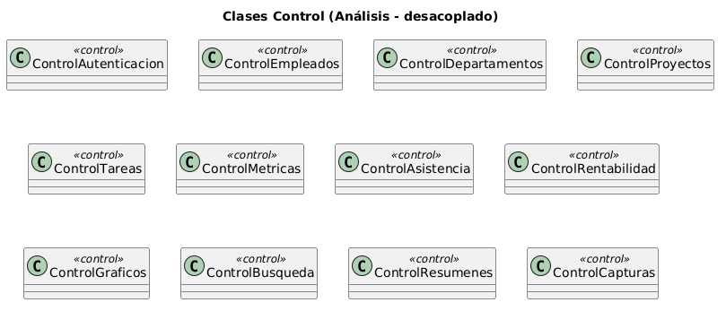

# Disciplina de Análisis

## Índice

1. [Análisis de la Arquitectura](#1-análisis-de-la-arquitectura)
   - 1.1 [Visión general del módulo](#11-visión-general-del-módulo)
   - 1.2 [Restricción fundamental: solo lectura sobre Odoo](#12-restricción-fundamental-solo-lectura-sobre-odoo)
2. [Análisis de Casos de Uso](#2-análisis-de-casos-de-uso)
   - 2.1 [Marco metodológico de análisis](#21-marco-metodológico-de-análisis)
   - 2.2 [CU-02 — Listar empleados](#22-cu-02--listar-empleados)
   - 2.3 [CU-03 — Ver resumen de empleado](#23-cu-03--ver-resumen-de-empleado)
   - 2.4 [CU-08 — Listar tareas](#24-cu-08--listar-tareas)
   - 2.5 [CU-13 — Consultar rentabilidad financiera](#25-cu-13--consultar-rentabilidad-financiera)
   - 2.6 [CU-17 — Guardar snapshot](#26-cu-17--guardar-snapshot)
   - 2.7 [CU-19 — Consultar detalle de snapshot](#27-cu-19--consultar-detalle-de-snapshot)
3. [Análisis de Clases](#3-análisis-de-clases)
   - 3.1 [Identificación de clases de análisis](#31-identificación-de-clases-de-análisis)
   - 3.2 [Relaciones entre clases del dominio](#32-relaciones-entre-clases-del-dominio)
4. [Análisis de Paquetes](#4-análisis-de-paquetes)
   - 4.1 [Subsistemas conceptuales](#41-subsistemas-conceptuales)
   - 4.2 [Paquetes de análisis del backend](#42-paquetes-de-análisis-del-backend)
   - 4.3 [Paquetes de análisis de los frontends](#43-paquetes-de-análisis-de-los-frontends)

---

## 1. Análisis de la Arquitectura

### 1.1 Visión general del módulo

Netkia Analytics es un módulo externo de analítica construido sobre el ERP Odoo v16 Enterprise. Su arquitectura se organiza en tres capas lógicas desacopladas y dos fuentes de datos diferenciadas: una base de datos relacional correspondiente al ERP y una base documental destinada al almacenamiento de capturas históricas.

El sistema se compone de los siguientes elementos principales:
- **Componente servidor (backend)**: actúa como núcleo del sistema. Se encarga de acceder a la base de datos del ERP en modo solo lectura, así como de gestionar la persistencia de capturas históricas en una base documental independiente. Además, centraliza la lógica de negocio y expone los servicios necesarios para el resto de componentes.
- **Aplicación cliente principal**: proporciona acceso a la información operativa en tiempo real. Permite consultar datos actualizados del ERP, visualizar indicadores y generar capturas del estado actual de los paneles (CU-17).
- **Aplicación cliente de capturas (visor)**: orientada al análisis histórico, permite consultar, visualizar y eliminar capturas previamente almacenadas (CU-18, CU-19, CU-20). Comparte el mismo mecanismo de autenticación que la aplicación principal, pero su interacción se limita al consumo de información persistida.

La separación entre los dos frontends es intencional: el principal resuelve el caso de uso *operativo* (decisiones hoy sobre datos vivos); el visor resuelve el caso de uso *histórico* (consultar el estado de un panel en un día pasado).

### 1.2 Restricción fundamental: solo lectura sobre Odoo

El acceso exclusivo de lectura a la base de datos del ERP determina varias decisiones de arquitectura: no se utilizan patrones de escritura ni transacciones de modificación sobre la base relacional; todos los modelos de datos mapean tablas existentes sin añadir columnas; y la lógica del módulo operativo se concentra en optimizar consultas y calcular métricas, no en persistir estado propio.

La única excepción a esta restricción es el subsistema de capturas, que persiste sus propios documentos en la base documental. Esa base queda por completo fuera del espacio de Odoo: no existe integridad referencial real entre ambas, y la correspondencia entre una captura de entidad y la entidad operativa que retrata se mantiene de forma lógica mediante un campo de tipo y un identificador. De este modo, la restricción de solo lectura sobre el ERP se preserva íntegramente y el almacenamiento de capturas queda encapsulado en un subsistema independiente.

---

## 2. Análisis de Casos de Uso

Esta sección describe qué sucede en cada caso de uso desde que el actor lo inicia hasta que el sistema devuelve un resultado. El objetivo del análisis es identificar las clases implicadas, las responsabilidades que asume cada una y las colaboraciones necesarias entre ellas, sin entrar en detalles de implementación, los cuales corresponden a la fase de diseño.

### 2.1 Marco metodológico de análisis

En RUP, el análisis de casos de uso describe **qué responsabilidades** asume cada clase y **cómo colaboran entre sí** para cumplir con los requisitos funcionales definidos en el contrato del caso de uso.

#### Separación de responsabilidades por capas

Para estructurar el análisis, se adopta una organización basada en el patrón MVC, alineada con las categorías de clases propuestas en RUP: Boundary (Vista), Control y Entidad.

| **Categoría (RUP)** | **Capa (MVC)** | **Responsabilidad**          | **Descripción detallada**                                                                                                                                                                                      | **Colaboraciones principales**                                                                                                 | **Restricciones**                                                                                                |
| ------------------- | -------------- | ---------------------------- | -------------------------------------------------------------------------------------------------------------------------------------------------------------------------------------------------------------- | ------------------------------------------------------------------------------------------------------------------------------ | ---------------------------------------------------------------------------------------------------------------- |
| **Boundary**        | Vista          | Interacción con el actor     | Gestiona la comunicación entre el usuario y el sistema, capturando entradas, mostrando resultados y controlando la navegación entre interfaces. Representa los puntos de entrada al sistema desde el exterior. | Colabora con las clases de Control, a las que delega la ejecución de los casos de uso.                                         | No contiene lógica de negocio ni accede directamente a las entidades del dominio o a mecanismos de persistencia. |
| **Control**         | Control        | Coordinación del caso de uso | Orquesta la ejecución de los casos de uso, gestionando el flujo de eventos y aplicando la lógica de negocio. Actúa como intermediario entre las clases Boundary y las Entidad.                                 | Interactúa con clases Boundary para recibir solicitudes y con clases Entidad para consultar o modificar el estado del sistema. | No gestiona la presentación ni implementa directamente la persistencia de datos.                                 |
| **Entidad**         | Modelo         | Representación del dominio   | Modela los conceptos clave del dominio del problema, encapsulando los datos y, en su caso, reglas de negocio básicas asociadas a dichos datos.                                                                 | Colabora con las clases de Control, que utilizan sus datos y operaciones para llevar a cabo los casos de uso.                  | No contiene lógica de interfaz de usuario ni controla el flujo de ejecución del sistema.                         |

---

### 2.2 CU-02 — Listar empleados

El análisis de este caso de uso se documenta en el archivo [Análisis de CU-02](./utils/Análisis_CU02.md). 

---

### 2.3 CU-03 — Ver resumen de empleado

El análisis de este caso de uso se documenta en el archivo [Análisis de CU-03](./utils/Análisis_CU03.md).

---

### 2.4 CU-08 — Listar tareas

El análisis de este caso de uso se documenta en el archivo [Análisis de CU-08](./utils/Análisis_CU08.md).

---

### 2.5 CU-13 — Consultar rentabilidad financiera

El análisis de este caso de uso se documenta en el archivo [Análisis de CU-13](./utils/Análisis_CU13.md).

---

### 2.6 CU-17 — Guardar snapshot

El análisis de este caso de uso se documenta en el archivo [Análisis de CU-17](./utils/Análisis_CU17.md).

---

### 2.7 CU-19 — Consultar detalle de snapshot

El análisis de este caso de uso se documenta en el archivo [Análisis de CU-19](./utils/Análisis_CU19.md).

---

## 3. Análisis de Clases

### 3.1 Identificación de clases de análisis

Siguiendo la metodología RUP, las clases se clasifican en tres estereotipos: Entidad, Vista y Control. Las clases de análisis son abstracciones conceptuales que representan responsabilidades del dominio; su correspondencia con componentes concretos de implementación se establece en la disciplina de diseño.

#### Clases Entidad del dominio operativo y documental

Las clases Entidad del dominio operativo representan los conceptos persistidos en la base relacional de Odoo. En el análisis se nombran por su rol en el dominio, no por su tabla.

Las clases Entidad del dominio documental representan los conceptos persistidos en la base documental. Son independientes de las entidades del ERP y no mantienen integridad referencial con ellas.

#### Clases Vista (Boundary) — páginas de las aplicaciones

Las clases vista representan los puntos de entrada del actor al sistema. Cada clase vista gestiona la interacción con el actor para uno o varios casos de uso relacionados.

#### Clases Control

Las clases Control orquestan la ejecución de los casos de uso. Cada clase Control coordina la colaboración entre las clases Vista y las clases Entidad para cumplir con los requisitos funcionales de uno o varios casos de uso relacionados.

---

## 4. Análisis de Paquetes

### 4.1 Subsistemas conceptuales

El sistema se organiza en cuatro subsistemas conceptuales con responsabilidades bien diferenciadas:

| Subsistema | Responsabilidad | Fuente de datos |
|---|---|---|
| **Frontend principal** | Interacción operativa con el actor: consulta, filtrado, visualización y generación de capturas | Consume el backend mediante solicitudes |
| **Backend** | Centraliza la lógica de negocio, verifica el ámbito del actor y expone los resultados calculados | Base relacional del ERP (solo lectura) y base documental (lectura/escritura) |
| **Base operativa** | Almacena los datos del ERP: tareas, empleados, proyectos, imputaciones, asistencia y auditoría | PostgreSQL (Odoo) |
| **Base documental** | Almacena las capturas históricas de métricas, gráficos y entidades | MongoDB |
| **Visor de capturas** | Interacción histórica con el actor: consulta y eliminación de capturas previamente almacenadas | Consume únicamente los endpoints de capturas del backend |

La separación entre el frontend principal y el visor refleja la distinción entre el caso de uso operativo (decisiones sobre datos vivos) y el caso de uso histórico (análisis de un estado pasado). El visor nunca dispara cálculos sobre la base operativa.

### 4.2 Paquetes de análisis del backend

Dentro del subsistema backend las clases se agrupan en los siguientes paquetes funcionales siguiendo el patrón de Modelo-Vista-Controlador:
| Paquete de análisis | Clases Control que agrupa | Casos de uso |
|---|---|---|
| Modelos de dominio | Todas las clases Entidad | Todas las operaciones sobre datos del ERP y capturas |
| Controladores de casos de uso | Clases Control de autenticación, empleados, departamentos, proyectos, tareas, métricas, asistencia, rentabilidad, gráficos, búsqueda y resúmenes | CU-01 a CU-15, CU-21 a CU-32 |
| Controladores de capturas | Clase Control de capturas | CU-17 a CU-20 |
| Utilidades | Funciones de acceso a datos, validación de parámetros, formateo de resultados, constantes de negocio, etc. | Soporte transversal a todos los casos de uso |
| Esquemas de datos | Definiciones de estructuras de datos para validación y serialización | Soporte transversal a todos los casos de uso |
| Configuración | Parámetros de conexión, mapeos de roles y ámbitos, etc. | Soporte transversal a todos los casos de uso |

### 4.3 Paquetes de análisis de los frontends

Los dos frontends se organizan según el mismo criterio de cohesión funcional. La separación entre aplicación principal y visor es una decisión de análisis: responden a casos de uso con naturaleza distinta y no comparten clases Vista menos el login.

**Aplicación principal**

| Paquete de análisis | Clases Vista que agrupa | Casos de uso |
|---|---|---|
| Autenticación | `Login` | CU-01 |
| Operativa de personas | `Employees`, `EmployeeDetail`, `Departments`, `DepartmentDetail` | CU-02 a CU-05 |
| Operativa de proyectos | `Projects`, `ProjectDetail`, `Tasks`, `TaskDetail` | CU-06 a CU-09 |
| Analítica | `Metrics`, `Charts`, `Attendance`, `Manager` | CU-10 a CU-12, CU-21, CU-22 a CU-32 |
| Dirección | `Rentability` | CU-13, CU-14 |
| Utilidades | `Search`, `Overview`, `SaveSnapshotButton` | CU-15, CU-17 |

**Visor de capturas**

| Paquete de análisis | Clases Vista que agrupa | Casos de uso |
|---|---|---|
| Autenticación | `Login` | CU-01 |
| Navegación de capturas | `Home`, `MetricSnapshots`, `ChartSnapshots`, `EntitySnapshots` | CU-18 |
| Detalle y eliminación | `SnapshotDetail` | CU-19, CU-20 |

La clase `SaveSnapshotButton` pertenece al paquete de utilidades de la aplicación principal
porque puede integrarse en cualquier vista calculada. No existe en el visor porque este no
genera capturas nuevas.