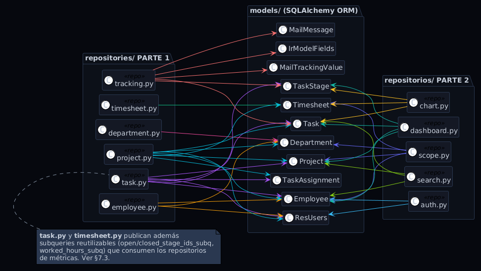
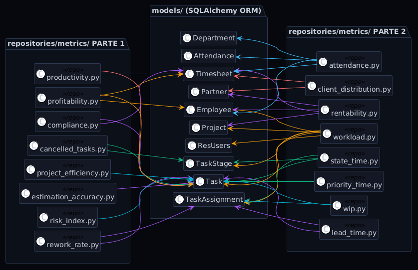
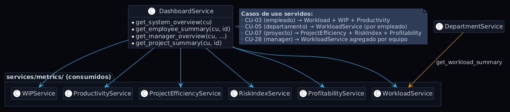
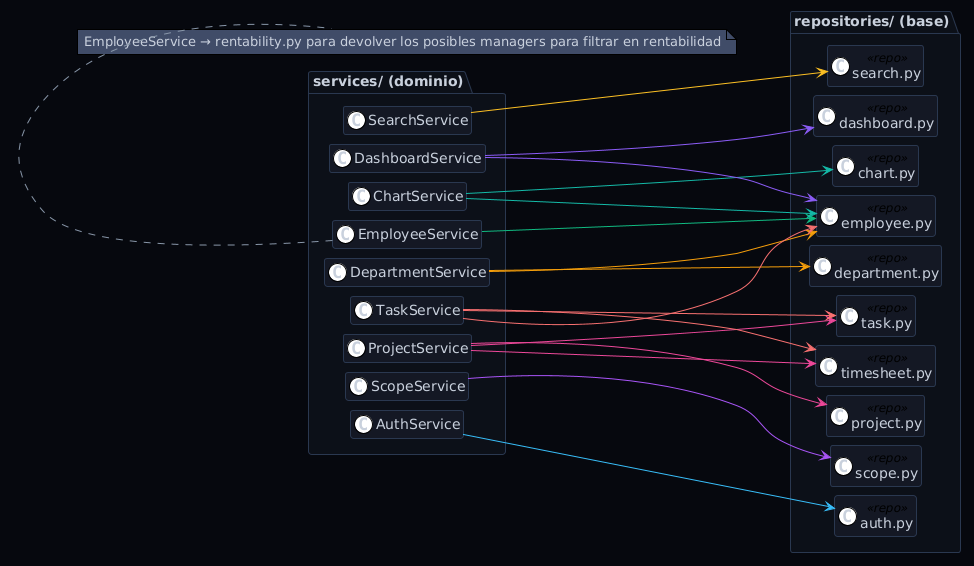

# 5. Diseño de la Arquitectura

## Índice

5. [Diseño de la Arquitectura](#5-diseño-de-la-arquitectura)
   - 5.1 [Patrón arquitectónico](#51-patrón-arquitectónico)
   - 5.2 [Stack tecnológico](#52-stack-tecnológico)
   - 5.3 [Seguridad: JWT y RBAC](#53-seguridad-jwt-y-rbac)
   - 5.4 [Arquitectura física desplegada](#54-arquitectura-física-desplegada)
6. [Diseño de Casos de Uso](#6-diseño-de-casos-de-uso)
   - 6.1 [CU-03 — Ver resumen de empleado](#61-cu-03--ver-resumen-de-empleado)
   - 6.2 [CU-08 — Listar y filtrar tareas](#62-cu-08--listar-y-filtrar-tareas)
   - 6.3 [CU-10 — Consultar productividad](#63-cu-10--consultar-productividad)
   - 6.4 [CU-28 — Panel manager](#64-cu-28--panel-manager)
7. [Diseño de Clases](#7-diseño-de-clases)
   - 7.1 [Diagrama 1 — Modelos ORM ↔ Repositorios](#71-diagrama-1--modelos-orm--repositorios)
   - 7.2 [Diagrama 2 — Repositorios ↔ Servicios de dominio](#72-diagrama-2--repositorios--servicios-de-dominio)
   - 7.3 [Diagrama 3 — Servicios de métricas ↔ Repositorios de métricas](#73-diagrama-3--servicios-de-métricas--repositorios-de-métricas)
   - 7.4 [Diagrama 4 — Rutas ↔ Servicios (Backend) y Frontend ↔ Backend](#74-diagrama-4--rutas--servicios-backend-y-frontend--backend)
8. [Diseño de Paquetes](#8-diseño-de-paquetes)
   - 8.1 [Principios aplicados en la organización de paquetes](#81-principios-aplicados-en-la-organización-de-paquetes)
   - 8.2 [Métricas de calidad](#82-métricas-de-calidad)
9. [Wireframes de Interfaz](#9-wireframes-de-interfaz)
   - 9.1 [WF-01 — Resumen de Empleado (CU-03)](#wf-01--resumen-de-empleado-cu-03)
   - 9.2 [WF-02 — Listado y filtrado de tareas (CU-08)](#wf-02--listado-y-filtrado-de-tareas-cu-08)
   - 9.3 [WF-03 — Panel de métricas (CU-10 y otras métricas)](#wf-03--panel-de-métricas-cu-10-y-otras-métricas)
   - 9.4 [WF-04 — Panel Manager (CU-27)](#wf-04--panel-manager-cu-27)

### 5.1 Patrón arquitectónico

El sistema materializa una **arquitectura por capas de cuatro niveles** en el backend, complementada con un frontend SPA desacoplado. Aunque la terminología MVC es utilizada como herramienta de análisis para clasificar las clases, la estructura de implementación va más allá del MVC clásico de tres niveles por razones de complejidad del dominio analítico.

| Concepto MVC | Materialización en la solución |
|---|---|
| **Modelo** | `models/` (ORM) + `repositories/` (acceso a datos) |
| **Vista** | React SPA + `schemas/` (contratos JSON) |
| **Controlador** | `routes/` (HTTP) + `services/` (lógica de negocio) |

La capa de servicios no existe en el MVC puro de tres capas. Se introduce porque los cálculos de métricas operativas requieren orquestar múltiples consultas y aplicar fórmulas complejas; concentrar esa lógica en los controladores produciría módulos de cientos de líneas con baja cohesión.

### 5.2 Stack tecnológico

| Capa | Tecnología | Justificación |
|---|---|---|
| Frontend | React 18 + Vite 5 | SPA reactiva; Recharts para gráficos, React Router para navegación |
| Backend | FastAPI 0.109 + Python 3.11 | Framework asíncrono con validación automática (Pydantic) y documentación OpenAPI |
| ORM | SQLAlchemy 2.0 | Mapeo directo de tablas Odoo sin migraciones |
| Base de datos | PostgreSQL 14+ (Odoo v16) | BD existente del ERP; CTEs recursivas para jerarquía organizativa |
| Autenticación | JWT HS256 (python-jose) | Token stateless con scope embebido; passlib para hash Odoo |
| Comunicación | REST + JSON | Proxy Vite en desarrollo; CORS configurado para producción |

### 5.3 Seguridad: JWT y RBAC

El control de acceso se resuelve en dos momentos:

1. **Login:** `scope_service` calcula el rol del usuario (`director` / `responsable` / `empleado`) y su ámbito organizativo (`employee_ids`, `department_ids`, `project_ids`) consultando las jerarquías de Odoo. Este ámbito se embebe en el token JWT.

2. **Cada petición:** el middleware de autenticación decodifica el token, reconstruye el objeto `CurrentUser` y los guards (`require_manager_or_above`, `require_director`) bloquean el acceso según el rol. Los servicios aplican filtros de scope sobre las consultas usando los ids embebidos.

#### Dónde se verifica y aplica el scope

Hay tres capas distintas donde el scope del JWT actúa:

**Capa 1 — Guard de rol** (`core/auth.py`): `require_manager_or_above` / `require_director`. Bloquea por rol antes de que la petición llegue al servicio. Es lo primero que se ejecuta.

**Capa 2 — Verificación de acceso individual** (`utils/validation.py`): `verify_employee_scope`, `verify_project_scope`, `verify_department_scope`. Se llama desde la ruta o el servicio cuando el actor pide una entidad concreta por ID. Comprueba si ese ID está en la lista del JWT.

**Capa 3 — Filtrado de listados** (capa de servicio): Cuando el actor lista entidades sin especificar un ID, el servicio extrae `cu.employee_ids`, `cu.department_ids` o `cu.project_ids` del token y los pasa al repositorio como filtro.

| CU | Capa 1 | Capa 2 | Capa 3 — filtrado de scope |
|---|---|---|---|
| CU-02 Listar empleados | `require_manager_or_above` | — | `emp_ids = cu.employee_ids if cu.is_responsable` → `get_filtered_employees_query(emp_ids)` |
| CU-03 Ver resumen empleado | `require_manager_or_above` | `verify_employee_scope(cu, id)` en `EmployeeService` y en `DashboardService` | — |
| CU-04 Listar departamentos | `require_manager_or_above` | — | `dept_ids = cu.department_ids if cu.is_responsable` → `get_filtered_departments_query(dept_ids)` |
| CU-05 Ver detalle departamento | `require_manager_or_above` | `verify_department_scope(cu, id)` en `DepartmentService` | — |
| CU-06 Listar proyectos | `require_manager_or_above` | — | `[p for p in projects if p.id in cu.project_ids]` en `ProjectService.list_projects` |
| CU-07 Ver detalle proyecto | `require_manager_or_above` | `verify_project_scope(cu, id)` en `ProjectService` | — |
| CU-08 Listar tareas | `require_manager_or_above` | `verify_employee_scope` si se filtra por empleado | `effective_project_ids = cu.project_ids if cu.is_responsable` en `TaskService.filter_tasks` |
| CU-28 Panel manager | `require_manager_or_above` | `verify_department_scope` si se filtra por dept | `get_filtered_employees_query(employee_ids=cu.employee_ids)` en `DashboardService` |


### 5.4 Arquitectura física desplegada

```
┌──────────────┐   HTTP :3000   ┌──────────────┐   SQL :5432   ┌──────────────┐
│  Navegador   │◄──────────────►│   Servidor   │◄─────────────►│  PostgreSQL  │
│  (React)     │   /api proxy   │  (FastAPI    │  pool_size=5  │  (Odoo v16)  │
│              │                │   uvicorn)   │               │              │
└──────────────┘                └──────────────┘               └──────────────┘
```

---

## 6. Diseño de Casos de Uso

Esta sección especifica el flujo detallado de los casos de uso más representativos, trazando la interacción a través de todas las capas hasta que se devuelve la respuesta final. En todos los casos se aplica el mismo patrón de control de acceso en tres capas: la ruta aplica el guard de rol (Capa 1), el servicio verifica el acceso a entidades concretas (Capa 2) y filtra los listados al scope del JWT (Capa 3), y el repositorio ejecuta la consulta SQL sin conocer nada de roles ni permisos.

---

### 6.1 CU-02 — Listar empleados

**Actor:** Director o Responsable  
**Precondición:** el actor está autenticado.

| Paso | Capa | Clase / Función | Acción |
|---|---|---|---|
| 1 | Frontend | `Employees.jsx` → `useApi` | Envía `GET /employees/` con filtros opcionales: `department_id`, `search`, `active`, `sort_by`, `sort_order`, `page`, `page_size` |
| 2 | Routes | `employee.router` → `require_manager_or_above` | Decodifica el JWT y rechaza con 403 si el rol es `empleado`. Inyecta `CurrentUser` con `role`, `employee_ids` y `department_ids`. No aplica scope aquí: delega al servicio |
| 3 | Services | `EmployeeService.list_employees(cu, ...)` | Si se proporciona `department_id`, llama a `verify_department_scope(cu, department_id)` y lanza 403 si el responsable no gestiona ese departamento (**Capa 2**) |
| 4 | Services | | Calcula `emp_ids`: si el actor es responsable y no hay `department_id` concreto, `emp_ids = cu.employee_ids`; si es director, `emp_ids = None` sin restricción (**Capa 3**) |
| 5 | Repositories | `employee.py → get_filtered_employees_query()` | Construye la query con `WHERE id IN (:emp_ids)` si hay scope, más filtros de departamento, búsqueda por nombre y ordenación |
| 6 | Utils | `pagination.py → paginate()` | Ejecuta `COUNT(*)` para el total y aplica `OFFSET`/`LIMIT` según página |
| 7 | Routes | `employee.router` | Devuelve `200 OK` + `PaginatedResponse[EmployeeDetail]` |

**Datos de salida:** `PaginatedResponse[EmployeeDetail]` con `id`, `name`, `department_name`, `job_title`, `work_email`, `hourly_cost` y `active` por cada empleado visible para el actor.


---

### 6.2 CU-03 — Ver resumen de empleado

**Actor:** Director o Responsable  
**Precondición:** el actor está autenticado; el `employee_id` pertenece al scope del actor.

| Paso | Capa | Clase / Función | Acción |
|---|---|---|---|
| 1 | Frontend | `EmployeeDetail.jsx` → `useApi` | Envía `GET /employees/{id}` para obtener la ficha básica del empleado |
| 2 | Routes | `employee.router` → `require_manager_or_above` | Decodifica el JWT y rechaza con 403 si el rol es `empleado`. Inyecta `CurrentUser`. Delega al servicio sin aplicar scope |
| 3 | Services | `EmployeeService.get_employee(cu, employee_id)` | Llama a `verify_employee_scope(cu, employee_id)`: 403 si el responsable no tiene ese empleado en `cu.employee_ids` (**Capa 2**) |
| 4 | Repositories | `employee.py → get_employee_by_id()` | `SELECT hr_employee JOIN hr_department WHERE id = :id`. El empleado ya está validado; el repositorio solo recupera datos |
| 5 | Frontend | `EmployeeDetail.jsx` → `useApi` | Envía `GET /dashboards/summary/employee/{id}` para cargar los KPIs del dashboard |
| 6 | Routes | `dashboards.router` → `require_manager_or_above` | Decodifica el JWT. Delega al servicio sin aplicar scope |
| 7 | Services | `DashboardService.get_employee_summary(cu, employee_id)` | Vuelve a llamar a `verify_employee_scope(cu, employee_id)` para impedir el acceso directo a la ruta del dashboard sin pasar por `/employees/{id}` (**Capa 2**) |
| 8 | Services | `WorkloadService.calculate(employee_id, detailed=True)` | Consulta las tareas abiertas asignadas al empleado y las tareas cerradas en los últimos 30 días. Calcula `workload_percentage` y `pending_hours` |
| 9 | Services | `WIPService.calculate(employee_id)` | Cuenta las tareas abiertas asignadas al usuario y clasifica el estado: `optimo`, `aceptable` o `sobrecargado` |
| 10 | Services | `ProductivityService.calculate(employee_id, date_from, date_to)` | Calcula el ratio `planned / actual × 100` para las tareas cerradas en los últimos 30 días |
| 11 | Repositories | `workload.py`, `wip.py`, `productivity.py` | Ejecutan las queries sobre `project_task`, `project_task_user_rel` y `account_analytic_line` filtrando por el `user_id` del empleado concreto |
| 12 | Services | `DashboardService` | Ensambla `EmployeeSummaryResponse` con los resultados de los tres sub-cálculos y construye `quick_stats` |
| 13 | Routes | `dashboards.router` | Devuelve `200 OK` + JSON |
| 14 | Frontend | `EmployeeDetail.jsx` | Renderiza las KpiCards de carga, WIP y productividad, y la sección de pestañas de tareas |
| 15 | Frontend | Pestañas (`Pendientes`, `Completadas`, `Asignadas`, `Responsable`) | Cada pestaña lanza `GET /tasks/filter` bajo demanda al seleccionarse, reutilizando el mismo endpoint de CU-08 con el parámetro `status` o `responsable` correspondiente |

**Datos de salida:** `EmployeeSummaryResponse` con `workload`, `wip`, `productivity_last_30_days` y `quick_stats`, incluyendo `workload_percentage`, `pending_hours`, `wip_count`, `avg_productivity` y `completed_last_30_days`.


---

### 6.3 CU-04 — Listar departamentos

**Actor:** Director o Responsable  
**Precondición:** el actor está autenticado.

| Paso | Capa | Clase / Función | Acción |
|---|---|---|---|
| 1 | Frontend | `Departments.jsx` → `useApi` | Envía `GET /departments/` con filtros opcionales: `search`, `sort_by`, `sort_order`, `page`, `page_size` |
| 2 | Routes | `department.router` → `require_manager_or_above` | Decodifica el JWT y rechaza con 403 si el rol es `empleado`. Inyecta `CurrentUser` con `role` y `department_ids`. Delega al servicio sin aplicar scope |
| 3 | Services | `DepartmentService.list_departments(cu, ...)` | Calcula `dept_ids`: si el actor es responsable, `dept_ids = cu.department_ids`; si es director, `dept_ids = None` sin restricción (**Capa 3**). No hay Capa 2 porque no se pide un departamento concreto por ID |
| 4 | Repositories | `department.py → get_filtered_departments_query()` | Construye la query con `WHERE id IN (:dept_ids)` si hay scope, más filtro de búsqueda por nombre y ordenación. Siempre añade `WHERE active = True` |
| 5 | Utils | `pagination.py → paginate()` | Ejecuta `COUNT(*)` y aplica `OFFSET`/`LIMIT` |
| 6 | Services | `DepartmentService` | Convierte cada fila en `DepartmentDetail` con `id`, `name`, `manager_name` y `parent_id` |
| 7 | Routes | `department.router` | Devuelve `200 OK` + `PaginatedResponse[DepartmentDetail]` |

**Datos de salida:** `PaginatedResponse[DepartmentDetail]` con los departamentos visibles para el actor, ordenados según el criterio solicitado.


---

### 6.4 CU-08 — Listar tareas

**Actor:** Director o Responsable  
**Precondición:** el actor está autenticado.

| Paso | Capa | Clase / Función | Acción |
|---|---|---|---|
| 1 | Frontend | `Tasks.jsx` | Lee los parámetros de la URL y envía `GET /tasks/filter` con filtros combinados: `status`, `stage_id`, `project_id`, `employee_id`, `date_from`, `date_to`, `date_assign`, `root_only`, `sort_by`, `sort_order`, `page`, `page_size` |
| 2 | Routes | `task.router` → `require_manager_or_above` | Decodifica el JWT y rechaza con 403 si el rol es `empleado`. Inyecta `CurrentUser`. Delega al servicio sin aplicar scope |
| 3 | Services | `TaskService.filter_tasks(cu, ...)` | Si se proporciona `employee_id`, llama a `verify_employee_scope(cu, employee_id)` → 403 si no está en `cu.employee_ids`. Si se proporciona `project_id`, llama a `verify_project_scope(cu, project_id)` (**Capa 2**) |
| 4 | Services | | Calcula `effective_project_ids`: si el actor es responsable y no hay `employee_id` ni `project_id` concreto, `effective_project_ids = cu.project_ids`; en caso contrario, `None` (**Capa 3**) |
| 5 | Repositories | `task.py → build_filtered_query()` | Construye la query con `WHERE project_id IN (:scope_ids)` si hay scope, más todos los filtros activos: estado de etapa, fechas, asignación de empleado, búsqueda por nombre y ordenación |
| 6 | Utils | `pagination.py → paginate()` | Ejecuta `COUNT(*)` y aplica `OFFSET`/`LIMIT` |
| 7 | Repositories | `timesheet.py → get_worked_hours_batch()` | Calcula las horas reales trabajadas por tarea en una única query agrupada sobre `account_analytic_line` |
| 8 | Services | `TaskService._build_items()` | Selecciona el constructor según el modo activo: `_to_pending`, `_to_completed`, `_to_assigned` o `_to_default`, construyendo el tipo de ítem correspondiente |
| 9 | Routes | `task.router` | Devuelve `200 OK` + `PaginatedResponse` con los ítems tipados según el modo |

**Datos de salida:** `PaginatedResponse[PendingTaskItem | CompletedTaskItem | AssignedTaskItem | TaskResponse]` según los filtros activos.

**Decisión de diseño clave:** el mismo endpoint `GET /tasks/filter` es reutilizado tanto por la página global de tareas como por las pestañas de `EmployeeDetail` (CU-03), que lo invocan bajo demanda al seleccionar cada pestaña.


---

### 6.5 CU-23 — Consultar rentabilidad financiera global

**Actor:** Director  
**Precondición:** el actor está autenticado con rol `director`.

| Paso | Capa | Clase / Función | Acción |
|---|---|---|---|
| 1 | Frontend | `Rentability.jsx` → `useApi` | Envía `GET /metrics/profitability/summary?date_from=X&date_to=Y` |
| 2 | Routes | `metrics.router` → `require_director` | Decodifica el JWT y rechaza con 403 si el rol no es `director`. No hay Capa 2 ni Capa 3: la rentabilidad financiera es un dato global exclusivo del director |
| 3 | Services | `RentabilityService.get_summary(date_from, date_to)` | Orquesta dos consultas: totales globales y desglose por proyecto. Opera sin restricción de scope |
| 4 | Repositories | `rentability.py → get_global_totals()` | `SELECT SUM(amount) income/expense/net, SUM(unit_amount) hours FROM account_analytic_line WHERE project_id IS NOT NULL AND date BETWEEN :from AND :to` |
| 5 | Repositories | `rentability.py → get_profitability_by_project()` | Misma tabla agrupada por `project_id` para obtener el desglose por proyecto |
| 6 | Repositories | `rentability.py → get_project_meta()` | `SELECT project_project JOIN res_partner` para enriquecer los resultados con nombre de proyecto y cliente |
| 7 | Services | `RentabilityService` | Para cada proyecto calcula `profitability_pct = net / income × 100` y clasifica el estado: `ganancia`, `neutro` o `perdida`. Cuenta proyectos por estado para el resumen |
| 8 | Routes | `metrics.router` | Devuelve `200 OK` + JSON con el resumen global y el conteo de proyectos por estado |
| 9 | Frontend | `Rentability.jsx` | Renderiza los KPIs de ingresos, gastos, neto y rentabilidad, el gráfico de barras por proyecto y el gráfico de tarta por estado |

**Datos de salida:** `{ income, expense, net, total_hours, profitability_pct, status, projects_summary: { ganancia, neutro, perdida, total } }`


---

### 6.6 CU-28 — Panel manager

**Actor:** Director o Responsable  
**Precondición:** el actor está autenticado.

| Paso | Capa | Clase / Función | Acción |
|---|---|---|---|
| 1 | Frontend | `Manager.jsx` → `useApi` | Envía `GET /dashboards/summary/manager` con filtros opcionales: `department_id`, `status`, `page`, `sort_by`, `sort_order` |
| 2 | Routes | `dashboards.router` → `require_manager_or_above` | Decodifica el JWT y rechaza con 403 si el rol es `empleado`. Inyecta `CurrentUser`. Delega al servicio sin aplicar scope |
| 3 | Services | `DashboardService.get_manager_overview(cu, ...)` | Si se proporciona `department_id`, llama a `verify_department_scope(cu, department_id)` → 403 si el responsable no gestiona ese departamento (**Capa 2**) |
| 4 | Services | | Determina la lista de empleados a mostrar: si hay `department_id` validado usa `get_employees_by_department_query()`; si el actor es responsable usa `get_filtered_employees_query(employee_ids=cu.employee_ids)`; si es director usa `get_all_employees_query()` (**Capa 3**) |
| 5 | Repositories | `metrics/workload.py → get_pending_hours_per_employee()` | Una única query agrupada con JOIN `hr_employee → res_users → project_task_user_rel → project_task → account_analytic_line`. Devuelve `pending_hours` y `pending_tasks` para todos los empleados activos |
| 6 | Services | | Cruza la lista filtrada de empleados con el `pending_map` del repositorio. Para cada empleado calcula `workload_pct = pending_hours / 40 × 100` y clasifica el estado: `sobrecargado`, `normal`, `subcargado` o `without_tasks` |
| 7 | Services | | Extrae `top_overloaded` (top 5 por porcentaje). Si se filtra por `status`, restringe el listado al estado solicitado. Aplica `sort_dicts` + `paginate_list` para la tabla paginada |
| 8 | Routes | `dashboards.router` | Devuelve `200 OK` + `ManagerOverviewResponse` |
| 9 | Frontend | `Manager.jsx` | Renderiza las tarjetas de estado (total/sobrecargado/normal/subcargado/sin tareas), el panel de top sobrecargados, el gráfico de distribución y la tabla paginada cuando se selecciona un estado |

**Datos de salida:** `{ team_summary, top_overloaded, team_workload (paginado), team_workload_total, team_workload_pages, overloaded_employees, underloaded_employees, employees_without_tasks }`


# 7. Diseño de Clases

Con 13 modelos ORM, 11 repositorios base, 16 repositorios de métricas, 14 servicios
de métricas, 11 servicios de dominio, 9 routers y 12 páginas del frontend, intentar
representar todas las dependencias en un único diagrama produce un resultado
ilegible. La estrategia seguida aquí es **presentar la arquitectura en ocho
diagramas pequeños, cada uno respondiendo a una pregunta concreta**.

En aquellos diagramas donde varias clases-fuente emiten flechas que se cruzan, se
aplica un **código cromático consistente**: cada clase-fuente recibe un color
único que se hereda por sus flechas de dependencia salientes. El lector puede
seguir cualquier flecha hasta su origen con un único movimiento visual.

---

## 7.1 Mapa general de clases por capa

El primer diagrama es un **mapa de ubicación**: muestra qué vive en cada capa
sin trazar flechas entre clases. Las flechas discontinuas verticales solo indican
la dirección del flujo de dependencias (siempre hacia abajo).


---

## 7.2a Repositorios base (fuera de `/metrics`) ↔ Modelos

Este diagrama cubre los **11 repositorios base**, es decir, los que viven
directamente en `app/repositories/` sin entrar en el subpaquete `metrics/`.
Son los proveedores de datos transversales del sistema: CRUD sobre las
entidades de negocio (tareas, empleados, proyectos, departamentos,
timesheets), autenticación, control de alcance (RBAC), búsqueda global,
agregación para dashboards, gráficos y trazabilidad de cambios de Odoo.

Cada repositorio recibe un color único que se hereda por sus flechas
salientes: basta seguir el color para reconstruir de qué modelos depende.



**Observaciones de diseño**

- `auth.py` es un repositorio minúsculo y tiene una única razón para cambiar: la
  política de autenticación contra Odoo (tabla `res_users`). Su aislamiento respeta
  el SRP.
- `task.py` y `timesheet.py` no solo exponen CRUD; también publican las subqueries
  reutilizables que comparten con la capa de métricas (§7.3). Esto justifica que
  sean los únicos repositorios base con doble rol.
- `scope.py` concentra toda la lógica de resolución RBAC (director / responsable /
  empleado) y es la única fuente autorizada para traducir un `user_id` a su
  ámbito (`employee_ids`, `department_ids`, `project_ids`).
- `tracking.py` es el único repositorio que accede a las tablas `mail_message`,
  `mail_tracking_value` e `ir_model_fields`. Encapsula por completo la dependencia
  con el motor de auditoría de Odoo.

---

## 7.2b Repositorios de métricas (dentro de `/metrics`) ↔ Modelos

Este segundo diagrama cubre los **16 repositorios especializados** de
`app/repositories/metrics/`. Cada uno implementa el acceso a datos necesario
para calcular una métrica concreta (productividad, cumplimiento, WIP, lead
time, rentabilidad, etc.).

La mayoría de estos repositorios tienen una **huella estrecha sobre el modelo
ORM**: acceden solo a 1–3 tablas directamente. El resto de la información la
obtienen **reutilizando las subqueries publicadas por `task.py` y `timesheet.py`**
(§7.3), lo que evita duplicar la lógica de "etapas abiertas/cerradas" y
"horas imputadas" en cada métrica.

Para evitar saturar el diagrama con 16 colores distintos se aplica un **código
cromático por familia de métrica**:

| Color    | Familia                                                    |
|----------|------------------------------------------------------------|
| Violeta  | Métricas de tarea individual (productividad, compliance, etc.) |
| Cian     | Métricas de proyecto (eficiencia, rentabilidad, riesgo)       |
| Verde    | Métricas de tiempo y flujo (lead time, state time, priority)  |
| Naranja  | Métricas de equipo (workload, WIP)                            |
| Coral    | Métricas financieras y de cliente (profitability, rentability, distribución) |
| Azul     | Métricas de asistencia (attendance)                           |



**Observaciones de diseño**

- Los repositorios de métricas tienen una huella intencionadamente estrecha
  sobre el modelo: el 80 % accede a 1–3 tablas directamente.
- `workload.py` y `rentability.py` son los más amplios porque su resultado es
  inherentemente agregado (tareas + horas + proyecto + empleado).
- `attendance.py` es la única métrica que accede a la tabla `hr_attendance`;
  está aislado del resto del modelo para reflejar que su origen de datos es el
  módulo de control de fichajes de Odoo, no el de gestión de proyectos.
- Ningún repositorio de métricas importa otro repositorio de métricas: la
  composición se deja a la capa de servicios (§7.5).

---

## 7.3 Arquitectura de métricas: reutilización de subqueries

Este diagrama muestra que los repositorios de métricas no vuelven a escribir cada uno su propia consulta de "etapas abiertas" ni "horas imputadas"; consumen tres
subqueries reutilizables publicadas por `task.py` (violeta), `timesheet.py` (verde) y `scope.py` (azul). El código cromático permite ver a simple vista qué repositorio de métricas depende de cuál proveedor: si un repo tiene una única flecha violeta es que solo consulta estados de tarea; si tiene dos colores es que combina ambas fuentes.


---

## 7.4 Servicios de métricas ↔ Repositorios de métricas (correspondencia 1:1)

Una vez establecido el patrón anterior, la capa de servicios de métricas es
trivialmente regular: **cada servicio consume exactamente un repositorio de
métricas**. Aquí no se aplican colores: la correspondencia 1:1 hace que las
flechas vayan en paralelo sin cruzarse, y añadir 14 colores distintos sería
decorativo más que informativo.


---

## 7.5 DashboardService: orquestación por composición

El `DashboardService` no duplica lógica de métricas; las **compone**. Este
diagrama hace visible la relación "consumer-of-services" que permite que un
endpoint de dashboard (CU-03, CU-05, CU-07, CU-28) devuelva en una sola llamada
lo equivalente a invocar seis endpoints de métricas distintos. Las flechas
desde `DashboardService` van en cian (es el protagonista) y las de
`DepartmentService` en naranja para distinguir sus respectivas dependencias
sobre `WorkloadService`.



---

## 7.6 Servicios de dominio ↔ Repositorios base

Diagrama "simétrico" al 7.4 pero para la capa de dominio. Aquí la
correspondencia ya no es 1:1 (un `ProjectService` puede depender de tres
repositorios distintos para componer la respuesta completa) y **las flechas sí
se cruzan**, porque varios servicios comparten repositorios como `employee.py`
o `task.py`. El código cromático asigna un color único a cada servicio de
dominio: para trazar sus dependencias basta seguir las flechas de ese color.



---

## 7.7 Capa de presentación: Frontend ↔ Routes ↔ Services

El último diagrama cierra el ciclo: muestra qué páginas del frontend disparan
qué endpoints, y a qué servicios delegan esos endpoints. En este caso se
renuncia al código cromático porque hay dieciocho clases-fuente (9 páginas +
9 routers) y el número de colores excedería la capacidad del lector para
distinguirlos. En su lugar el diagrama se apoya en la **disposición espacial
estricta por columnas**: frontend a la izquierda, routers en el centro,
servicios a la derecha, con correspondencia mayoritariamente horizontal.


---

## 8. Diseño de Paquetes

### 8.1 Principios aplicados en la organización de paquetes

**Jerarquización por capas (Principio de jerarquización)**

Las dependencias entre paquetes son exclusivamente descendentes. Ningún import apunta hacia arriba. Las rutas no importan modelos ORM ni repositorios directamente.

**SRP — Una responsabilidad por módulo**

Cada fichero de `repositories/metrics/` tiene una única razón para cambiar: la estructura de la tabla Odoo relevante para esa métrica. Cada fichero de `services/metrics/` tiene también una única razón: la fórmula de cálculo de esa métrica. El añadir una nueva métrica implica crear exactamente dos ficheros nuevos y un endpoint, sin tocar ningún módulo existente.

**OCP — Abierto para extensión**

El registro `_ITEM_BUILDERS` de `TaskService` permite añadir un nuevo tipo de ítem (por ejemplo, `"subtask"`) sin modificar el método `_build_items`: basta con añadir una entrada al diccionario y un método `_to_subtask()`. El bucle de construcción no contiene ningún `if/elif`.

**ISP — Interfaces pequeñas y específicas**

Cada servicio de métricas importa únicamente las funciones del submódulo concreto que necesita (`from app.repositories.metrics.wip import count_open_assigned_tasks`), no el paquete completo. En el frontend, cada página importa solo su módulo de API (`employees.js`, `metrics.js`, etc.).

**DIP — Inversión de dependencias**

Los servicios (módulos de alto nivel) no dependen de los modelos ORM (módulos de bajo nivel). Acceden a los datos exclusivamente a través de las funciones de repositorio, que actúan como abstracción. Cero imports `from app.models` en `routes/` o `services/`.

**DRY — No te repitas**

Las subqueries `open_stage_ids_subq()`, `closed_stage_ids_subq()` y `worked_hours_subq()` están definidas una sola vez en `task.py` y `timesheet.py` respectivamente. Todos los repositorios de métricas las importan y reutilizan. Las constantes de dominio (umbrales, etiquetas, ventanas temporales) están centralizadas en `core/constants.py`.

**Cohesión funcional**

Cada repositorio agrupa únicamente consultas de un mismo dominio de datos. No existe ningún módulo con funciones heterogéneas: `task.py` solo consulta tareas, `employee.py` solo consulta empleados, `rentability.py` solo consulta datos financieros.

**Bajo acoplamiento**

Los dos únicos casos de dependencia cruzada entre repositorios del mismo nivel (`repositories/metrics/` → `repositories/task.py` y `repositories/timesheet.py`) son de **acoplamiento por datos**: se comparten subqueries puras sin estado ni efectos secundarios. Este es el nivel más bajo de la escala de acoplamiento.

### 8.2 Métricas de calidad

| Principio | Indicador | Valor | Estado |
|---|---|---|---|
| Jerarquización | Imports ascendentes (violaciones de capa) | 0 | ✅ |
| SRP | Módulos de repositorio con más de un dominio | 0 | ✅ |
| OCP | Bifurcaciones if/elif en `_build_items` | 0 | ✅ |
| DIP | Imports directos de Models en Routes | 0 | ✅ |
| ISP | Servicios que importan el módulo de repo completo | 0 | ✅ |
| DRY | Subqueries duplicadas entre repositorios | 0 | ✅ |
| Cohesión funcional | Repos con funciones de múltiples dominios | 0 | ✅ |
| Bajo acoplamiento | Dependencias cruzadas entre repos (acoplamiento por datos) | 2 justificadas | ✅ |

---

## 9. Prototipos de Interfaz

Los prototipos presentados en esta sección fueron elaborados en la **Disciplina de Requisitos (Capítulo 2)** como parte del modelado de casos de uso. Se incluyen aquí como referencia visual para el diseño de la interfaz, dado que la implementación real del frontend se ajusta fielmente a ellos.

---

### P-01 — Vista de inicio (Overview)

Panel de bienvenida con alertas activas, indicadores globales (proyectos, empleados, tareas) y accesos rápidos. Sirve de punto de entrada tras la autenticación (CU-01).


---

### P-02 — Resumen de Empleado (CU-03)

Panel individual con cabecera de perfil, cuatro KPI cards (carga, vencidas, WIP, productividad), tarjetas de tareas asignadas hoy y vencidas sin cerrar, y tabla de tareas paginada con pestañas.


**Decisiones de diseño implementadas:**
- Las pestañas de tareas cargan bajo demanda invocando `GET /tasks/filter`.
- Las tarjetas de alerta son clicables y navegan a la vista de tareas con filtros preseleccionados.

---

### P-03 — Listado y filtrado de tareas (CU-08)

Tabla paginada con barra de filtros combinables: estado, etapa exacta (mutuamente excluyente con estado), proyecto, rango de fechas de deadline y opción de solo tareas padre.


**Decisiones de diseño implementadas:**
- El selector de etapa tiene prioridad sobre el de estado cuando ambos están activos.
- Las cabeceras de columna son clicables para cambiar el criterio de ordenación server-side.

---

### P-04 — Panel de métricas (CU-10 a CU-20)

Cuadrícula de tarjetas métricas a la izquierda con gauge de preview. Al seleccionar una tarjeta, el panel derecho muestra el detalle completo con gráficos y KPIs. Panel de parámetros expandible en la parte superior.


**Decisiones de diseño implementadas:**
- Las métricas que requieren parámetros (empleado, proyecto) muestran un estado vacío hasta que se rellenan.
- El panel de detalle es sticky para no perder de vista los KPIs al hacer scroll en la cuadrícula.

---

### P-05 — Panel Manager / Supervisión de carga del equipo (CU-28)

Cinco tarjetas numéricas clicables (total, sobrecargado, normal, subcargado, sin tareas), panel de empleados más cargados con barra de progreso, gráfico de distribución por estado y tabla paginada que aparece al seleccionar un estado.


**Decisiones de diseño implementadas:**
- Las tarjetas de estado y las barras del gráfico desencadenan el mismo efecto: filtran la tabla inferior y hacen scroll automático hasta ella.
- El nombre del empleado en la tabla enlaza directamente a su resumen (CU-03).

---

### P-06 — Rentabilidad Financiera (CU-23)

Panel exclusivo del Director con filtros de fecha y modo de análisis (global / por proyecto / por responsable), KPIs financieros, gráfico comparativo de ingresos vs. gastos y pestañas de desglose por proyecto y por cliente con opción de drill-down a líneas analíticas.


**Decisiones de diseño implementadas:**
- El acceso al módulo devuelve una pantalla de acceso restringido para cualquier rol distinto de Director (HTTP 403 en backend + redirección en frontend).
- El drill-down de líneas analíticas se activa bajo demanda, sin cargar los datos hasta que el usuario lo solicita explícitamente.