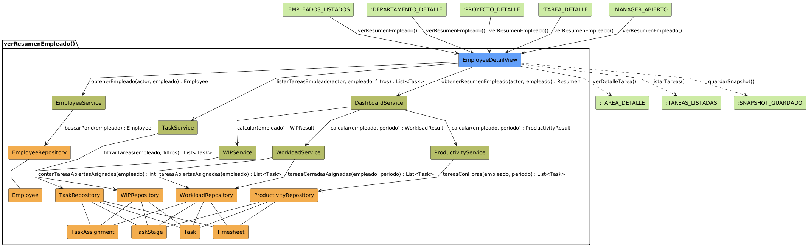

# Análisis de CU-03 — Ver resumen de empleado

## Diagrama de colaboración

## Clases de análisis identificadas

### Vista (Boundary) — `EmployeeDetail.jsx`

Responsabilidades:

- Recibir la solicitud de apertura del detalle de un empleado concreto.
- Solicitar al Control la ficha básica del empleado y su resumen compuesto de métricas.
- Presentar al actor la cabecera del empleado (nombre, cargo, departamento, coste por hora) y los cuatro indicadores clave: tareas pendientes, tareas vencidas sin cerrar, número de tareas en paralelo y productividad media de los últimos treinta días.
- Gestionar las pestañas de tareas del empleado (pendientes, completadas, asignadas y como responsable) con sus respectivos filtros de rango de fechas, solicitando bajo demanda al Control el listado filtrado al seleccionar cada pestaña.
- Gestionar la navegación hacia el listado de tareas y hacia el guardado de una captura.

Colaboraciones:

- **Entrada:** recibe la solicitud del actor tras navegar desde el listado de empleados, desde el detalle de un proyecto o departamento, desde una tarea asignada al empleado o desde el panel de manager.
- **Control:** solicita `obtenerEmpleado(actor, empleado)` a `EmployeeService`, `obtenerResumenEmpleado(actor, empleado)` a `DashboardService` y, bajo demanda al seleccionar cada pestaña, `listarTareasEmpleado(actor, empleado, filtros)` a `TaskService`.
- **Salida:** presenta el panel compuesto del empleado al actor y puede navegar a `:TAREAS_LISTADAS` o `:TAREA_DETALLE` mediante `listarTareas()` o `verDetalleTarea()`, o `guardarSnapshot()`.

---

### Control — `EmployeeService`

Responsabilidades:

- Verificar que el empleado solicitado existe en el sistema.
- Verificar que el empleado solicitado pertenece al ámbito del actor.
- Obtener del repositorio la ficha básica del empleado y devolverla a la Vista.

Colaboraciones:

- **Vista:** responde a `obtenerEmpleado(actor, empleado)`.
- **Entidad:** delega en `EmployeeRepository.buscarPorId(empleado)`.

### Control — `DashboardService`

Responsabilidades:

- Verificar independientemente que el empleado solicitado existe y pertenece al ámbito del actor, dado que el endpoint del dashboard puede invocarse directamente.
- Fijar el período de análisis de treinta días y pasarlo como parámetro a los subservicios que lo requieren.
- Coordinar los tres subservicios de métricas: `WorkloadService`, `WIPService` y `ProductivityService`.
- Componer los resultados parciales de los tres subservicios en un único resumen con los indicadores de carga, trabajo en paralelo, productividad y estadísticas rápidas.
- Devolver el resumen compuesto a la Vista.

Colaboraciones:

- **Vista:** responde a `obtenerResumenEmpleado(actor, empleado)`.
- **Subservicios:** delega en `WorkloadService`, `WIPService` y `ProductivityService`.

### Control — `WorkloadService`

Responsabilidades:

- Obtener las tareas abiertas asignadas al empleado con sus horas planificadas y trabajadas.
- Obtener las tareas cerradas por el empleado en el período recibido como parámetro.
- Calcular el porcentaje de carga de trabajo como cociente entre las horas pendientes y la jornada semanal de referencia.
- Determinar el estado de carga: sobrecargado si supera el umbral superior, subcargado si no alcanza el umbral inferior, normal en caso contrario.

Colaboraciones:

- **Orquestador:** responde a `DashboardService.calcular(empleado, periodo)`.
- **Entidad:** delega en `WorkloadRepository` para obtener las tareas abiertas y cerradas del empleado.

### Control — `WIPService`

Responsabilidades:

- Contar el número de tareas abiertas asignadas simultáneamente al empleado.
- Determinar el estado del trabajo en paralelo: óptimo, aceptable o sobrecargado según umbrales predefinidos.
- Generar una recomendación textual adaptada al estado calculado.

Colaboraciones:

- **Orquestador:** responde a `DashboardService`.
- **Entidad:** delega en `WIPRepository` para contar las tareas abiertas asignadas.

### Control — `ProductivityService`

Responsabilidades:

- Obtener las tareas cerradas asociadas al empleado en el período recibido como parámetro, con sus horas planificadas y horas reales.
- Calcular la productividad individual de cada tarea como cociente entre horas planificadas y horas reales.
- Calcular la productividad media del conjunto.

Colaboraciones:

- **Orquestador:** responde a `DashboardService.calcular(empleado, periodo)`.
- **Entidad:** delega en `ProductivityRepository` para obtener las tareas cerradas con sus horas.

### Control — `TaskService`

Responsabilidades:

- Verificar que el empleado solicitado pertenece al ámbito del actor.
- Aplicar los filtros de estado (pendientes, completadas, asignadas o responsable) y el rango de fechas indicado por la pestaña activa.
- Obtener del repositorio el listado paginado de tareas filtradas y devolverlo a la Vista.

Colaboraciones:

- **Vista:** responde a `listarTareasEmpleado(actor, empleado, filtros)` bajo demanda al seleccionar cada pestaña.
- **Entidad:** delega en `TaskRepository.filtrarTareas(empleado, filtros)`.

---

### Entidad — `EmployeeRepository`

Responsabilidades:

- Localizar y devolver la ficha completa de un empleado a partir de su identificador.
- Resolver el identificador de usuario correspondiente al empleado, necesario para localizar sus asignaciones de tareas.

Colaboraciones:

- **Control:** responde a `EmployeeService`.
- **Entidad:** gestiona instancias de `Employee`.

### Entidad — `WorkloadRepository`

Responsabilidades:

- Recuperar las tareas abiertas asignadas al empleado junto con sus horas planificadas, trabajadas y pendientes.
- Recuperar las tareas cerradas por el empleado en el período indicado junto con las horas planificadas y reales.

Colaboraciones:

- **Control:** responde a `WorkloadService`.
- **Entidad:** gestiona instancias de `Task`, `TaskStage`, `Timesheet` y `TaskAssignment`.

### Entidad — `WIPRepository`

Responsabilidades:

- Contar el número de tareas en estado abierto que tienen al empleado asignado simultáneamente.

Colaboraciones:

- **Control:** responde a `WIPService`.
- **Entidad:** gestiona instancias de `Task`, `TaskStage` y `TaskAssignment`.

### Entidad — `ProductivityRepository`

Responsabilidades:

- Recuperar las tareas cerradas asociadas al empleado en el período indicado, con sus horas planificadas y horas reales registradas.

Colaboraciones:

- **Control:** responde a `ProductivityService`.
- **Entidad:** gestiona instancias de `Task`, `TaskStage` y `Timesheet`.

### Entidad — `TaskRepository`

Responsabilidades:

- Construir y ejecutar la consulta de tareas aplicando los filtros de estado, responsable, asignación y rango de fechas indicados.
- Calcular las horas trabajadas por tarea para construir los indicadores de cada fila del listado.
- Devolver el resultado paginado al Control.

Colaboraciones:

- **Control:** responde a `TaskService`.
- **Entidad:** gestiona instancias de `Task`, `TaskStage`, `Timesheet` y `TaskAssignment`.

### Entidades modelo — `Employee`, `Task`, `TaskStage`, `Timesheet`, `TaskAssignment`

Responsabilidades:

- `Employee`: representa al empleado con nombre, cargo, coste por hora y estado activo.
- `Task`: representa una tarea con horas planificadas, fecha límite y estado de apertura o cierre.
- `TaskStage`: determina si una tarea se considera abierta o cerrada y proporciona su nombre de etapa.
- `Timesheet`: registra las horas imputadas por un empleado a una tarea concreta.
- `TaskAssignment`: representa la relación de asignación entre una tarea y un usuario del sistema.

Colaboraciones:

- **Repositorios:** cada modelo es gestionado por los repositorios que lo necesitan según se indica en las colaboraciones anteriores.

---

## Flujo de colaboración principal

**Secuencia: ver resumen de empleado**

1. **Inicio:** el actor navega desde el listado de empleados, desde el detalle de un proyecto o departamento, desde una tarea o desde el panel de manager → `EmployeeDetail.jsx` recibe la solicitud con el identificador del empleado.

2. **Ficha básica:** `EmployeeDetail.jsx` → `EmployeeService.obtenerEmpleado(actor, empleado)`. `EmployeeService` verifica que el empleado existe y pertenece al ámbito del actor, delega en `EmployeeRepository.buscarPorId(empleado)` y devuelve la ficha.

3. **Verificación de ámbito para el dashboard:** `DashboardService` verifica independientemente que el empleado existe y pertenece al ámbito del actor, dado que su endpoint puede invocarse directamente sin pasar por el endpoint de la ficha. Fija el período de análisis de treinta días.

4. **Cálculo de carga:** `DashboardService` → `WorkloadService.calcular(empleado, periodo)` → `WorkloadRepository` recupera tareas abiertas y cerradas del empleado → `WorkloadService` calcula el porcentaje de carga y determina el estado → devuelve resultado.

5. **Cálculo de WIP:** `DashboardService` → `WIPService.calcular(empleado)` → `WIPRepository` cuenta las tareas abiertas asignadas al empleado → `WIPService` determina el estado y genera la recomendación → devuelve resultado.

6. **Cálculo de productividad:** `DashboardService` → `ProductivityService.calcular(empleado, periodo)` → `ProductivityRepository` recupera las tareas cerradas con sus horas en el período → `ProductivityService` calcula la productividad media → devuelve resultado.

7. **Composición:** `DashboardService` agrega los tres resultados parciales en un resumen unificado y lo devuelve a `EmployeeDetail.jsx`.

8. **Presentación:** `EmployeeDetail.jsx` muestra la cabecera del empleado y los cuatro indicadores clave al actor.

9. **Carga de tareas bajo demanda:** al seleccionar una pestaña, `EmployeeDetail.jsx` → `TaskService.listarTareasEmpleado(actor, empleado, filtros)`. `TaskService` verifica el ámbito del actor, aplica los filtros de la pestaña activa y delega en `TaskRepository.filtrarTareas(empleado, filtros)`, que devuelve el listado de tareas paginado. La Vista presenta el resultado en la pestaña correspondiente.

10. **Navegación:** el actor puede navegar a `listarTareas()` para abrir el listado completo de tareas con filtros preseleccionados, o iniciar `guardarSnapshot()` para persistir el estado actual del panel.

---

## Correspondencia con requisitos

| Requisito del caso de uso | Clase responsable | Colaboración |
|---|---|---|
| Mostrar ficha básica del empleado | `EmployeeService` | Obtiene ficha de `EmployeeRepository` tras verificar existencia y ámbito |
| Verificar ámbito del actor (ficha) | `EmployeeService` | Comprueba que el empleado pertenece al ámbito del actor |
| Verificar ámbito del actor (dashboard) | `DashboardService` | Verificación independiente antes de coordinar los subservicios |
| Calcular porcentaje de carga de trabajo | `WorkloadService` | Cociente entre horas pendientes y jornada de referencia de cuarenta horas |
| Determinar estado de carga | `WorkloadService` | Umbrales de sobrecarga y subcarga configurados en el sistema |
| Contar tareas en paralelo | `WIPService` | Delega en `WIPRepository.contarTareasAbiertasAsignadas` |
| Determinar estado del WIP y recomendación | `WIPService` | Umbrales óptimo, aceptable y sobrecargado |
| Calcular productividad media del período | `ProductivityService` | Cociente horas planificadas / horas reales por tarea |
| Componer resumen unificado | `DashboardService` | Orquesta los tres subservicios y agrega resultados |
| Mostrar tareas por pestaña bajo demanda | `TaskService` | Filtra tareas por estado, responsable y fechas según la pestaña activa |
| Navegar al listado completo de tareas | `EmployeeDetail.jsx` | Gestiona la navegación hacia `listarTareas()` con filtros preseleccionados |
| Navegar al detalle de una tarea | `EmployeeDetail.jsx` | Gestiona la navegación hacia `verDetalleTarea()` al seleccionar una tarea del listado |
| Guardar captura del panel | `EmployeeDetail.jsx` | Gestiona la navegación hacia `guardarSnapshot()` |