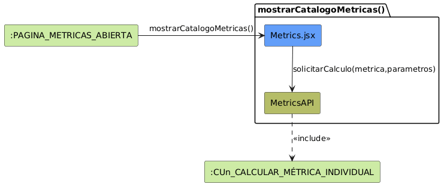

# Análisis de CU-10 — Mostrar Catálogo de Métricas

## Diagrama de colaboración

---

# Clases de análisis identificadas

## Vista (Boundary) — `Metrics.jsx`

### Responsabilidades

* Recibir la solicitud de apertura del catálogo de métricas desde el actor autenticado.
* Presentar las métricas disponibles agrupadas por categoría.
* Capturar la selección de una métrica concreta por parte del actor.
* Mostrar dinámicamente el panel de parámetros requerido por la métrica seleccionada.
* Recoger los parámetros configurados por el actor antes de solicitar el cálculo.
* Delegar en el controlador la ejecución de la métrica seleccionada.
* Presentar el resultado devuelto por el caso de uso específico de cálculo de métrica.

### Colaboraciones

* **Entrada:** recibe la navegación del actor hacia el catálogo de métricas.
* **Control:** invoca `solicitarCalculo(metrica, parametros)` sobre `MetricsAPI`.
* **Casos de uso incluidos:** presenta el resultado generado por el caso de uso específico de cálculo de métrica.

---

## Control (Controller) — `MetricsAPI`

### Responsabilidades

* Recibir desde la vista la solicitud de cálculo de una métrica concreta.
* Identificar qué caso de uso específico debe ejecutarse según la métrica seleccionada.
* Delegar la ejecución al caso de uso individual correspondiente.
* Devolver el resultado del cálculo a la vista para su representación.

### Colaboraciones

* **Vista:** recibe `solicitarCalculo(metrica, parametros)` desde `Metrics.jsx`.
* **Casos de uso incluidos:** delega la ejecución en el caso de uso específico correspondiente a la métrica seleccionada.

---

## Caso de uso incluido — `CUn_CALCULAR_MÉTRICA_INDIVIDUAL`

### Responsabilidades

* Ejecutar el cálculo específico de la métrica seleccionada.
* Aplicar la lógica de negocio y consultas necesarias para obtener el resultado.
* Devolver el resultado estructurado al controlador.

### Colaboraciones

* **Controlador:** es invocado por `MetricsAPI`.
* **Componentes especializados:** utiliza los servicios, repositorios y modelos específicos definidos en el caso de uso individual correspondiente.

---

# Flujo de colaboración principal

## Secuencia: consultar métrica operativa

1. **Inicio:** el actor abre la página de métricas → `Metrics.jsx` muestra el catálogo agrupado por categorías.

2. **Selección de métrica:** el actor selecciona una métrica concreta del catálogo.

3. **Configuración de parámetros:** `Metrics.jsx` muestra dinámicamente los parámetros requeridos por la métrica seleccionada y el actor los configura.

4. **Solicitud de cálculo:** `Metrics.jsx` invoca `MetricsAPI.solicitarCalculo(metrica, parametros)`.

5. **Identificación del caso de uso:** `MetricsAPI` identifica el caso de uso específico asociado a la métrica seleccionada.

6. **Delegación:** `MetricsAPI` delega la ejecución en `CUn_CALCULAR_MÉTRICA_INDIVIDUAL`.

7. **Cálculo específico:** el caso de uso individual ejecuta la lógica necesaria para calcular la métrica seleccionada.

8. **Devolución:** el resultado calculado es devuelto desde el caso de uso específico hacia `MetricsAPI` y posteriormente hacia `Metrics.jsx`.

9. **Presentación:** `Metrics.jsx` muestra el panel de detalle con los indicadores y gráficos asociados a la métrica calculada.

---

# Correspondencia con requisitos

| Requisito del caso de uso                                 | Clase responsable                 | Colaboración                                     |
| --------------------------------------------------------- | --------------------------------- | ------------------------------------------------ |
| Mostrar catálogo de métricas agrupadas                    | `Metrics.jsx`                     | Renderiza categorías y tarjetas de métricas      |
| Mostrar parámetros requeridos por la métrica seleccionada | `Metrics.jsx`                     | Adapta dinámicamente el formulario de parámetros |
| Solicitar el cálculo de una métrica                       | `MetricsAPI`                      | Recibe la petición desde la vista                |
| Delegar el cálculo en el caso de uso específico           | `MetricsAPI`                      | Invoca el CU individual correspondiente          |
| Ejecutar el cálculo concreto de la métrica                | `CUn_CALCULAR_MÉTRICA_INDIVIDUAL` | Aplica lógica y consultas específicas            |
| Mostrar resultados e indicadores                          | `Metrics.jsx`                     | Presenta gráficos e indicadores devueltos        |
