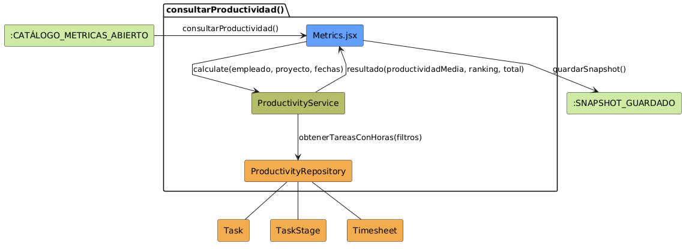

# Análisis de CU-22 — Consultar Productividad

## Diagrama de colaboración

---

## Clases de análisis identificadas

### Vista (Boundary) — `Metrics.jsx`

Responsabilidades:

- Recibir la selección de la métrica *Productividad* por parte del actor dentro del catálogo de métricas.
- Presentar el panel de parámetros opcionales: selector de empleado, selector de proyecto y selectores de rango de fechas.
- Solicitar al Control el cálculo de la métrica con los parámetros configurados en cuanto el actor confirma la selección o modifica algún parámetro.
- Presentar el panel de detalle con la productividad media, el total de tareas analizadas y el ranking de tareas ordenadas por productividad.
- Gestionar el botón de guardado de la snapshot del panel calculado.

Colaboraciones:

- **Entrada:** recibe la selección de la métrica Productividad del actor, llegando desde CU-10 vía selección en el catálogo.
- **Control:** solicita `calculate(empleado, proyecto, fechaDesde, fechaHasta)` a `ProductivityService`.
- **Salida:** presenta el panel de detalle al actor y delega en `SaveSnapshotButton` (CU-17) el guardado opcional.

---

### Control — `ProductivityService`

Responsabilidades:

- Recibir los parámetros opcionales de la métrica: identificador de empleado, identificador de proyecto, fecha de inicio y fecha de fin.
- Obtener del repositorio las tareas cerradas con horas estimadas y horas reales, aplicando los filtros recibidos.
- Filtrar del conjunto resultante las tareas cuyas horas reales sean mayores que cero, dado que tareas sin horas reales no son analizables.
- Calcular la productividad individual de cada tarea como `(planned_hours / actual_hours) × 100`.
- Calcular la productividad media del conjunto como la media aritmética de las productividades individuales.
- Ordenar las tareas del resultado de mayor a menor productividad para construir el ranking.
- Devolver a la Vista un resultado estructurado con la productividad media, el total de tareas analizadas y el ranking de tareas con sus datos de detalle.

Colaboraciones:

- **Vista:** responde a `calculate(empleado, proyecto, fechaDesde, fechaHasta)`.
- **Entidad:** delega en `ProductivityRepository.obtenerTareasConHoras(filtros)`.

---

### Entidad — `ProductivityRepository`

Responsabilidades:

- Construir y ejecutar la consulta de tareas cerradas con `planned_hours` mayor que cero, aplicando los filtros opcionales de empleado, proyecto y rango de fechas sobre las horas de los partes.
- Calcular las horas reales acumuladas por tarea mediante una subconsulta agrupada sobre `Timesheet`: agrupa por `task_id` y suma `unit_amount`.
- Unir mediante `outer join` el resultado de esa subconsulta con las tareas para que las tareas sin partes de horas aparezcan con horas reales igual a cero.
- Filtrar adicionalmente por el estado de la etapa de la tarea para incluir únicamente tareas cuya `TaskStage` tenga `closed = True`.
- Si se especifica un filtro de empleado, restringir la subconsulta de timesheets al empleado indicado para calcular solo las horas de ese empleado sobre cada tarea.
- Devolver al servicio la lista de registros con identificador de tarea, nombre, `planned_hours`, `parent_id` y horas reales calculadas.

Colaboraciones:

- **Control:** responde a `ProductivityService`.
- **Entidad:** gestiona instancias de `Task`, `TaskStage` y `Timesheet`.

---

### Entidades modelo — `Task`, `TaskStage`, `Timesheet`

Responsabilidades:

- `Task`: representa la tarea con sus horas planificadas (`planned_hours`) y la referencia a su tarea padre (`parent_id`). Es la entidad sobre la que se calcula la productividad.
- `TaskStage`: determina si la tarea está cerrada mediante el campo `closed`. Solo las tareas cuya etapa tiene `closed = True` se incluyen en el análisis de productividad.
- `Timesheet`: registra cada parte de horas imputado por un empleado a una tarea mediante `unit_amount`. La suma de estos registros por tarea constituye las horas reales (`actual_hours`) de la tarea. Si se filtra por empleado, solo se consideran los partes de ese empleado.

Colaboraciones:

- **Repositorio:** las tres entidades son gestionadas por `ProductivityRepository`. `Task` y `TaskStage` se unen para identificar las tareas cerradas elegibles; `Timesheet` se agrega en una subconsulta para calcular las horas reales de cada tarea.

---

## Flujo de colaboración principal

**Secuencia: calcular productividad**

1. **Inicio:** el actor selecciona la métrica *Productividad* en el catálogo → `Metrics.jsx` muestra el panel de parámetros opcionales: empleado, proyecto y rango de fechas.

2. **Configuración de parámetros:** el actor configura opcionalmente un empleado concreto, un proyecto concreto y/o un rango de fechas. Ninguno de los tres es obligatorio.

3. **Solicitud de cálculo:** `Metrics.jsx` → `ProductivityService.calculate(empleado, proyecto, fechaDesde, fechaHasta)`.

4. **Consulta al repositorio:** `ProductivityService` → `ProductivityRepository.obtenerTareasConHoras(filtros)`. El repositorio construye la consulta sobre `Task` filtrando por `TaskStage.closed = True` y `planned_hours > 0`, aplicando los filtros opcionales, y agrega las horas reales de `Timesheet` mediante subconsulta.

5. **Devolución de datos:** `ProductivityRepository` devuelve la lista de tareas con sus horas estimadas y reales a `ProductivityService`.

6. **Cálculo de productividad:** `ProductivityService` itera sobre las tareas devueltas. Para cada tarea con `actual_hours > 0`, calcula `productivity_pct = (planned_hours / actual_hours) × 100` y acumula el total para la media.

7. **Construcción del resultado:** `ProductivityService` calcula la productividad media, ordena las tareas de mayor a menor productividad y construye el objeto de resultado con `average_productivity`, `total_tasks` y la lista de `tasks` con sus indicadores.

8. **Devolución a la Vista:** el resultado asciende de `ProductivityService` a `Metrics.jsx`.

9. **Presentación:** `Metrics.jsx` muestra el panel de detalle con la productividad media, el total de tareas analizadas y el ranking de tareas con su productividad individual.

10. **Guardado de snapshot (opcional):** el actor pulsa "Guardar snapshot" → `SaveSnapshotButton` invoca CU-17 con `metric_name = 'productivity'`, los parámetros usados y el resultado calculado como payload.

---

## Flujos alternativos

- `FA-01`: Sin tareas cerradas que cumplan los filtros y dispongan de horas estimadas → `ProductivityRepository` devuelve lista vacía → `ProductivityService` devuelve `average_productivity = 0`, `total_tasks = 0` → `Metrics.jsx` muestra estado vacío informativo.

---

## Observaciones de implementación

La fórmula aplicada es `(planned_hours / actual_hours) × 100`. Solo se incluyen tareas cerradas en las que `planned_hours > 0` y `actual_hours > 0`. Los valores superiores al 100 % indican que la tarea se completó en menos tiempo del estimado (mejor rendimiento); los inferiores indican que se invirtió más tiempo del previsto.

Cuando se aplica el filtro de empleado, las horas reales se calculan exclusivamente a partir de los partes de horas de ese empleado sobre cada tarea. Esto permite analizar la productividad individual sin verse afectada por las horas imputadas por otros compañeros en la misma tarea.

---

## Correspondencia con requisitos

| Requisito del caso de uso | Clase responsable | Colaboración |
|---|---|---|
| Aplicar filtros opcionales de empleado, proyecto y fechas | `ProductivityService` | Traslada los filtros al repositorio sin imponerlos como obligatorios |
| Obtener tareas cerradas con horas estimadas y reales | `ProductivityRepository` | Une `Task`, `TaskStage` y la subconsulta agregada de `Timesheet` |
| Excluir tareas sin horas reales del cálculo | `ProductivityService` | Filtra las filas con `actual_hours > 0` antes de aplicar la fórmula |
| Calcular productividad individual por tarea | `ProductivityService` | Aplica `(planned / actual) × 100` para cada tarea elegible |
| Calcular productividad media del conjunto | `ProductivityService` | Media aritmética de las productividades individuales |
| Presentar ranking de tareas ordenado por productividad | `Metrics.jsx` | Recibe la lista ya ordenada del servicio y la renderiza |
| Mostrar estado vacío si no hay datos suficientes | `Metrics.jsx` | Comprueba `total_tasks === 0` y presenta mensaje informativo |
| Guardar snapshot del panel calculado | `SaveSnapshotButton` (CU-17) | Invocado desde la Vista cuando el actor pulsa el botón de guardado |