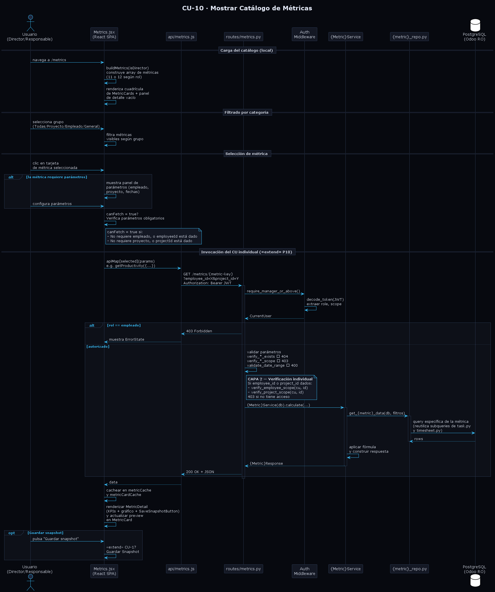

# Diseño de CU-10 — Mostrar Catálogo de Métricas

**Actor:** Director o Responsable
**Precondición:** el actor está autenticado (CU-01 completado).

| Paso | Capa | Clase / Función | Acción |
|---|---|---|---|
| 1 | Frontend | `Metrics.jsx` → `buildMetrics(isDirector)` | El actor accede a `/metrics`. La página construye el array local de métricas disponibles: 11 métricas para Responsable, 12 para Director (se añade `client-distribution`). Cada entrada declara `key`, `label`, `icon`, `color`, flags de parámetros requeridos (`needsEmployee`, `needsProject`, `needsDates`), función `preview()` y función `renderDetail()` |
| 2 | Frontend | `Metrics.jsx` → cuadrícula de `MetricCard` | Renderiza la cuadrícula con layout `repeat(auto-fill, minmax(220px, 1fr))` y el panel de detalle vacío con icono `BarChart3` y texto "Selecciona una métrica para ver el detalle". Muestra los botones de filtro por categoría: "Todas", "Por proyecto", "Por empleado" y "Generales" |
| 3 | Frontend | `Metrics.jsx` → `filteredMetrics` | Si el actor cambia de grupo, filtra la cuadrícula: `project` → solo métricas con `needsProject`; `employee` → solo las que tienen `needsEmployee`; `general` → las que no requieren ni proyecto ni empleado; `all` → todas |
| 4 | Frontend | `Metrics.jsx` | El actor selecciona una tarjeta → `setSelected(metric.key)`. Si la métrica requiere parámetros, muestra el panel de parámetros con selectores de empleado (cargado desde `GET /employees/?page_size=200`), proyecto (cargado desde `GET /projects/`) y/o rango de fechas. La variable `canFetch` impide lanzar la petición hasta que todos los parámetros obligatorios estén completos |
| 5 | Frontend | `api/metrics.js` → `apiMap[selected](params)` | Cuando `canFetch = true` y no hay datos cacheados para esa combinación de métrica+parámetros, lanza la petición al endpoint correspondiente: e.g., `GET /metrics/productivity?employee_id=X&project_id=Y&date_from=Z&date_to=W` con `Authorization: Bearer JWT` |
| 6 | Routes | `metrics.router` → guard de rol | Decodifica el JWT mediante `require_manager_or_above` (rechaza con 403 si el rol es `empleado`) o `require_director` para métricas exclusivas del Director. Inyecta `CurrentUser` con `role`, `employee_ids`, `department_ids` y `project_ids` |
| 7 | Routes | `metrics.router` → validación | Si se proporcionan parámetros de entidad, ejecuta `verify_employee_exists` / `verify_project_exists` → 404 si no existe, y `verify_employee_scope` / `verify_project_scope` → 403 si la entidad está fuera del ámbito del actor (**Capa 2**). Si hay fechas, ejecuta `validate_date_range` → 400 si `date_from > date_to` |
| 8 | Services | `{Metric}Service.calculate(...)` | Instancia el servicio de métrica correspondiente y llama a `calculate(...)`. Cada métrica tiene su propio servicio y repositorio dedicado (CU-22 a CU-32). Delega la consulta al repositorio, aplica la fórmula de cálculo y devuelve la respuesta tipada |
| 9 | Repositories | `repositories/metrics/{metric}.py` | Ejecuta las queries sobre los modelos ORM (`Task`, `Timesheet`, `TaskStage`, etc.), reutilizando las subqueries publicadas por `task.py` (`closed_stage_ids_subq`, `open_stage_ids_subq`) y `timesheet.py` (`worked_hours_subq`) |
| 10 | Routes | `metrics.router` | Devuelve `200 OK` + JSON con la respuesta tipada de la métrica seleccionada |
| 11 | Frontend | `Metrics.jsx` → `MetricDetail` | Cachea el resultado en `metricCache` (indexado por `metric.key|JSON(params)`) y en `metricCardCache` (indexado por `metric.key`). Renderiza el panel de detalle con: cabecera (icono + nombre + botón `SaveSnapshotButton`), KPIs y gráficos específicos renderizados por `metric.renderDetail(data)`. Actualiza la preview de la `MetricCard` seleccionada |

**Datos de salida:** no hay un esquema propio de CU-10. El catálogo se construye localmente en el frontend. Cuando el actor selecciona una métrica, los datos corresponden al esquema del caso de uso individual invocado (CU-22 a CU-32).

**Decisión de diseño clave:** el catálogo de métricas se construye enteramente en el frontend mediante `buildMetrics(isDirector)`. No existe un endpoint `/metrics/catalog` en el backend. Cada métrica declara sus metadatos de visualización (`icon`, `color`, `preview`, `renderDetail`) junto con su clave de API. El dispatcher `apiMap` traduce la clave de métrica a la función de API correspondiente sin ramificaciones `if/elif`, respetando el OCP: añadir una nueva métrica implica añadir una entrada al array y un par servicio/repositorio nuevo, sin modificar código existente.

