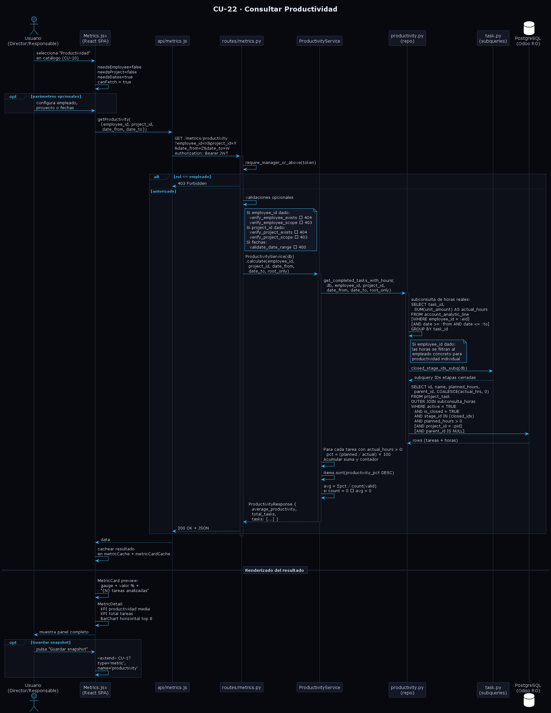

# Diseño de CU-22 — Consultar Productividad

**Actor:** Director o Responsable
**Precondición:** el actor está autenticado; ha accedido a CU-10 y ha seleccionado la métrica *Productividad* del catálogo.

| Paso | Capa | Clase / Función | Acción |
|---|---|---|---|
| 1 | Frontend | `Metrics.jsx` → `MetricCard` | El actor selecciona la tarjeta "Productividad" (`key: 'productivity'`) en la cuadrícula del catálogo → `setSelected('productivity')`. La métrica tiene `needsEmployee: false`, `needsProject: false` y `needsDates: true`, por lo que `canFetch = true` inmediatamente. Se muestra el panel de parámetros de fechas (opcionales) |
| 2 | Frontend | `Metrics.jsx` → `buildParamsForMetric(metric)` | Construye el objeto de parámetros opcionales: `employee_id` si el actor ha seleccionado un empleado, `project_id` si ha seleccionado un proyecto, `date_from` y `date_to` si ha configurado fechas. Ninguno es obligatorio |
| 3 | Frontend | `api/metrics.js` → `getProductivity(params)` | Envía `GET /metrics/productivity?employee_id=X&project_id=Y&date_from=Z&date_to=W` con `Authorization: Bearer JWT` |
| 4 | Routes | `metrics.router` → `get_productivity()` | Decodifica el JWT mediante `require_manager_or_above`. Rechaza con 403 si el rol es `empleado`. Inyecta `CurrentUser` |
| 5 | Routes | `metrics.router` | Si se proporcionan fechas, ejecuta `validate_date_range` → 400 si `date_from > date_to`. Si se proporciona `employee_id`, ejecuta `verify_employee_exists` → 404 y `verify_employee_scope` → 403 si fuera del ámbito (**Capa 2**). Si se proporciona `project_id`, ejecuta `verify_project_exists` → 404 y `verify_project_scope` → 403 (**Capa 2**) |
| 6 | Services | `ProductivityService.calculate(employee_id, project_id, date_from, date_to, root_only)` | Delega la obtención de datos en `get_completed_tasks_with_hours()` del repositorio |
| 7 | Repositories | `metrics/productivity.py` → subconsulta de horas | Construye una subconsulta sobre `Timesheet` (`account_analytic_line`): agrupa por `task_id` y suma `unit_amount` como `actual_hours`. Si se proporciona `employee_id`, filtra los timesheets a ese empleado. Si se proporcionan fechas, filtra `Timesheet.date` al rango indicado |
| 8 | Repositories | `metrics/productivity.py` → query principal | Construye la query sobre `Task` (`project_task`): `OUTER JOIN` con la subconsulta de horas, `COALESCE(actual_hours, 0)`. Filtra por `active = True`, `is_closed = True`, `stage_id IN closed_stage_ids_subq(db)` y `planned_hours > 0`. Aplica filtros opcionales: `project_id` y `parent_id IS NULL` si `root_only` |
| 9 | Repositories | `task.py` → `closed_stage_ids_subq(db)` | Subquery reutilizable que devuelve los IDs de etapas cerradas (`TaskStage.closed = True`). Es la misma subquery compartida por todos los repositorios de métricas que necesitan identificar tareas cerradas |
| 10 | Services | `ProductivityService` | Itera sobre las tareas devueltas. Para cada tarea con `actual_hours > 0`, calcula `productivity_pct = (planned_hours / actual_hours) × 100`. Acumula la suma de productividades y el contador de tareas válidas |
| 11 | Services | | Ordena la lista de mayor a menor productividad (`sort by productivity_pct DESC`). Calcula `average_productivity = Σpct / count(valid)`, redondeado a 2 decimales. Si no hay tareas válidas, devuelve `average_productivity = 0` |
| 12 | Services | | Devuelve `ProductivityResponse(average_productivity, total_tasks, tasks)` |
| 13 | Routes | `metrics.router` | Devuelve `200 OK` + JSON |
| 14 | Frontend | `Metrics.jsx` → `MetricCard` | Actualiza la preview en la tarjeta: gauge miniatura con productividad media (capeada a 100%), coloreada por umbral (`statusColor(pct, [70, 90])`): verde ≥ 90 %, ámbar ≥ 70 %, rojo < 70 %. Subtítulo: `"{total_tasks} tareas analizadas"` |
| 15 | Frontend | `MetricDetail` → `metric.renderDetail(data)` | Muestra el panel de detalle: dos KPI cards (productividad media y total de tareas), gráfico de barras horizontal (`BarChart layout="vertical"`) con las top 8 tareas ordenadas por `productivity_pct`, cada barra coloreada por umbral. Cabecera con botón `SaveSnapshotButton` |

**Datos de salida:** `ProductivityResponse` con `average_productivity`, `total_tasks` y `tasks: List[ProductivityTaskItem]`, donde cada ítem contiene `task_id`, `task_name`, `planned_hours`, `actual_hours`, `parent_id` y `productivity_pct`.

**Decisión de diseño clave:** cuando se filtra por empleado, la subconsulta de horas reales filtra exclusivamente los partes de horas de ese empleado sobre cada tarea. Esto permite calcular la productividad individual sin verse afectada por las horas imputadas por otros compañeros en la misma tarea. La ordenación por productividad se realiza en la capa de servicio (no en la query SQL) porque `productivity_pct` es un campo calculado. La reutilización de `closed_stage_ids_subq` (publicada una sola vez en `task.py`) evita duplicar la lógica de etapas cerradas en cada repositorio de métricas.

