# Capítulo 4 — Implementación

Este capítulo documenta la implementación real del **Módulo de Análisis ERP**, detallando cómo cada caso de uso diseñado en el Capítulo 3 se traduce en componentes concretos del sistema. La documentación cubre la capa de rutas HTTP (FastAPI), la capa de servicios con la lógica de negocio, la capa de repositorios que accede a PostgreSQL (Odoo, solo lectura) y MongoDB (snapshots), y el frontend en React 18 + Vite.

---

## Diagrama general de navegación

El diagrama de estados del Capítulo 4 muestra el flujo real de la aplicación con capturas de pantalla reales de la interfaz embebidas en cada estado. Cada nodo representa una pantalla del sistema y cada flecha una acción del usuario que provoca la transición.

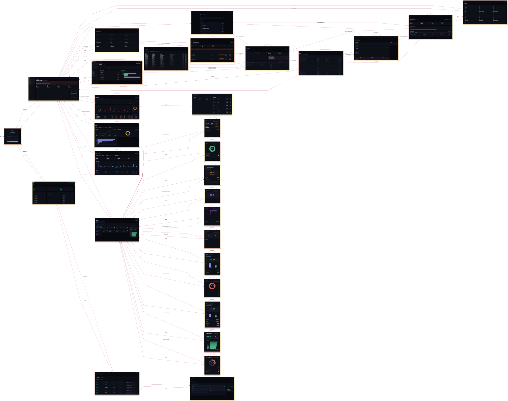

> El fuente PlantUML del diagrama está en [`diagramas/navegacion.puml`](./diagramas/navegacion.puml).

### Estructura del diagrama

El diagrama refleja la navegación completa del sistema dividida en paquetes funcionales:

| Paquete | Estados | Descripción |
|---|---|---|
| **Autenticación** | `NoAuth` → `Overview` | Inicio de sesión con JWT. El Responsable inicia también el visor de snapshots. |
| **P2 · Empleados** | `ListEmp`, `DetEmp` | Listado filtrable y ficha de resumen con KPIs y pestañas de tareas. |
| **P3 · Departamentos** | `ListDept`, `DetDept` | Listado y ficha con distribución de carga del equipo. |
| **P4 · Proyectos** | `ListProy`, `DetProy` | Listado y ficha con eficiencia, riesgo y rentabilidad del proyecto. |
| **P5 · Tareas** | `ListTarea`, `DetTarea` | Listado polimórfico y detalle con subtareas y horas. |
| **P6 · Análisis** | `MostrarCatálogoMetricas`, `MostrarGraficos`, `MostrarAsistencia`, `MostrarManager`| Métricas operativas, gráficos analíticos, asistencia vs imputaciones, distribución de equipo.|
| **P7 · Rentabilidad ★** | `Rentabilidad`, `Lineas` | Exclusivo Director. Resumen financiero y líneas analíticas. |
| **P8 · Utilidades** |`Busqueda` | Búsqueda global. |
| **P9 · Snapshots** | `VisorInicial`, `Visor`, `DetSnap` | Visor independiente (puerto 3001) para consultar y eliminar snapshots. |
| **P10 · Métricas Operativas** | `MetricasOperativas` | Métricas operativas del sistema. |

---

## Casos de uso implementados

A continuación se lista cada caso de uso documentado en este capítulo con su fichero de especificación correspondiente.

> Cada fichero de especificación incluye un apartado **`## Implementación`** al final con los fragmentos de código más relevantes de las tres capas del sistema (Routes → Service → Repository), comentados para facilitar su lectura en la memoria.

### P2 · Gestión de empleados

| CU | Nombre | Especificación |
|---|---|---|
| **CU-02** | Listar y Buscar Empleados | [docs/CU-02.md](./docs/CU-02.md) |
| **CU-03** | Ver Resumen de Empleado | [docs/CU-03.md](./docs/CU-03.md) |

### P5 · Gestión de tareas

| CU | Nombre | Especificación |
|---|---|---|
| **CU-08** | Listar Tareas | [docs/CU-08.md](./docs/CU-08.md) |

### P6 · Métricas operativas

| CU | Nombre | Especificación |
|---|---|---|
| **CU-10** | Consultar Catálogo de Métricas | [docs/CU-10.md](./docs/CU-10.md) |
| **CU-22** | Consultar Productividad | [docs/CU-22.md](./docs/CU-22.md) |

### P7 · Rentabilidad financiera ★ Director

| CU | Nombre | Especificación |
|---|---|---|
| **CU-13** | Consultar Rentabilidad Financiera | [docs/CU-13.md](./docs/CU-13.md) |

### P9 · Snapshots

| CU | Nombre | Especificación |
|---|---|---|
| **CU-17** | Guardar Snapshot (upsert diario) | [docs/CU-17.md](./docs/CU-17.md) |
| **CU-19** | Consultar Detalle de Snapshot | [docs/CU-19.md](./docs/CU-19.md) |

---

## Estructura de directorios

La estructura completa de directorios se encuentra aquí: 
[Estructura de directorios](docs/estructuraDirectorios.md)

---

## Galería de vistas

Cada sección corresponde a un componente React del frontend. Las capturas de pantalla son de la aplicación real en ejecución.

---

### 🔐 Inicio de sesión — `Login.jsx`

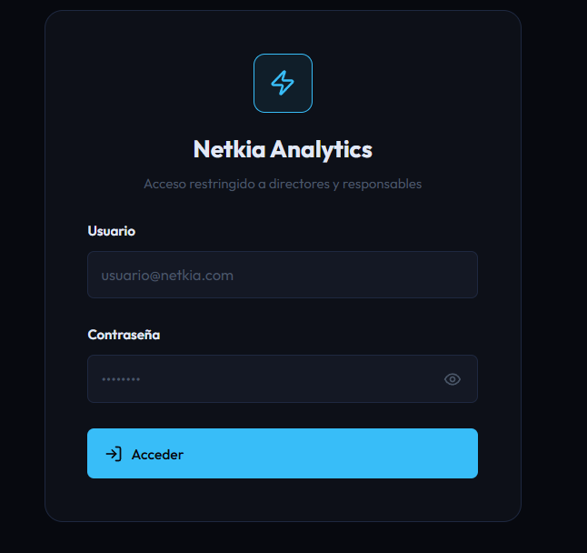

Formulario de autenticación que envía las credenciales al endpoint `POST /auth/token`. El servidor devuelve un JWT firmado que incluye el `rol` (`director` o `responsable`) y el `scope` del usuario (proyectos accesibles). El token se almacena en el `AuthContext` de React y no se vuelve a consultar al servidor durante la sesión (de ahí que `GET /auth/me` sea innecesario).

---

### 🏠 Panel de inicio — `Overview.jsx`

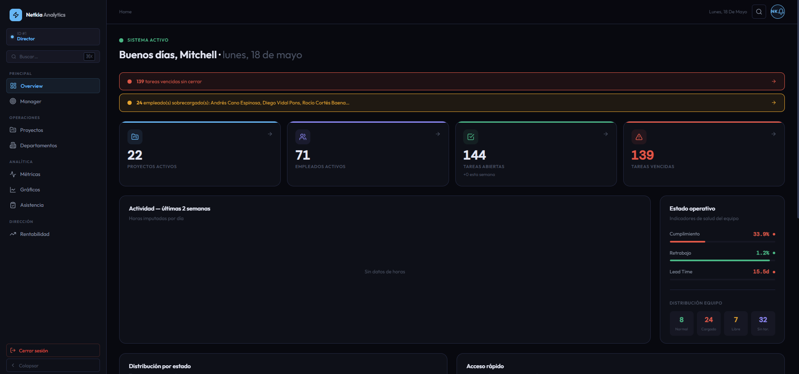

Dashboard global del sistema. Muestra:
- **4 tarjetas KPI** con proyectos activos, empleados, tareas abiertas y vencidas (`GET /dashboards/overview`).
- **Alertas de acción** si hay tareas vencidas o empleados sobrecargados (datos de `/dashboards/summary/manager`).
- **Gráfico de área** con las horas imputadas de los últimos 14 días (`GET /charts/productivity-trend`).
- **Widget "Estado operativo"** con cumplimiento, tasa de retrabajo y lead time (`GET /metrics/compliance`, `/rework-rate`, `/lead-time`).
- **Widget "Distribución equipo"** (normal / cargado / libre / sin tareas) via `GET /dashboards/summary/manager`.
- **Gráfico "Distribución por estado"** de tareas activas (`GET /charts/task-distribution`).
- **Panel de snapshot masivo** (`BulkSnapshotPanel`) para guardar todos los tipos en un clic.

---

### 👥 Listado de empleados — `Employees.jsx`

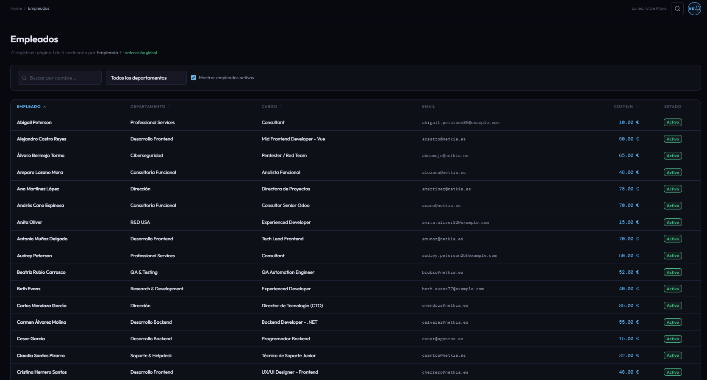

Tabla paginada de empleados con ordenación server-side en todas las columnas (nombre, departamento, cargo, email, coste/h, estado). Los filtros disponibles son: búsqueda por nombre (debounced 300 ms), selector de departamento (cargado de `/departments/`) y toggle de activos/inactivos. Al hacer clic en una fila se navega a `EmployeeDetail`. La paginación (25 registros/página) y la ordenación se envían como query params a `GET /employees/`.

---

### 👤 Ficha de empleado — `EmployeeDetail.jsx`

Vista de detalle con tres áreas principales:
1. **Cabecera** con nombre, cargo, departamento, email y badge de estado de carga del empleado.
2. **4 tarjetas KPI** (tareas pendientes, vencidas sin cerrar, WIP actual, productividad 30 días) procedentes de `GET /dashboards/summary/employee/{id}`.
3. **Sección "Hoy"** con las tareas asignadas hoy y las vencidas sin cerrar (sin nueva petición, datos del summary).
4. **Tarjeta de tareas con 4 pestañas** — Pendientes, Completadas, Asignadas y Responsable — cada una con selector de rango de fechas y lazy-loading: solo se carga la pestaña activa llamando a `GET /tasks/filter` con `employee_id` y `status`.

---

### 🏢 Listado de departamentos — `Departments.jsx`

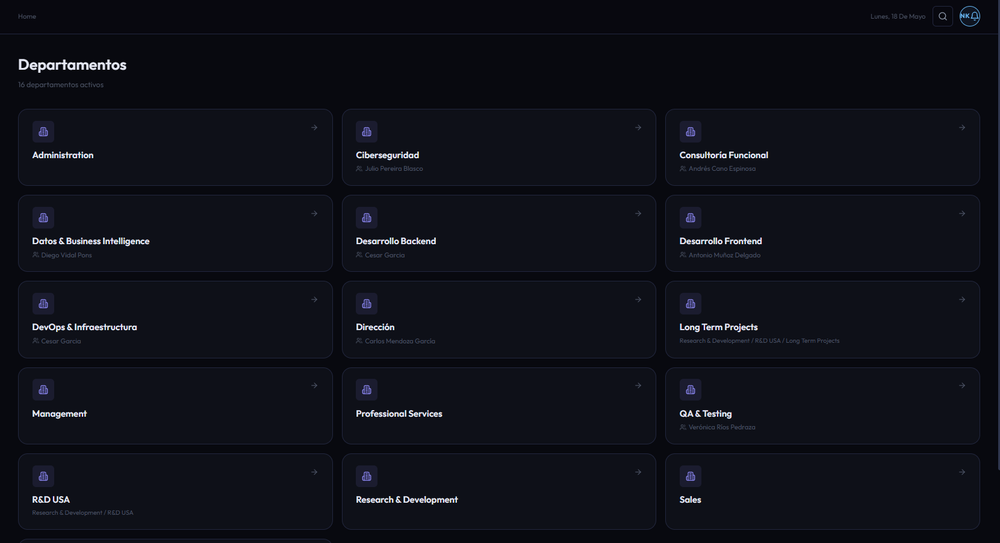

Tabla de departamentos con nombre completo y manager. Al hacer clic en una fila navega a `DepartmentDetail`. Los datos provienen de `GET /departments/`.

---

### 🏢 Detalle de departamento — `DepartmentDetail.jsx`

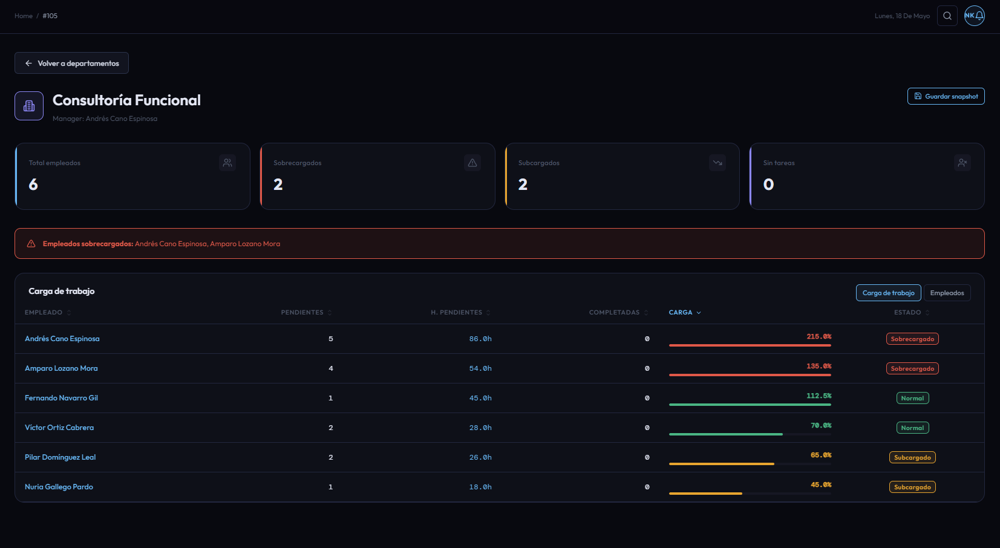

Dos pestañas:
- **"Carga de trabajo"**: tabla ordenable client-side con todos los empleados del departamento mostrando % de ocupación, horas pendientes, tareas completadas y estado (sobrecargado / normal / subcargado). Datos de `GET /departments/{id}/workload-summary`. Si hay empleados sobrecargados, aparece un banner de alerta rojo con sus nombres.
- **"Empleados"**: listado completo con cargo, email y coste/hora. Lazy-loaded via `GET /departments/{id}/employees` al activar la pestaña.
El botón **"Guardar snapshot"** llama a `POST /snapshots/entities` para persistir el estado del departamento en MongoDB.

---

### 📁 Listado de proyectos — `Projects.jsx`

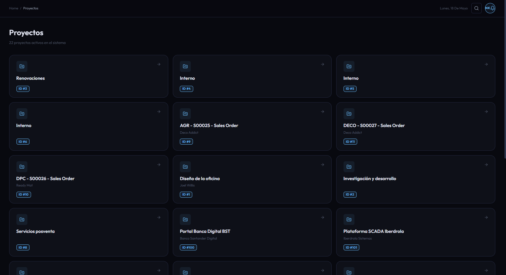

Tabla de proyectos filtrados por el scope del JWT del usuario autenticado. Muestra nombre, cliente y estado. Los datos vienen de `GET /projects/`.

---

### 📁 Detalle de proyecto — `ProjectDetail.jsx`

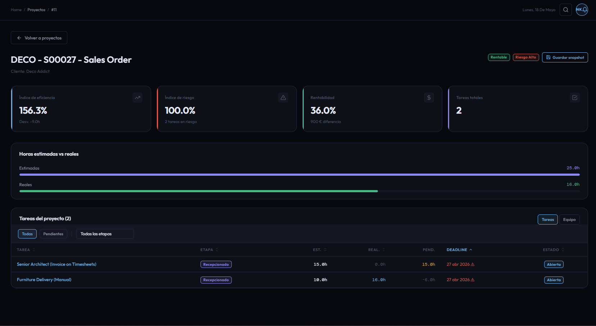

Vista de detalle con:
- **4 tarjetas KPI**: índice de eficiencia, índice de riesgo, rentabilidad y total de tareas (`GET /dashboards/summary/project/{id}`).
- **Barras de progreso** de horas estimadas vs reales.
- **Pestaña "Tareas"**: listado paginado con filtro por etapa y toggle pendientes/todas (`GET /projects/{id}/tasks`). Ordenación server-side por nombre, etapa, horas y deadline.
- **Pestaña "Equipo"**: empleados asignados con horas registradas y coste/hora, lazy-loaded (`GET /projects/{id}/employees`).
- Botón **"Guardar snapshot"** que persiste en MongoDB via `POST /snapshots/entities`.

---

### ✅ Listado de tareas — `Tasks.jsx`

Tabla paginada con filtros combinables: búsqueda por nombre, selector de etapa Kanban (`GET /tasks/stages`), rango de fechas de deadline y empleado asignado. Soporta parámetros URL (`?status=overdue`, `?employee_id=...`) para navegación directa desde alertas del dashboard. Los datos se obtienen de `GET /tasks/filter` con todos los parámetros como query string.

---

### ✅ Detalle de tarea — `TaskDetail.jsx`

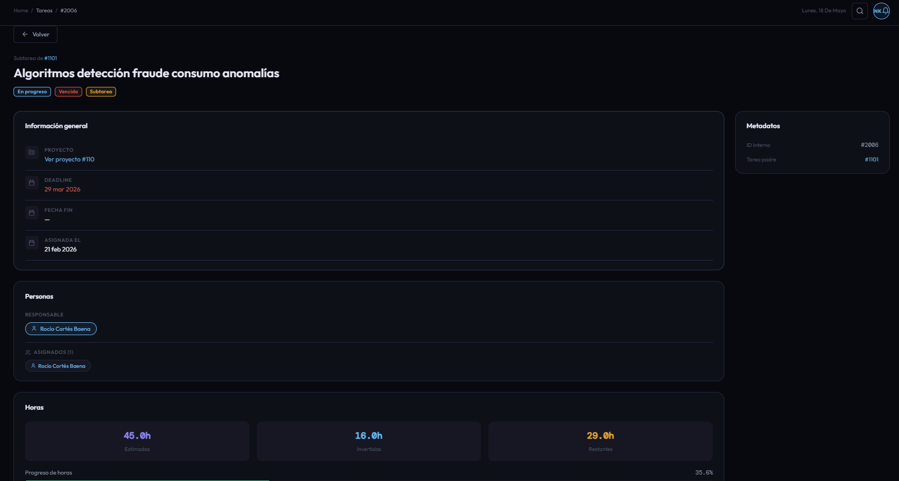

Ficha completa de la tarea con: horas planificadas, trabajadas y pendientes; lista de empleados asignados; subtareas; stage actual; fecha límite; y fecha de cierre si procede. Los datos provienen de `GET /tasks/{task_id}`.

---

### 🔍 Búsqueda global — `Search.jsx`

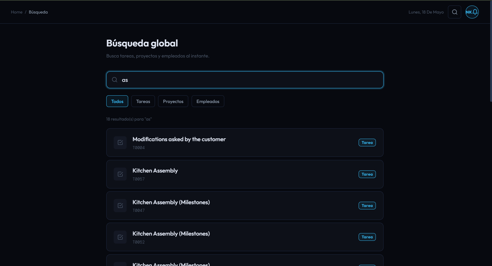

Búsqueda full-text transversal que lanza `GET /search/` con el texto introducido. Devuelve resultados agrupados en tres secciones (Empleados, Proyectos, Tareas) con enlaces directos a cada ficha. La búsqueda se dispara al escribir (debounced) y no requiere enviar el formulario.

---

### 📊 Métricas operativas — `Metrics.jsx`

Panel de métricas en dos columnas. La columna izquierda muestra una **cuadrícula de tarjetas** (una por métrica) con el valor actual en formato mini-gauge. Al seleccionar una tarjeta, la columna derecha muestra el **panel de detalle** con gráficos y KPIs específicos, un selector de empleado o proyecto cuando la métrica lo requiere, y el botón "Guardar snapshot". Las métricas disponibles son:

| Imagen | Métrica | Endpoint |
|--------|---------|----------|
|  | **Productividad** — ratio horas reales/estimadas por empleado | `GET /metrics/productivity` |
| 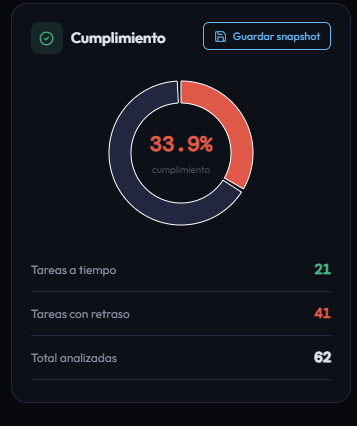 | **Cumplimiento** — % tareas cerradas en plazo | `GET /metrics/compliance` |
| 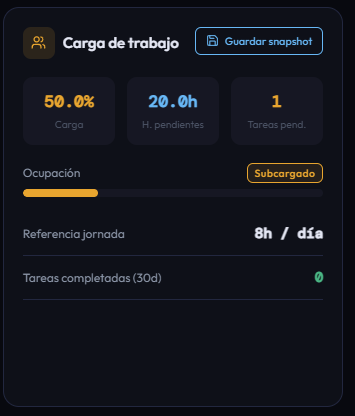 | **Carga de trabajo** — ocupación vs capacidad de un empleado | `GET /metrics/workload` |
| 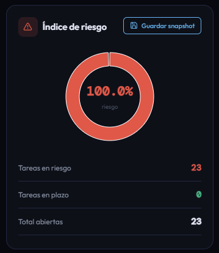 | **Índice de riesgo** — % tareas abiertas en riesgo de retraso | `GET /metrics/risk-index` |
| 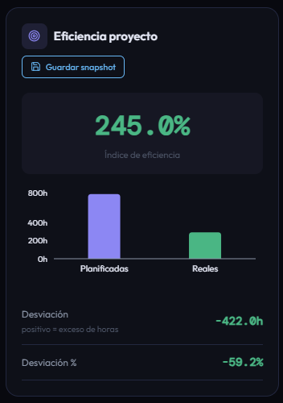 | **Eficiencia de proyecto** — horas planificadas vs reales | `GET /metrics/project-efficiency` |
| 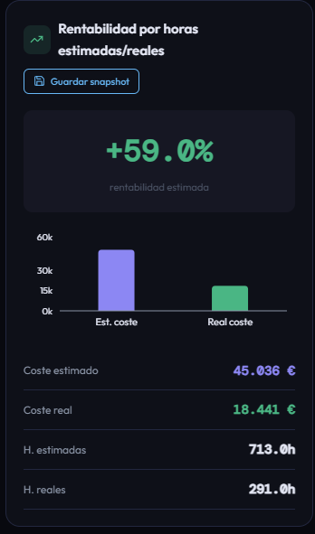 | **Rentabilidad estimada** — coste estimado vs coste real | `GET /metrics/profitability` |
| 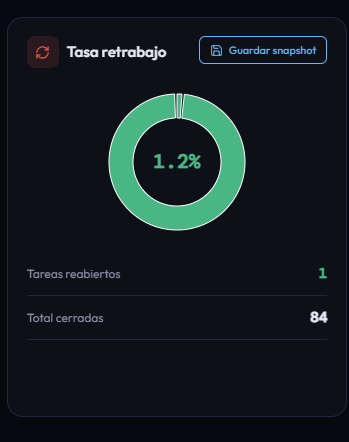 | **Tasa de retrabajo** — % tareas reabiertos | `GET /metrics/rework-rate` |
| 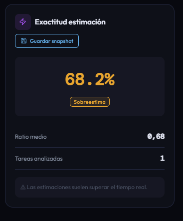 | **Exactitud de estimación** — sesgo estimado/real por empleado | `GET /metrics/estimation-accuracy` |
| 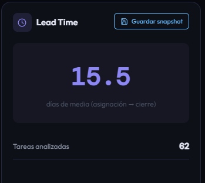 | **Lead Time** — días promedio asignación → cierre | `GET /metrics/lead-time` |
| 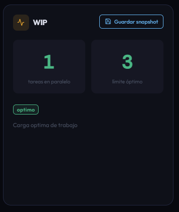 | **WIP** — tareas en paralelo vs límite óptimo | `GET /metrics/wip` |
| 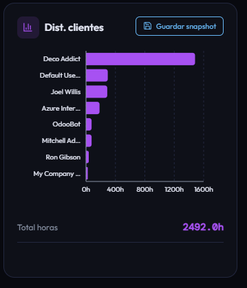 | **Distribución por clientes** *(solo Director)* — horas por cliente | `GET /metrics/client-distribution` |

---

### 📈 Gráficos analíticos — `Charts.jsx`

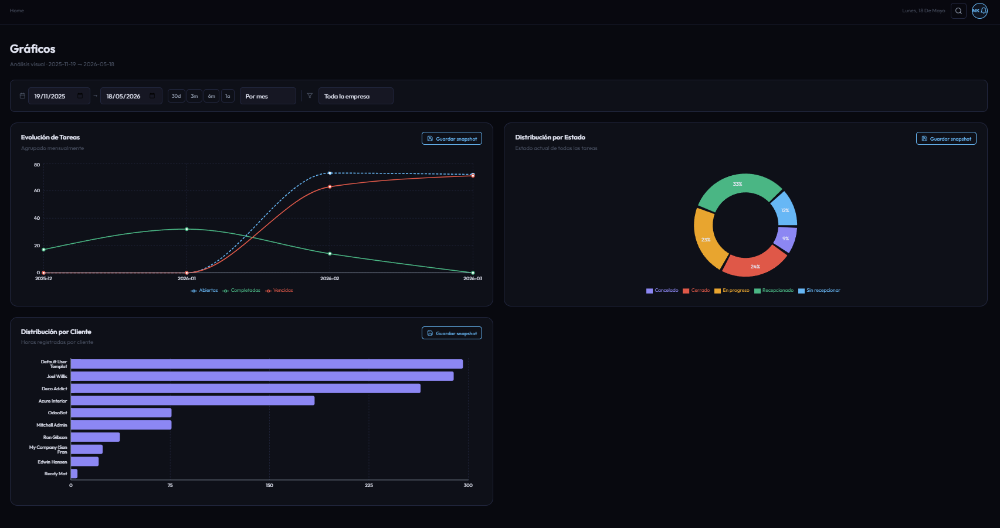

Vista de tres gráficos con barra de filtros compartida (rango de fechas, agrupación por mes/semana, filtro de entidad). Cada gráfico tiene su propio botón "Guardar snapshot":
- **Evolución de tareas**: gráfico de líneas con series de completadas, abiertas y vencidas (`GET /charts/task-evolution`).
- **Distribución por estado**: gráfico de tarta con conteo por etapa Kanban (`GET /charts/task-distribution`).
- **Distribución por cliente**: gráfico de barras horizontales con horas imputadas por cliente (`GET /metrics/client-distribution`).

---

### 🕐 Asistencia vs Partes — `Attendance.jsx`

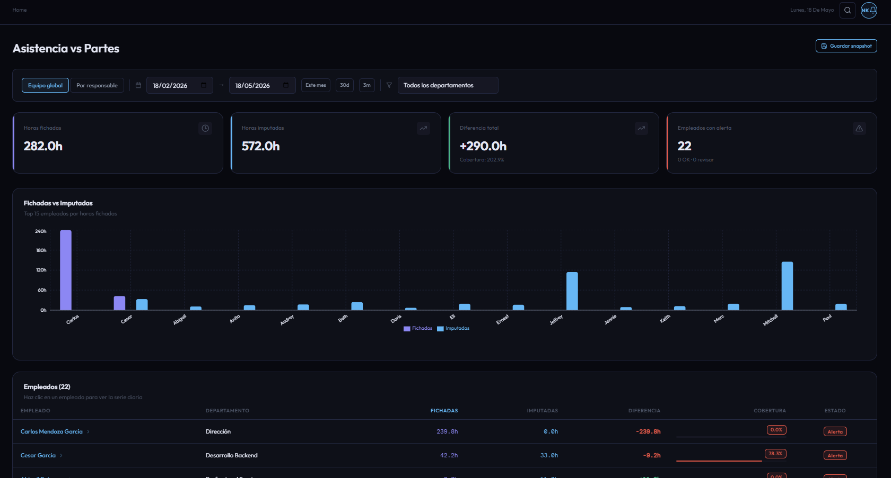

Vista de comparativa entre horas fichadas (entradas/salidas de `hr.attendance`) y horas imputadas en timesheets. Dos modos de vista:
- **"Equipo global"**: tabla de todos los empleados con horas fichadas, imputadas, diferencia y % de cobertura. Filtrable por departamento. Datos de `GET /employees/attendance/comparison`.
- **"Por responsable"** *(solo Director)*: filtra el equipo por el manager seleccionado. Datos de `GET /employees/attendance/manager/{id}`.

Al hacer clic en un empleado se despliega un **panel de serie diaria** con gráfico de barras (fichadas vs imputadas) y gráfico de diferencia diaria, cargado de `GET /employees/attendance/{id}/daily`. El botón "Guardar snapshot" persiste la vista actual.

---

### ⚡ Panel de manager — `Manager.jsx`

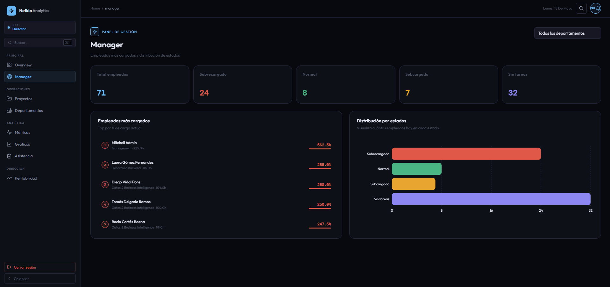

Vista de distribución de carga del equipo con:
- **5 tarjetas de estado** clickables (Total / Sobrecargado / Normal / Subcargado / Sin tareas) que filtran el listado inferior.
- **"Empleados más cargados"**: ranking de los más sobrecargados con barra de progreso y % de carga.
- **Gráfico de barras horizontal** con distribución de estados del equipo.
- **Listado paginado** (12 por página) que aparece al seleccionar un estado, con ordenación server-side y enlace a cada ficha de empleado.
Todos los datos provienen de `GET /dashboards/summary/manager` con distintos parámetros.

---

### 💰 Rentabilidad financiera — `Rentability.jsx` *(solo Director)*

Panel financiero exclusivo del Director basado en las líneas analíticas contables de Odoo. Tres modos de filtro: Global, Por proyecto y Por responsable. Incluye:
- **4 tarjetas KPI**: ingresos totales, gastos totales, neto y % de rentabilidad.
- **Gráfico de barras** ingresos vs gastos por proyecto (top 12).
- **Gráfico de tarta** con distribución ganancia/neutro/pérdida.
- **Tabla "Por proyecto"** con rentabilidad individual. Al pulsar "Ver Detalles" carga las líneas analíticas de ingresos y gastos del proyecto (`GET /metrics/profitability/per-project/{id}/lines`).
- **Tabla "Por cliente"** con las mismas métricas agrupadas por cliente.
- **Panel de detalle por manager** (al seleccionar un responsable): carga todos sus proyectos via `GET /metrics/profitability/manager/{id}`.

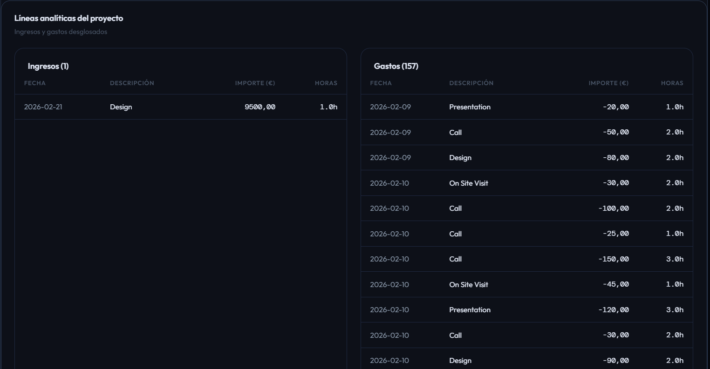

---

### 📷 Visor de snapshots — `Home.jsx` + vistas de listado (frontend2, puerto 3001)

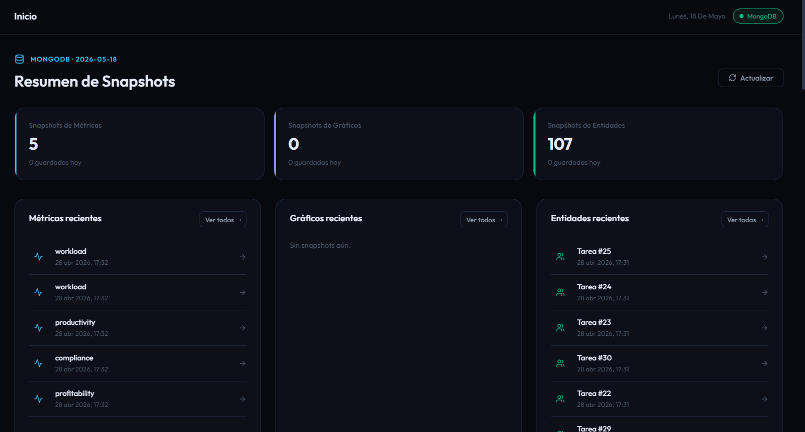

Aplicación independiente que consume la misma API pero solo los endpoints `/snapshots/**`. La pantalla de inicio muestra los contadores de snapshots guardados en MongoDB (`GET /snapshots/stats`). Desde ahí se navega a:

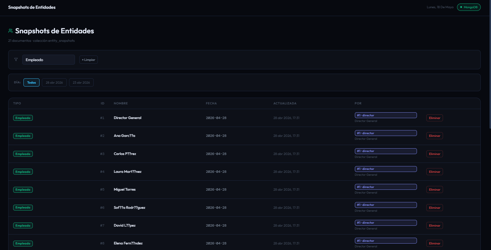

- **`MetricSnapshots.jsx`**, **`ChartSnapshots.jsx`**, **`EntitySnapshots.jsx`**: listados paginados con filtro por nombre/fecha. Cada fila permite **eliminar** el snapshot (`DELETE /snapshots/{tipo}/{id}`) con confirmación en modal.

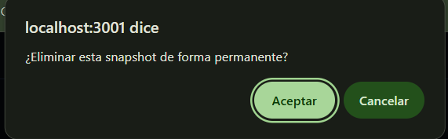

- **`SnapshotDetail.jsx`**: visualizador del JSON completo del snapshot guardado, con renderizado específico según el tipo (métricas, gráficos o entidades).

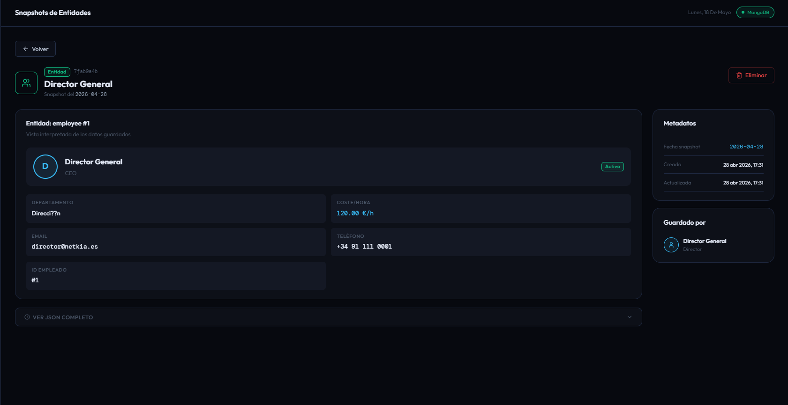

---

## Catálogo de endpoints de la API

La documentación completa de los endpoints de la API está disponible aquí: 
[Documentación endpoints](docs/endpoints.md)
