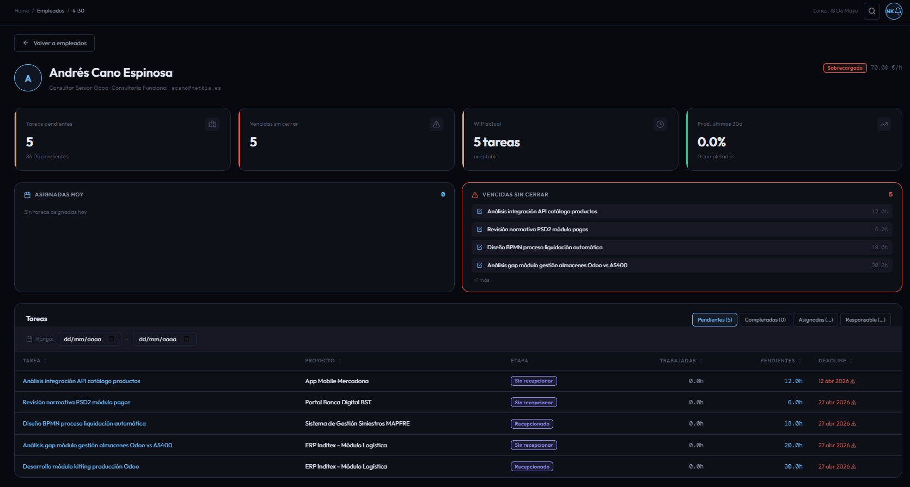

# CU-03 — Ver resumen de empleado

## Descripción funcional

Al hacer clic sobre una fila del listado de empleados, el sistema navega a la ficha de resumen de ese empleado. Esta pantalla agrega tres dimensiones de análisis en una sola vista: carga de trabajo actual (`WorkloadService`), tareas en curso (`WIPService`) y productividad de los últimos 30 días (`ProductivityService`). El cálculo se realiza íntegramente en el backend y se devuelve como un único objeto `EmployeeSummaryResponse`.

La pantalla dispone de cuatro pestañas de tareas que se cargan **bajo demanda** al seleccionarlas, reutilizando el endpoint `GET /tasks/filter` de CU-08.

---

## Captura de pantalla

---

## Qué puede hacer el usuario

### Panel de KPIs

| KPI | Descripción |
|---|---|
| **Carga de trabajo** | Porcentaje de ocupación respecto a la jornada de referencia (`WORKLOAD_REFERENCE_HOURS`). Clasifica al empleado en `optimo`, `aceptable` o `sobrecargado`. |
| **WIP (Work In Progress)** | Número de tareas abiertas asignadas. Indica si el empleado tiene demasiadas tareas en paralelo. |
| **Productividad (30 días)** | Ratio `horas_planificadas / horas_reales × 100` sobre tareas cerradas en los últimos 30 días. |

### Pestañas de tareas

Cada pestaña invoca `GET /tasks/filter` con los parámetros correspondientes al seleccionarse:

| Pestaña | Filtros enviados |
|---|---|
| **Pendientes** | `employee_id`, `status=pending` |
| **Completadas** | `employee_id`, `status=completed` |
| **Asignadas** | `employee_id` (sin `status`) |
| **Responsable** | `employee_id`, `responsable=true` |

### Guardar snapshot

El botón **Guardar snapshot** guarda el estado actual del resumen del empleado en la colección `entity_snapshots` de MongoDB (CU-17), con `entity_type = "employee"` y `entity_id = employee_id`.

---

## Datos mostrados

| Campo | Origen |
|---|---|
| **Nombre, departamento, cargo** | `GET /employees/{id}` → `EmployeeDetail` |
| **Carga (%)** | `WorkloadService.calculate(employee_id, detailed=True)` |
| **Horas pendientes** | `wl.pending_hours` (WorkloadResponse) |
| **WIP count** | `WIPService.calculate(employee_id).wip_count` |
| **Productividad media** | `ProductivityService.calculate(...).average_productivity` |
| **Tareas completadas (30 d)** | `wl.total_completed_tasks` |

---

## Restricciones de acceso

- **Director:** puede acceder al resumen de cualquier empleado del sistema.
- **Responsable:** solo puede acceder si el `employee_id` está en `cu.employee_ids` (embebido en el JWT en el momento del login). Un intento de acceso fuera del ámbito devuelve un 403.
- La validación de ámbito se ejecuta dos veces: una en `GET /employees/{id}` (vía `EmployeeService.get_employee`) y otra en `GET /dashboards/summary/employee/{id}` (vía `DashboardService.get_employee_summary`), para impedir el acceso directo al endpoint de dashboard eludiendo la ficha de empleado.
