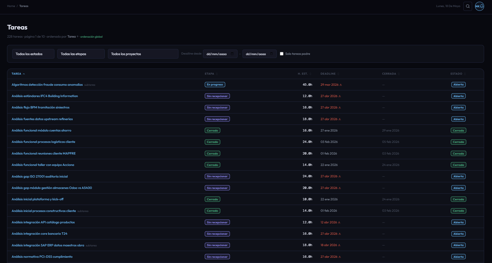

# CU-08 — Listar tareas

## Descripción funcional

La pantalla de tareas centraliza el acceso a todas las tareas del sistema a través de un único endpoint polimórfico: `GET /tasks/filter`. El mismo endpoint es reutilizado por las pestañas de la ficha de empleado (CU-03), las pestañas del detalle de proyecto y la página global de tareas, variando únicamente los parámetros de filtrado.

El modo de construcción de los ítems de respuesta se determina automáticamente por la combinación de `status` y `employee_id`:

| `status` | `employee_id` | Tipo de ítem devuelto |
|---|---|---|
| `pending` | presente | `PendingTaskItem` |
| `completed` | presente | `CompletedTaskItem` |
| cualquier otro | presente | `AssignedTaskItem` |
| — | ausente | `TaskResponse` (modo genérico) |

---

## Captura de pantalla

---

## Qué puede hacer el usuario

### Filtros disponibles

| Filtro | Parámetro | Descripción |
|---|---|---|
| **Estado** | `status` | `pending`, `completed` o `overdue`. Filtra por etapa abierta/cerrada. |
| **Etapa** | `stage_id` | Etapa concreta del flujo Kanban. |
| **Proyecto** | `project_id` | Restringe al proyecto seleccionado. Aplica validación de scope si el actor es Responsable. |
| **Empleado** | `employee_id` | Tareas asignadas a ese empleado. Aplica validación de scope. |
| **Responsable** | `responsable` | Si `true`, devuelve las tareas donde el empleado es responsable (`user_id`). |
| **Fecha de fin** | `date_from` / `date_to` | Rango sobre `date_deadline`. |
| **Fecha de asignación** | `date_assign` | Filtra tareas asignadas a partir de esa fecha. |
| **Solo raíz** | `root_only` | Si `true`, excluye las subtareas (`parent_id IS NULL`). |
| **Búsqueda** | `search` | Filtra por nombre de tarea (ILIKE). |

### Ordenación y paginación

- Columna de ordenación configurable mediante `sort_by` y `sort_order`.
- Paginación server-side: `page` y `page_size` (máx. 200 por página, por defecto 50).

---

## Datos mostrados (modo genérico `TaskResponse`)

| Campo | Descripción |
|---|---|
| **Nombre** | Nombre de la tarea en Odoo. |
| **Proyecto** | Proyecto padre. |
| **Etapa** | Nombre traducido de la etapa Kanban. |
| **Horas planificadas** | `planned_hours` del modelo ORM. |
| **Horas trabajadas** | Calculadas mediante `get_worked_hours_batch` sobre `account_analytic_line`. |
| **Fecha límite** | `date_deadline`. |
| **Cerrada** | Booleano calculado a partir de la etapa (`is_closed`). |

---

## Campos adicionales por modo

### `PendingTaskItem`
Añade `pending_hours` (= `planned - worked`), `is_overdue` y `date_assign`.

### `CompletedTaskItem`
Añade `actual_hours`, `productivity` (= `planned / actual × 100`), `completion_date` y `on_time`.

### `AssignedTaskItem`
Combina los campos de ambos modos: `pending_hours`, `actual_hours`, `productivity`, `is_closed` e `is_overdue`.

---

## Restricciones de acceso

- **Director:** ve tareas de todos los proyectos del sistema.
- **Responsable:** si no se especifica `employee_id` ni `project_id`, el servicio restringe automáticamente a `cu.project_ids`. Si se especifica `project_id`, se comprueba que pertenezca al ámbito del Responsable (403 si no). Si se especifica `employee_id`, se comprueba que pertenezca a `cu.employee_ids`.
