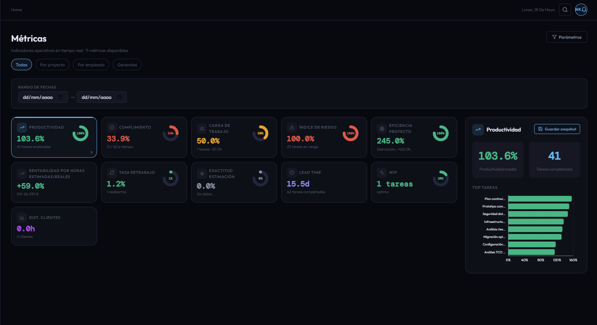

# CU-10 — Consultar catálogo de métricas

## Descripción funcional

El catálogo de métricas es la pantalla central desde la que el actor accede a cualquiera de las métricas operativas individuales del sistema. Cada tarjeta del catálogo describe brevemente la métrica (nombre, descripción, parámetros requeridos) y actúa como punto de entrada hacia el CU correspondiente del paquete P10 (CU-22 a CU-32).

La vista no realiza ninguna consulta analítica por sí misma: únicamente presenta las rutas de navegación disponibles. El catálogo es estático en el frontend; no requiere ningún endpoint de backend propio.

---

## Captura de pantalla

---

## Qué puede hacer el usuario

### Navegación a métricas individuales

| Tarjeta | Métrica | CU relacionado | Endpoint |
|---|---|---|---|
| Productividad | Ratio horas planificadas / reales en tareas cerradas | CU-22 | `GET /metrics/productivity` |
| Cumplimiento | Porcentaje de tareas entregadas a tiempo | CU-23 | `GET /metrics/compliance` |
| WIP | Tareas abiertas en paralelo por empleado | CU-24 | `GET /metrics/wip` |
| Carga de trabajo | Porcentaje de ocupación respecto a la jornada de referencia | CU-25 | `GET /metrics/workload` |
| Índice de riesgo | Porcentaje de tareas en riesgo sobre el total del proyecto | CU-26 | `GET /metrics/risk-index` |
| Tasa de retrabajo | Porcentaje de tareas que vuelven a una etapa anterior | CU-27 | `GET /metrics/rework-rate` |
| Exactitud de estimación | Desviación media entre horas planificadas y reales | CU-28 | `GET /metrics/estimation-accuracy` |
| Lead Time | Tiempo medio entre asignación y cierre de tarea | CU-29 | `GET /metrics/lead-time` |
| Eficiencia por proyecto | Ratio de horas cerradas sobre horas planificadas del proyecto | CU-30 | `GET /metrics/project-efficiency` |
| Tiempo por estado | Tiempo medio que las tareas pasan en cada etapa Kanban | CU-31 | `GET /metrics/state-time` |
| Distribución por prioridad | Tiempo en etapa desglosado por nivel de prioridad | CU-32 | `GET /metrics/priority-time` |

### Guardar snapshot

Desde cada vista de métrica individual (no desde el catálogo en sí) el actor puede guardar un snapshot de los resultados actuales (CU-17), que queda almacenado en la colección `metric_snapshots` de MongoDB.

---

## Restricciones de acceso

- **Director y Responsable:** ambos tienen acceso a todas las métricas del catálogo. Sin embargo, dentro de cada métrica, el Responsable solo ve datos de su ámbito (`cu.project_ids`, `cu.employee_ids`).
- La pantalla del catálogo en sí no aplica ningún filtro de scope, ya que no ejecuta consultas analíticas.
