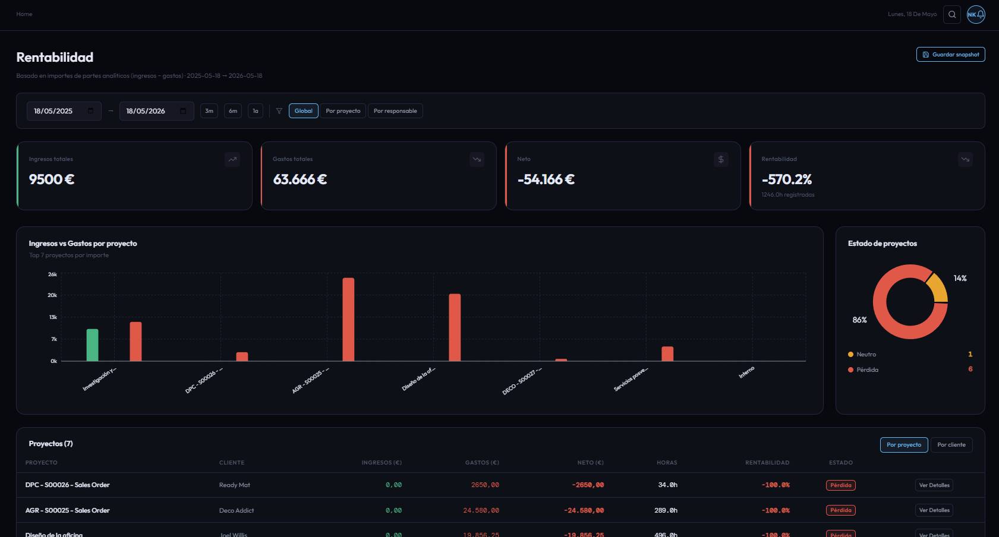

# CU-13 — Consultar rentabilidad financiera

## Descripción funcional

La pantalla de rentabilidad financiera es **exclusiva del Director**. Muestra el balance global de ingresos, gastos y neto del periodo seleccionado, calculado desde las líneas analíticas de Odoo (`account_analytic_line`). El resumen global se complementa con un desglose tabulado por proyecto y por cliente, y con gráficos de barras y de tarta que visualizan la distribución de rentabilidad.

Desde la tabla de detalle por proyecto o por cliente, el actor puede navegar al drill-down de líneas analíticas (CU-14).

---

## Captura de pantalla

---

## Qué puede hacer el usuario

### Filtros disponibles

| Filtro | Parámetro | Descripción |
|---|---|---|
| **Fecha de inicio** | `date_from` | Inicio del periodo de análisis. |
| **Fecha de fin** | `date_to` | Fin del periodo de análisis. |
| **Proyecto** | `project_id` | Restringe el desglose a un proyecto concreto (solo en vista por proyecto). |
| **Responsable** | `manager_id` | Filtra los proyectos por su responsable. |

### Vistas disponibles

El actor puede alternar entre tres vistas mediante pestañas:

| Vista | Endpoint | Descripción |
|---|---|---|
| **Resumen global** | `GET /metrics/profitability/summary` | Totales de ingresos, gastos, neto, horas y `profitability_pct` global. Incluye recuento de proyectos por estado. |
| **Por proyecto** | `GET /metrics/profitability/per-project` | Desglose fila por fila con `income`, `expense`, `net`, `total_hours`, `profitability_pct` y estado (`ganancia` / `neutro` / `pérdida`). |
| **Por cliente** | `GET /metrics/profitability/per-client` | Agrupación de proyectos por cliente. Muestra `project_count` y los mismos totales financieros. |

### Drill-down a líneas analíticas (CU-14)

Al pulsar **Ver detalles** sobre una fila de la tabla, el frontend navega al detalle de líneas analíticas del proyecto o cliente seleccionado:
- Por proyecto: `GET /metrics/profitability/per-project/{project_id}/lines`
- Por cliente: `GET /metrics/profitability/per-client/{client_id}/lines`

La respuesta clasifica cada línea en `incomes` o `expenses` según el signo de `amount`.

### Guardar snapshot

El botón **Guardar snapshot** guarda el estado actual de la vista de rentabilidad en la colección `chart_snapshots` de MongoDB (CU-17).

---

## Datos del resumen global

| Campo | Descripción |
|---|---|
| **income** | Suma total de ingresos del periodo (`amount >= 0`). |
| **expense** | Suma total de gastos (`amount < 0`). |
| **net** | `income + expense`. |
| **total_hours** | Suma de `unit_amount` (horas imputadas). |
| **profitability_pct** | `net / income × 100`. Si `income = 0` y `net < 0` → `-100 %`. |
| **status** | `ganancia` si `profitability_pct > PROFITABILITY_GAIN_THRESHOLD`, `neutro` o `perdida`. |
| **projects_summary** | Recuento `{ ganancia, neutro, perdida, total }`. |

---

## Restricciones de acceso

- **Solo Director.** El guard `require_director` rechaza con 403 cualquier token con rol distinto de `director`, antes de que la petición llegue al servicio.
- No se aplica filtrado por scope: la rentabilidad es un dato global de negocio que el Director consulta sin restricción organizativa.
