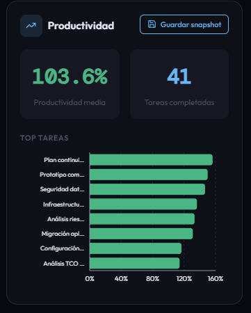

# CU-22 — Consultar productividad

## Descripción funcional

La métrica de productividad calcula el ratio entre horas planificadas y horas realmente trabajadas en las tareas **cerradas** del periodo seleccionado. Un valor superior a 100 % indica que la tarea se completó con menos horas de las previstas; un valor inferior indica desviación negativa.

El endpoint `GET /metrics/productivity` es parametrizable por empleado, proyecto y rango de fechas, y es reutilizado internamente por `DashboardService.get_employee_summary` para alimentar el panel de KPIs de CU-03.

---

## Captura de pantalla



---

## Parámetros de entrada

| Parámetro | Tipo | Descripción |
|---|---|---|
| `employee_id` | int (opcional) | Filtra por empleado asignado. Aplica validación de scope si el actor es Responsable. |
| `project_id` | int (opcional) | Filtra por proyecto. Aplica validación de scope. |
| `date_from` | date (opcional) | Inicio del periodo sobre `date_end` de la tarea. |
| `date_to` | date (opcional) | Fin del periodo. |
| `root_only` | bool (default `false`) | Si `true`, excluye subtareas. |

---

## Qué puede hacer el usuario

### Visualización

- **Indicador global**: `average_productivity` (media de los ratios individuales de cada tarea válida).
- **Tabla de tareas**: lista ordenada de mayor a menor productividad, con `task_name`, `planned_hours`, `actual_hours` y `productivity_pct` por tarea.

### Guardar snapshot

El botón **Guardar snapshot** llama a `POST /snapshots/metrics` con:
```json
{
  "metric_name": "productivity",
  "params": { "employee_id": ..., "project_id": ..., "date_from": ..., "date_to": ... },
  "data": { "average_productivity": ..., "total_tasks": ..., "tasks": [...] }
}
```

---

## Flujo técnico

| Paso | Capa | Clase / Función | Acción |
|---|---|---|---|
| 1 | Routes | `metrics.router` → `require_manager_or_above` | Valida JWT, aplica guards de scope si hay `employee_id` o `project_id`. |
| 2 | Services | `ProductivityService.calculate(...)` | Llama al repositorio y aplica la fórmula. |
| 3 | Repositories | `productivity.py → get_completed_tasks_with_hours()` | Consulta tareas cerradas con `SUM(unit_amount)` desde `account_analytic_line`. Solo incluye tareas donde `actual_hours > 0`. |
| 4 | Services | `ProductivityService` | Para cada tarea: `pct = (planned / actual) × 100`. Calcula la media sobre las tareas válidas. Ordena de mayor a menor. |
| 5 | Routes | `metrics.router` | Devuelve `200 OK` + `ProductivityResponse`. |

---

## Datos de salida (`ProductivityResponse`)

| Campo | Descripción |
|---|---|
| **average_productivity** | Media del ratio `planned/actual × 100` sobre las tareas válidas del periodo. |
| **total_tasks** | Número de tareas incluidas en el cálculo (solo las que tienen `actual_hours > 0`). |
| **tasks** | Lista de `ProductivityTaskItem`: `task_id`, `task_name`, `planned_hours`, `actual_hours`, `parent_id`, `productivity_pct`. |

---

## Restricciones de acceso

- **Director:** puede consultar la productividad de cualquier empleado o proyecto del sistema.
- **Responsable:** si se especifica `employee_id`, debe estar en `cu.employee_ids`. Si se especifica `project_id`, debe estar en `cu.project_ids`. La validación se realiza en la capa de rutas mediante `verify_employee_scope` y `verify_project_scope`.

---

## Implementación

> **Archivos implicados:**  
> `app/routes/metrics.py` · `app/services/metrics/productivity.py` · `app/repositories/metrics/productivity.py` · `app/repositories/task.py`

---

### Capa de rutas — `routes/metrics.py`

El endpoint valida existencia y scope antes de invocar el servicio. Todas las comprobaciones se encadenan en el handler para mantener la ruta corta.

```python
# router prefix: /metrics
@router.get("/productivity")
def get_productivity(
    employee_id: Optional[int]  = Query(None),
    project_id:  Optional[int]  = Query(None),
    date_from:   Optional[date] = Query(None),
    date_to:     Optional[date] = Query(None),
    root_only:   bool           = Query(False),
    db: Session     = Depends(get_db),
    cu: CurrentUser = Depends(require_manager_or_above),
):
    if date_from or date_to:
        validate_date_range(date_from, date_to)
    if employee_id:
        verify_employee_exists(db, employee_id)
        verify_employee_scope(cu, employee_id)   # 403 si no es del ámbito
    if project_id:
        verify_project_exists(db, project_id)
        verify_project_scope(cu, project_id)
    return ProductivityService(db).calculate(
        employee_id=employee_id, project_id=project_id,
        date_from=date_from, date_to=date_to, root_only=root_only,
    )
```

---

### Capa de servicio — `services/metrics/productivity.py`

El servicio aplica la fórmula `pct = (planned / actual) × 100` sobre cada tarea válida (`actual_hours > 0`). Solo tareas con `planned_hours > 0` llegan desde el repositorio, y solo las que tienen imputación real (`actual_hours > 0`) entran en el cálculo de la media.

```python
class ProductivityService:
    def calculate(self, employee_id=None, project_id=None,
                  date_from=None, date_to=None, root_only=False) -> ProductivityResponse:

        rows = get_completed_tasks_with_hours(
            self.db, employee_id, project_id, date_from, date_to, root_only,
        )

        items, total_pct, valid = [], 0.0, 0
        for r in rows:
            if r.actual_hours > 0:   # filtra tareas sin imputación real en el periodo
                pct = (r.planned_hours / r.actual_hours) * 100
                items.append(ProductivityTaskItem(
                    task_id=r.id,
                    task_name=r.name,
                    planned_hours=round(r.planned_hours, 2),
                    actual_hours=round(r.actual_hours, 2),
                    parent_id=r.parent_id,
                    productivity_pct=round(pct, 2),
                ))
                total_pct += pct
                valid += 1

        # Ordena de mayor a menor productividad
        items.sort(key=lambda x: x.productivity_pct, reverse=True)

        return ProductivityResponse(
            average_productivity=round(total_pct / valid, 2) if valid else 0,
            total_tasks=valid,
            tasks=items,
        )
```

---

### Capa de repositorio — `repositories/metrics/productivity.py`

La consulta usa una **subquery de timesheets** agrupada por `task_id` para calcular `actual_hours`. El JOIN entre la subquery y `project_task` es un `outerjoin` para no excluir tareas sin imputaciones (el servicio las filtra después con `actual_hours > 0`). El filtro de etapa cerrada reutiliza `closed_stage_ids_subq` de `repositories/task.py`, más la columna `Task.is_closed` como doble garantía.

```python
# repositories/metrics/productivity.py
def get_completed_tasks_with_hours(db, employee_id, project_id,
                                   date_from, date_to, root_only=False):
    # Paso 1: subquery de horas imputadas por tarea (filtra por empleado y fecha)
    subq = db.query(
        Timesheet.task_id,
        func.sum(Timesheet.unit_amount).label("actual_hours"),
    )
    if employee_id:
        subq = subq.filter(Timesheet.employee_id == employee_id)
    if date_from:
        subq = subq.filter(Timesheet.date >= date_from)
    if date_to:
        subq = subq.filter(Timesheet.date <= date_to)
    subq = subq.group_by(Timesheet.task_id).subquery()

    # Paso 2: consulta principal uniendo tareas con la subquery
    q = (
        db.query(
            Task.id, Task.name, Task.planned_hours, Task.parent_id,
            func.coalesce(subq.c.actual_hours, 0).label("actual_hours"),
        )
        .outerjoin(subq, Task.id == subq.c.task_id)
        # Solo tareas cerradas: doble condición (is_closed + etapa cerrada)
        .filter(
            Task.active == True,
            Task.is_closed == True,
            Task.stage_id.in_(closed_stage_ids_subq(db)),
            Task.planned_hours > 0,    # excluye tareas sin estimación
        )
    )
    if project_id:
        q = q.filter(Task.project_id == project_id)
    if root_only:
        q = q.filter(Task.parent_id.is_(None))
    return q.all()
```

