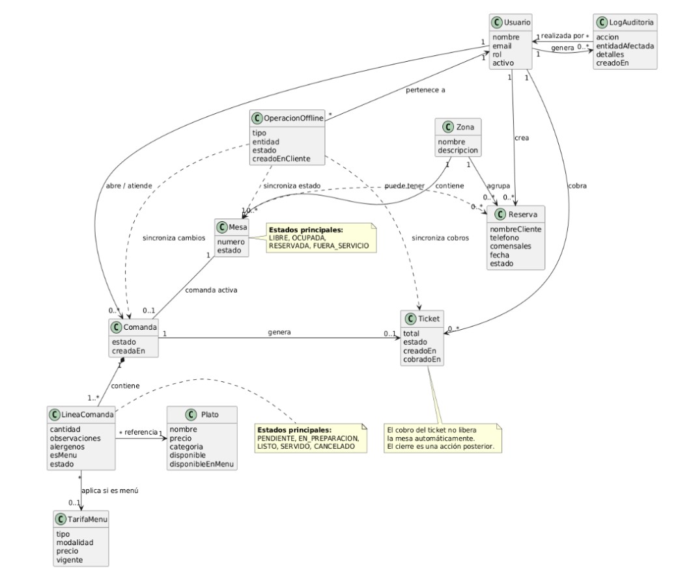
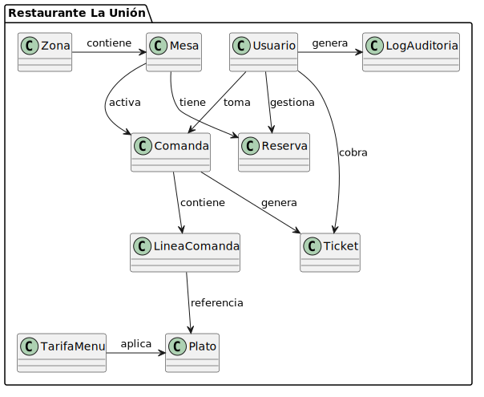
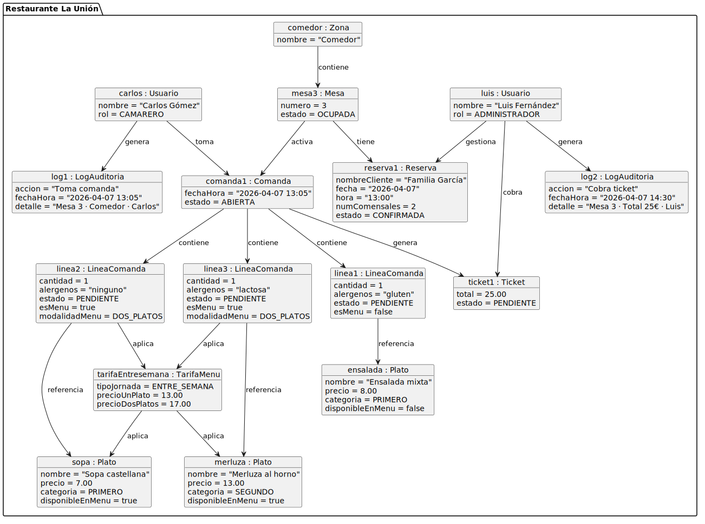
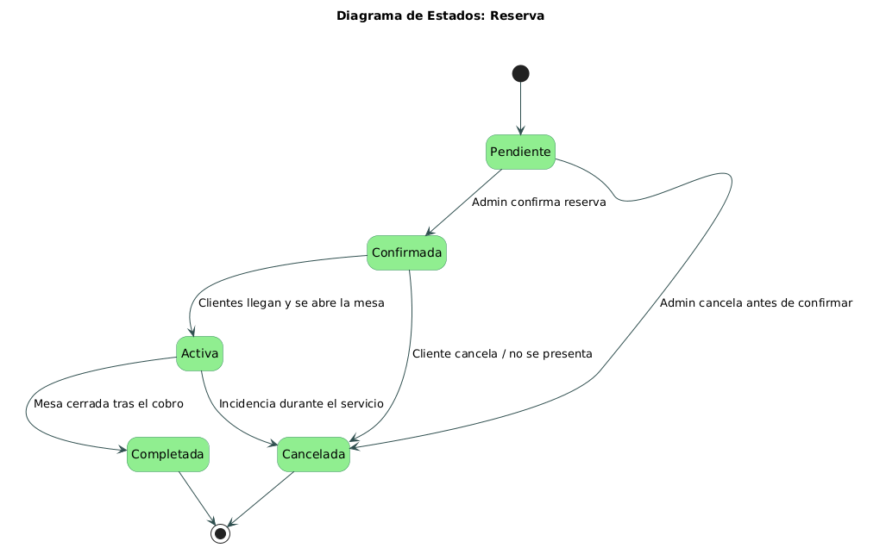
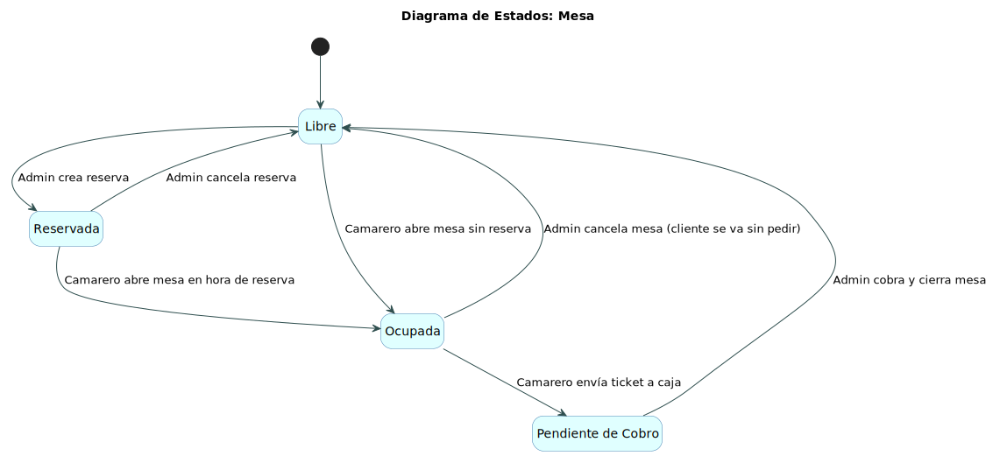
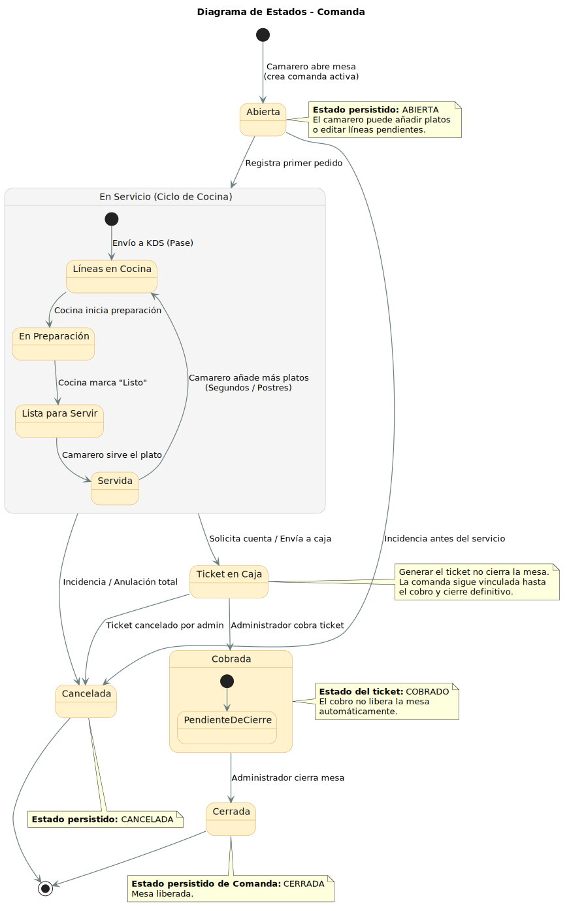

# 2.1 Modelo de dominio y glosario

## Modelo de dominio

El modelo de dominio se construye alrededor del ciclo operativo de una mesa: una zona contiene mesas, una mesa puede activar una comanda, la comanda agrupa líneas, las líneas referencian platos y tarifas de menú, y finalmente la comanda genera un ticket.

Además, las reservas, la auditoría y las operaciones offline complementan el flujo principal sin romper el modelo central.

## Glosario

| Término | Definición |
|---|---|
| `Usuario` | Persona que accede al sistema con credenciales. Puede tener rol de Camarero, Cocinero o Administrador, y su rol determina las acciones permitidas. |
| `Zona` | Área física del restaurante: comedor, bar, terraza, plaza, mirador, balcón y escalera. Cada zona agrupa mesas y facilita la organización del servicio. |
| `Mesa` | Unidad básica del servicio. Pertenece a una zona, puede tener una comanda activa y puede estar asociada a reservas en distintos tramos horarios. |
| `Reserva` | Registro de una ocupación prevista. Incluye cliente, teléfono, número de comensales, fecha, estado y asignación a mesa o zona según el momento de la gestión. |
| `Comanda` | Registro digital de lo solicitado por los comensales de una mesa. Se construye línea a línea y sirve como base para el trabajo de cocina y la generación del ticket. |
| `LineaComanda` | Representa cada plato dentro de una comanda, incluyendo cantidad, observaciones, alérgenos confirmados, si pertenece al menú y su estado: pendiente, en preparación, listo, servido o cancelado. |
| `Plato` | Elemento disponible en la carta, con nombre, precio, categoría, disponibilidad, alérgenos y posibilidad de formar parte del menú del día. |
| `TarifaMenu` | Define precios y modalidades del menú. Permite aplicar una tarifa vigente cuando una línea de comanda pertenece al menú del día. |
| `Ticket` | Resumen económico generado a partir de una comanda. Incluye desglose, total y estado. Solo el Administrador puede cobrarlo. Tras el cobro, la mesa queda pendiente de cierre y se libera únicamente cuando se ejecuta la acción de cerrar mesa. |
| `LogAuditoria` | Registro de acciones relevantes del sistema, como cambios en usuarios, reservas, carta, comandas, tickets, cobros y cierres de mesa. Cada entrada guarda usuario, fecha, entidad afectada y detalles de la acción. |
| `OperacionOffline` | Operación registrada cuando existe un corte de conexión. Queda pendiente de sincronización hasta que la aplicación recupera conectividad con el backend. |

## Diagrama de clases

## Diagrama de objetos

## Diagrama de estados

### Reserva

### Mesa

### Comanda

[← Volver al índice del capítulo](README.md)
