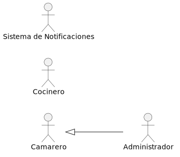

# 2.5 Disciplina de requisitos, actores y casos de uso

Esta disciplina tiene como finalidad establecer, de manera clara y estructurada, quiénes interactúan con el sistema y qué funcionalidades deben estar disponibles para cada uno de ellos. A partir de esto, se definen los casos de uso principales, su prioridad y su comportamiento esperado.

## Actores del sistema

| Actor | Descripción |
|---|---|
| Camarero | Usuario encargado de gestionar mesas, tomar comandas, consultar estados, solicitar pases y enviar tickets a caja. |
| Cocinero | Usuario encargado de trabajar sobre el KDS, consultar líneas pendientes, marcar platos en preparación, listos o servidos, y revisar observaciones y alérgenos. |
| Administrador | Usuario con permisos de gestión sobre caja, reservas, usuarios, carta, auditoría y cierre de mesas. |
| Sistema de notificaciones | Componente interno encargado de emitir avisos automáticos, como platos listos, reservas próximas o actualización del KDS. No representa un perfil humano de acceso. |

## Casos de uso positivos

| ID | Caso de uso | Camarero | Administrador | Cocinero | Sist. Notif. |
|---|---|:---:|:---:|:---:|:---:|
| CU-01 | Iniciar sesión | ✅ | ✅ | ✅ | |
| CU-02 | Cerrar sesión | ✅ | ✅ | ✅ | |
| CU-03 | Ver estado de mesas por zona | ✅ | ✅ | | |
| CU-04 | Abrir mesa | ✅ | ✅ | | |
| CU-05 | Cerrar mesa | | ✅ | | |
| CU-06 | Tomar comanda | ✅ | ✅ | | |
| CU-07 | Ver comanda de una mesa | ✅ | ✅ | | |
| CU-08 | Editar comanda | ✅ | ✅ | | |
| CU-09 | Solicitar segundos platos / postres | ✅ | ✅ | | ✅ |
| CU-10 | Ver comandas pendientes en KDS | | | ✅ | |
| CU-11 | Marcar comanda en preparación | | | ✅ | |
| CU-12 | Marcar plato como listo | | | ✅ | ✅ |
| CU-13 | Ver alérgenos y observaciones | | | ✅ | |
| CU-14 | Enviar ticket a caja | ✅ | ✅ | | |
| CU-15 | Editar ticket | ✅ | ✅ | | |
| CU-16 | Reclamar ticket enviado | ✅ | ✅ | | |
| CU-17 | Cobrar ticket en caja | | ✅ | | |
| CU-18 | Ver listado de reservas del día | | ✅ | | |
| CU-19 | Gestionar reservas (crear, editar, cancelar) | | ✅ | | |
| CU-20 | Asignar mesa a reserva | | ✅ | | |
| CU-21 | Gestionar usuarios y roles | | ✅ | | |
| CU-22 | Configurar plano de sala (zonas y mesas) | | ✅ | | |
| CU-23 | Unir / separar mesas | | ✅ | | |
| CU-24 | Consultar log de auditoría | | ✅ | | |
| CU-25 | Gestionar carta (añadir, editar, eliminar platos) | | ✅ | | |
| CU-26 | Configurar menú del día | | ✅ | | |
| CU-27 | Enviar notificaciones automáticas (plato listo, reservas próximas, actualizar KDS) | | | | ✅ |
| CU-28 | Marcar plato como agotado / disponible | | ✅ | ✅ | |

[← Volver al índice del capítulo](README.md)
