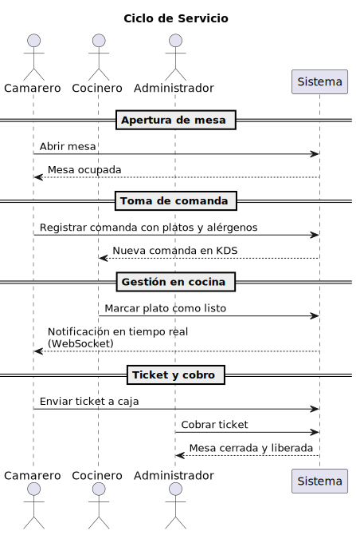
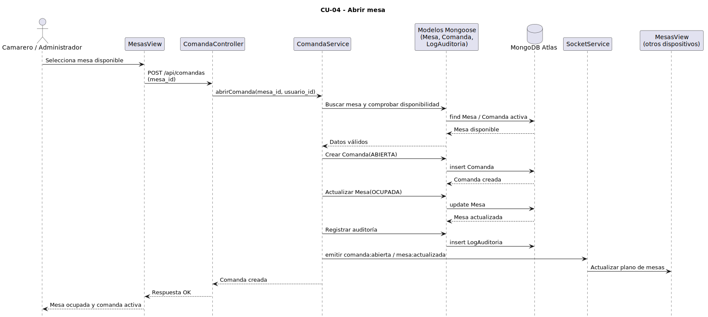
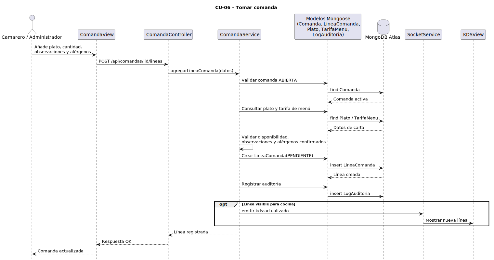
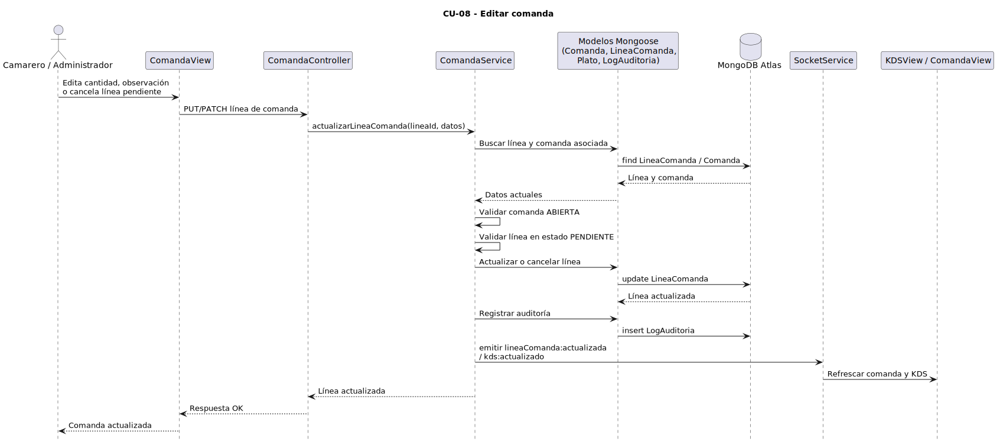
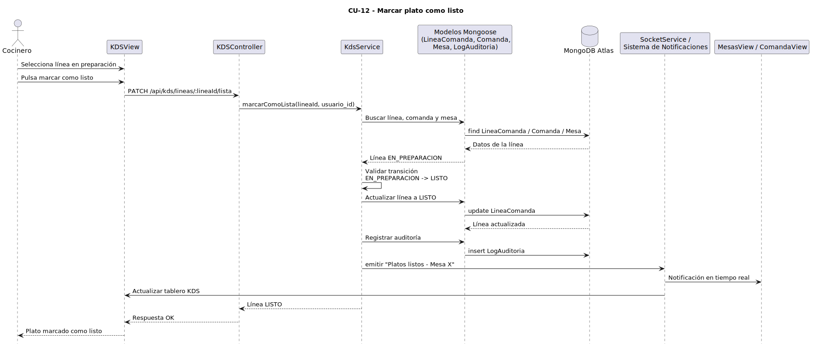
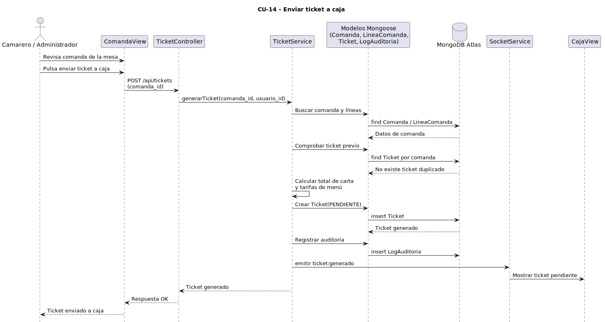
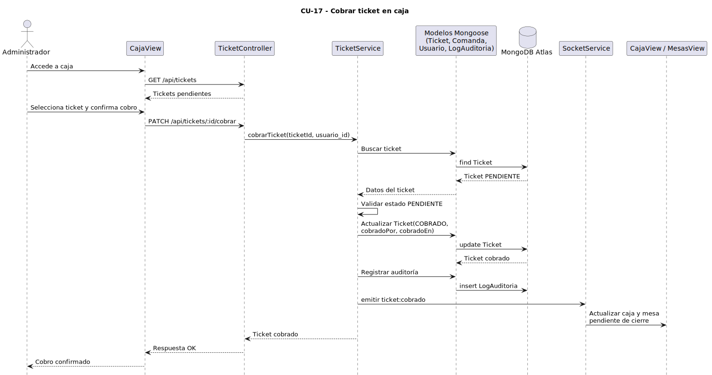
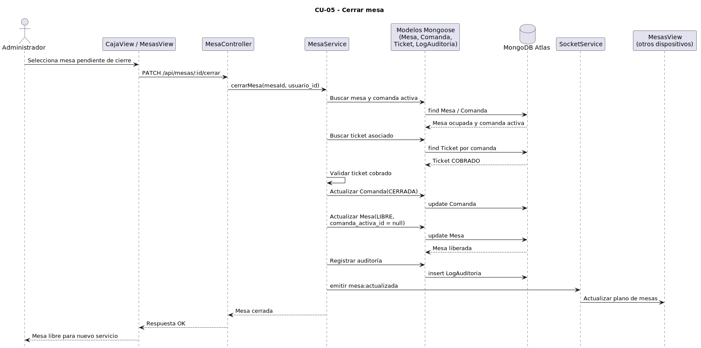

# 2.8 Diagramas de secuencia

Los diagramas de secuencia muestran el orden temporal de interacción entre los actores, las vistas y el sistema. En este capítulo se incluye un diagrama general del ciclo de servicio y, posteriormente, diagramas específicos para los casos de uso seleccionados como más representativos del MVP.

## Diagrama de secuencia general

## Diagramas de secuencia por caso de uso seleccionado

### CU-04 Abrir mesa

### CU-06 Tomar comanda

### CU-08 Editar comanda

### CU-12 Marcar plato como listo

### CU-14 Enviar ticket a caja

### CU-17 Cobrar ticket en caja

### CU-05 Cerrar mesa

[← Volver al índice del capítulo](README.md)
