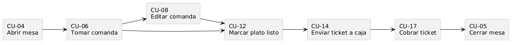

# 2.10 Selección de casos de uso para el desarrollo

Aunque el catálogo completo recoge más funcionalidades, el desarrollo y la explicación técnica del MVP se centran en los casos de uso que representan el flujo operativo principal del restaurante. Estos casos conectan sala, cocina y caja desde la llegada del cliente hasta el cierre de la mesa.

| ID | Nombre | Priorización |
|---|---|---|
| CU-04 | Abrir mesa | 🔴 Must |
| CU-06 | Tomar comanda | 🔴 Must |
| CU-08 | Editar comanda | 🔴 Must |
| CU-12 | Marcar plato como listo | 🔴 Must |
| CU-14 | Enviar ticket a caja | 🔴 Must |
| CU-17 | Cobrar ticket en caja | 🔴 Must |
| CU-05 | Cerrar mesa | 🔴 Must |

Estos casos fueron seleccionados porque permiten demostrar el valor principal del sistema: digitalizar la mesa, la comanda, la comunicación con cocina, el ticket, el cobro y la liberación final de la mesa.

[← Volver al índice del capítulo](README.md)
