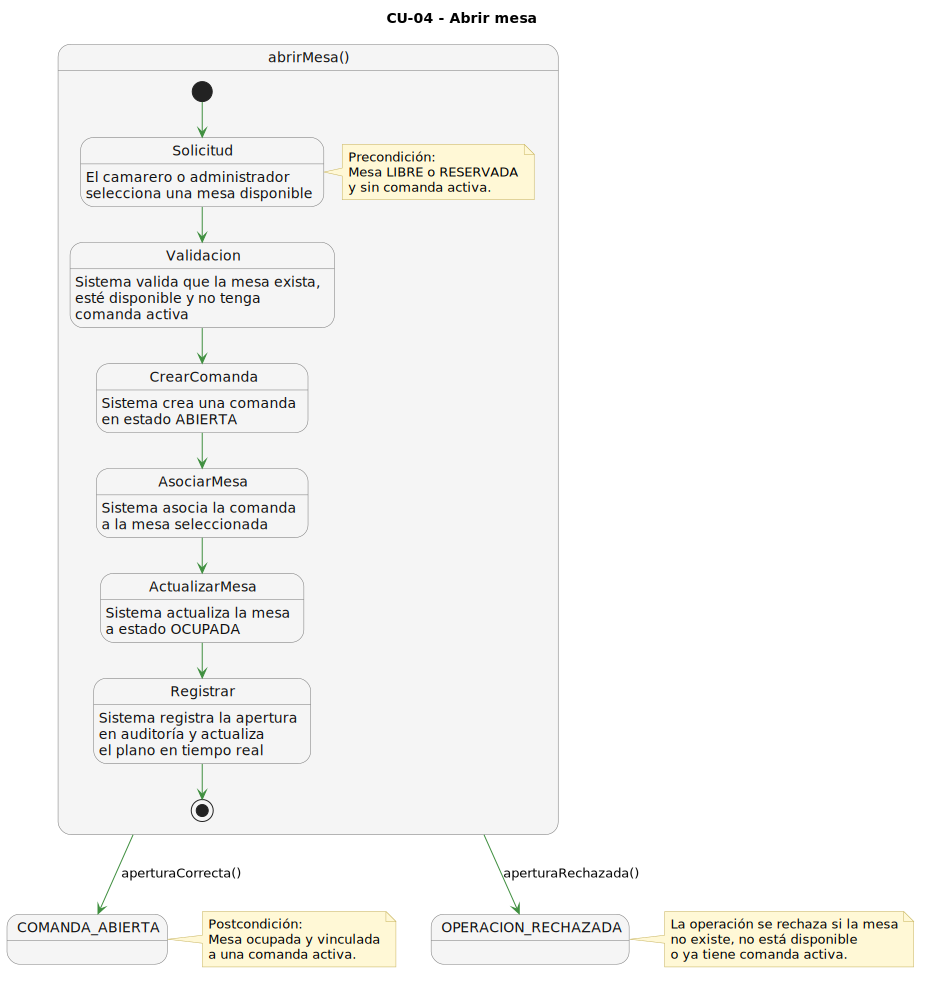
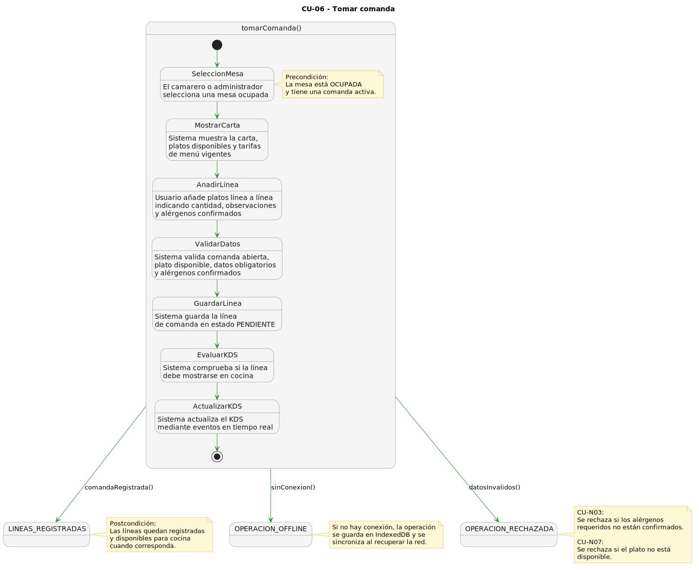
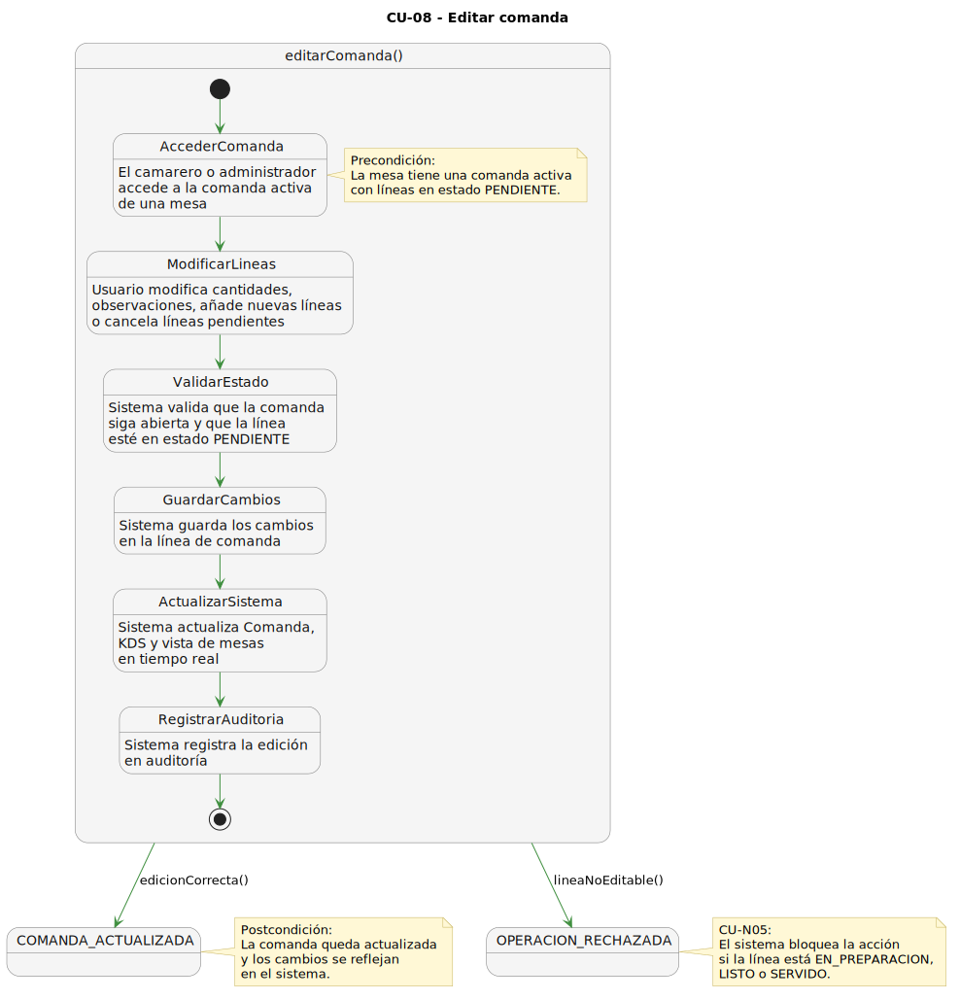
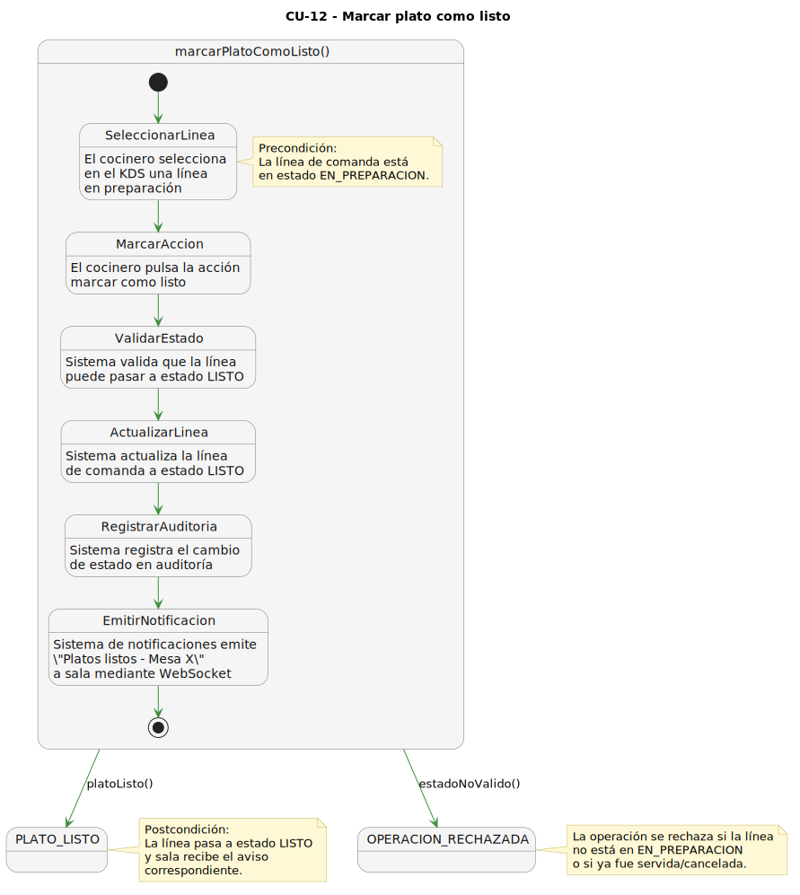
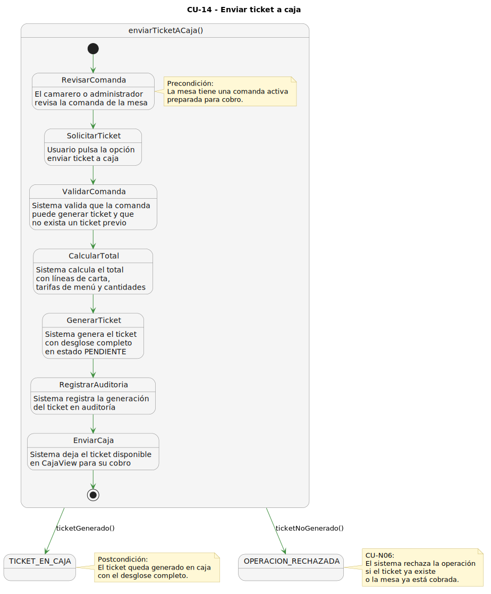
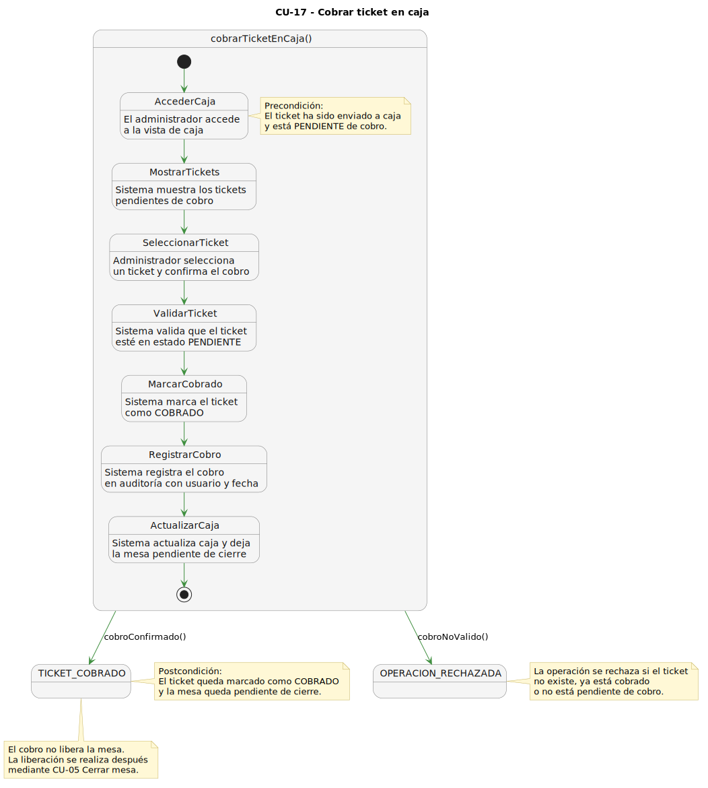
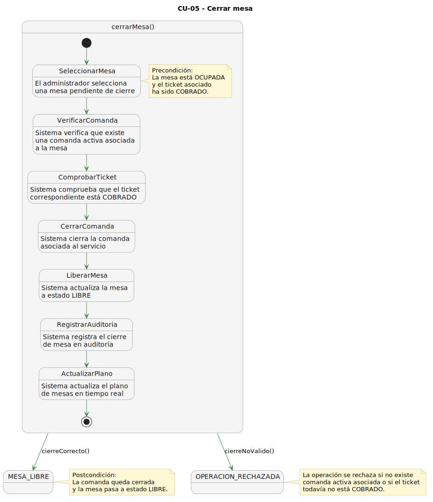

# 2.13 Diagramas de actividad de los casos de uso más importantes

Los diagramas de actividad detallan el flujo de proceso necesario para que cada caso de uso seleccionado finalice correctamente. Estos diagramas complementan la descripción textual de los casos de uso, ya que permiten visualizar decisiones, validaciones y caminos alternativos.

## CU-04 Abrir mesa

## CU-06 Tomar comanda

## CU-08 Editar comanda

## CU-12 Marcar plato como listo

## CU-14 Enviar ticket a caja

## CU-17 Cobrar ticket

## CU-05 Cerrar mesa

[← Volver al índice del capítulo](README.md)
