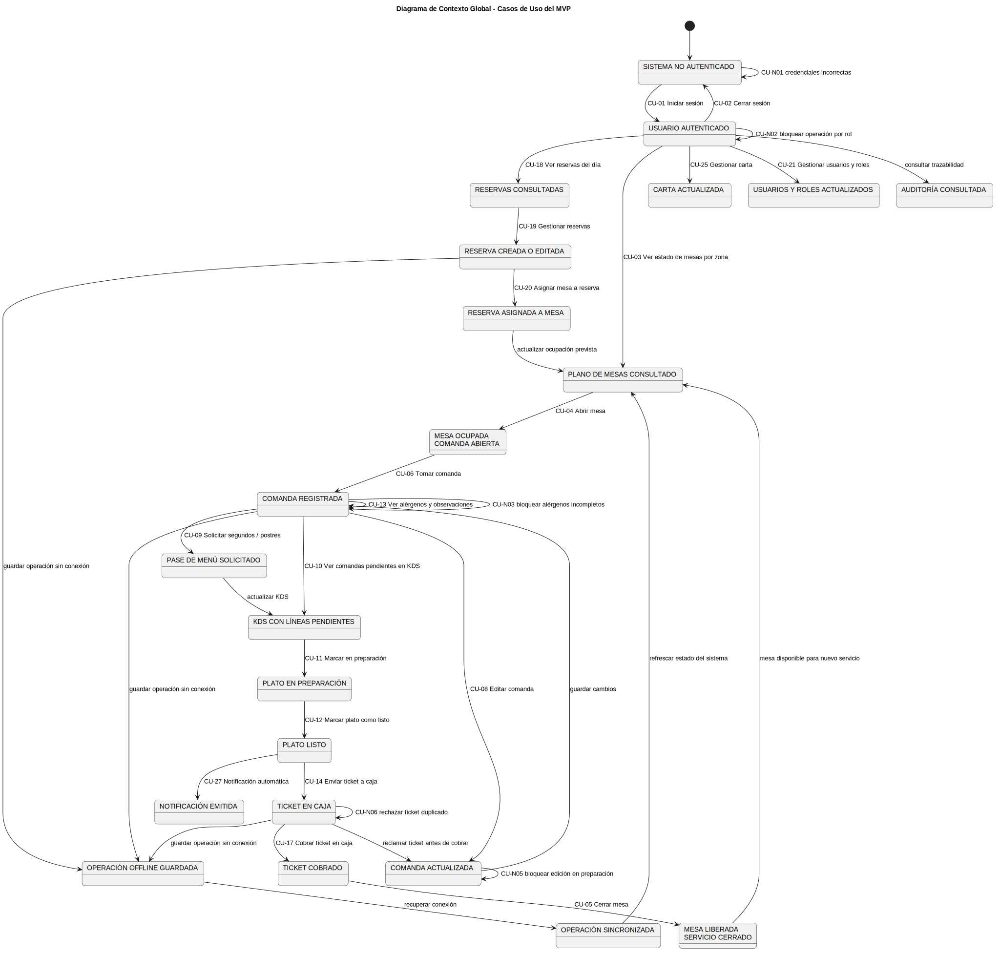
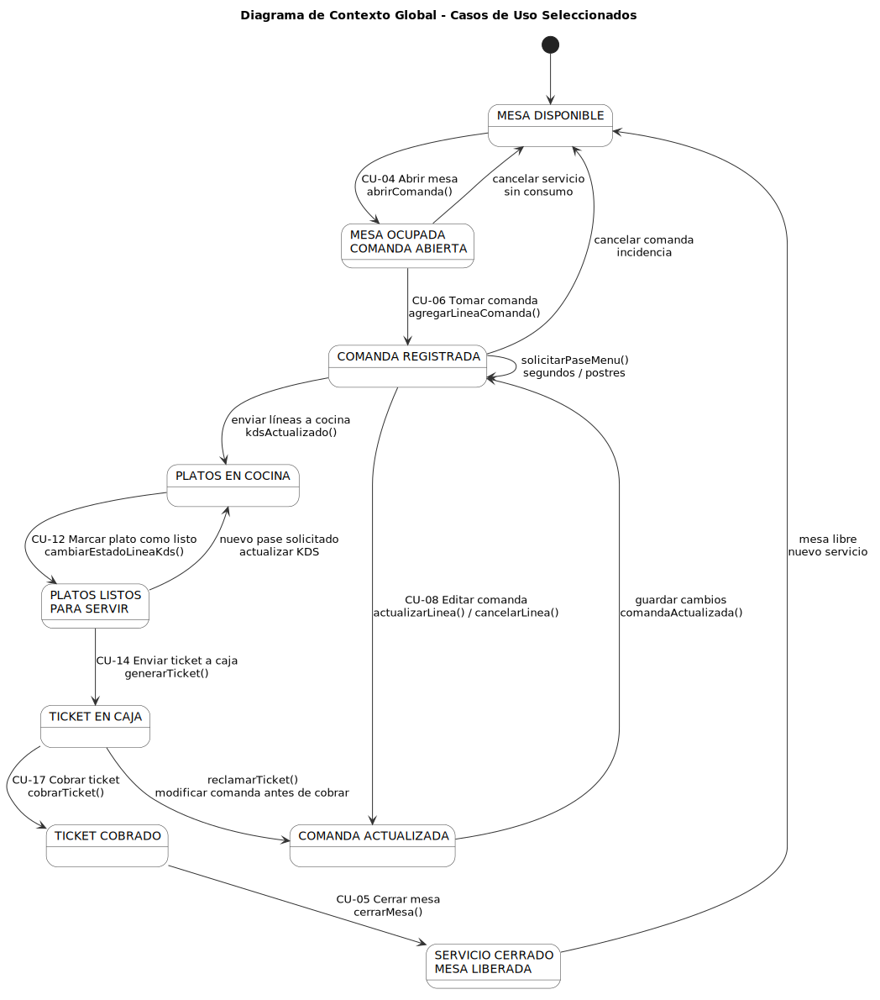

# 2.14 Diagramas de contexto

Los diagramas de contexto permiten representar el sistema desde una perspectiva global. En este capítulo se incluyen dos niveles: un contexto general de la solución y un contexto centrado en los casos de uso principales seleccionados para el MVP.

## Diagrama de contexto general

El diagrama de contexto general muestra la relación entre los actores, los dispositivos, el sistema de gestión del restaurante, la base de datos, el soporte offline y las comunicaciones en tiempo real.

## Diagrama de contexto de casos de uso principales

El diagrama de contexto de casos de uso principales muestra cómo el sistema cambia de estado a través del flujo operativo seleccionado: abrir mesa, tomar comanda, editar comanda, marcar plato como listo, enviar ticket a caja, cobrar ticket y cerrar mesa.

[← Volver al índice del capítulo](README.md)
