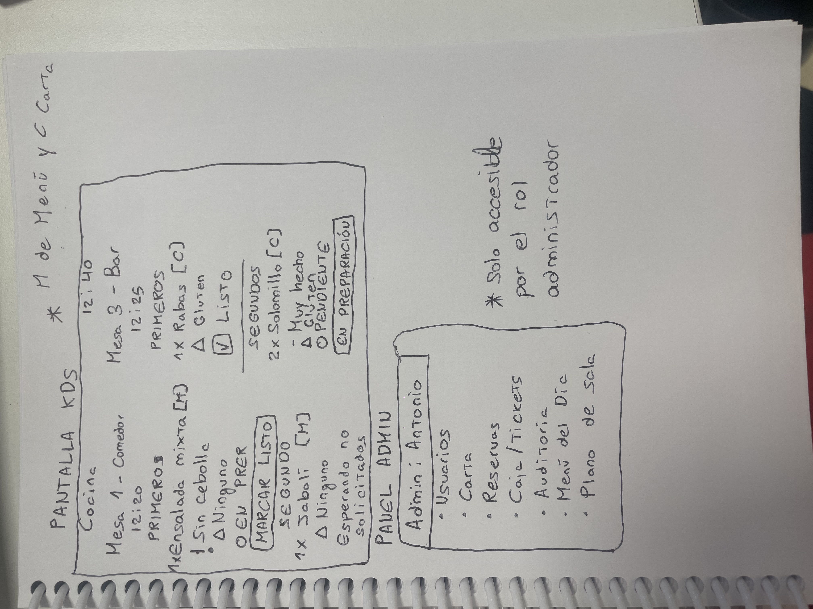
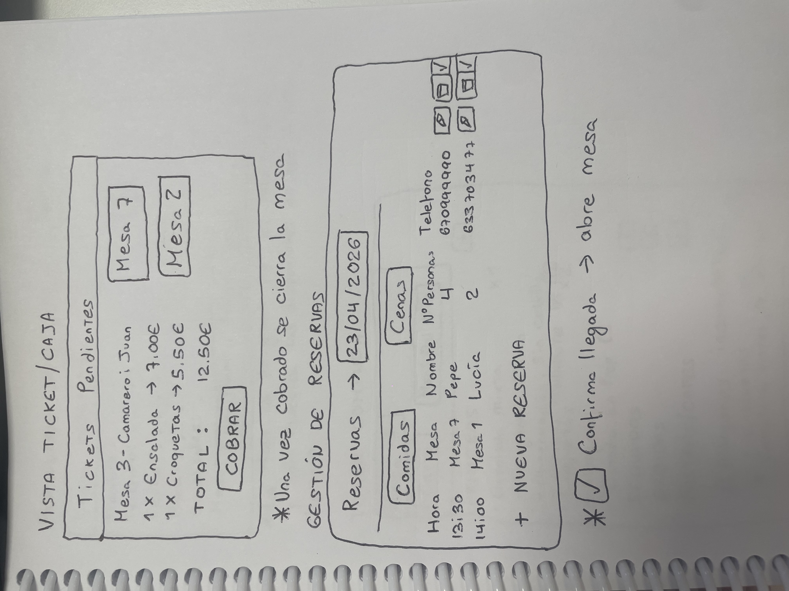
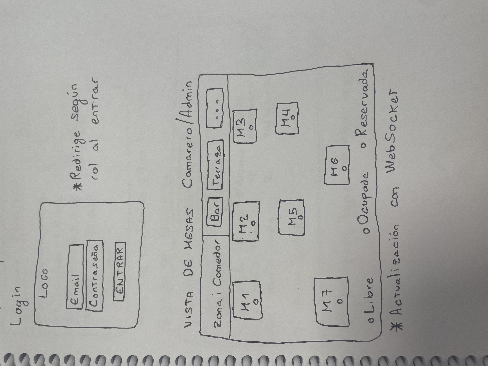
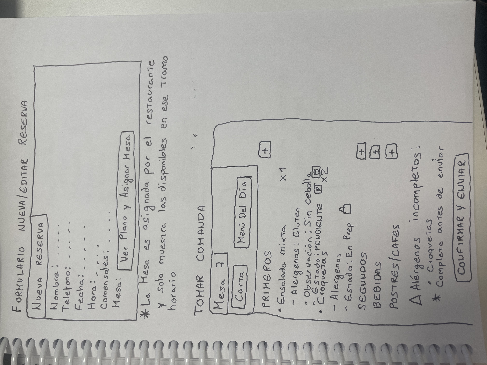

# 2.15 Bocetos y prototipos de casos de uso

Los bocetos y prototipos permiten validar de forma temprana la estructura visual de las pantallas principales antes de su implementación final. Su objetivo es comprobar que cada rol dispone de una interfaz alineada con sus responsabilidades dentro del restaurante.

## Boceto de prototipos de casos de uso

### Boceto 1 - Pantalla KDS y panel administrador

La pantalla KDS es exclusiva del Cocinero. Muestra en tiempo real las líneas de comanda pendientes, en preparación y listas, organizadas por mesa. Cada línea incluye cantidad, alérgenos destacados y observaciones.

El panel administrador permite acceder a las áreas de gestión del sistema: reservas, usuarios, carta, caja, auditoría y configuración operativa.

### Boceto 2 - Reservas

La vista de reservas permite consultar las reservas del día ordenadas por turno de servicio. Desde esta pantalla el Administrador puede crear, editar, cancelar o eliminar reservas, además de asignar mesa o zona según la disponibilidad del restaurante.

### Boceto 3 - Vista de mesas y acceso operativo

La vista de mesas es la pantalla principal del Camarero y del Administrador. Muestra las mesas agrupadas por zona, con indicadores de estado como libre, ocupada, reservada o fuera de servicio. Desde esta vista se puede abrir mesa, tomar comanda o consultar una comanda activa.

### Boceto 4 - Toma de comanda y formulario operativo

La vista de comanda permite registrar líneas con platos de carta o menú, cantidad, observaciones y alérgenos confirmados. Si los datos obligatorios no están completos, el sistema bloquea la operación. Además, una línea en preparación no puede editarse, ya que cocina ha iniciado su elaboración.

[← Volver al índice del capítulo](README.md)
