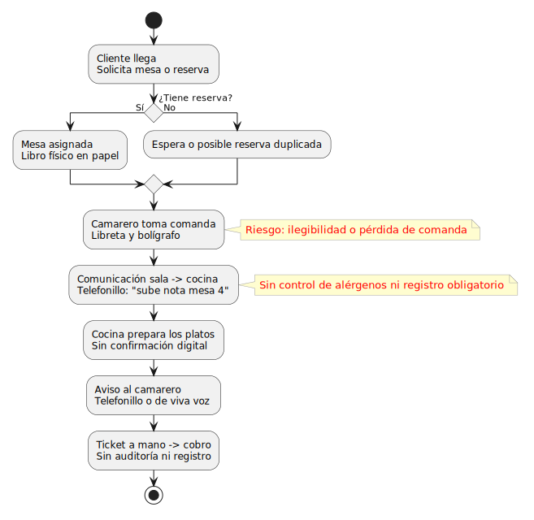
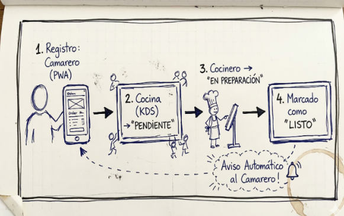

# Capítulo 1 - Introducción y contexto

## Índice del capítulo

- [1.1 Introducción](#11-introducción)
- [1.2 Marco teórico y estado del arte](#12-marco-teórico-y-estado-del-arte)
- [1.3 Fundamentos tecnológicos](#13-fundamentos-tecnológicos)
- [1.4 Matriz DAFO](#14-matriz-dafo)
- [1.5 Justificación](#15-justificación)
- [1.6 Solución propuesta](#16-solución-propuesta)
- [1.7 Objetivos general y específicos](#17-objetivos-general-y-específicos)
- [1.8 Alcance y limitaciones](#18-alcance-y-limitaciones)
- [1.9 Hipótesis y metodología](#19-hipótesis-y-metodología)

## 1.1 Introducción

El restaurante La Unión es un establecimiento familiar situado en Puente Viesgo, Cantabria, en activo desde el año 1951. El restaurante ofrece servicio de comidas con carta y menú del día, mientras que en el servicio nocturno se ofrecen únicamente raciones de carta. A efectos del sistema, el servicio nocturno se considera a partir de las 20:00.

El negocio cuenta con entre doce y catorce empleados, incluyendo cocineros, camareros y personal directivo. Debido al espacio limitado del local, el restaurante se organiza en diversas zonas: comedor, bar, terraza, plaza, mirador, balcón y escalera. Además, el alto volumen de reservas exige una coordinación constante entre sala y cocina.

Actualmente, la gestión del restaurante se basa en procedimientos analógicos. Las comandas se apuntan en libretas de camarero, las reservas se registran en un libro físico y la comunicación entre sala y cocina se realiza mediante un telefonillo, con avisos como "sube nota" o "segundos de la mesa 5 del comedor".

Estos procedimientos fueron funcionales durante décadas, pero hoy en día generan limitaciones que afectan a la experiencia del cliente, a la eficiencia del servicio y a la trazabilidad de las operaciones internas.

Por este motivo, este Trabajo de Fin de Grado propone el desarrollo de una Progressive Web App orientada a digitalizar la gestión interna del restaurante. La solución aborda los módulos de sala, comandas, cocina, reservas y caja, incorporando acceso por roles, comunicación en tiempo real y soporte offline para mantener la continuidad del servicio ante cortes puntuales de red.

## 1.2 Marco teórico y estado del arte

Los sistemas Point of Sale, conocidos como TPV, se utilizan habitualmente en la hostelería para centralizar operaciones como la gestión de mesas, comandas, caja y, en algunos casos, reservas o cocina. La mayoría de estas soluciones funcionan mediante una arquitectura cliente-servidor, en la que los dispositivos de sala dependen de un servidor central o de una plataforma en la nube para registrar y consultar la información del servicio.

Entre las soluciones comerciales más conocidas se encuentran:

- **Agora POS**. Funciona tanto en la nube como en servidor local. Dispone de módulos de mesas, comandas y caja, pero requiere intervención del proveedor para adaptaciones específicas, lo que puede suponer un coste elevado en licencias, hardware o personalización.
- **Revo XEF**. Está orientada principalmente al ecosistema iPad y basada en la nube. Es una solución intuitiva y con una interfaz cuidada, pero depende del entorno Apple y de la conectividad para trabajar con normalidad.
- **Last.app**. Integra sala, reservas y stock, pero su funcionamiento depende en gran medida de la nube. En caso de caída de Internet, algunas operaciones críticas pueden quedar limitadas.
- **Square**. Cuenta con módulo de cocina y cierto soporte offline, pero no se adapta de forma natural a restaurantes con varias zonas de servicio y numeraciones independientes por zona.
- **Oracle Simphony**. Es una plataforma completa y potente, orientada a cadenas de restauración o negocios de gran tamaño. Permite configuraciones complejas, pero su coste resulta elevado para un restaurante familiar.
- **Glop / Camarero10**. Está orientada a pequeños negocios y puede funcionar en entorno local. Tiene un coste más asumible, pero su capacidad de personalización es limitada y no contempla con suficiente flexibilidad reglas específicas como menús variables, pases de cocina o lógica propia de reservas.

Estas soluciones están pensadas para restaurantes estándar. En cambio, adaptarlas al caso concreto del Restaurante La Unión puede requerir costes adicionales, dependencia del proveedor o renunciar a parte de la operativa real del negocio.

### Comparativa de soluciones POS

| Criterio | Soluciones comerciales analizadas | La Unión App |
|---|---|---|
| Funcionamiento sin Internet | Parcial o dependiente del proveedor. | PWA con enfoque local-first e IndexedDB. |
| Notificaciones en tiempo real | Parcial según producto. | Socket.IO para avisos de cocina y reservas. |
| Varias zonas con numeración propia | Parcial o requiere configuración específica. | Entidad `Zona` adaptada al restaurante. |
| Lógica variable del menú del día | Normalmente no disponible sin personalización. | Reglas de negocio a medida. |
| Aviso de reserva próxima en mesa ocupada | No habitual. | Notificación automática mediante backend y Socket.IO. |
| Alérgenos obligatorios | Normalmente configurables, pero no siempre obligatorios. | Validación en backend y visualización en comanda/KDS. |
| Solicitud de segundos platos o postres | No habitual. | Flujo específico por pases de menú. |
| Log auditado de tickets | Disponible sobre todo en soluciones empresariales. | Auditoría con usuario y fecha. |
| Control de acceso por rol | Habitual en soluciones completas. | JWT y permisos por rol. |
| Hardware específico | Frecuente en sistemas comerciales. | Uso desde navegador en tablets o PC. |
| Coste de implantación | Medio, alto o muy alto según proveedor. | Sin licencia comercial y usando infraestructura existente. |
| Adaptación a la operativa real | Limitada por el proveedor. | Desarrollo a medida. |

### ¿Por qué esta solución y no una comercial?

En el mercado existen soluciones más completas y robustas para la gestión de restaurantes, pero ninguna se adapta perfectamente a las necesidades específicas de La Unión sin requerir modificaciones costosas o compromisos en la funcionalidad.

Los sistemas POS analizados están diseñados para un restaurante estándar. El menú del día en La Unión es variable: a veces son dos primeros, otras un único plato, o primero y segundo. Ningún POS permite configurar esta lógica de forma completamente ajustada sin modificar el producto o pagar al proveedor. Lo mismo ocurre con las zonas del restaurante: la mayoría utiliza una numeración única para todas las mesas, mientras que aquí cada zona necesita su propia organización.

A esto se suma que ningún sistema analizado calcula de forma específica cuánto tiempo queda para la próxima reserva de una mesa ocupada ni avisa al camarero con antelación. Los alérgenos tampoco se tratan con el rigor requerido para este caso: en muchos productos son un campo opcional o de texto libre, cuando deberían quedar registrados y validados en el servidor.

Por último, el registro detallado de tickets, qué usuario lo gestiona, desde qué mesa y en qué momento, suele estar disponible en soluciones empresariales de alto coste. Para un restaurante familiar, ese coste resulta difícil de justificar.

En resumen, esta solución no pretende competir con las plataformas analizadas en términos de funcionalidades globales, sino resolver exactamente el problema de este restaurante con los recursos disponibles, de forma sostenible y económica a largo plazo.

## 1.3 Fundamentos tecnológicos

### Progressive Web Apps

Una Progressive Web App (PWA) es una aplicación web que puede comportarse como una aplicación instalada en un móvil, tablet o PC. Para ello combina tecnologías web con capacidades propias de una aplicación instalable.

Los elementos principales de una PWA son:

- **Web App Manifest**. Archivo que define el nombre, icono y colores de la aplicación, y permite instalarla en la pantalla de inicio del dispositivo.
- **Service Worker**. Script que se ejecuta en segundo plano y actúa como intermediario entre la aplicación y la red. Permite cachear recursos y encolar operaciones cuando no hay conexión.
- **HTTPS**. Capa necesaria para ejecutar Service Workers de forma segura y garantizar una comunicación protegida entre cliente y servidor.

### IndexedDB

IndexedDB es una base de datos integrada en el navegador que permite guardar datos complejos de forma local. A diferencia de `localStorage`, que almacena texto simple y tiene menor capacidad, IndexedDB puede almacenar objetos JavaScript completos.

En este proyecto se utiliza para guardar operaciones pendientes de sincronización y estado local cuando existen problemas de conexión. De esta forma, el camarero puede continuar trabajando aunque haya una interrupción puntual de la red.

### Arquitectura local-first

La arquitectura local-first prioriza que la aplicación pueda seguir funcionando localmente aunque el servidor o la red no estén disponibles durante un periodo corto de tiempo.

En este proyecto, cuando un camarero registra una operación y hay conexión, la información se sincroniza directamente con el backend. Si no hay conexión, la operación queda guardada en IndexedDB y se sincroniza cuando la red vuelve a estar disponible.

### Background Sync API

La Background Sync API permite que el navegador ejecute tareas pendientes cuando recupera la conectividad. En el contexto de este proyecto, se utiliza como base conceptual para justificar que las operaciones guardadas localmente puedan enviarse posteriormente al servidor.

### WebSocket y Socket.IO

Para las notificaciones en tiempo real, como avisar al camarero de que sus platos están listos o de que una mesa tiene una reserva próxima, no basta con una petición HTTP tradicional. El servidor necesita poder enviar mensajes al cliente sin esperar a que este los solicite.

WebSocket permite crear una conexión persistente entre cliente y servidor. En el proyecto se utiliza Socket.IO, una librería que facilita esta comunicación mediante eventos con nombre, reconexión automática y gestión más sencilla de los clientes conectados.

### Autenticación con JWT y control de acceso por rol

El sistema tiene tres tipos de usuario con permisos distintos: Camarero, Cocinero y Administrador. Cada rol determina las vistas y operaciones disponibles dentro de la aplicación.

La autenticación se realiza mediante JWT. Un JWT es un token firmado que contiene la identidad del usuario y su rol. El servidor lo genera cuando el usuario inicia sesión y el cliente lo incluye en las peticiones posteriores a la API. De esta forma, el backend puede comprobar quién realiza cada operación y si tiene permisos para ejecutarla.

El control de acceso se implementa en el backend mediante middleware de Express. Este middleware valida el token JWT y comprueba el rol del usuario antes de permitir el acceso a cada ruta protegida. Por ejemplo, un camarero puede abrir mesas y tomar comandas, el cocinero puede trabajar sobre el KDS, y el cobro de tickets queda restringido al rol Administrador.

### Kitchen Display System

Un Kitchen Display System (KDS) es una pantalla digital en cocina que sustituye a los tickets de papel. Cuando el camarero registra una comanda, el sistema la envía automáticamente a la pantalla de cocina, donde el cocinero puede verla y cambiar su estado.

El flujo funciona así:

1. El camarero registra la comanda desde su dispositivo.
2. El pedido aparece en la pantalla de cocina como pendiente.
3. El cocinero lo pone en preparación.
4. Cuando está listo, lo marca como listo y el camarero recibe un aviso automático.

Los sistemas KDS más avanzados permiten redirigir pedidos a distintas zonas de cocina, usar colores para indicar tiempos de espera y generar métricas de rendimiento. En este proyecto, la funcionalidad KDS se implementa como una vista de la propia aplicación web, accesible desde cualquier dispositivo con navegador, lo que elimina la necesidad de comprar hardware específico.

### Gestión digital de reservas

Los sistemas de reservas digitales resuelven problemas del libro en papel: eliminan reservas duplicadas, centralizan la información y permiten ver el estado de cada mesa en vivo.

Plataformas como TheFork Manager, Cover Manager o ZenChef ofrecen funcionalidades avanzadas, pero no contemplan la lógica específica que necesita La Unión: calcular cuánto tiempo queda hasta la próxima reserva de una mesa concreta y avisar al camarero con antelación cuando esa mesa sigue ocupada.

### Gestión de alérgenos

El Reglamento (UE) Nº 1169/2011 obliga a informar sobre los alérgenos presentes en los alimentos servidos en restaurantes. No cumplirlo puede tener consecuencias legales para el establecimiento y poner en riesgo la salud de los clientes.

En el sistema analógico actual, los alérgenos pueden comunicarse mediante anotaciones manuales, con riesgo de pérdida o ilegibilidad. En el sistema propuesto, los alérgenos y observaciones quedan registrados en la comanda y son visibles para cocina, reduciendo el riesgo operativo.

## 1.4 Matriz DAFO

Este análisis permite fundamentar la transición entre el modelo analógico y el modelo digital.

| Fortalezas | Debilidades |
|---|---|
| Establecimiento con gran reputación y en activo desde 1951. | Falta de registros digitales de tickets. |
| Personal con amplia experiencia y conocimiento del funcionamiento real del restaurante. | Métodos obsoletos e ineficiencias derivadas de errores humanos. |

| Oportunidades | Amenazas |
|---|---|
| Bajo coste de implantación al utilizar recursos ya disponibles como red local, PC y tablets. | Riesgos de seguridad alimentaria por posibles fallos en la gestión de alérgenos. |
| Independencia de proveedores externos y de sus costes. | Riesgo de quedar rezagado frente a restaurantes cercanos con atención más ágil. |
| Arquitectura local-first para mantener la operativa ante fallos de red. | Pérdidas de tickets que afectan a facturación diaria y caja. |

## 1.5 Justificación

La experiencia directa del autor en el sector hostelero ha permitido identificar ineficiencias críticas del modelo de gestión actual. Entre los problemas más recurrentes destacan la duplicidad o pérdida de reservas físicas, la dificultad para coordinar el doblaje de mesas en turnos consecutivos y los errores de comunicación derivados de comandas manuscritas.

También se ha detectado que el uso de sistemas tradicionales de comunicación interna resulta ineficiente, ya que obliga al camarero a interrumpir el flujo de servicio para transmitir información que podría actualizarse de forma digital y automática.

Frente a soluciones comerciales que pueden resultar costosas o rígidas, se plantea el desarrollo de una aplicación a medida diseñada específicamente para los requisitos del Restaurante La Unión. Esta decisión se fundamenta en tres pilares:

- **Adaptabilidad operativa**. La lógica del software se ajusta a la operativa real del negocio, incluyendo zonas, mesas, menús variables, comandas por pases y turnos de servicio.
- **Resiliencia tecnológica**. La arquitectura local-first permite mantener las operaciones principales ante fallos puntuales de conectividad.
- **Control y auditoría**. El sistema registra acciones relevantes y centraliza información crítica como alérgenos, observaciones, cambios de comanda, tickets y cobros.

## 1.6 Solución propuesta

La solución propuesta consiste en desarrollar una PWA orientada a la gestión interna del Restaurante La Unión. La aplicación contempla tres perfiles de usuario diferenciados: Administrador, Cocinero y Camarero. Además, incorpora un sistema automático de notificaciones como componente interno encargado de avisar de platos listos y reservas próximas sobre mesas ocupadas.

Los camareros podrán gestionar mesas por zonas, tomar comandas digitales, registrar cantidades, observaciones y alérgenos confirmados, solicitar segundos platos o postres cuando corresponda y enviar tickets a caja.

Los cocineros dispondrán de una pantalla KDS que muestra líneas de comanda pendientes, en preparación y listas, destacando observaciones y alérgenos. También podrán marcar los platos como listos para que sala reciba la actualización correspondiente.

Los administradores tendrán acceso a la gestión de reservas, usuarios, carta, caja y registros de auditoría. El cobro de tickets queda reservado a este perfil y el cierre de mesa se realiza como una acción posterior al cobro.

Desde un enfoque técnico, la arquitectura seguirá un enfoque local-first. Cada dispositivo podrá guardar localmente operaciones pendientes y sincronizarlas con el servidor cuando la red esté disponible. De esta forma se mejora la continuidad del servicio ante interrupciones puntuales de conectividad.

## 1.7 Objetivos general y específicos

### Objetivo general

El objetivo principal del proyecto es desarrollar una Progressive Web App con arquitectura local-first que digitalice la gestión operativa del Restaurante La Unión. La aplicación cubrirá los módulos de comandas, cocina (KDS), reservas, mesas, caja y auditoría, con acceso diferenciado según el rol del usuario y capacidad para mantener las operaciones principales ante fallos puntuales de conectividad.

### Objetivos específicos

- **Objetivo específico I: Requisitos.** Recopilar, mediante entrevistas con el cliente, un catálogo de al menos 20 casos de uso validados, incluyendo requisitos funcionales y no funcionales numerados, y una tabla de priorización MoSCoW que delimite el alcance del MVP.
- **Objetivo específico II: Análisis y diseño.** Elaborar los artefactos de diseño del sistema: modelo entidad-relación con al menos 8 entidades, diseño de la API REST con el contrato de cada endpoint, esquema de eventos WebSocket, diagrama de arquitectura y prototipos de interfaz por rol.
- **Objetivo específico III: MVP.** Implementar un MVP que cubra el 100 % de los casos de uso clasificados como Must-have, con la arquitectura local-first en funcionamiento, autenticación JWT activa y notificaciones por WebSocket validadas en la red local del restaurante.

## 1.8 Alcance y limitaciones

### ¿Qué cubre el sistema?

El sistema cubre la operativa diaria identificada con el cliente para el MVP:

- Gestión de mesas por zona y visualización de su estado.
- Comandas digitales con lógica de carta y menú del día.
- Confirmación de alérgenos declarados y registro obligatorio de observaciones en líneas de comanda.
- Pantalla KDS para cocina con estados de línea: pendiente, en preparación, listo y servido.
- Solicitud de segundos platos o postres desde sala hacia cocina cuando corresponda.
- Notificaciones en tiempo real cuando los platos están listos.
- Gestión de reservas con asignación de mesa o zona y número de comensales.
- Aviso automático de reserva próxima sobre una mesa ocupada.
- Generación, cobro y control de tickets con registro de auditoría.
- Cobro en caja restringido al rol Administrador.
- Control de acceso diferenciado por rol.
- Funcionamiento de operaciones principales ante fallos puntuales de la red local.

### ¿Qué no cubre el sistema?

Las siguientes funcionalidades quedan fuera del alcance de este proyecto:

- Portal de cliente y carta digital pública, ya que el sistema es una herramienta de gestión interna.
- Integración con plataformas de delivery.
- Gestión completa de inventario de materias primas y proveedores.
- Contabilidad completa del negocio.
- Aplicación nativa iOS/Android.
- Gestión de personal y turnos.

## 1.9 Hipótesis y metodología

### Hipótesis

El desarrollo de una PWA con arquitectura local-first, autenticación basada en JWT, notificaciones en tiempo real mediante WebSocket y un modelo de datos ajustado a la operativa del Restaurante La Unión permitirá digitalizar la gestión interna del establecimiento.

Con ello se reducirán los problemas derivados del sistema analógico actual y se favorecerá que operaciones críticas, como el registro de alérgenos o el seguimiento de tickets, queden registradas incluso ante interrupciones puntuales de la red local.

### Metodología

El proyecto adopta una metodología iterativa e incremental con un cliente real. El ciclo de vida se basa en un RUP simplificado combinado con prácticas ágiles, organizado en cuatro fases:

- **Fase de inicio (Capítulo 2).** Entrevistas con el cliente, extracción de requisitos, elaboración del catálogo de casos de uso y tabla MoSCoW. La fase concluye cuando el cliente valida los requisitos recogidos.
- **Fase de elaboración (Capítulo 3).** Traducción de los requisitos en decisiones de diseño concretas: modelo de datos, API REST, eventos WebSocket, arquitectura del sistema y prototipos de interfaz.
- **Fase de construcción (Capítulo 4).** Implementación iterativa del MVP, priorizando los casos de uso Must-have. Cada iteración genera software funcional que puede ser validado de forma incremental.
- **Fase de transición (Capítulo 5).** Evaluación de los resultados obtenidos frente a la hipótesis planteada, análisis de las limitaciones encontradas y propuesta de líneas de trabajo futuro.

| Fase | Capítulo | Resultado principal |
|---|---|---|
| Inicio | Capítulo 2 | Catálogo de requisitos y priorización MoSCoW. |
| Elaboración | Capítulo 3 | Artefactos de diseño. |
| Construcción | Capítulo 4 | MVP funcional validado. |
| Transición | Capítulo 5 | Conclusiones y líneas futuras. |

[← Volver al índice general](../README.md)
