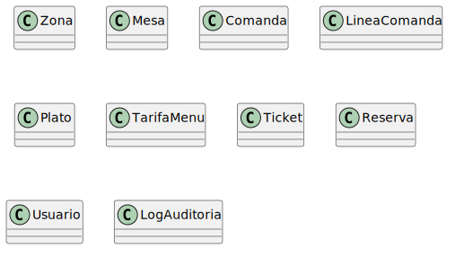
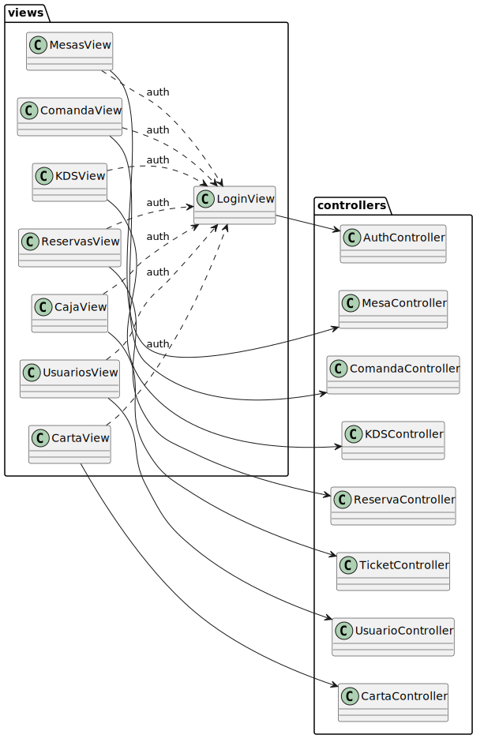
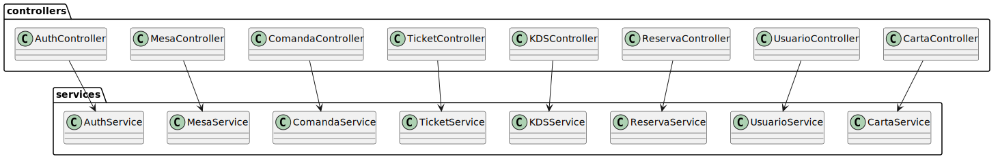

# 3.2 Análisis Modelo-Vista-Controlador

El análisis Modelo-Vista-Controlador permite explicar cómo se separan las responsabilidades principales del sistema. En el proyecto no se implementa un MVC clásico puro, ya que la aplicación utiliza React en el frontend y Express en el backend, pero sí se mantiene una separación lógica entre vistas, controladores, servicios y modelos.

## Modelos

Los modelos representan las entidades centrales del sistema y su estructura en la base de datos. Se han implementado con Mongoose sobre MongoDB, lo que permite definir esquemas flexibles y adaptados a la operativa real del restaurante.

| Modelo | Responsabilidad |
|---|---|
| `Usuario` | Almacena credenciales, rol de acceso y estado del usuario. |
| `Zona` | Identifica las áreas físicas del restaurante. |
| `Mesa` | Registra número, zona, estado y comanda activa. |
| `Comanda` | Agrupa el pedido activo asociado a una mesa. |
| `LineaComanda` | Representa cada plato solicitado con cantidad, observaciones, alérgenos y estado. |
| `Plato` | Define la carta disponible. |
| `TarifaMenu` | Gestiona precios y configuración del menú del día. |
| `Ticket` | Resume el importe del servicio y su estado de cobro. |
| `Reserva` | Modela la ocupación futura de una mesa. |
| `LogAuditoria` | Conserva la trazabilidad de acciones relevantes. |
| `OperacionOffline` | Registra operaciones pendientes de sincronización. |

Los diagramas entidad-relación reflejan cómo estas entidades se relacionan entre sí en flujos como la toma de comanda, el envío del ticket a caja, la gestión de reservas y la sincronización offline.

## Vistas

Las vistas constituyen la capa de presentación y se adaptan al rol autenticado en cada sesión. La aplicación se ha planteado como una PWA orientada a tablet, de modo que cada usuario visualiza únicamente las funciones correspondientes a sus permisos.

Existen vistas compartidas entre Camarero y Administrador, como el plano de mesas, la consulta y edición de comandas y el envío de tickets a caja. El Cocinero accede a la vista KDS, donde visualiza en tiempo real las líneas pendientes y en preparación. El Administrador dispone además de vistas exclusivas para reservas, usuarios, carta, menú del día, caja y auditoría.

## Controladores

Los controladores actúan como punto de entrada de la API REST para los distintos recursos del sistema. Su función principal es recibir las peticiones HTTP, extraer los parámetros necesarios, aplicar las validaciones y permisos definidos en las rutas y delegar la lógica de negocio en la capa de servicios.

| Controlador | Responsabilidad principal |
|---|---|
| `AuthController` | Gestiona inicio de sesión, tokens JWT, cierre de sesión y bloqueo por intentos fallidos. |
| `MesaController` | Controla consulta, actualización, cierre y liberación de mesas. |
| `ComandaController` | Gestiona creación de comandas, líneas, edición, cancelación y pases de menú. |
| `TicketController` | Centraliza generación, consulta, cobro, reclamación y cancelación de tickets. |
| `KDSController` | Permite consultar líneas visibles en cocina y actualizar su estado. |
| `ReservaController` | Administra creación, consulta, edición, asignación de mesa y estado de reservas. |
| `UsuarioController` | Gestiona alta, consulta, edición, contraseñas, desbloqueo y eliminación de usuarios. |
| `CartaController` | Permite administrar platos, disponibilidad, alérgenos y tarifas de menú. |

[← Volver al índice del capítulo](README.md)
