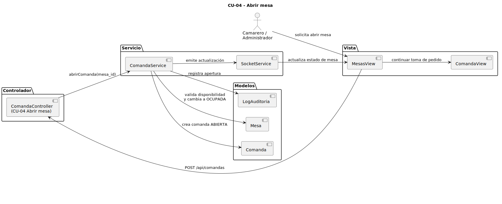
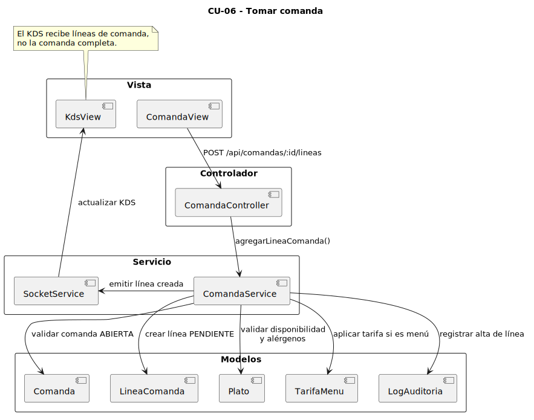
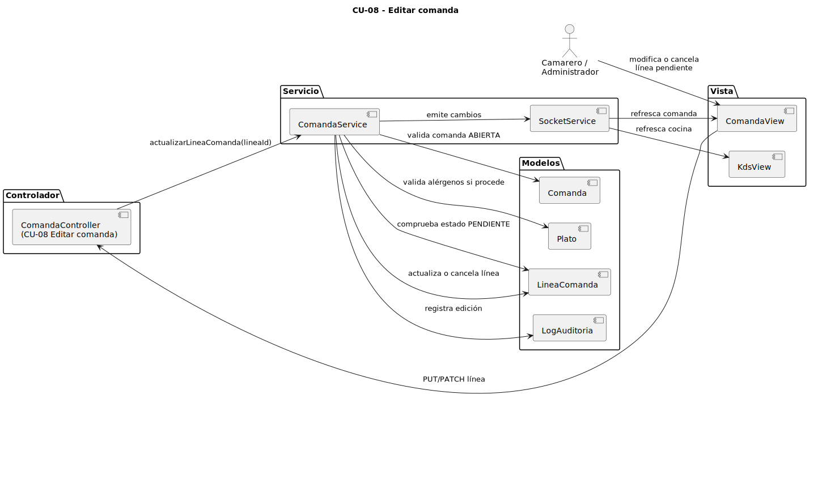
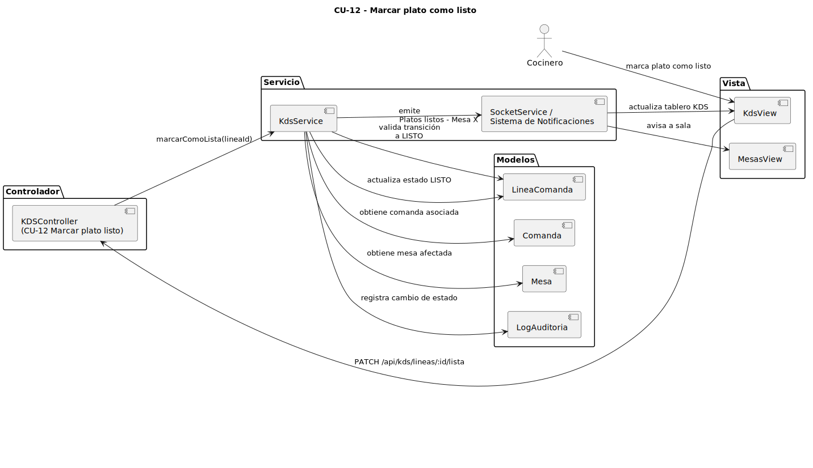
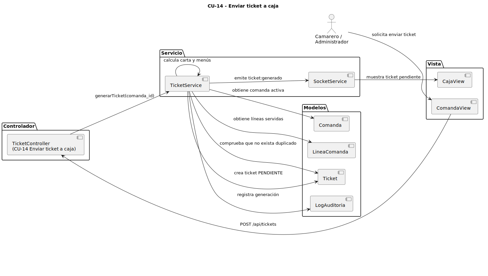
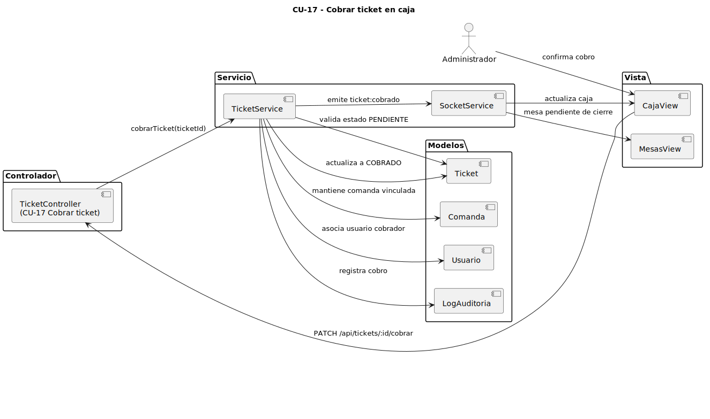
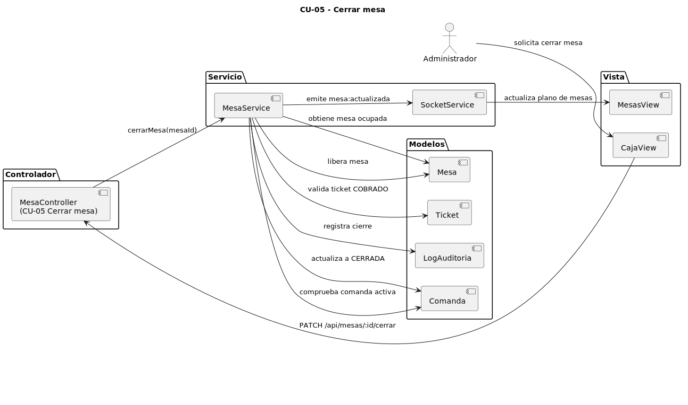

# 3.4 Casos de uso seleccionados mediante MVC

En este apartado se documenta cómo los casos de uso principales atraviesan las capas del sistema. En cada caso, el actor inicia la acción desde una vista, el controlador recibe la petición, el servicio aplica la regla de negocio y el modelo persiste o consulta la información necesaria.

## CU-04. Abrir mesa

Este diagrama muestra cómo se inicia el servicio de una mesa. La acción parte de la vista de mesas, pero técnicamente se resuelve mediante `ComandaController` y `ComandaService`, ya que abrir una mesa implica crear una comanda activa asociada. El servicio valida que la mesa esté disponible, actualiza su estado y registra la acción en auditoría.

## CU-06. Tomar comanda

El diagrama representa el alta de líneas de comanda desde `ComandaView`. La operación se envía a `ComandaController` y la lógica se resuelve en `ComandaService`, donde se valida que la comanda esté abierta, que el plato esté disponible, que los alérgenos estén confirmados y que, en caso de menú, se aplique la tarifa correspondiente. El KDS se actualiza mediante eventos en tiempo real.

## CU-08. Editar comanda

Este diagrama recoge la edición o cancelación de líneas de comanda. La lógica principal consiste en comprobar que la comanda siga abierta y que la línea esté en estado pendiente. Si cocina ya ha iniciado la preparación, el backend bloquea la modificación para evitar cambios tardíos sobre platos ya trabajados.

## CU-12. Marcar plato como listo

El diagrama muestra el flujo desde `KdsView` cuando cocina marca un plato como listo. La operación se realiza sobre una línea de comanda, no sobre la comanda completa. `KdsService` valida la transición de estado, registra la acción y emite la notificación correspondiente para que sala pueda servir el plato.

## CU-14. Enviar ticket a caja

Este diagrama representa la generación del ticket desde `ComandaView`. `TicketService` obtiene la comanda y sus líneas, calcula el total y crea un ticket en estado pendiente. La operación no implica cobro ni cierre de mesa, sino que deja el ticket disponible en `CajaView` para su gestión posterior.

## CU-17. Cobrar ticket en caja

El diagrama muestra el cobro de un ticket pendiente desde `CajaView`. `TicketService` valida que el ticket pueda cobrarse, registra el usuario que realiza la acción y cambia el estado del ticket a cobrado. Este paso no libera la mesa automáticamente, sino que la deja pendiente del cierre posterior.

## CU-05. Cerrar mesa

Este diagrama representa el último paso del flujo operativo. `MesaService` comprueba que la mesa tenga una comanda activa y que el ticket asociado ya haya sido cobrado. Solo entonces cierra la comanda, libera la mesa y actualiza la vista de mesas para que pueda utilizarse en un nuevo servicio.

[← Volver al índice del capítulo](README.md)
