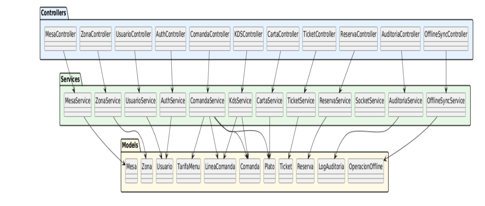

# 3.5 Diagrama de clases de diseño

El diagrama de clases de diseño representa la organización lógica del backend en controladores, servicios y modelos. Aunque la implementación está desarrollada en JavaScript mediante módulos y funciones exportadas, el diagrama permite visualizar las responsabilidades principales de cada capa y la relación entre ellas.

Los controladores actúan como punto de entrada de la API REST. Reciben las peticiones HTTP, extraen los parámetros necesarios y delegan la lógica funcional en los servicios. El acceso a estas rutas queda protegido mediante middleware de autenticación JWT, control de roles y validación de datos.

La capa de servicios concentra la lógica de negocio del sistema. En ella se implementan reglas como la apertura de mesas, la gestión de líneas de comanda, los pases de menú, los cambios de estado en cocina, la generación y cobro de tickets, la gestión de reservas, la auditoría y la sincronización offline.

Finalmente, los modelos Mongoose representan las entidades persistentes del sistema y permiten estructurar los datos almacenados en MongoDB Atlas.

## Capa de controladores

| Controlador | Métodos principales |
|---|---|
| `AuthController` | `iniciarSesion()`, `refrescarSesion()`, `obtenerPerfil()`, `cerrarSesion()` |
| `MesaController` | `listar()`, `obtenerPorId()`, `obtenerComandaActiva()`, `crear()`, `actualizar()`, `cerrar()` |
| `ComandaController` | `abrir()`, `listar()`, `obtenerPorId()`, `agregarLinea()`, `actualizarLinea()`, `cancelarLinea()`, `solicitarPase()` |
| `KDSController` | `listar()`, `cambiarEstado()`, `iniciar()`, `marcarComoLista()`, `marcarComoServida()` |
| `TicketController` | `generar()`, `listar()`, `obtenerPorId()`, `cobrar()`, `cancelar()`, `reclamar()` |
| `ReservaController` | `crear()`, `listar()`, `listarDelDia()`, `actualizar()`, `asignarMesa()`, `cambiarEstado()` |
| `UsuarioController` | `crear()`, `listar()`, `obtenerPorId()`, `actualizar()`, `actualizarPassword()`, `desbloquear()` |
| `CartaController` | `listarPlatos()`, `crearPlatoController()`, `actualizarPlatoController()`, `listarTarifasMenu()` |
| `AuditoriaController` | `listar()` |
| `OfflineSyncController` | `registrarOperacion()`, `listarPendientes()`, `sincronizarPendientes()`, `listarHistorial()` |
| `ZonaController` | `crear()`, `listar()`, `actualizar()`, `eliminar()` |

## Capa de servicios

- `AuthService` y `UsuarioService` gestionan autenticación, sesión, usuarios y control de acceso.
- `MesaService`, `ComandaService`, `KdsService` y `TicketService` implementan el flujo operativo de sala, cocina y caja.
- `CartaService` y `TarifaMenu` gestionan platos, disponibilidad, alérgenos y precios de menú.
- `ReservaService` y `ZonaService` permiten organizar las mesas por zonas y controlar reservas.
- `SocketService` y `NotificacionService` emiten eventos en tiempo real, como platos listos o reservas próximas.
- `OfflineSyncService` registra y sincroniza operaciones pendientes cuando se recupera la conexión.
- `AuditoriaService` registra acciones relevantes para mantener trazabilidad.

## Relación entre capas

La arquitectura sigue un flujo unidireccional: los controladores delegan en los servicios y los servicios operan sobre los modelos de Mongoose. Esta estructura reduce el acoplamiento, mejora la mantenibilidad y facilita que cada capa pueda evolucionar de forma independiente.

[← Volver al índice del capítulo](README.md)
