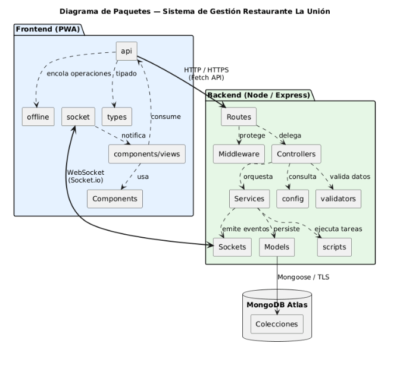

# 3.6 Análisis de paquetes

El sistema se ha diseñado bajo una arquitectura modular que separa claramente el cliente frontend del servidor backend. Esta organización permite reducir el acoplamiento entre la interfaz, la lógica de negocio y la persistencia de datos. De esta forma, los cambios en las vistas pueden realizarse sin modificar directamente las reglas de negocio, y las validaciones del servidor se mantienen centralizadas en una capa independiente.

## Estructura del backend

El backend organiza sus paquetes siguiendo el flujo habitual de una petición HTTP:

| Paquete | Responsabilidad |
|---|---|
| `routes` | Declaran los endpoints REST de cada recurso y aplican middleware de autenticación, autorización por rol y validación. |
| `middleware` | Contiene la autenticación mediante JWT, el control de roles, la validación de peticiones y el tratamiento centralizado de errores. |
| `controllers` | Reciben las peticiones HTTP, extraen los datos necesarios y delegan la operación en la capa de servicios. |
| `services` | Implementan la lógica de negocio principal: abrir mesa, editar comanda, cambiar estados en cocina, generar tickets o cerrar mesa. |
| `models` | Definen los esquemas Mongoose utilizados para persistir la información en MongoDB Atlas. |
| `validators` | Agrupan los esquemas de validación de entrada para evitar que lleguen datos incorrectos a la lógica de negocio. |
| `sockets` | Gestionan la comunicación en tiempo real mediante Socket.IO. |
| `config` | Centraliza configuración de entorno, conexión con MongoDB e inicialización de Socket.IO. |
| `scripts` | Contiene utilidades de seed, reset de base de datos y pruebas de endpoints. |

## Estructura del frontend

El frontend organiza sus paquetes alrededor de la experiencia PWA y de las vistas principales del sistema:

| Paquete | Responsabilidad |
|---|---|
| `api` | Centraliza llamadas HTTP al backend e incluye el token JWT en las peticiones autenticadas. |
| `components` | Contiene componentes reutilizables de interfaz y elementos comunes de la aplicación. |
| `components/views` | Agrupa vistas funcionales como sala, comanda, KDS, caja, reservas, carta, usuarios, auditoría y offline. |
| `offline` | Implementa soporte local-first mediante IndexedDB, almacenando operaciones pendientes y estado local ante cortes de conexión. |
| `socket` | Contiene el cliente Socket.IO utilizado para recibir eventos en tiempo real desde el backend. |
| `types` | Define tipos TypeScript utilizados por las vistas y la comunicación con la API. |

[← Volver al índice del capítulo](README.md)
