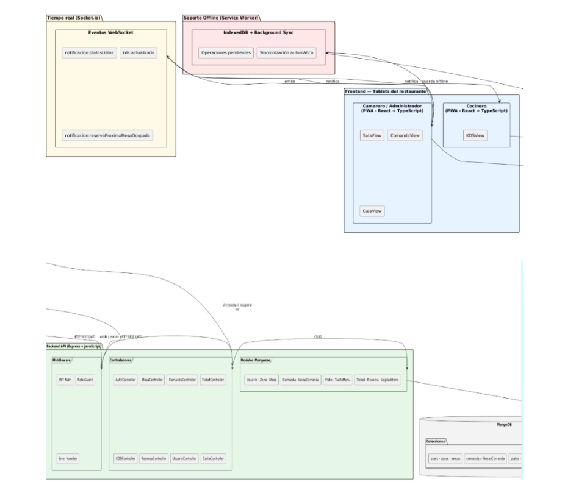

# 3.8 Diagrama general del sistema

El sistema se organiza en cuatro bloques principales: frontend, backend, comunicación en tiempo real y soporte offline. El frontend se desarrolla como una PWA con React y TypeScript, utilizada desde los dispositivos de sala, cocina y administración. El backend se implementa con Express y JavaScript, utilizando Mongoose como ODM para trabajar con MongoDB.

La comunicación en tiempo real se gestiona mediante Socket.IO, lo que permite actualizar sala, KDS y caja cuando cambian mesas, comandas o tickets. Por último, el soporte offline se apoya en el Service Worker e IndexedDB, donde se almacenan operaciones pendientes y estado local para mantener la continuidad del servicio ante cortes temporales de conexión.

[← Volver al índice del capítulo](README.md)
