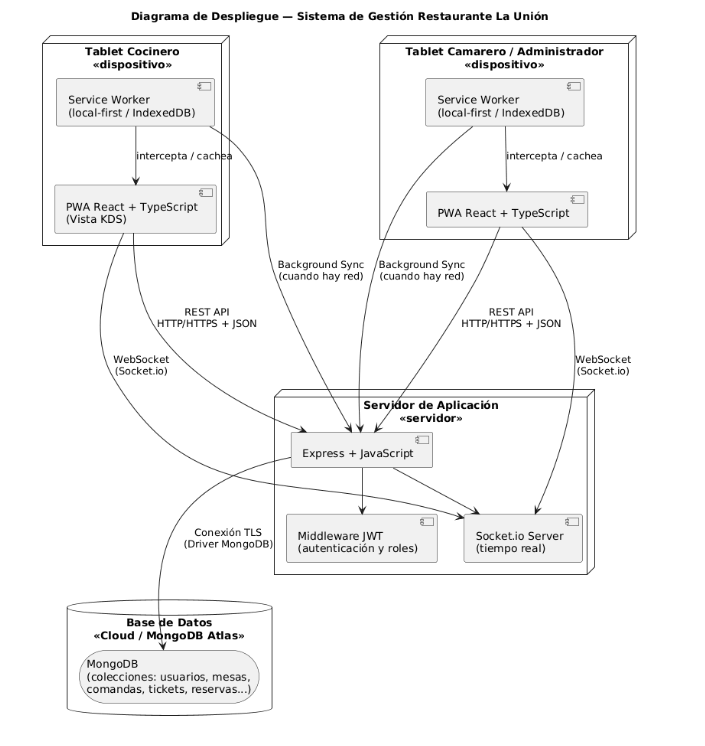

# 3.9 Diagrama de despliegue

El diagrama de despliegue muestra cómo se distribuyen los componentes físicos y lógicos de la solución. La aplicación se ejecuta desde dispositivos con navegador, como tablets o PC, mientras que el backend se sirve desde un PC local de la empresa dentro de la red del restaurante.

La base de datos se aloja en MongoDB Atlas, inicialmente en plan gratuito para el MVP. La comunicación con la base de datos se realiza mediante conexión TLS a través del driver de MongoDB utilizado por Mongoose.

Este modelo permite aprovechar infraestructura existente, mantener baja la inversión inicial y conservar capacidad de evolución hacia un plan de pago de MongoDB Atlas si el sistema pasa a producción estable.

[← Volver al índice del capítulo](README.md)
