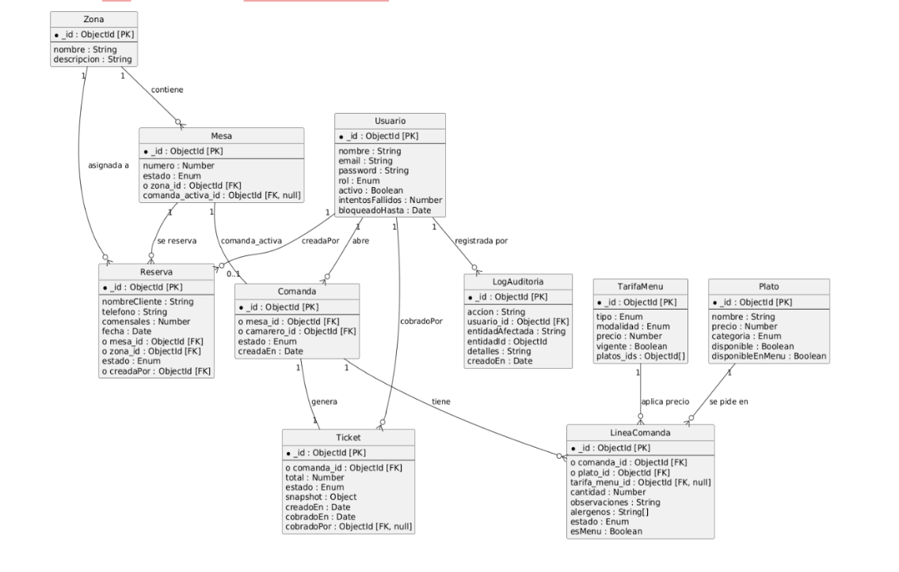

# 3.10 Diagrama entidad-relación

El diagrama entidad-relación representa las entidades persistentes principales y sus relaciones. Aunque MongoDB es una base de datos documental, el uso de Mongoose permite definir referencias entre documentos y mantener una estructura lógica similar a un modelo relacional para facilitar el análisis.

Las relaciones principales son:

- Una zona contiene varias mesas.
- Una mesa puede tener una comanda activa.
- Una comanda contiene múltiples líneas de comanda.
- Cada línea referencia un plato y, opcionalmente, una tarifa de menú.
- Una comanda puede generar un ticket.
- Un usuario puede abrir comandas, cobrar tickets o registrar acciones de auditoría.
- Una reserva puede asociarse a una zona y a una mesa.

[← Volver al índice del capítulo](README.md)
