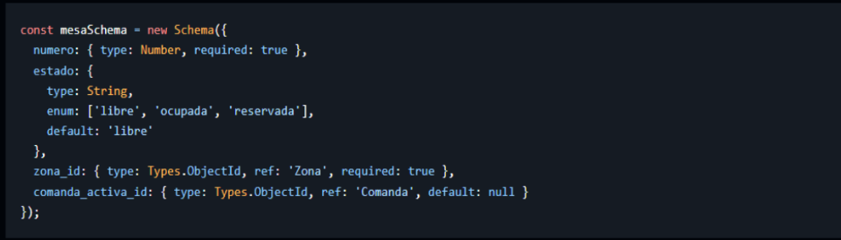

# 3.11 Modelos MongoDB

Para la gestión de los datos se ha utilizado Mongoose, que permite definir esquemas estructurados sobre MongoDB. Esta combinación ha sido elegida porque ofrece la flexibilidad de una base de datos documental, manteniendo validaciones y relaciones entre documentos para garantizar la coherencia de la información.

| Modelo | Campos principales | Relaciones |
|---|---|---|
| `Usuario` | `nombre`, `email`, `password`, `rol`, `activo`, `intentosFallidos`, `bloqueadoHasta` | Referenciado por `Comanda`, `Ticket` y `LogAuditoria`. |
| `Zona` | `nombre`, `descripcion` | Relacionada con `Mesa` y `Reserva`. |
| `Mesa` | `numero`, `estado`, `zona_id`, `comanda_activa_id` | Referencia a `Zona` y se asocia activamente con `Comanda` durante el servicio. |
| `Comanda` | `mesa_id`, `camarero_id`, `estado`, `creadaEn` | Compuesta por `LineaComanda` y referenciada a `Mesa` y `Usuario`. |
| `LineaComanda` | `comanda_id`, `plato_id`, `cantidad`, `observaciones`, `alergenos`, `esMenu`, `tarifa_menu_id`, `estado` | Referencia a `Comanda`, `Plato` y, si procede, `TarifaMenu`. |
| `Plato` | `nombre`, `precio`, `categoria`, `disponible`, `disponibleEnMenu` | Referenciado por `LineaComanda`. |
| `TarifaMenu` | `tipo`, `modalidad`, `precio`, `vigente`, `platos_ids` | Asociado a `LineaComanda` cuando pertenece al menú. |
| `Ticket` | `comanda_id`, `total`, `snapshot`, `estado`, `creadoEn`, `cobradoEn`, `cobradoPor` | Referencia a `Comanda` y `Usuario`. |
| `Reserva` | `nombreCliente`, `telefono`, `comensales`, `fecha`, `mesa_id`, `zona_id`, `estado`, `creadaPor` | Referencia a `Mesa`, `Zona` y `Usuario`. |
| `LogAuditoria` | `accion`, `usuario_id`, `entidadAfectada`, `entidadId`, `creadoEn`, `detalles` | Referencia a `Usuario`. |
| `OperacionOffline` | `tipo`, `payload`, `estado`, `creadoEnCliente`, `sincronizadoEn` | Permite registrar operaciones pendientes de sincronización. |

## Ejemplo de esquema de Mongoose

Además del modelo de `Mesa`, resulta especialmente relevante el esquema de `LineaComanda`, ya que concentra parte de la lógica operativa del sistema. Cada línea representa un plato solicitado dentro de una comanda y permite controlar su estado en cocina, los alérgenos confirmados, las observaciones del camarero y si pertenece o no al menú del día.



```js
const lineaComandaSchema = new Schema({
  comanda_id: { type: Types.ObjectId, ref: 'Comanda', required: true },
  plato_id: { type: Types.ObjectId, ref: 'Plato', required: true },
  tarifa_menu_id: { type: Types.ObjectId, ref: 'TarifaMenu', default: null },
  cantidad: { type: Number, required: true, min: 1 },
  observaciones: { type: String, required: true },
  alergenos: [{ type: String }],
  esMenu: { type: Boolean, default: false },
  solicitadoKds: { type: Boolean, default: true },
  estado: {
    type: String,
    enum: ['PENDIENTE', 'EN_PREPARACION', 'LISTO', 'SERVIDO', 'CANCELADO'],
    default: 'PENDIENTE'
  }
});
```

[← Volver al índice del capítulo](README.md)
