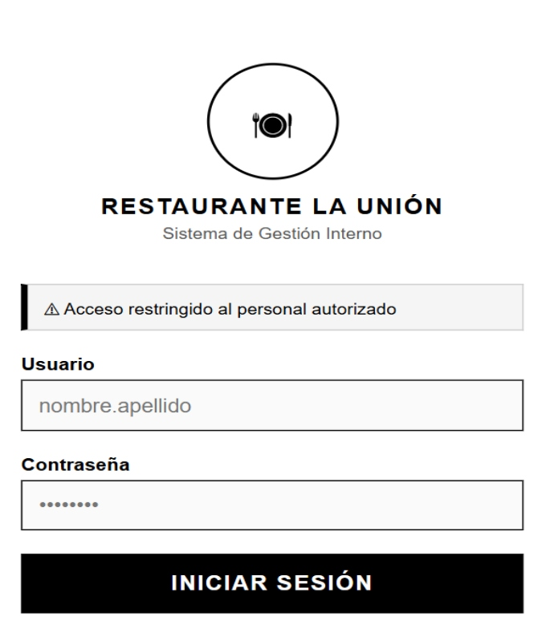
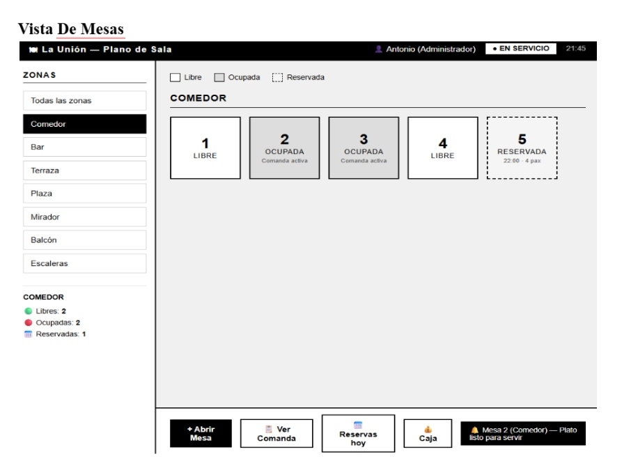
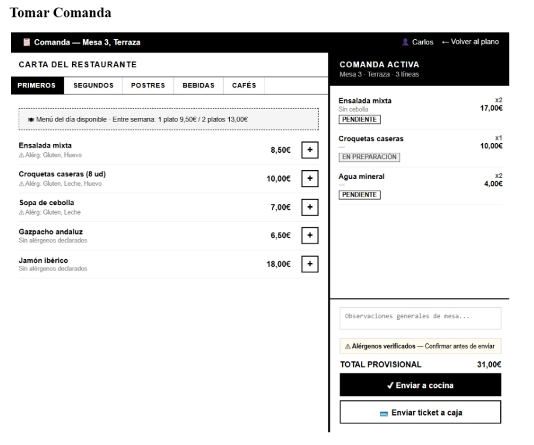
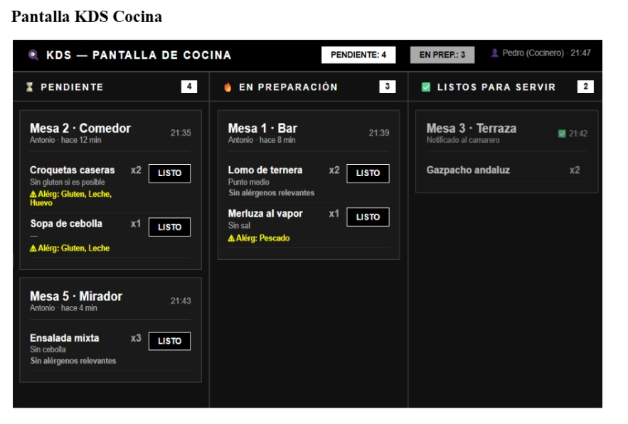
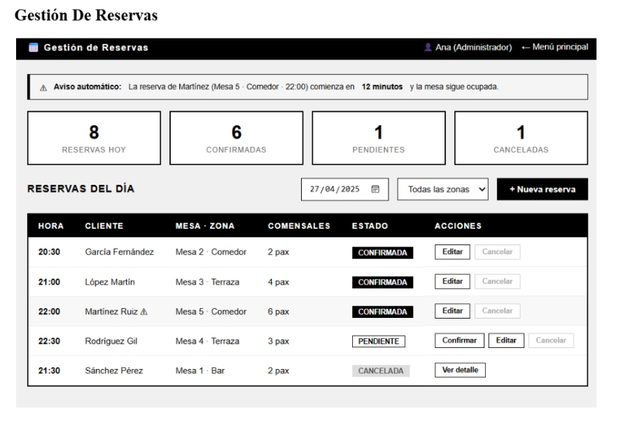
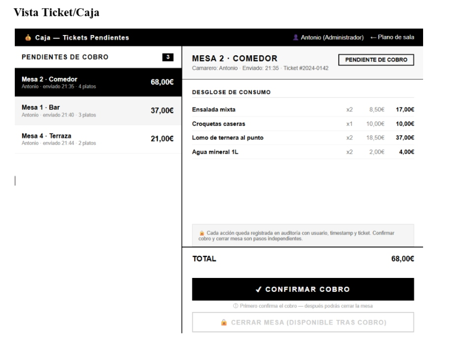
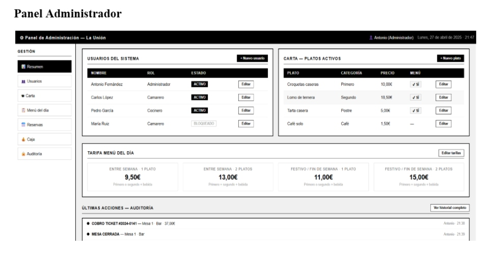

# 3.13 Wireframes

Los wireframes permiten mostrar la intención inicial de las pantallas antes de la implementación del MVP. En este proyecto se han utilizado para validar con el cliente la distribución de las vistas principales y asegurar que cada rol tuviera acceso únicamente a las funciones necesarias.

## Login

Pantalla de acceso al sistema. Incluye formulario de email y contraseña bajo la identidad visual del restaurante. Tras validar las credenciales, el sistema redirige al usuario según su rol.

## Vista de mesas

Pantalla principal para Camarero y Administrador. Muestra el plano de mesas agrupado por zonas y permite consultar estado, abrir mesa, tomar comanda o revisar una comanda activa.

## Tomar comanda

Vista orientada al trabajo del camarero durante el servicio. Permite seleccionar platos de carta o menú, indicar cantidad, alérgenos y observaciones, y enviar las líneas a cocina cuando corresponda.

## KDS cocina

Pantalla exclusiva de cocina. Organiza las líneas de comanda por estado y permite marcar platos como en preparación, listos o servidos.

## Gestión de reservas

Vista de administración para consultar, crear, editar, cancelar y asignar mesa a reservas. Permite organizar las reservas del día por turno de servicio.

## Ticket y caja

Vista de caja para revisar tickets pendientes, confirmar cobros y dejar la mesa pendiente de cierre. Esta separación evita liberar la mesa antes de finalizar el cobro.

## Panel de administración

Panel exclusivo de administración desde el que se accede a usuarios, carta, reservas, caja, auditoría y configuración del sistema.

[← Volver al índice del capítulo](README.md)
