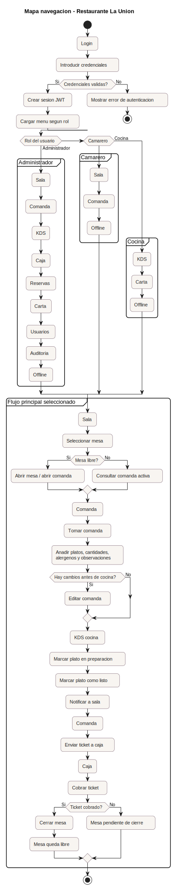

# 4.2 Mapa de navegación

El mapa de navegación representa las vistas principales del MVP y el recorrido funcional que sigue cada rol dentro del sistema. La navegación se organiza alrededor del flujo de servicio del restaurante: autenticación, mesas, comanda, cocina, caja, reservas, administración y sincronización offline.

El diagrama permite comprobar que las vistas no son pantallas aisladas, sino que están conectadas por los casos de uso principales seleccionados para el desarrollo.

[← Volver al índice del capítulo](README.md)
