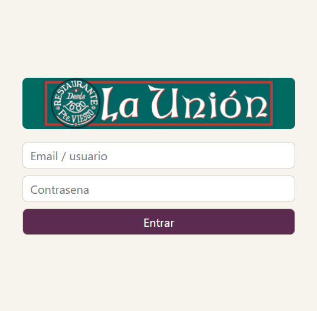
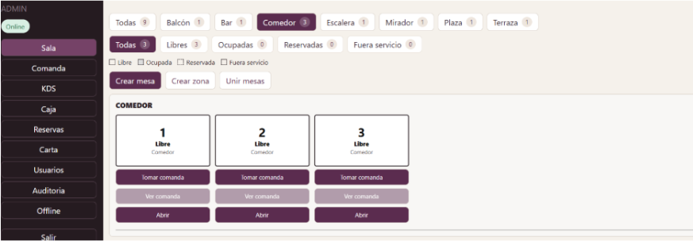
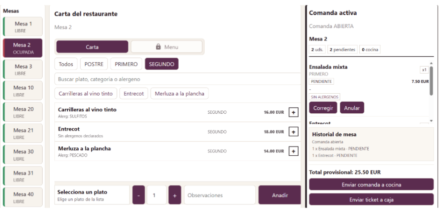
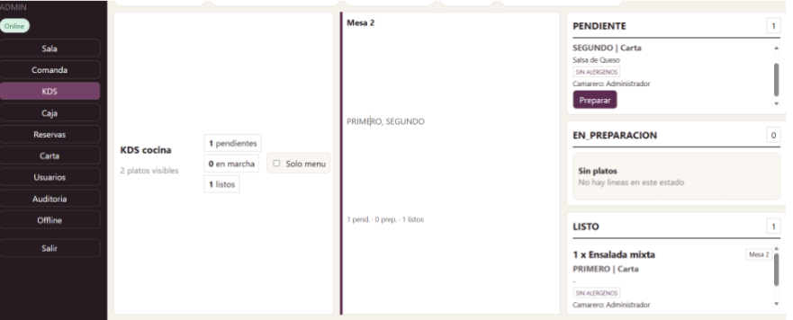
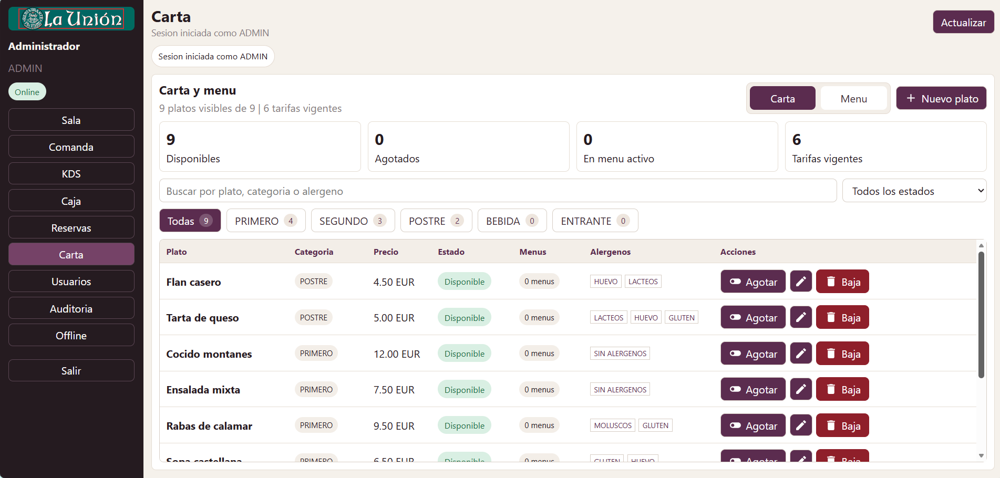
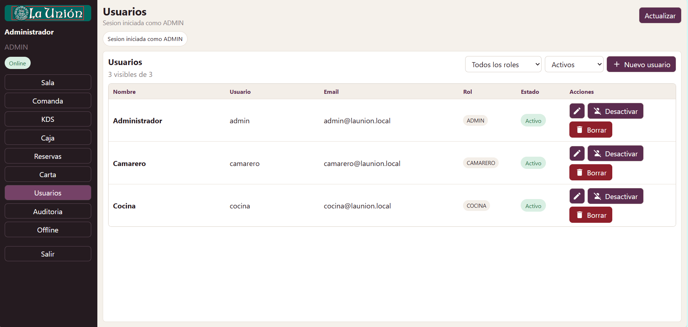
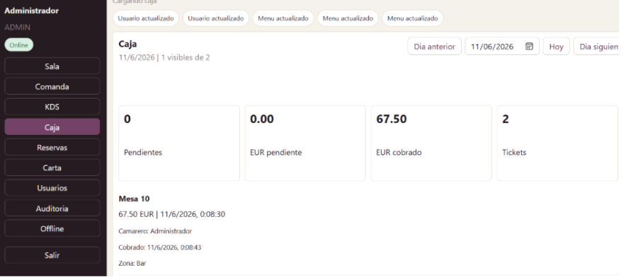
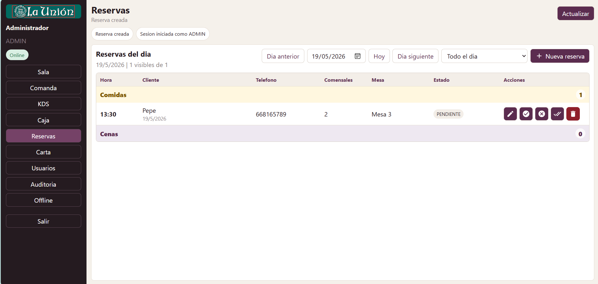
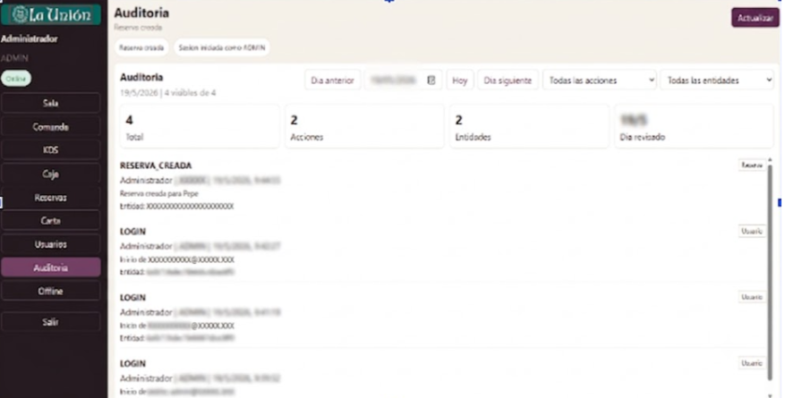
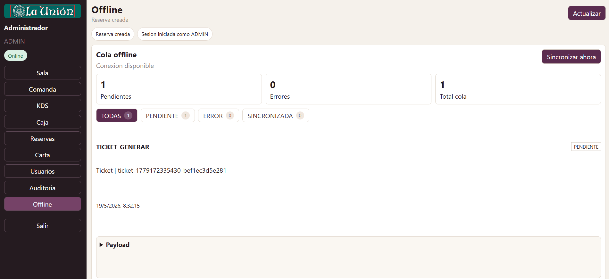

# 4.3 Vistas principales

## Login

La pantalla de login autentica al usuario y permite restaurar la sesión mediante token JWT almacenado en el navegador.

## Vista de mesas

La vista de mesas permite consultar mesas por zona y estado, abrir mesa, tomar comanda y ver una comanda activa. Se ha reducido el tamaño de cada mesa para que la vista sea útil en servicios con muchas mesas. También se muestra el estado operativo: mesa sentada, cocina trabajando, ticket en caja o mesa pendiente de cierre.

## Comanda

La vista de comanda está pensada para camareros en servicio. Permite seleccionar mesa, alternar entre carta y menú, filtrar platos, revisar alérgenos, añadir líneas, editar o anular líneas pendientes y enviar el ticket a caja. En menús, los primeros, segundos y postres funcionan como pases: los segundos o postres no aparecen en cocina hasta que el camarero los solicita.

## KDS

La pantalla KDS muestra a cocina un tablero por estados: pendiente, en preparación y listo. El filtrado por pase evita que cocina vea al mismo tiempo todos los platos de muchas mesas. Así se prioriza lo que se debe cocinar en cada momento.

## Carta

La gestión de carta permite mantener platos, alérgenos, disponibilidad y tarifas de menú. Esta información alimenta la toma de comandas y el cálculo de tickets.

## Usuarios

La vista de usuarios permite al administrador gestionar personal y roles. Esto soporta la separación de permisos entre administrador, camarero y cocina. Los usuarios mostrados en las capturas son ejemplos de prueba y no corresponden a miembros reales de la empresa.

## Caja

La vista de caja lista los tickets pendientes y permite confirmar el cobro. Después del cobro, la mesa queda pendiente de cierre, evitando que se libere automáticamente antes de finalizar el proceso administrativo.

## Reservas

La vista de reservas lista las reservas del día, permite crear, editar, cancelar y asignar mesa. La validación de horario bloquea reservas fuera de comidas y cenas. Durante el servicio, el camarero puede consultar la información necesaria para atender la mesa reservada.

## Auditoría

La auditoría registra acciones relevantes sobre entidades del sistema. Sirve como trazabilidad para incidencias operativas, cambios de carta, caja, reservas y usuarios.

## Offline

La vista offline muestra operaciones pendientes de sincronización. El objetivo es que el restaurante pueda seguir trabajando ante cortes temporales de red.

[← Volver al índice del capítulo](README.md)
