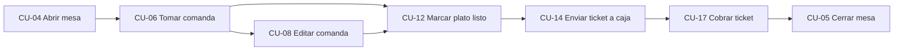

# 4.6 Casos de uso seleccionados

Los casos de uso seleccionados representan el flujo principal del servicio en el restaurante. Se han elegido porque conectan sala, cocina y caja, y porque muestran las reglas de negocio que diferencian la solución de una simple aplicación de toma de pedidos.

| ID | Caso de uso | Vista principal | Resultado |
|---|---|---|---|
| CU-04 | Abrir mesa | Vista de mesas | Mesa ocupada y comanda activa. |
| CU-06 | Tomar comanda | Comanda | Líneas de carta o menú registradas. |
| CU-08 | Editar comanda | Comanda | Líneas pendientes modificadas o canceladas. |
| CU-12 | Marcar plato como listo | KDS | Plato actualizado y visible para sala. |
| CU-14 | Enviar ticket a caja | Comanda / Caja | Ticket pendiente de cobro. |
| CU-17 | Cobrar ticket en caja | Caja | Ticket cobrado. |
| CU-05 | Cerrar mesa | Caja / vista de mesas | Mesa liberada para un nuevo servicio. |

[← Volver al índice del capítulo](README.md)
