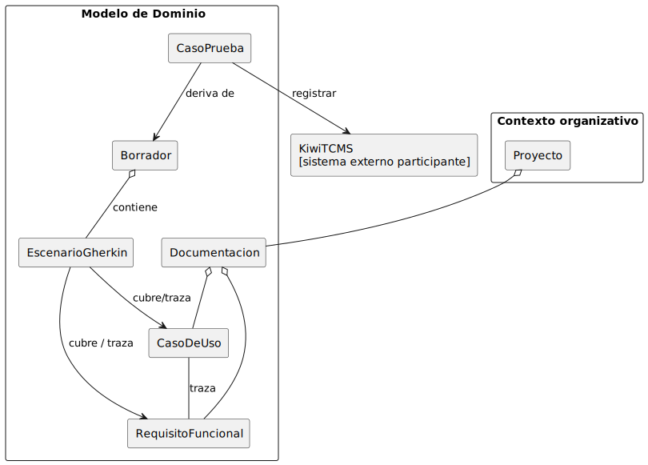
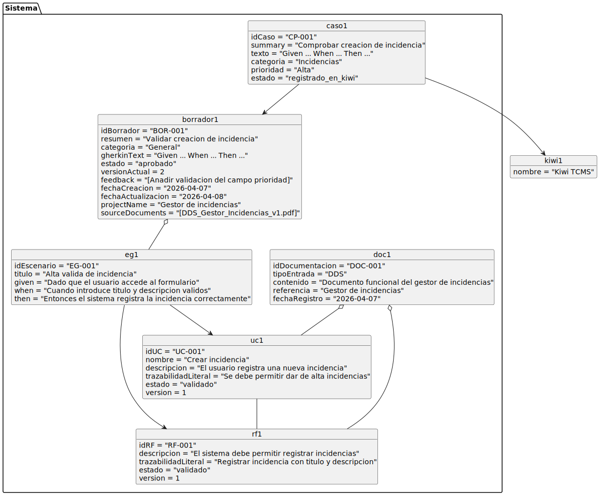
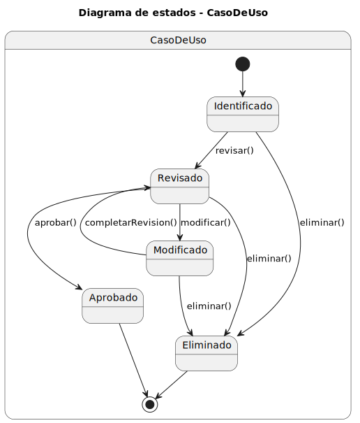
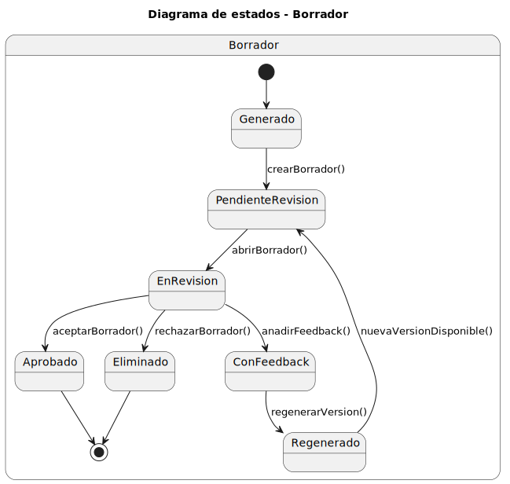

## Modelo de Dominio

  

#### Explicacion

# Modelo de Dominio

## Descripción general
En el contexto organizativo, el sistema parte de un **Proyecto**, que proporciona el marco al que debe quedar asociada toda **Documentación**. La documentación constituye el punto de entrada del sistema y puede presentarse en forma de texto libre, DRF, DDS o combinación de varias fuentes documentales.

A partir de la documentación se obtienen **Casos de Uso** y **Requisitos Funcionales**, que representan la base funcional del conocimiento extraído. Entre ambos se mantiene una relación de trazabilidad, ya que describen de forma complementaria el comportamiento esperado del sistema.

Sobre esta base se generan **Escenarios Gherkin**, que formalizan el comportamiento en un formato estructurado y verificable. Dichos escenarios se integran en un **Borrador**, que constituye el artefacto interno de revisión. El borrador permite ser consultado, revisado, versionado, aceptado o rechazado, pero no se registra directamente en Kiwi TCMS.

Cuando un borrador es aceptado, el sistema deriva de él un **Caso de Prueba**, que representa el artefacto final del dominio. Este caso de prueba puede registrarse en **Kiwi TCMS**, que se modela como sistema externo participante. Kiwi TCMS no forma parte del núcleo del dominio, pero interviene en el flujo funcional global como repositorio externo de registro de casos de prueba.

De este modo, el modelo mantiene la trazabilidad completa desde la documentación inicial hasta el caso de prueba final y por ende la publicacion posterior en Kiwi TCMS, distinguiendo claramente entre artefactos de análisis funcional, artefactos de revisión y artefactos finales de prueba.

## Diagrama de Clases

  

## Diagrama de Objetos

  

## Diagramas de Estado

### Estados de `CasoDeUso`

  

#### Explicacion

El `CasoDeUso` nace en `Identificado` cuando se extrae o crea dentro del sistema. Pasa a `Revisado` cuando su contenido ha sido comprobado y puede entrar en `Modificado` si se actualiza posteriormente. Cuando queda validado para ser utilizado como base funcional alcanza el estado `Aprobado`. Desde los estados no finales tambien puede pasar a `Eliminado` si deja de ser necesario o deja de ser valido dentro del proyecto.

### Estados de `RequisitoFuncional`

  

#### Explicacion

El `RequisitoFuncional` sigue una evolucion paralela a la del caso de uso. Parte de `Identificado`, avanza a `Revisado`, puede pasar por `Modificado` cuando se ajusta su contenido y termina en `Aprobado` cuando queda validado para la generacion de escenarios y la trazabilidad posterior. Igual que en el caso anterior, puede acabar en `Eliminado` desde los estados no finales.

Este diagrama refuerza la idea de control y trazabilidad sobre los requisitos funcionales, asegurando que antes de usarlos como base para pruebas o implementacion hayan pasado por una fase de revision y aprobacion.

### Estados de `Borrador`

  

#### Explicacion

El `Borrador` comienza en `Generado` cuando el sistema produce una primera propuesta a partir de los escenarios Gherkin. Pasa a `PendienteRevision` cuando queda disponible para el Ingeniero de QA y puede entrar en `Modificado` si se incorpora feedback o se regenera su contenido. Cuando el borrador queda conforme, alcanza el estado `Aprobado`, que habilita la generacion del caso de prueba derivado. Si finalmente se descarta o deja de ser util, tambien puede terminar en `Eliminado`.
