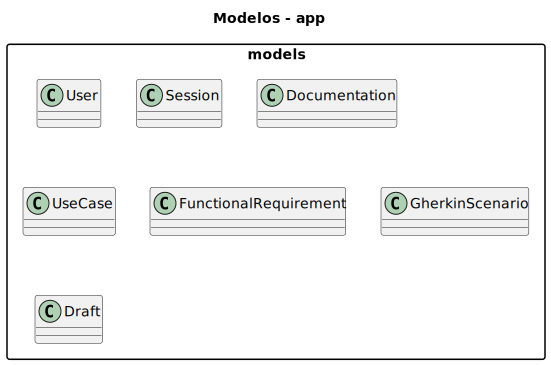
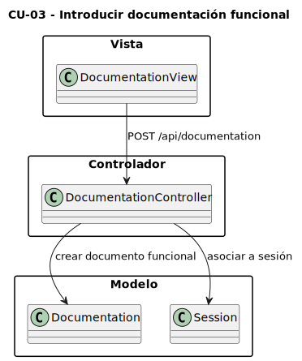
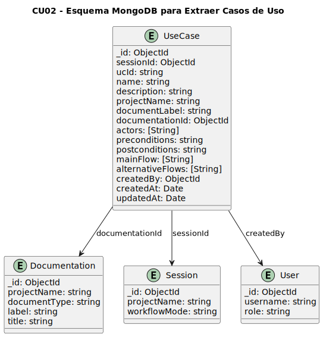
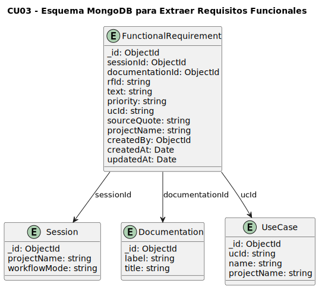
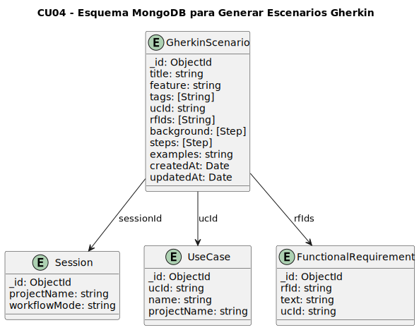
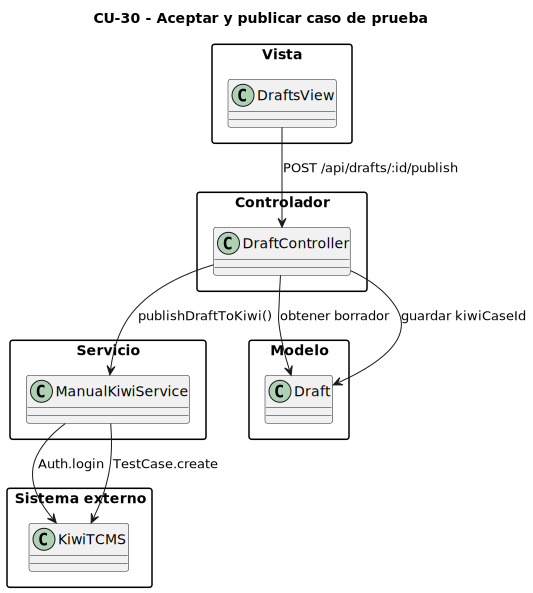
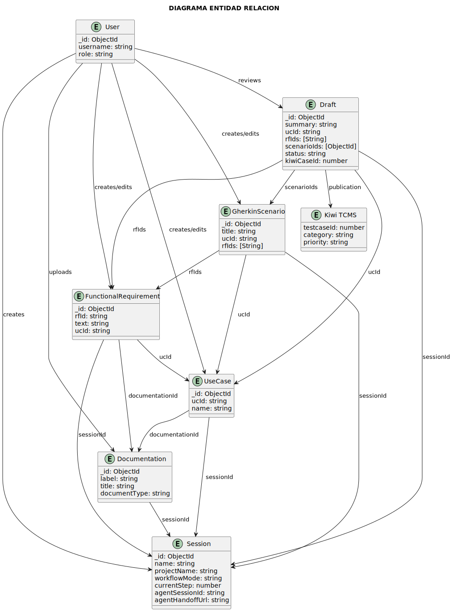
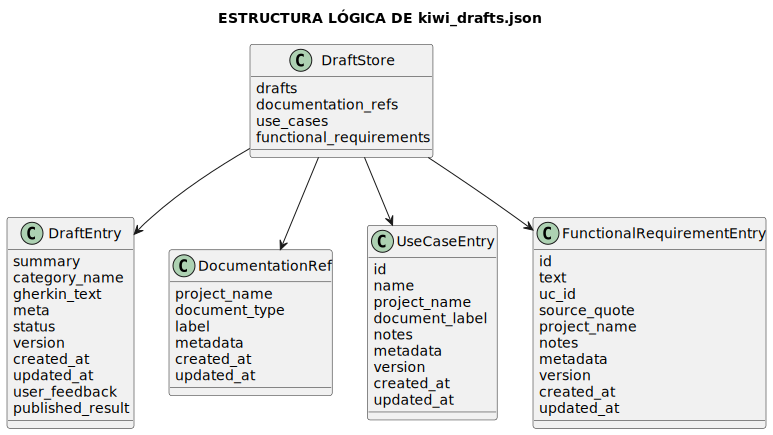
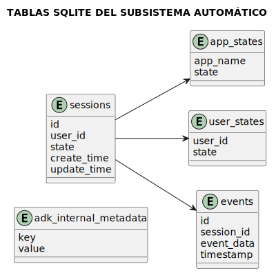
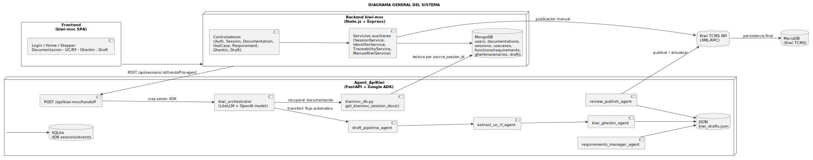

# Analisis y Diseño

La solucion propuesta se ha diseñado bajo un enfoque arquitectonico hibrido basado en el patron MVC (Modelo - Vista - Controlador) para el subsistema principal, denominado `kiwi-mvc`, combinado con un subsistema de automatizacion mediante agentes, denominado `Agent_ApiKiwi`.

Este planteamiento permite una separacion clara entre la logica de negocio, la representacion de los datos y la interaccion del usuario. 

Ademas, hay dos modos de trabajo complementarios: un modo manual, en el que el usuario gestiona directamente el flujo completo desde la aplicacion principal, y un modo automatico, en el que parte del procesamiento se delega a un conjunto de agentes especializados que ejecutan el mismo flujo de forma asistida.

Esta solucion separa el sistema en dos niveles. Por un lado, `kiwi-mvc` concentra la gestion funcional del dominio: sesiones de trabajo, documentacion, casos de uso, requisitos funcionales, escenarios Gherkin y borradores. Por otro, `Agent_ApiKiwi` automatiza las fases de analisis y generacion, conserva un estado propio, mantiene una fase final de revision humana antes de la publicacion en Kiwi TCMS y, ademas, permite gestionar casos ya existentes en Kiwi a traves de agentes especializados.

## Modelos

Los modelos representan las entidades centrales del sistema y su estructura en la base de datos. En el subsistema principal `kiwi-mvc`, estas entidades se almacenan en MongoDB, lo que permite definir esquemas flexibles y mantener relaciones logicas entre los distintos artefactos del proceso.

Entre los modelos mas relevantes se encuentran:

- `User`: representa a los usuarios del sistema, encargados de gestionar el flujo de generacion de casos de prueba.
- `Session`: define una sesion de trabajo en la que se agrupan documentos, casos de uso, requisitos funcionales, escenarios y borradores. Actua como unidad de contexto del proceso.
- `Documentation`: representa la documentacion funcional introducida por el usuario, ya sea de tipo DRF o DDS, y constituye el punto de partida del analisis.
- `UseCase`: define los casos de uso extraidos de la documentacion funcional, incluyendo informacion descriptiva, actores y estructura del flujo funcional.
- `FunctionalRequirement`: describe los requisitos funcionales asociados a los casos de uso. Ademas, incluye una cita textual (`sourceQuote`) del documento origen para mantener trazabilidad documental.
- `GherkinScenario`: representa los escenarios de prueba redactados en lenguaje Gherkin, vinculados a casos de uso y requisitos funcionales.
- `Draft`: agrupa casos de uso, requisitos y escenarios en un borrador previo a su revision o publicacion en Kiwi TCMS.

Los diagramas entidad-relacion permiten visualizar como estas entidades se relacionan entre si en los distintos casos de uso del sistema. Esto proporciona una vision estructurada del modelo de datos, orientada a la trazabilidad, la consistencia y la mantenibilidad.

  

## Controladores

Los controladores definen la logica de negocio que conecta los modelos con las vistas. Cada controlador responde a una serie de endpoints definidos en la API REST del sistema. En la implementacion real, la arquitectura combina controladores, modelos Mongoose y un conjunto de servicios auxiliares, en lugar de una capa de servicios completa y uniforme para todos los casos.

Entre los principales controladores se encuentran:

- `AuthController`: maneja la autenticacion y la gestion de acceso de los usuarios.
- `SessionController`: permite crear, consultar, actualizar y eliminar sesiones de trabajo, asi como delegar el flujo automatico al subsistema de agentes.
- `DocumentationController`: gestiona la introduccion y consulta de documentacion funcional.
- `UseCaseController`: permite crear, listar, consultar, actualizar y eliminar casos de uso.
- `RequirementController`: gestiona los requisitos funcionales asociados a una sesion de trabajo.
- `GherkinController`: permite crear y gestionar escenarios de prueba manuales.
- `DraftController`: gestiona la generacion, revision, rechazo y publicacion de borradores.

La logica de estos controladores se apoya parcialmente en servicios auxiliares como `sessionService`, `traceabilityService`, `identifierService` y `manualKiwiService`, aunque varios controladores tambien operan directamente sobre modelos Mongoose. Esta organizacion sigue permitiendo evolucionar el sistema sin acoplar toda la logica a un unico nivel arquitectonico.

  

## Vistas

Las vistas del sistema estarán divididas en dos interfaces principales:

- Aplicacion Web `kiwi-mvc`: permite al usuario gestionar sesiones de trabajo, introducir documentacion, extraer y editar casos de uso y requisitos funcionales, generar escenarios Gherkin y revisar borradores. El flujo se organiza en pasos secuenciales, lo que facilita el seguimiento del proceso completo.

- Interfaz `Agent_ApiKiwi`: esta orientada principalmente a la revision del flujo automatico mediante `/dev-ui/`. Permite inspeccionar los borradores generados por los agentes, anadir feedback y proceder a su aceptacion o publicacion, y tambien da acceso a capacidades de gestion sobre casos ya existentes en Kiwi TCMS.

  

## CU01 Introducir documentacion funcional

La introduccion de documentacion funcional constituye el punto de entrada del sistema. A partir de esta informacion, el usuario puede iniciar una sesion de trabajo y disponer de una base documental sobre la que se apoyaran la extraccion de casos de uso y requisitos funcionales.

### Modelo

El modelo utilizado es `Documentation`, definido en la coleccion correspondiente de MongoDB. En el se almacenan los principales atributos que describen un documento funcional:

- `projectName`: nombre del proyecto.
- `documentType`: tipo de documento (`DRF` o `DDS`).
- `label`: identificador documental.
- `title`: titulo del documento.
- `content`: contenido textual completo.
- `uploadedBy`: usuario que introduce el documento.
- `sessionId`: sesion de trabajo asociada.

  

### Servicio

Esta funcionalidad se resuelve principalmente desde `DocumentationController` sobre el modelo `Documentation`, con apoyo de utilidades de sesion para validar el contexto manual o pendiente de trabajo. Las operaciones funcionales equivalentes son crear, consultar, actualizar y eliminar documentacion asociada a una sesion.

### Controlador

Los controladores actuan como intermediarios entre la capa de servicios y la vista. Los principales metodos definidos son:

- `create`: valida y guarda un nuevo documento funcional.
- `getOne`: obtiene un documento por su identificador.
- `extractFromSession`: devuelve la documentacion y el estado hidratado de una sesion.
- `update`: actualiza los datos de un documento.
- `remove`: elimina un documento existente.
- `listProjects`: devuelve los proyectos disponibles del usuario autenticado.

### Rutas

| Metodo | Ruta | Descripcion | Roles permitidos |
| --- | --- | --- | --- |
| `POST` | `/api/documentation` | Crea un nuevo documento funcional | Usuario autenticado |
| `GET` | `/api/documentation/:id` | Obtiene un documento concreto | Usuario autenticado |
| `GET` | `/api/documentation/session/:id` | Lista la documentacion de una sesion | Usuario autenticado |
| `PUT` | `/api/documentation/:id` | Actualiza un documento | Usuario autenticado |
| `DELETE` | `/api/documentation/:id` | Elimina un documento | Usuario autenticado |

### Vista

La introduccion de documentacion se realiza desde la interfaz principal `kiwi-mvc`, dentro del primer paso del flujo. Esta vista permite asociar un documento a una sesion de trabajo y a un proyecto concreto, sirviendo como base para el resto del proceso.

## CU02 Extraer casos de uso

La extraccion de casos de uso permite identificar, a partir de la documentacion funcional, las funcionalidades principales del sistema analizado. Estos casos de uso se almacenan y pueden ser posteriormente revisados o modificados por el usuario.

### Modelo

El modelo `UseCase` representa la entidad caso de uso. Incluye informacion descriptiva, estructural y de trazabilidad:

- `ucId`: identificador del caso de uso.
- `name`: nombre.
- `description`: descripcion.
- `documentationId`: documento origen.
- `documentLabel`: referencia documental.
- `projectName`: proyecto asociado.
- `actors`: actores implicados.
- `preconditions`, `postconditions`, `mainFlow`, `alternativeFlows`: estructura funcional del caso de uso.

  

### Servicio

La gestion de casos de uso combina el controlador especifico con utilidades de identificadores y validacion de sesion. El sistema soporta altas, consultas, modificaciones y borrado manual, asi como extraccion a partir de un documento funcional almacenado.

### Controlador

Los metodos del controlador son responsables de conectar la logica de extraccion con la API REST:

- `create`: crea manualmente un caso de uso.
- `list`: devuelve la lista de casos de uso de una sesion o proyecto.
- `getOne`: obtiene un caso de uso por su ID.
- `update`: actualiza un caso de uso existente.
- `remove`: elimina un caso de uso.
- `extractFromDocument`: extrae casos de uso a partir de un documento funcional.

### Rutas

| Metodo | Ruta | Descripcion | Roles permitidos |
| --- | --- | --- | --- |
| `GET` | `/api/use-cases` | Lista los casos de uso | Usuario autenticado |
| `POST` | `/api/use-cases` | Crea un nuevo caso de uso | Usuario autenticado |
| `GET` | `/api/use-cases/:id` | Obtiene un caso de uso por ID | Usuario autenticado |
| `PUT` | `/api/use-cases/:id` | Actualiza un caso de uso | Usuario autenticado |
| `DELETE` | `/api/use-cases/:id` | Elimina un caso de uso | Usuario autenticado |
| `GET` | `/api/documentation/:documentationId/extract-use-cases` | Extrae casos de uso desde la documentacion | Usuario autenticado |

### Vista

La funcionalidad de extraccion de casos de uso se encuentra en el segundo paso del flujo de la SPA. Desde esta vista, el usuario puede visualizar los casos de uso generados, editarlos y mantener la trazabilidad con el documento original.

## CU03 Extraer requisitos funcionales

La extraccion de requisitos funcionales permite descomponer la documentacion funcional en requisitos mas especificos, que posteriormente podran asociarse con casos de uso y escenarios de prueba.

### Modelo

El modelo `FunctionalRequirement` representa un requisito funcional asociado a una sesion, a un documento y a un caso de uso.

Sus atributos principales son:

- `rfId`: identificador del requisito.
- `text`: contenido del requisito.
- `priority`: prioridad.
- `ucId`: caso de uso padre.
- `sourceQuote`: cita textual del documento origen.
- `documentationId`: documento del que se extrae.
- `projectName`: proyecto asociado.

  

### Servicio

Esta funcionalidad combina operaciones CRUD sobre `FunctionalRequirement` con comprobaciones de sesion, proyecto y trazabilidad. Tambien soporta la extraccion de requisitos a partir de documentacion ya cargada en el sistema.

### Controlador

Los principales metodos definidos son:

- `create`: crea un requisito funcional.
- `list`: lista los requisitos disponibles.
- `getOne`: obtiene un requisito por ID.
- `update`: actualiza su contenido.
- `remove`: elimina un requisito.
- `extractFromDocument`: extrae requisitos funcionales del documento.

### Rutas

| Metodo | Ruta | Descripcion | Roles permitidos |
| --- | --- | --- | --- |
| `GET` | `/api/requirements` | Lista los requisitos funcionales | Usuario autenticado |
| `POST` | `/api/requirements` | Crea un requisito funcional | Usuario autenticado |
| `GET` | `/api/requirements/:id` | Obtiene un requisito por ID | Usuario autenticado |
| `PUT` | `/api/requirements/:id` | Actualiza un requisito | Usuario autenticado |
| `DELETE` | `/api/requirements/:id` | Elimina un requisito | Usuario autenticado |
| `GET` | `/api/documentation/:documentationId/extract-requirements` | Extrae requisitos desde la documentacion | Usuario autenticado |

### Vista

La extraccion de requisitos funcionales se lleva a cabo en la misma vista en la que se muestran los casos de uso. Desde este entorno, el usuario puede revisar la trazabilidad entre documentacion, casos de uso y requisitos, garantizando consistencia funcional.

## CU04 Generar escenarios Gherkin

La generacion de escenarios Gherkin transforma los casos de uso y los requisitos funcionales en escenarios de prueba estructurados, legibles y trazables. Estos escenarios sirven como puente entre el analisis funcional realizado en las fases anteriores y la construccion posterior del borrador publicable.

### Modelo

El modelo `GherkinScenario` representa cada escenario generado dentro de una sesion de trabajo. Su estructura recoge tanto la informacion descriptiva del escenario como sus enlaces de trazabilidad con casos de uso y requisitos funcionales.

Sus atributos principales son:

- `title`: titulo del escenario.
- `feature`: funcionalidad o comportamiento que describe.
- `tags`: etiquetas asociadas al escenario.
- `ucId`: identificador del caso de uso relacionado.
- `rfIds`: requisitos funcionales cubiertos por el escenario.
- `steps`: pasos del escenario en formato Gherkin.
- `createdAt`: fecha de creacion.
- `updatedAt`: fecha de actualizacion.

  

### Servicio

Aquí `kiwi-mvc` permite gestionar escenarios manualmente y mantener su trazabilidad con UC y RF. La generacion automatica de escenarios no se expone como una ruta REST propia en `kiwi-mvc`, sino que se resuelve en el subsistema `Agent_ApiKiwi` mediante el pipeline de agentes.

### Controlador

Los metodos del controlador conectan esta funcionalidad con la API REST y permiten mantener la trazabilidad del proceso:

- `create`: crea un escenario manualmente.
- `list`: lista los escenarios disponibles.
- `getOne`: obtiene un escenario por ID.
- `update`: actualiza un escenario existente.
- `remove`: elimina un escenario.

### Rutas

| Metodo | Ruta | Descripcion | Roles permitidos |
| --- | --- | --- | --- |
| `GET` | `/api/scenarios` | Lista los escenarios Gherkin | Usuario autenticado |
| `POST` | `/api/scenarios` | Crea un escenario Gherkin | Usuario autenticado |
| `GET` | `/api/scenarios/:id` | Obtiene un escenario Gherkin por ID | Usuario autenticado |
| `PUT` | `/api/scenarios/:id` | Actualiza un escenario Gherkin | Usuario autenticado |
| `DELETE` | `/api/scenarios/:id` | Elimina un escenario Gherkin | Usuario autenticado |

### Vista

La generacion y revision de escenarios Gherkin se realiza en el tercer paso del flujo de la SPA. Desde esta vista, el usuario puede comprobar que cada escenario refleja correctamente el comportamiento esperado, editarlo si es necesario y mantener su vinculacion con los casos de uso y requisitos funcionales de origen.

## CU05 Aceptar y publicar casos de prueba a partir de borrador

Esta funcionalidad representa una de las partes centrales del sistema, ya que permite consolidar los artefactos generados durante el proceso en un borrador, revisarlo y finalmente publicarlo en Kiwi TCMS.

### Modelo

El modelo `Draft` agrupa la informacion asociada a la publicacion final:

- `summary`: resumen del borrador.
- `description`: descripcion general.
- `projectName`: proyecto asociado.
- `ucId`: caso de uso principal.
- `rfIds`: requisitos funcionales relacionados.
- `scenarioIds`: escenarios Gherkin asociados.
- `priority`: prioridad del caso de prueba.
- `status`: estado del borrador (`pending`, `published`, `rejected`).
- `content`: contenido del borrador.
- `kiwiCaseId`: identificador en Kiwi TCMS si se ha publicado.

  

### Servicio

La capa de servicios incluye las operaciones necesarias para trabajar con borradores y publicacion:

- `assembleDraft(sessionId)`: genera un borrador a partir de UC, RF y escenarios.
- `findDraftById(id)`: obtiene un borrador concreto.
- `updateDraft(id, input)`: actualiza un borrador.
- `addFeedback(id, text)`: anade feedback.
- `rejectDraft(id)`: rechaza un borrador.
- `publishDraft(id)`: publica el borrador en Kiwi TCMS.

Ademas, en el modo automatico intervienen agentes especializados del subsistema `Agent_ApiKiwi`, que generan borradores y permiten su posterior publicacion.

### Controlador

Los principales metodos definidos son:

- `assembleDraftHandler`: ensambla el borrador a partir de los artefactos existentes.
- `getDraftByIdHandler`: obtiene un borrador.
- `updateDraftHandler`: actualiza su contenido.
- `addDraftFeedbackHandler`: anade feedback.
- `rejectDraftHandler`: marca el borrador como rechazado.
- `publishDraftHandler`: publica el borrador en Kiwi TCMS.

### Rutas

| Metodo | Ruta | Descripcion | Roles permitidos |
| --- | --- | --- | --- |
| `GET` | `/api/drafts` | Lista los borradores | Usuario autenticado |
| `POST` | `/api/drafts/assemble` | Ensambla un borrador | Usuario autenticado |
| `GET` | `/api/drafts/:id` | Obtiene un borrador concreto | Usuario autenticado |
| `PUT` | `/api/drafts/:id` | Actualiza un borrador | Usuario autenticado |
| `POST` | `/api/drafts/:id/feedback` | Anade feedback a un borrador | Usuario autenticado |
| `POST` | `/api/drafts/:id/reject` | Rechaza un borrador | Usuario autenticado |
| `POST` | `/api/drafts/:id/publish` | Publica el borrador en Kiwi TCMS | Usuario autenticado |

### Vista

La gestion de borradores se realiza desde el cuarto paso del flujo en `kiwi-mvc`, donde el usuario puede revisar el contenido consolidado, asignar prioridad, anadir feedback y decidir su publicacion.

En el modo automatico, la revision tambien puede realizarse desde la interfaz `/dev-ui/` del subsistema `Agent_ApiKiwi`, permitiendo aceptar o rechazar borradores generados por los agentes.

## Diagrama entidad relacion

El diagrama entidad-relacion (MongoDB Compass) general sintetiza como se articulan las entidades fundamentales del sistema, alineadas con la arquitectura MVC y con los casos de uso previamente descritos.

En el se observa como `Session` actua como nodo central, agrupando la documentacion, los casos de uso, los requisitos funcionales, los escenarios Gherkin y los borradores. Cada documento funcional sirve de base para la extraccion de casos de uso y requisitos. A su vez, los escenarios Gherkin se construyen a partir de esa informacion y se integran posteriormente en un borrador, que puede ser revisado o publicado en Kiwi TCMS.

Este modelo refleja una estructura coherente, escalable y facilmente trazable que da soporte a las funcionalidades clave del sistema.

  

## Ajuste del modo manual y automatico

El sistema dispone de dos modos de ejecucion: manual (`kiwi-mvc`) y automatico (`Agent_ApiKiwi`). Ambos comparten los mismos casos de uso funcionales: introducir documentacion funcional, extraer casos de uso, extraer requisitos funcionales, generar escenarios Gherkin y publicar casos de prueba.

La diferencia entre ambos modos radica en la ejecucion del flujo. En el modo manual, el usuario construye los artefactos paso a paso desde la interfaz. En el modo automatico, el sistema delega el procesamiento en un conjunto de agentes, manteniendo una fase final de revision por parte del usuario.

De este modo, el subsistema automatico automatiza el flujo principal existente y, adicionalmente, incorpora capacidades conversacionales para consultar y administrar casos ya publicados en Kiwi TCMS.

## Persistencia y gestion de datos en el subsistema automatico

El subsistema `Agent_ApiKiwi` emplea una estrategia de persistencia especifica, adaptada al procesamiento por agentes.

Se utilizan estos mecanismos principales:

- `MongoDB`: base de datos del sistema principal, utilizada como fuente de documentacion mediante acceso en lectura.
- `SQLite` (`sessions.db`): base de datos local del subsistema de agentes, donde ADK persiste sesiones, eventos y estado interno de ejecucion.
- `kiwi_drafts.json`: fichero de persistencia local en formato JSON, utilizado para guardar los artefactos generados por el pipeline automatico, como casos de uso, requisitos funcionales, borradores y referencias documentales. No actua como una base de datos independiente, sino como almacenamiento estructurado en fichero gestionado directamente por el propio subsistema `Agent_ApiKiwi`.
- `MariaDB`: base de datos subyacente de Kiwi TCMS, donde terminan persistidos los casos de prueba publicados desde la parte manual y automatica a traves de la API XML-RPC.

## Modelo de ejecucion en modo automatico

En el modo automatico, el flujo funcional esta coordinado por un agente raiz `kiwi_orchestrator`, que decide a que subagente transferir cada peticion. Entre los subagentes principales se encuentran:

- `draft_pipeline_agent`: encadena la extraccion y la generacion inicial de borradores.
- `extract_uc_rf_agent`: analiza la documentacion y extrae casos de uso y requisitos funcionales.
- `kiwi_gherkin_agent`: genera escenarios de prueba en formato Gherkin y deja borradores pendientes.
- `review_publish_agent`: gestiona la revision y publicacion de los borradores.
- `requirements_manager_agent`: permite consultar y mantener UC y RF persistidos por el subsistema automatico.
- `kiwi_case_manager_agent`: permite buscar, inspeccionar y modificar casos ya existentes en Kiwi TCMS.

El proceso mantiene la misma logica funcional que en el modo manual, pero ejecutado de forma automatizada y coordinada por el orquestador principal.

## Persistencia de los JSON generados por los agentes

El fichero `kiwi_drafts.json` actua como almacenamiento persistente en fichero JSON de los artefactos generados por el pipeline automatico. En la practica real, este fichero se escribe en la ruta definida por `DRAFTS_PATH`.

En la configuracion actual del proyecto, `DRAFTS_PATH` apunta a `/data/kiwi_drafts.json`. Esto significa que:

- cuando `Agent_ApiKiwi` se ejecuta con Docker(en el caso de este TFG), el fichero se escribe dentro del contenedor en `/data/kiwi_drafts.json`;
- esa ruta esta respaldada por un volumen montado sobre la carpeta `Agent_ApiKiwi/data` del proyecto;
- por tanto, el contenido queda persistido fuera del runtime del contenedor y puede recuperarse en ejecuciones posteriores.

Incluye:

- borradores (`drafts`)
- casos de uso (`use_cases`)
- requisitos funcionales (`functional_requirements`)
- referencias documentales (`documentation_refs`)

Cada borrador contiene informacion estructurada como contenido Gherkin, estado, metadatos, timestamps y resultado de publicacion, permitiendo mantener trazabilidad completa. De este modo, `kiwi_drafts.json` no sustituye a MongoDB ni a SQLite, sino que complementa ambas persistencias como almacenamiento local de artefactos funcionales generados por los agentes.

  

## Tablas SQLite (`sessions.db`)

La base de datos SQLite se utiliza para gestionar el estado interno del sistema de agentes, permitiendo mantener continuidad entre ejecuciones.

Las tablas principales son:

- `sessions`: almacena sesiones activas y su estado.
- `events`: registra el historial de ejecucion.
- `app_states`: estado global del sistema.
- `user_states`: estado por usuario.
- `adk_internal_metadata`: metadatos internos.

  

## Tablas utilizadas en Kiwi TCMS (MariaDB)

Los casos de prueba publicados se almacenan en la base de datos relacional de Kiwi TCMS, basada en MariaDB. Esto permite gestionar su ciclo de vida, mantener historial de cambios y garantizar la integridad de los datos, tanto para la parte manual como la automática.

Las tablas principales son:

- `testcases_testcase`: caso de prueba.
- `testcases_historicaltestcase`: historial de modificaciones.
- `testcases_category`: categoria.
- `testcases_testcasestatus`: estado.
- `management_priority`: prioridad.
- `management_tag`: etiquetas.

  

## Modelo global de persistencia

El sistema combina distintos mecanismos de almacenamiento, cada uno con una responsabilidad especifica:

- `MongoDB` -> datos funcionales
- `SQLite` -> estado del sistema automatico
- `JSON` -> artefactos generados
- `MariaDB` (Kiwi TCMS) -> almacenamiento final casos de prueba

## Diagrama general del sistema

Este diagrama muestra la interaccion global entre los modulos del sistema.

La interfaz principal `kiwi-mvc` consume servicios del backend REST, el cual interactua con MongoDB para almacenar usuarios, documentacion, casos de uso, requisitos, escenarios y borradores.

Cuando el usuario activa el modo automatico, `kiwi-mvc` realiza un handoff hacia `Agent_ApiKiwi` mediante el endpoint `POST /api/kiwi-mvc/handoff`. Ese endpoint crea una sesion propia del subsistema ADK y registra datos como `source_session_id`, `project_name` y `session_name`. A partir de ahi, una herramienta especifica (`kiwimvc_db.py`) recupera la documentacion almacenada en MongoDB usando el identificador de sesion de `kiwi-mvc` y la utiliza como entrada inicial para el flujo de agentes. Despues, el orquestador principal y sus subagentes procesan la informacion, generan borradores y pueden publicarlos finalmente en Kiwi TCMS.

La publicacion se realiza consumiendo la API XML-RPC de Kiwi TCMS, tanto desde el flujo manual de `kiwi-mvc` como desde el flujo automatico de `Agent_ApiKiwi`, y el resultado final queda almacenado en su base de datos relacional basada en MariaDB.

La arquitectura modular permite escalar el sistema, mantenerlo actualizado y anadir nuevas funcionalidades sin afectar al conjunto.

  

## Arquitectura y tecnologias utilizadas

El sistema desarrollado presenta una arquitectura basada en la separacion de responsabilidades mediante una estructura cliente-servidor, extendida con un subsistema de automatizacion.

- **Backend/API REST (`kiwi-mvc`)**: proporciona los servicios de autenticacion, gestion de sesiones, documentacion, casos de uso, requisitos funcionales, escenarios Gherkin y borradores. Esta implementado con un enfoque modular basado en controladores, servicios, modelos y middleware.
- **Aplicacion Web Principal (SPA)**: permite al usuario trabajar manualmente sobre el ciclo de vida completo del caso de prueba, desde la documentacion funcional hasta la publicacion final.
- **Subsistema automatico (`Agent_ApiKiwi`)**: implementa un orquestador de agentes y varios subagentes que analizan la documentacion, extraen casos de uso y requisitos, generan escenarios Gherkin, preparan borradores para su revision y publicacion y permiten gestionar casos ya existentes en Kiwi TCMS, utilizando modelos de OpenAI a traves de LiteLLM.

Esta separacion garantiza escalabilidad, mantenibilidad y la posibilidad de combinar flujos manuales y automaticos dentro del mismo sistema.

## Tecnologias utilizadas

### Backend (`kiwi-mvc`)

- `Node.js`: entorno de ejecucion JavaScript en servidor.
- `Express.js`: framework para definir rutas, middlewares y servicios REST.
- `MongoDB`: base de datos NoSQL orientada a documentos.
- `Mongoose`: libreria ODM para modelado de datos.
- `express-session` y `connect-mongo`: gestion de sesiones HTTP.

### Frontend 

- `HTML`, `CSS` y `JavaScript`.
- Arquitectura tipo Single Page Application.
- Flujo guiado mediante paneles y modales.

### Subsistema automatico (`Agent_ApiKiwi`)

- `Python`: lenguaje principal del subsistema automatico.
- `FastAPI`: framework web para exponer el servicio de agentes.
- `Google ADK`: framework de orquestacion de agentes.
- `LiteLLM`: capa de integracion para el acceso a modelos de lenguaje desde los agentes.
- `OpenAI`: proveedor de los modelos utilizados por el subsistema automatico; en la implementacion actual se configura mediante `OPENAI_MODEL` y el valor por defecto es `openai/gpt-5.2`.
- `SQLite`: persistencia de sesiones y eventos ADK.
- `JSON`: almacenamiento de borradores y artefactos generados.

### Integracion externa

- `Kiwi TCMS` (XML-RPC API): sistema externo consumido como API para publicar y gestionar casos de prueba.
- `MariaDB`: base de datos relacional utilizada por Kiwi TCMS para almacenar los casos publicados y sus entidades asociadas.

### Otros

- `Docker`: contenerizacion del subsistema(ahora mismo, se podría usar otro).
- `PlantUML`: generacion de diagramas UML para la documentacion tecnica.
