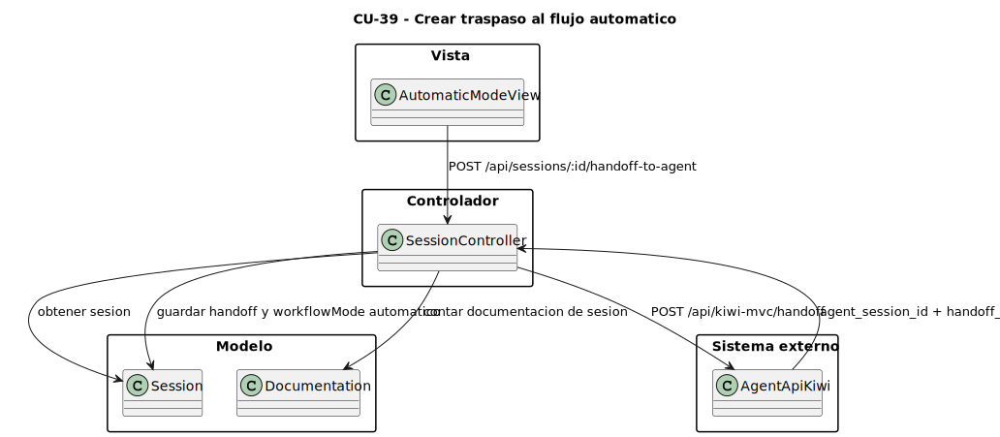
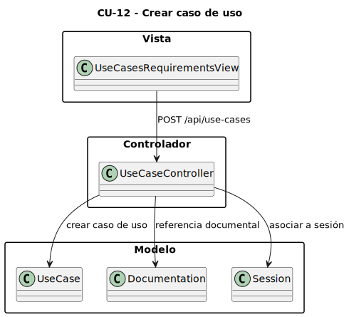
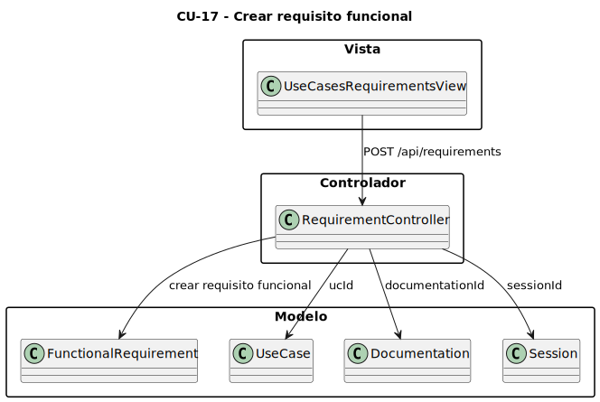
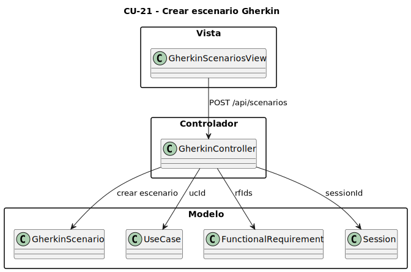
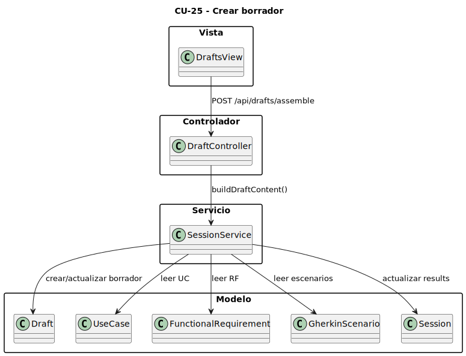
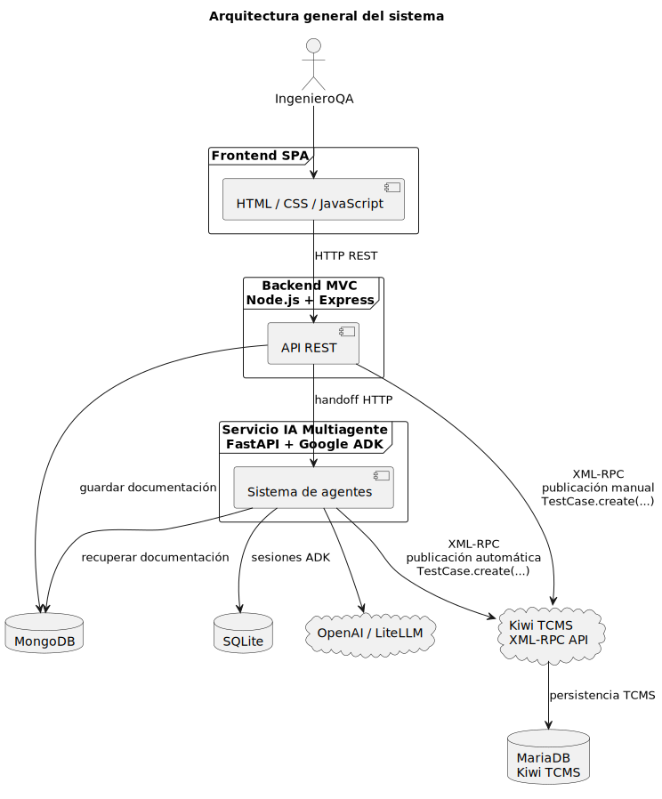
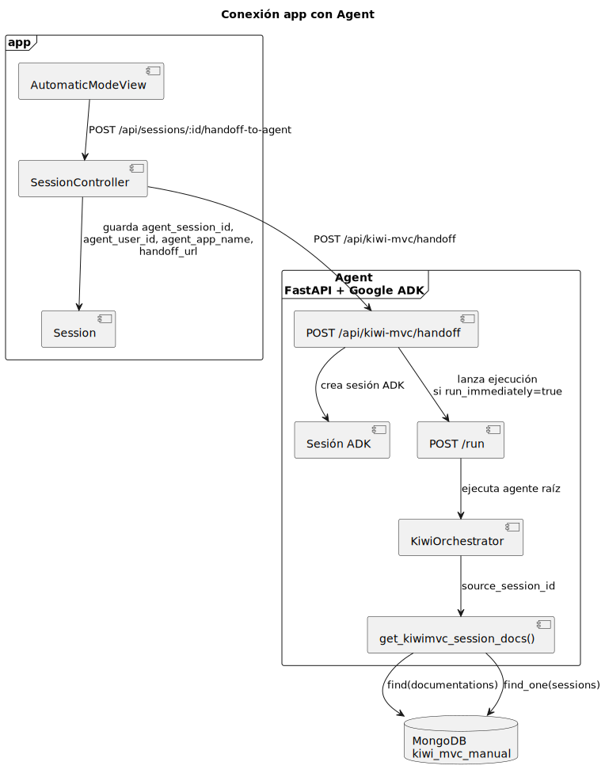
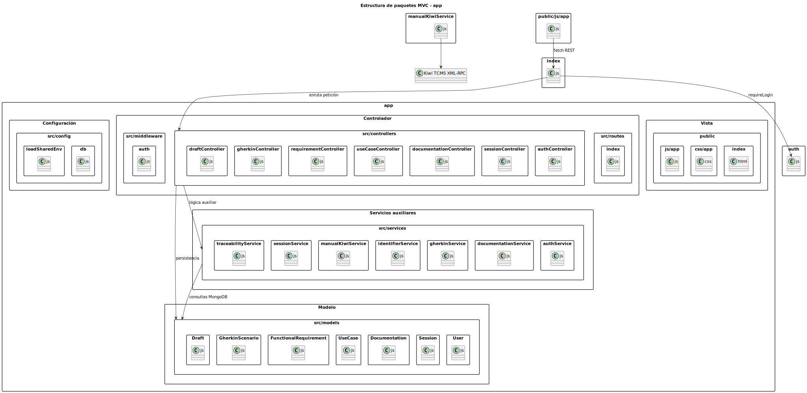

# Capítulo 3

## 1. Modelos


### Explicación

El subsistema `app` utiliza modelos Mongoose para definir los esquemas de colecciones principales almacenadas en MongoDB. Estos modelos forman la capa Modelo del patrón MVC.

Cada clase del diagrama representa una colección funcional del sistema:

- `User`: actor autenticados.
- `Session`: sesiones de trabajo.
- `Documentation`: documentación funcional introducida por el actor.
- `UseCase`: casos de uso.
- `FunctionalRequirement`: requisitos funcionales.
- `GherkinScenario`: escenarios Gherkin.
- `Draft`: borradores de casos de prueba.

Este diagrama se mantiene sin propiedades ni relaciones porque su objetivo es ofrecer una visión general de los modelos principales.

## 2. Vistas 


### Explicación

`app` está implementado como una Single Page Application. El servidor Express sirve `public/index.html`, y la lógica de interfaz se encuentra en `public/js/app.js`.

Las vistas representan secciones funcionales de la aplicación, no páginas renderizadas individualmente por el servidor. Cada vista consume la API REST de `app` y se comunica con los controladores correspondientes.

La autenticación se realiza mediante `LoginView`, conectada con `AuthController`. Después, el usuario trabaja con sesiones, documentación, casos de uso, requisitos, escenarios y borradores.

El modo automático se activa desde `AutomaticModeView`, que utiliza `SessionController` para hacer el handoff hacia `agent`.

## 3. Controladores


### Explicación

Los controladores reciben las peticiones HTTP definidas en `src/routes/index.js`, validan la información recibida, interactúan con modelos o servicios y devuelven respuestas JSON al frontend.

Los principales controladores son:

- `AuthController`: gestiona registro, login, logout y usuario actual.
- `SessionController`: gestiona sesiones de trabajo, resultados y conexión con el agente.
- `DocumentationController`: gestiona documentación funcional.
- `UseCaseController`: gestiona casos de uso.
- `RequirementController`: gestiona requisitos funcionales.
- `GherkinController`: gestiona escenarios Gherkin.
- `DraftController`: gestiona borradores, feedback, rechazo y publicación.

La autenticación interna de `app` se integra dentro de `AuthController`. Las contraseñas se almacenan con hash mediante `bcryptjs`, y las sesiones HTTP se guardan en MongoDB mediante `connect-mongo`, en la colección técnica `httpSessions`.

### Servicios auxiliares

Aunque la aplicación sigue un patrón MVC, parte de la lógica de negocio se desacopla de los controladores mediante servicios auxiliares ubicados en `src/services`. Estos servicios encapsulan operaciones reutilizables, reglas de negocio transversales, generación de identificadores, trazabilidad y comunicación con sistemas externos.

Los principales servicios del subsistema `app` son:

- `AuthService`: centraliza operaciones auxiliares de autenticación y sesión.
- `SessionService`: concentra la lógica asociada al ciclo de vida de las sesiones de trabajo y al ensamblado de resultados.
- `DocumentationService`: da soporte al tratamiento de documentación funcional y su asociación a sesiones.
- `GherkinService`: encapsula operaciones auxiliares relacionadas con escenarios Gherkin.
- `IdentifierService`: genera identificadores lógicos como `ucId` y `rfId`, usados para trazabilidad funcional.
- `TraceabilityService`: construye y mantiene relaciones de trazabilidad entre documentación, casos de uso, requisitos y escenarios.
- `ManualKiwiService`: integra `app` con `Kiwi TCMS` mediante XML-RPC para publicar casos de prueba.

La presencia de esta capa intermedia mejora la mantenibilidad del sistema porque evita sobrecargar los controladores con lógica extensa y permite reutilizar comportamiento en varios flujos. Además, hace explícita la separación entre acceso HTTP, lógica de aplicación, persistencia MongoDB e integraciones externas.

### Justificación de decisiones de diseño

Se mantiene una arquitectura MVC porque encaja con la separación natural del subsistema `app`: la vista concentra la interacción del actor, los controladores exponen los casos de uso mediante API REST y los modelos representan las entidades persistentes del dominio. Esta decisión facilita localizar responsabilidades y evita mezclar interfaz, reglas de negocio y persistencia en un mismo punto.

La capa de servicios se incorpora como apoyo al patrón MVC para encapsular operaciones que no pertenecen estrictamente a un único controlador, como la generación de identificadores, la trazabilidad entre artefactos, el ensamblado de borradores o la publicación en Kiwi TCMS. De esta forma, los controladores quedan orientados a recibir peticiones, validar datos y coordinar el flujo, mientras que la lógica reutilizable queda en módulos específicos.

MongoDB se utiliza como persistencia principal del sistema desarrollado porque los artefactos funcionales manejados por la aplicación tienen una estructura documental y evolucionan durante la sesión de trabajo. Mongoose permite definir esquemas, validaciones e índices manteniendo flexibilidad para representar documentación, casos de uso, requisitos, escenarios y borradores.

El subsistema `agent` se separa en una aplicación FastAPI para aislar el flujo automático basado en agentes del flujo manual de `app`. La comunicación entre ambos se limita a un handoff HTTP, lo que reduce el acoplamiento entre tecnologías y permite que el modo manual siga funcionando aunque el subsistema automático no esté disponible.

La integración con Kiwi TCMS se encapsula mediante XML-RPC y no accede directamente a MariaDB. Esta decisión mantiene a Kiwi como sistema externo, respeta su API pública y evita depender de su modelo interno de base de datos.

### Rutas principales de la API

La entrada HTTP del subsistema `app` se centraliza en `src/routes/index.js`. Este módulo define las rutas REST consumidas por la SPA y las asocia con el controlador correspondiente, aplicando cuando procede el middleware de autenticación `auth.js`.

La organización por rutas permite desacoplar la navegación del frontend de la implementación interna de cada controlador. Las rutas reales identificadas en el proyecto son las siguientes:

| Método | Ruta | Controlador principal | Propósito |
| --- | --- | --- | --- |
| `POST` | `/api/auth/login` | `AuthController` | Iniciar sesión en la aplicación. |
| `POST` | `/api/auth/logout` | `AuthController` | Cerrar la sesión activa. |
| `POST` | `/api/auth/register` | `AuthController` | Registrar un nuevo actor. |
| `GET` | `/api/auth/me` | `AuthController` | Recuperar el actor autenticado. |
| `GET` | `/api/documentation/projects` | `DocumentationController` | Listar proyectos con documentación registrada. |
| `GET` | `/api/documentation/session/:id` | `DocumentationController` | Recuperar o extraer documentación asociada a una sesión. |
| `GET` | `/api/documentation` | `DocumentationController` | Listar documentos funcionales. |
| `POST` | `/api/documentation` | `DocumentationController` | Crear un documento funcional. |
| `GET` | `/api/documentation/:id` | `DocumentationController` | Consultar un documento funcional concreto. |
| `PUT` | `/api/documentation/:id` | `DocumentationController` | Actualizar un documento funcional. |
| `DELETE` | `/api/documentation/:id` | `DocumentationController` | Eliminar un documento funcional. |
| `GET` | `/api/requirements` | `RequirementController` | Listar requisitos funcionales. |
| `POST` | `/api/requirements` | `RequirementController` | Crear un requisito funcional. |
| `GET` | `/api/requirements/:id` | `RequirementController` | Consultar un requisito funcional concreto. |
| `PUT` | `/api/requirements/:id` | `RequirementController` | Actualizar un requisito funcional. |
| `DELETE` | `/api/requirements/:id` | `RequirementController` | Eliminar un requisito funcional. |
| `GET` | `/api/use-cases` | `UseCaseController` | Listar casos de uso. |
| `POST` | `/api/use-cases` | `UseCaseController` | Crear un caso de uso. |
| `GET` | `/api/use-cases/:id` | `UseCaseController` | Consultar un caso de uso concreto. |
| `PUT` | `/api/use-cases/:id` | `UseCaseController` | Actualizar un caso de uso. |
| `DELETE` | `/api/use-cases/:id` | `UseCaseController` | Eliminar un caso de uso. |
| `GET` | `/api/scenarios` | `GherkinController` | Listar escenarios Gherkin. |
| `POST` | `/api/scenarios` | `GherkinController` | Crear un escenario Gherkin. |
| `GET` | `/api/scenarios/:id` | `GherkinController` | Consultar un escenario Gherkin concreto. |
| `PUT` | `/api/scenarios/:id` | `GherkinController` | Actualizar un escenario Gherkin. |
| `DELETE` | `/api/scenarios/:id` | `GherkinController` | Eliminar un escenario Gherkin. |
| `GET` | `/api/drafts` | `DraftController` | Listar borradores. |
| `POST` | `/api/drafts/assemble` | `DraftController` | Ensamblar un borrador a partir de artefactos funcionales. |
| `GET` | `/api/drafts/:id` | `DraftController` | Consultar un borrador concreto. |
| `PUT` | `/api/drafts/:id` | `DraftController` | Actualizar un borrador. |
| `POST` | `/api/drafts/:id/feedback` | `DraftController` | Añadir feedback a un borrador. |
| `PUT` | `/api/drafts/:id/feedback/:feedbackId` | `DraftController` | Marcar una entrada de feedback como resuelta. |
| `POST` | `/api/drafts/:id/reject` | `DraftController` | Rechazar un borrador. |
| `POST` | `/api/drafts/:id/publish` | `DraftController` | Publicar un borrador en `Kiwi TCMS`. |
| `GET` | `/api/sessions` | `SessionController` | Listar sesiones de trabajo. |
| `POST` | `/api/sessions` | `SessionController` | Crear una nueva sesión de trabajo. |
| `GET` | `/api/sessions/:id` | `SessionController` | Consultar una sesión concreta. |
| `PUT` | `/api/sessions/:id` | `SessionController` | Actualizar una sesión. |
| `DELETE` | `/api/sessions/:id` | `SessionController` | Eliminar una sesión. |
| `POST` | `/api/sessions/:id/results` | `SessionController` | Guardar resultados intermedios o finales de una sesión. |
| `POST` | `/api/sessions/:id/handoff-to-agent` | `SessionController` | Transferir una sesión manual al subsistema automático `agent`. |
| `POST` | `/api/kiwi-mvc/handoff` | `agent` | Preparar o lanzar el handoff desde el subsistema automático. |
| `GET` | `/healthz` | `agent` | Comprobar el estado básico del servicio automático. |

Estas rutas muestran cómo la capa Controlador no se limita a exponer operaciones CRUD simples, sino que implementa flujos de negocio completos como el ensamblado de borradores, la publicación en un sistema externo o el traspaso de una sesión al subsistema automático.

## 4. Casos de uso 

### CU-03 Introducir documentación funcional


| Elemento | Valor |
| --- | --- |
| Ruta que satisface el caso | `POST /api/documentation` |
| Controlador | `DocumentationController.create` |
| Modelo principal | `Documentation` |
| Colección | `documentations` |

#### Explicación

Este caso de uso se satisface específicamente con la ruta `POST /api/documentation`. La vista envía la documentación funcional, y el controlador crea un documento en MongoDB asociado a una sesión de trabajo mediante `sessionId`.

### CU-39 Crear traspaso al flujo automático



| Elemento | Valor |
| --- | --- |
| Ruta que satisface el caso | `POST /api/sessions/:id/handoff-to-agent` |
| Controlador | `SessionController.handoffToAgent` |
| Modelo principal | `Session` |
| Modelo auxiliar | `Documentation` |
| Sistema externo | `agent` |

#### Explicación

Este caso se satisface con `POST /api/sessions/:id/handoff-to-agent`. El controlador recupera la sesión del usuario, valida que tenga proyecto y documentación asociada, invoca el handoff del subsistema automático mediante `POST /api/kiwi-mvc/handoff` y guarda en la sesión los datos devueltos, incluyendo `agentSessionId`, `agentUserId`, `agentAppName`, `agentHandoffUrl` y el cambio de `workflowMode` a `automatico`.

### CU-12 Crear caso de uso



| Elemento | Valor |
| --- | --- |
| Ruta que satisface el caso | `POST /api/use-cases` |
| Controlador | `UseCaseController.create` |
| Modelo principal | `UseCase` |
| Colección | `usecases` |

#### Explicación

Este caso de uso se satisface con `POST /api/use-cases`. El sistema crea un caso de uso asociado a una sesión y, si procede, a la documentación funcional de origen mediante `documentationId`.

### CU-17 Crear requisito funcional



| Elemento | Valor |
| --- | --- |
| Ruta que satisface el caso | `POST /api/requirements` |
| Controlador | `RequirementController.create` |
| Modelo principal | `FunctionalRequirement` |
| Colección | `functionalrequirements` |

#### Explicación

Este caso se satisface con `POST /api/requirements`. El requisito funcional queda guardado en MongoDB y puede mantener trazabilidad con el documento original mediante `documentationId` y con un caso de uso mediante `ucId`.

### CU-21 Crear escenario Gherkin



| Elemento | Valor |
| --- | --- |
| Ruta que satisface el caso | `POST /api/scenarios` |
| Controlador | `GherkinController.create` |
| Modelo principal | `GherkinScenario` |
| Colección | `gherkinscenarios` |

#### Explicación

Este caso se satisface con `POST /api/scenarios`. El escenario queda almacenado en MongoDB con su estructura Gherkin y mantiene trazabilidad con casos de uso y requisitos funcionales mediante `ucId` y `rfIds`.

### CU-25 Crear borrador



| Elemento | Valor |
| --- | --- |
| Ruta que satisface el caso | `POST /api/drafts/assemble` |
| Controlador | `DraftController.assemble` |
| Servicio principal | `SessionService.buildDraftContent` |
| Modelo principal | `Draft` |
| Colección | `drafts` |

#### Explicación

Este caso se satisface con `POST /api/drafts/assemble`. El controlador ensambla un borrador a partir de los casos de uso, requisitos funcionales y escenarios Gherkin existentes en la sesión.

### CU-30 Aceptar y publicar caso de prueba a partir de borrador


| Elemento | Valor |
| --- | --- |
| Ruta que satisface el caso | `POST /api/drafts/:id/publish` |
| Controlador | `DraftController.publish` |
| Servicio principal | `ManualKiwiService.publishDraftToKiwi` |
| Modelo principal | `Draft` |
| Sistema externo | `Kiwi TCMS` |

#### Explicación

Este caso de uso se satisface con `POST /api/drafts/:id/publish`. El controlador recupera el borrador, llama al servicio de publicación y este se autentica en Kiwi TCMS mediante XML-RPC para crear el caso de prueba con `TestCase.create`.

## 5. MongoDB: esquemas de colecciones reales como JSON/BSON

### `users`

```json
{
  "_id": "ObjectId",
  "username": "String",
  "password": "String",
  "email": "String",
  "role": "admin | tester | analyst",
  "createdAt": "Date"
}
```

### `sessions`

```json
{
  "_id": "ObjectId",
  "createdBy": "ObjectId -> users._id",
  "name": "String",
  "description": "String",
  "projectName": "String",
  "workflowMode": "pendiente | manual | automatico",
  "status": "activa | completada",
  "currentStep": "Number",
  "agentAppUrl": "String",
  "agentSessionId": "String",
  "agentUserId": "String",
  "agentAppName": "String",
  "agentHandoffUrl": "String",
  "agentLastSyncAt": "Date",
  "results": {
    "savedAt": "Date",
    "documents": [],
    "useCases": [],
    "requirements": [],
    "scenarios": [],
    "draft": {}
  },
  "createdAt": "Date",
  "updatedAt": "Date"
}
```

### Ciclo de vida de una sesión

La entidad `Session` actúa como contenedor lógico del proceso de trabajo. Una sesión agrupa la documentación funcional introducida por el actor y todos los artefactos derivados de ella.

El ciclo de vida de una sesión es:

1. Creación de la sesión.
2. Carga de documentación funcional.
3. Extracción o creación de casos de uso.
4. Extracción o creación de requisitos funcionales.
5. Generación de escenarios Gherkin.
6. Creación de borradores de casos de prueba.
7. Revisión, aceptación o rechazo.
8. Publicación en Kiwi TCMS.

De este modo, la sesión permite mantener la trazabilidad entre documentación, casos de uso, requisitos, escenarios, borradores y casos publicados.

### `documentations`

```json
{
  "_id": "ObjectId",
  "sessionId": "ObjectId -> sessions._id",
  "uploadedBy": "ObjectId -> users._id",
  "projectName": "String",
  "documentType": "DRF | DDS",
  "label": "String",
  "title": "String",
  "content": "String",
  "createdAt": "Date",
  "updatedAt": "Date"
}
```

### `usecases`

```json
{
  "_id": "ObjectId",
  "sessionId": "ObjectId -> sessions._id",
  "documentationId": "ObjectId -> documentations._id",
  "createdBy": "ObjectId -> users._id",
  "ucId": "String",
  "name": "String",
  "description": "String",
  "projectName": "String",
  "documentLabel": "String",
  "actors": ["String"],
  "preconditions": "String",
  "postconditions": "String",
  "mainFlow": ["String"],
  "alternativeFlows": ["String"],
  "notes": ["String"],
  "version": "Number",
  "createdAt": "Date",
  "updatedAt": "Date"
}
```

### `functionalrequirements`

```json
{
  "_id": "ObjectId",
  "sessionId": "ObjectId -> sessions._id",
  "documentationId": "ObjectId -> documentations._id",
  "createdBy": "ObjectId -> users._id",
  "rfId": "String",
  "text": "String",
  "priority": "alta | media | baja",
  "ucId": "String -> usecases.ucId",
  "sourceQuote": "String",
  "projectName": "String",
  "notes": ["String"],
  "version": "Number",
  "createdAt": "Date",
  "updatedAt": "Date"
}
```

### `gherkinscenarios`

```json
{
  "_id": "ObjectId",
  "sessionId": "ObjectId -> sessions._id",
  "createdBy": "ObjectId -> users._id",
  "title": "String",
  "feature": "String",
  "tags": ["String"],
  "ucId": "String -> usecases.ucId",
  "rfIds": ["String -> functionalrequirements.rfId"],
  "projectName": "String",
  "background": [
    {
      "keyword": "Given | When | Then | And | But",
      "text": "String"
    }
  ],
  "steps": [
    {
      "keyword": "Given | When | Then | And | But",
      "text": "String"
    }
  ],
  "examples": "String",
  "createdAt": "Date",
  "updatedAt": "Date"
}
```

### `drafts`

```json
{
  "_id": "ObjectId",
  "sessionId": "ObjectId -> sessions._id",
  "scenarioIds": ["ObjectId -> gherkinscenarios._id"],
  "createdBy": "ObjectId -> users._id",
  "summary": "String",
  "description": "String",
  "categoryName": "String",
  "projectName": "String",
  "ucId": "String -> usecases.ucId",
  "rfIds": ["String -> functionalrequirements.rfId"],
  "priority": "P1 | P2 | P3 | P4 | P5",
  "status": "pending | published | rejected",
  "version": "Number",
  "content": "String",
  "kiwiCaseId": "Number",
  "kiwiCategoryId": "Number",
  "kiwiCategoryName": "String",
  "kiwiPublishResult": {},
  "publishedAt": "Date",
  "rejectedAt": "Date",
  "feedback": [
    {
      "_id": "ObjectId",
      "text": "String",
      "createdAt": "Date",
      "done": "Boolean"
    }
  ],
  "createdAt": "Date",
  "updatedAt": "Date"
}
```

### `httpSessions`

```json
{
  "_id": "String",
  "expires": "Date",
  "session": {
    "cookie": {
      "originalMaxAge": "Number",
      "expires": "Date",
      "httpOnly": "Boolean",
      "path": "String"
    },
    "userId": "String",
    "username": "String",
    "role": "String"
  }
}
```

### Explicación

Estos son los esquemas de colecciones reales utilizados por `app`. La clave primaria real en todos los esquemas de colecciones funcionales es `_id`.

Las referencias mediante `ObjectId` representan relaciones documentales entre esquemas de colecciones. En cambio, campos como `ucId` y `rfId` son identificadores funcionales de trazabilidad, no claves primarias físicas.

La colección `httpSessions` no representa una entidad del dominio. Es una colección técnica generada por `connect-mongo` para almacenar las sesiones HTTP de Express.

En este proyecto, `MongoDB` sí forma parte del sistema diseñado e implementado. Es la base de datos principal de `app` y donde residen los esquemas de colecciones funcionales del dominio.


## 6. JSON utilizados por los agentes

### `kiwi_drafts.json`

```json
{
  "drafts": {
    "summary::project::document": {
      "summary": "String",
      "category_name": "String",
      "gherkin_text": "String",
      "meta": {
        "project_name": "String",
        "source_session_id": "String",
        "source_documents": []
      },
      "status": "pending | published | rejected",
      "version": "Number",
      "created_at": "DateTime",
      "updated_at": "DateTime",
      "timezone": "String",
      "user_feedback": [
        {
          "text": "String",
          "ts_iso": "DateTime"
        }
      ],
      "published_result": {
        "ok": "Boolean",
        "id": "Number",
        "status": "String"
      }
    }
  },
  "documentation_refs": [
    {
      "project": "String",
      "doc_type": "DRF | DDS",
      "label": "String",
      "metadata": {}
    }
  ],
  "use_cases": {
    "UC-01::project": {
      "id": "String",
      "name": "String",
      "project_name": "String",
      "document_label": "String",
      "notes": [],
      "metadata": {},
      "version": "Number"
    }
  },
  "functional_requirements": {
    "RF-01::project": {
      "id": "String",
      "text": "String",
      "uc_id": "String",
      "project_name": "String",
      "source_quote": "String",
      "notes": [],
      "metadata": {},
      "version": "Number"
    }
  },
  "project_context": {
    "source_session_id": "String",
    "project_name": "String",
    "source_documents": [],
    "updated_at": "DateTime"
  }
}
```

### Explicación

`agent` utiliza `kiwi_drafts.json` como persistencia local de desarrollo para guardar los artefactos generados por los agentes. La ruta concreta del fichero puede configurarse mediante `DRAFTS_PATH`; si no se define, el sistema lo crea en el directorio temporal del sistema operativo.

El fichero contiene cinco bloques principales:

- `drafts`: borradores generados por el pipeline automático.
- `documentation_refs`: referencias a documentos procesados.
- `use_cases`: casos de uso extraídos por IA.
- `functional_requirements`: requisitos funcionales extraídos por IA.
- `project_context`: contexto del proyecto y de la sesión origen de `app`, utilizado para mantener la trazabilidad durante el flujo automático.

Junto con `MongoDB`, este `JSON` sí pertenece al sistema desarrollado. En concreto, representa una persistencia auxiliar propia del subsistema automático durante el entorno de desarrollo.

En producción, este JSON no debería residir dentro de la aplicación. Debería sustituirse por un almacenamiento externo o repositorio de artefactos.

## 7. Agentes: construcción interna de agent


### Explicación

`agent` está construido como una aplicación FastAPI integrada con Google ADK. Su punto de entrada principal para `app` es:

`POST /api/kiwi-mvc/handoff`

Cuando recibe una sesión de `app`, crea una sesión propia del runtime ADK y ejecuta el orquestador principal `kiwi_orchestrator`.

El orquestador puede invocar la herramienta `get_kiwimvc_session_docs`, que lee en modo solo lectura la colección `documentations` de MongoDB. A partir de ahí, delega el trabajo en agentes especializados:

- `draft_pipeline_agent`: coordina el flujo completo.
- `extract_uc_rf_agent`: extrae casos de uso y requisitos funcionales.
- `kiwi_gherkin_agent`: genera escenarios Gherkin y borradores.
- `review_publish_agent`: permite revisar, aceptar y publicar.
- `requirements_manager_agent`: gestiona UC y RF generados por los agentes.

Las herramientas proporcionan capacidades concretas:

- `kiwimvc_db.py`: lectura de documentación desde MongoDB.
- `draft_store.py`: lectura/escritura del JSON de artefactos.
- `kiwi_api.py`: publicación en Kiwi TCMS.

### Decisiones de diseño del sistema multiagente

La división en agentes especializados evita concentrar toda la lógica en un único agente. Cada agente tiene una responsabilidad concreta dentro del proceso, lo que facilita el mantenimiento, la reutilización y la modificación de prompts o herramientas sin afectar al resto del sistema.

El agente `kiwi_orchestrator` actúa como agente principal. Su función es coordinar el flujo completo, recibir el contexto de la sesión procedente de `app`, recuperar la documentación funcional y delegar el trabajo en los agentes especializados.

El agente `draft_pipeline_agent` organiza el proceso de generación automática como un flujo secuencial. Primero se ejecuta la extracción de casos de uso y requisitos funcionales, y después se generan los escenarios Gherkin y borradores de prueba. Esta decisión evita generar escenarios sin disponer previamente de los artefactos funcionales necesarios.

Las herramientas utilizadas por los agentes encapsulan el acceso a recursos externos. De este modo, los agentes no acceden directamente a todos los sistemas, sino que utilizan funciones específicas para leer documentación desde MongoDB, almacenar artefactos en JSON o publicar casos de prueba en Kiwi TCMS mediante XML-RPC.

### Trazabilidad y control de generación

La documentación recuperada desde MongoDB se utiliza como fuente de entrada para extraer casos de uso y requisitos funcionales.

A partir de estos elementos se generan escenarios Gherkin y borradores de casos de prueba. La relación funcional puede resumirse de la siguiente forma:

`Documentation → UseCase → FunctionalRequirement → GherkinScenario → Draft → TestCase`

Los identificadores `ucId` y `rfId` permiten relacionar los artefactos entre sí y conservar el origen funcional de cada escenario o borrador generado.


### Revisión humana antes de publicación (Human-in-the-loop)

El sistema incorpora un enfoque de revisión humana antes de la publicación definitiva en Kiwi TCMS. Los borradores generados por el sistema multiagente pueden ser revisados, aceptados o rechazados antes de ser enviados al sistema externo.

Este diseño evita que los resultados generados por el modelo LLM se publiquen sin supervisión, permite corregir posibles errores y mejora la calidad final de los casos de prueba registrados.

## 8. Bases de datos externas o no diseñadas por el sistema

En esta sección se describen persistencias que aparecen en la arquitectura, pero que no forman parte de la base de datos diseñada en este trabajo. Las persistencias propias del sistema son `MongoDB` y el `JSON` de artefactos del subsistema automático en desarrollo.

### 8.1 MariaDB de Kiwi TCMS


#### Explicación

MariaDB pertenece a Kiwi TCMS. No es una base de datos creada ni gestionada por el sistema desarrollado.

`app` y `agent` no acceden directamente a estas tablas. La comunicación se realiza mediante la API XML-RPC de Kiwi TCMS.

Por tanto, MariaDB no forma parte del modelo de datos diseñado en este trabajo. Es una persistencia interna de un sistema externo.

Tablas relevantes:

| Tabla | Uso |
| --- | --- |
| `testcases_testcase` | Casos de prueba publicados |
| `testcases_historicaltestcase` | Historial de cambios |
| `testcases_category` | Categorías disponibles |
| `testcases_testcasestatus` | Estados de los casos |
| `management_priority` | Prioridades |
| `management_tag` | Etiquetas gestionadas por Kiwi |

### 8.2 SQLite de Google ADK


#### Explicación

SQLite es utilizada internamente por Google ADK dentro de `agent`.

No almacena datos funcionales del dominio. No contiene casos de uso, requisitos funcionales ni escenarios Gherkin del sistema principal. Su función es técnica: mantener sesiones, eventos y estado del runtime de agentes.

Por tanto, SQLite tampoco es una base de datos diseñada por este trabajo. Es una persistencia técnica del runtime ADK.

Tablas principales:

| Tabla | Uso |
| --- | --- |
| `sessions` | Sesiones internas del agente |
| `events` | Eventos de conversación y ejecución |
| `app_states` | Estado global de la aplicación ADK |
| `user_states` | Estado por usuario |
| `adk_internal_metadata` | Metadatos internos |

## 9. Arquitectura general del sistema



## 10. Conexión entre app y agent



### Explicación

La conexión comienza en `app` con la ruta:

`POST /api/sessions/:id/handoff-to-agent`

Esta ruta pertenece a `SessionController`. El controlador envía una petición al endpoint del agente:

`POST /api/kiwi-mvc/handoff`

El body incluye:

```json
{
  "source_session_id": "ObjectId de la sesión de app",
  "project_name": "nombre del proyecto",
  "session_name": "nombre de la sesión",
  "run_immediately": true
}
```

El agente crea una sesión ADK propia y devuelve datos como `agent_session_id`, `agent_user_id`, `agent_app_name` y `handoff_url`. Estos datos se guardan dentro del documento `Session` de MongoDB.

Después, el orquestador usa `get_kiwimvc_session_docs()` para leer únicamente la colección `documentations` de MongoDB.

## 11. Login en Kiwi y publicación


### Explicación

La publicación en Kiwi TCMS puede realizarse desde el flujo manual de `app` o desde el flujo automático de `agent`. En ambos casos se utiliza la API XML-RPC de Kiwi TCMS, evitando el acceso directo a MariaDB.

La autenticación se realiza mediante: 

`Auth.login(username, password)`

Kiwi devuelve una cookie de sesión. Esa cookie se reutiliza para ejecutar:

`TestCase.create(...)`

La creación del caso incluye:

- `summary`
- `text/content`
- `product`
- `category`
- `priority`
- `case_status`
- `classification`
- `is_automated`

La aplicación no escribe directamente en MariaDB. Kiwi TCMS recibe la petición XML-RPC y persiste internamente el caso de prueba en su propia base de datos.

## 12. Tecnologías utilizadas

Antes de enumerar las tecnologías, conviene distinguir claramente las persistencias del sistema de las persistencias externas o técnicas:

- Persistencia propia del sistema desarrollado: `MongoDB` en `app` y `JSON` de artefactos en `agent` durante desarrollo.
- Persistencia externa o no diseñada por el sistema: `MariaDB` de Kiwi TCMS y `SQLite` interna de Google ADK.

### Backend app

- `Node.js`: entorno de ejecución del backend.
- `Express.js`: framework usado para crear la API REST.
- `MongoDB`: base de datos principal del sistema.
- `Mongoose`: ODM usado para definir esquemas y acceder a MongoDB.
- `express-session`: gestión de sesiones HTTP.
- `connect-mongo`: almacenamiento de sesiones HTTP en MongoDB.
- `bcryptjs`: hash y comparación de contraseñas.

### Frontend

- `HTML`, `CSS` y `JavaScript`: usados para construir la SPA.
- `Fetch API`: comunicación entre la vista y la API REST.
- `DOM dinámico`: renderizado de pantallas y formularios sin recarga completa.

### Subsistema automático

- `Python`: lenguaje del servicio de agentes.
- `FastAPI`: exposición del endpoint de handoff y servidor del agente.
- `Google ADK`: runtime de agentes.
- `LiteLLM`: capa intermedia para invocar modelos LLM.
- `OpenAI`: proveedor de modelo configurado.
- `pymongo`: lectura de documentación desde MongoDB.
- `SQLite`: persistencia técnica interna de ADK, no diseñada por el proyecto.
- `JSON`: almacenamiento local de artefactos generado por el sistema en desarrollo.
- `Docker`: ejecución contenerizada del subsistema automático.

### Integración externa

- `Kiwi TCMS`: sistema externo donde se publican los casos de prueba.
- `XML-RPC`: protocolo usado para autenticarse y crear casos en Kiwi.
- `MariaDB`: base de datos interna de Kiwi TCMS, externa al sistema y no gestionada por el proyecto.

## 13. Estructura de paquetes MVC



### Explicación

La estructura de paquetes de `app` sigue el patrón MVC:

- Vista: formada por `public/index.html`, `public/css/app.css` y `public/js/app.js`.
- Controlador: formado por rutas, middleware y controladores Express.
- Modelo: formado por esquemas Mongoose.
- Servicios auxiliares: contienen lógica reutilizable que no pertenece estrictamente al controlador ni al modelo.
- Configuración: conexión a MongoDB y carga de variables de entorno compartidas.

---

[← Volver al Índice](../README.md)


