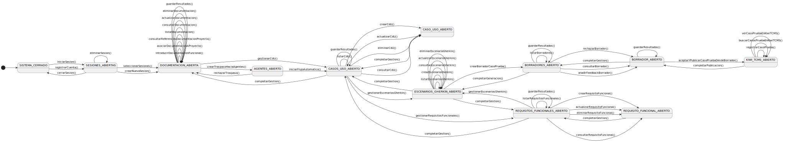
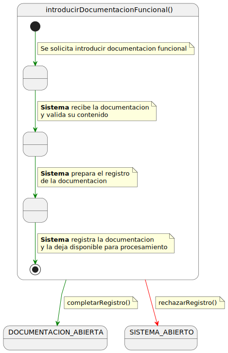
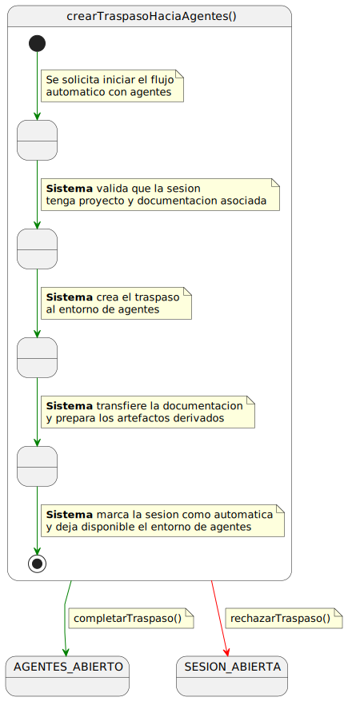
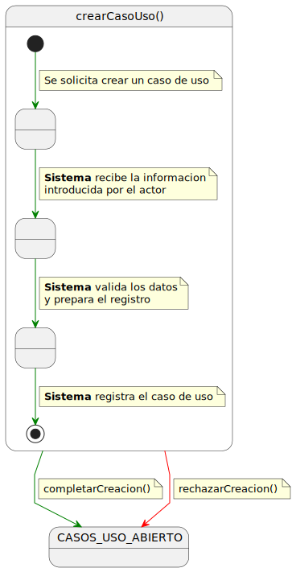
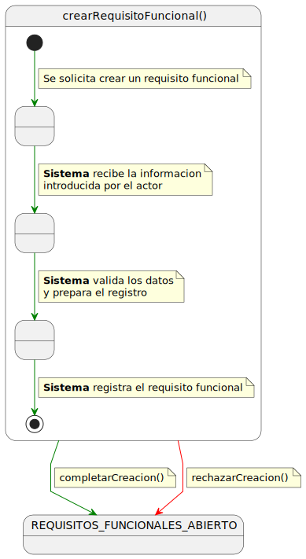
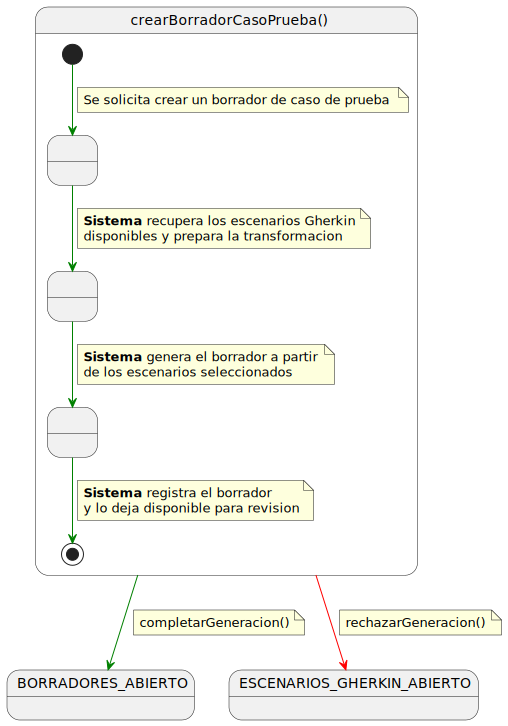
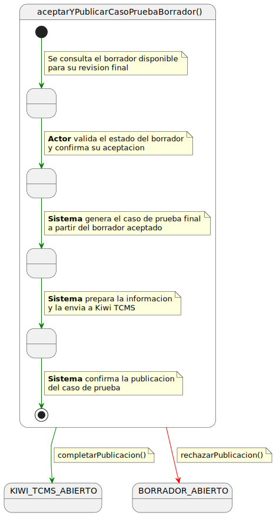

# Navegacion en casos de uso

Este documento relaciona el ciclo de vida funcional del sistema con las pantallas que satisfacen los casos de uso mas importantes. El objetivo es facilitar la navegacion entre cada caso de uso, su pantalla asociada, su correspondencia MVC y las evidencias visuales de los flujos manual y automatico.

## Diagrama de estado del ciclo de vida

El siguiente diagrama resume las acciones principales que puede realizar el sistema dentro del ciclo de vida funcional: introduccion de documentacion, gestion de artefactos, generacion de borradores, revision y publicacion.

## Indice de navegacion

| Caso de uso | Pantalla principal | MVC | Flujo manual | Flujo automatico |
|---|---|---|---|---|
| [UC-03 Introducir documentacion funcional](#uc-03-introducir-documentacion-funcional) | [Ver pantalla](#pantalla-uc-03) | [Ver MVC](#mvc-uc-03) | [Manual](#manual-uc-03) | [Automatico](#automatico-uc-03) |
| [UC-39 Crear traspaso al flujo automatico](#uc-39-crear-traspaso-al-flujo-automatico) | [Ver pantalla](#pantalla-uc-39) | [Ver MVC](#mvc-uc-39) | [Manual](#manual-uc-39) | [Automatico](#automatico-uc-39) |
| [UC-12 Crear caso de uso](#uc-12-crear-caso-de-uso) | [Ver pantalla](#pantalla-uc-12) | [Ver MVC](#mvc-uc-12) | [Manual](#manual-uc-12) | [Automatico](#automatico-uc-12) |
| [UC-17 Crear requisito funcional](#uc-17-crear-requisito-funcional) | [Ver pantalla](#pantalla-uc-17) | [Ver MVC](#mvc-uc-17) | [Manual](#manual-uc-17) | [Automatico](#automatico-uc-17) |
| [UC-21 Crear escenario Gherkin](#uc-21-crear-escenario-gherkin) | [Ver pantalla](#pantalla-uc-21) | [Ver MVC](#mvc-uc-21) | [Manual](#manual-uc-21) | [Automatico](#automatico-uc-21) |
| [UC-25 Crear borrador de caso de prueba](#uc-25-crear-borrador-de-caso-de-prueba) | [Ver pantalla](#pantalla-uc-25) | [Ver MVC](#mvc-uc-25) | [Manual](#manual-uc-25) | [Automatico](#automatico-uc-25) |
| [UC-30 Aceptar y publicar caso de prueba](#uc-30-aceptar-y-publicar-caso-de-prueba) | [Ver pantalla](#pantalla-uc-30) | [Ver MVC](#mvc-uc-30) | [Manual](#manual-uc-30) | [Automatico](#automatico-uc-30) |

---

## UC-03 Introducir documentacion funcional

### Detalle funcional

- **Actor:** Ingeniero de QA
- **Descripcion:** Permite introducir documentacion funcional en texto y clasificarla como DRF o DDS.
- **Precondiciones:** El actor ha iniciado sesion y existe una sesion de trabajo.
- **Flujo principal:** 1. El actor introduce proyecto, tipo de documento, etiqueta, titulo y contenido. 2. El sistema valida los datos obligatorios. 3. El sistema registra la documentacion en la sesion. 4. El sistema deja la documentacion disponible para el flujo manual o automatico.
- **Casos de Error:** Proyecto vacio, contenido vacio, tipo de documento no valido o fallo de almacenamiento.
- **Postcondiciones:** La documentacion queda disponible para consulta y procesamiento.
- **Diagrama de detalle:** 

### MVC UC-03

### Pantalla UC-03

## UC-39 Crear traspaso al flujo automatico

### Detalle funcional

- **Actor:** Ingeniero de QA
- **Descripcion:** Permite transferir una sesion con documentacion al entorno de agentes para preparar artefactos y borradores de forma automatica.
- **Precondiciones:** El actor ha iniciado sesion, existe una sesion con proyecto y hay documentacion asociada.
- **Flujo principal:** 1. El actor elige continuar con el flujo de agentes. 2. El sistema valida que la sesion tenga proyecto y documentacion. 3. El sistema crea el traspaso al entorno de agentes. 4. El entorno de agentes recupera la documentacion de la sesion y prepara artefactos derivados. 5. El sistema guarda la referencia al entorno de agentes y marca la sesion como automatica. 6. El actor puede abrir el entorno de agentes para continuar la revision.
- **Casos de Error:** Sesion no encontrada, proyecto vacio, sesion sin documentacion o entorno de agentes no disponible.
- **Postcondiciones:** La sesion queda en modo automatico y el actor puede continuar el trabajo desde el entorno de agentes.
- **Diagrama de detalle:** 

### MVC UC-39

### Flujo UC-39

Su finalidad es cambiar la sesion desde la aplicacion manual hacia el entorno de agentes. La pantalla previa permite elegir entre continuar manualmente o iniciar el flujo automatico.

---

## UC-12 Crear caso de uso

### Detalle funcional

- **Actor:** Ingeniero de QA
- **Descripcion:** Permite crear manualmente un caso de uso local.
- **Precondiciones:** El actor ha iniciado sesion y la sesion permite flujo manual.
- **Flujo principal:** 1. El actor abre el formulario. 2. Introduce identificador, nombre, descripcion, actores, condiciones y flujos. 3. El sistema valida los datos. 4. El sistema registra el caso de uso y actualiza la trazabilidad de la sesion.
- **Casos de Error:** Identificador vacio, nombre vacio, sesion inexistente o sesion en modo automatico.
- **Postcondiciones:** Se crea un nuevo caso de uso local.
- **Diagrama de detalle:** 

### MVC UC-12

### Flujo manual UC-12

### Flujo automatico UC-12

---

## UC-17 Crear requisito funcional

### Detalle funcional

- **Actor:** Ingeniero de QA
- **Descripcion:** Permite crear manualmente un requisito funcional local.
- **Precondiciones:** El actor ha iniciado sesion y la sesion permite flujo manual.
- **Flujo principal:** 1. El actor abre el formulario. 2. Introduce identificador, texto, prioridad, caso de uso asociado, cita fuente y notas. 3. El sistema valida los datos y la trazabilidad. 4. El sistema registra el requisito.
- **Casos de Error:** Identificador vacio, texto vacio, caso de uso asociado inexistente o sesion en modo automatico.
- **Postcondiciones:** Se crea un nuevo requisito funcional.
- **Diagrama de detalle:** 

### MVC UC-17

### Flujo manual UC-17

### Flujo automatico UC-17

---

## UC-21 Crear escenario Gherkin

### Detalle funcional

- **Actor:** Ingeniero de QA
- **Descripcion:** Permite crear manualmente un escenario Gherkin asociado a artefactos funcionales.
- **Precondiciones:** La sesion permite flujo manual.
- **Flujo principal:** 1. El actor abre el formulario de escenario. 2. Introduce titulo, feature, etiquetas, caso de uso, requisitos asociados, background, pasos y ejemplos. 3. El sistema valida datos y trazabilidad. 4. El sistema registra el escenario.
- **Casos de Error:** Titulo vacio, pasos vacios, referencias inexistentes o sesion en modo automatico.
- **Postcondiciones:** Se crea un nuevo escenario Gherkin.
- **Diagrama de detalle:** 

### MVC UC-21

### Flujo manual UC-21

### Flujo automatico UC-21

---

## UC-25 Crear borrador de caso de prueba

### Detalle funcional

- **Actor:** Ingeniero de QA
- **Descripcion:** Permite construir un borrador de caso de prueba a partir de los artefactos disponibles.
- **Precondiciones:** Existe una sesion manual con artefactos funcionales o escenarios suficientes.
- **Flujo principal:** 1. El actor solicita crear o ensamblar un borrador. 2. Indica resumen, categoria y prioridad. 3. El sistema recopila documentacion, casos de uso, requisitos y escenarios asociados. 4. El sistema construye y registra el borrador.
- **Casos de Error:** Sesion no encontrada, sesion en modo automatico o fallo al guardar el borrador.
- **Postcondiciones:** Se crea o actualiza un borrador pendiente de revision.
- **Diagrama de detalle:** 

### MVC UC-25

### Flujo manual UC-25

### Flujo automatico UC-25

---

## UC-30 Aceptar y publicar caso de prueba

### Detalle funcional

- **Actor:** Ingeniero de QA
- **Descripcion:** Permite aceptar un borrador y publicarlo como caso de prueba en Kiwi TCMS.
- **Precondiciones:** Existe un borrador con contenido y la integracion con Kiwi TCMS esta disponible.
- **Flujo principal:** 1. El actor revisa el borrador. 2. El sistema confirma la publicacion. 3. El sistema envia el contenido del borrador a Kiwi TCMS. 4. Kiwi TCMS registra el caso. 5. El sistema guarda el identificador devuelto y marca el borrador como publicado.
- **Casos de Error:** Borrador no encontrado, borrador sin contenido, fallo de integracion o error de publicacion.
- **Postcondiciones:** El caso de prueba queda publicado y el borrador queda marcado como publicado.
- **Diagrama de detalle:** 

### MVC UC-30

### Flujo manual UC-30

### Flujo automatico UC-30

[Volver al capitulo 4](Capitulo_4.md)
