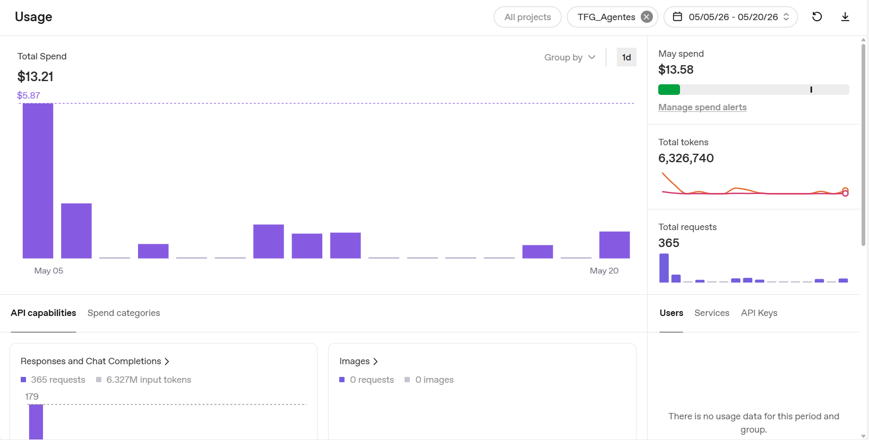

# Conclusiones

Este capítulo expone una reflexión final sobre la solución presentada, los resultados obtenidos durante su aplicación, las limitaciones encontradas, el aprendizaje adquirido y las posibles líneas de mejora que permitirían ampliar el alcance del trabajo.

## Facturación de IA, métricas de uso y estimación a largo plazo

Todos los agentes desarrollados dentro del sistema utilizan modelos LLM mediante la API de OpenAI. Por este motivo, el coste del sistema depende del consumo de tokens generado durante el análisis documental, la extracción de requisitos, la generación de escenarios Gherkin y la revisión de borradores.

| Métrica              | Valor aproximado/mes |
|-----------------------|----------------------|
| Requests realizadas   | 360 |
| Tokens consumidos     | 6.295.693 |
| Gasto observado       | ±13 € |
| Modelo utilizado      | GPT-5.2 |
| Tipo de facturación   | Pago por uso |

| Escenario                 | Uso estimado                                  | Coste aproximado |
|---------------------------|-----------------------------------------------|------------------|
| Desarrollo individual     | 1 usuario ocasional                           | 10 € – 30 €/mes |
| Equipo QA pequeño         | 3–5 usuarios diarios                          | 50 € – 200 €/mes |
| Uso empresarial medio     | Generación frecuente de artefactos            | 200 € – 1000 €/mes |
| Automatización intensiva  | Alto volumen documental y uso continuo        | >1000 €/mes |

## Valoración cualitativa, cuantitativa y métricas de productividad

Para evaluar el impacto del sistema desarrollado se realizó una valoración cualitativa basada en una pequeña entrevista de satisfacción durante las pruebas del prototipo.

A nivel general, la percepción obtenida de la entrevista con el cliente fue positiva, especialmente en la reducción del tiempo de preparación de pruebas, la disminución de tareas repetitivas, la facilidad para generar escenarios Gherkin y la mejora de productividad dentro del flujo de QA.

| Proceso                    | Resultado obtenido                                   | Tiempo empleado |
|----------------------------|------------------------------------------------------|------------------|
| Flujo manual               | 1 caso de prueba con 1 escenario Gherkin             | 2 min 06 s |
| Flujo mediante agentes IA  | 13 casos de prueba con 96 escenarios Gherkin         | 4 min 16 s |

| Métrica Comparativa de productividad        | Flujo manual | Flujo con IA |
|---------------------------------------------|---------------|---------------|
| Casos de prueba generados                   | 1 | 13 |
| Escenarios Gherkin generados                | 1 | 96 |
| Casos generados por minuto                  | ±0,47 | ±3 |
| Escenarios generados por minuto             | ±0,47 | ±22,5 |
| Incremento aproximado de productividad      | - | x6,4 en casos / x48 en escenarios |

- Los resultados muestran que el uso de agentes de IA reduce el tiempo necesario para generar casos de prueba y aumenta considerablemente el volumen de escenarios generados dentro del mismo intervalo temporal.

## Limitaciones del sistema desarrollado

Aunque el prototipo cumple con el objetivo planteado, presenta una serie de limitaciones que deben tenerse en cuenta a la hora de interpretar los resultados obtenidos.

En primer lugar, se trata de un prototipo funcional desarrollado y validado en un entorno controlado. Esto significa que el sistema permite comprobar la viabilidad de la propuesta, pero no puede considerarse todavía una solución preparada para producción sin realizar antes tareas adicionales de endurecimiento, despliegue, seguridad, monitorización y mantenimiento.

Una limitación importante es que el flujo manual y el flujo automático funcionan como dos vías diferenciadas. Una vez que una sesión se traspasa al flujo de agentes, queda marcada como automática y no se contempla volver al flujo manual dentro de esa misma sesión. Esta decisión simplifica el control del prototipo y evita mezclar estados, pero reduce la flexibilidad para el usuario final.

Otra limitación está relacionada con la persistencia de los artefactos generados por los agentes. Mientras que la aplicación web utiliza MongoDB como base de datos principal, el subsistema de agentes almacena parte de sus resultados en ficheros JSON locales durante el desarrollo. Esta solución ha sido suficiente para el prototipo, pero no es la opción más adecuada para un entorno real, ya que dificulta la concurrencia, la trazabilidad centralizada y la gestión robusta de versiones.

También debe tenerse en cuenta la dependencia de servicios externos y configuración previa. La publicación en Kiwi TCMS requiere que la API XML-RPC esté disponible y que los identificadores de producto, categoría, prioridad, estado y clasificación estén correctamente configurados. Si alguno de estos parámetros cambia o no está disponible, la publicación puede fallar.

En cuanto al uso de Inteligencia Artificial, los resultados generados por los agentes dependen de la calidad de la documentación de entrada, del modelo utilizado y del contexto proporcionado. Aunque el sistema estructura la información y mantiene una revisión humana antes de publicar, no puede garantizar por sí solo que todos los casos de uso, requisitos o escenarios generados sean completos, correctos o suficientes. Por este motivo, el enfoque *Human-In-The-Loop* sigue siendo necesario.

## Aprendizaje obtenido

Durante el desarrollo de este trabajo he aprendido cómo se construyen agentes de Inteligencia Artificial y cómo pueden integrarse dentro de una solución software actual. También he podido trabajar con tecnologías modernas y comprender cómo se conectan entre sí diferentes componentes como una aplicación web, una base de datos, una API externa y un sistema multiagente.

Además, el proyecto me ha permitido acercarme a un entorno real de empresa, interactuar con un equipo de trabajo y plantear una solución para una necesidad concreta de un cliente real. Esto ha sido especialmente útil para entender que una solución técnica no solo debe funcionar, sino que también debe adaptarse al contexto, a los procesos existentes y a las necesidades del usuario final.

Otro aprendizaje importante ha sido comprender que los agentes de IA todavía necesitan supervisión humana mediante un enfoque *Human-In-The-Loop*. La revisión humana sigue siendo necesaria para validar la coherencia, detectar posibles errores y aportar confianza al proceso de QA. Esto demuestra que actualmente la IA actúa principalmente como una herramienta de apoyo al ingeniero de QA, no como un sustituto completo del criterio humano.

## Mejoras futuras

Como mejora futura, sería conveniente revisar la gestión de los ficheros JSON utilizados por los agentes. Estos podrían almacenarse en un repositorio externo de archivos o incluso eliminarse para que toda la información se gestione directamente desde la aplicación y una base de datos común.

También sería interesante unificar más el flujo de trabajo, de forma que, al seleccionar el modo de agentes desde la aplicación, estos trabajen en segundo plano y devuelvan los resultados directamente en la misma interfaz. Esto haría que el sistema fuese más sencillo de entender y utilizar para el ingeniero de QA.

Otra mejora sería ampliar el número de agentes de IA especializados, por ejemplo un agente de pruebas E2E, un agente de análisis de código, un agente de mensajes o un agente sanador de fallos. Además, se podría crear un segundo flujo automático que, a partir de los casos de prueba publicados en Kiwi TCMS y leyendo el código de la aplicación, generase pruebas E2E en Cypress. De esta forma, el sistema no solo ayudaría a preparar casos de prueba, sino que también podría avanzar hacia la automatización completa del testing.

Por último, en un entorno de producción real sería necesario adaptar y endurecer la configuración del sistema, incorporando aspectos como gestión segura de credenciales, control de acceso, despliegue escalable, almacenamiento persistente externo, monitorización, observabilidad y optimización del consumo de recursos e IA.
