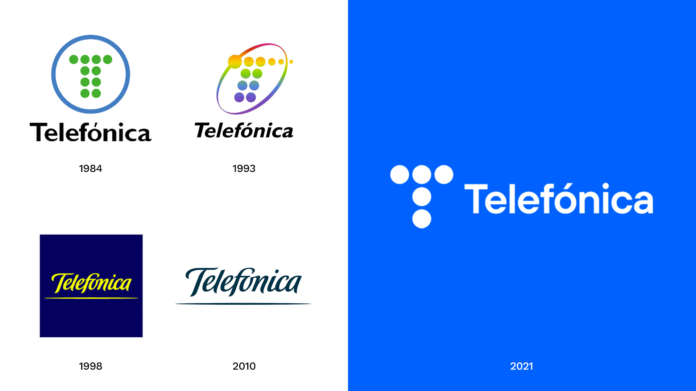
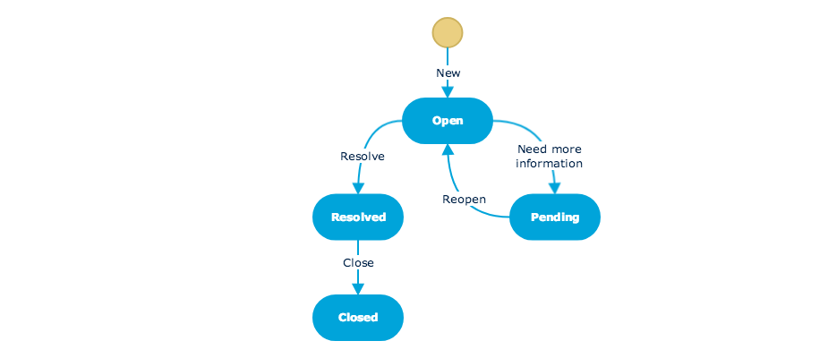
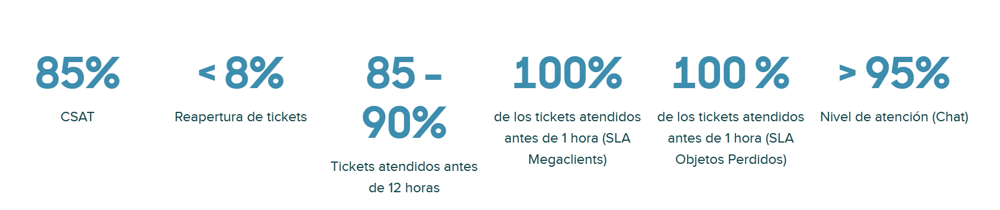

# 1. Introducción
## 1.1 Contexto del sector de las telecomunicaciones

El sector de las telecomunicaciones constituye uno de los pilares fundamentales de la economía digital actual. Las infraestructuras de telecomunicaciones permiten el funcionamiento de servicios esenciales como el acceso a internet, la telefonía móvil, la transmisión de datos o los servicios digitales avanzados utilizados por empresas, administraciones públicas y ciudadanos.

Durante las últimas décadas, el sector ha experimentado una profunda transformación tecnológica. La evolución desde redes analógicas hacia infraestructuras digitales, el despliegue de redes de fibra óptica y la expansión de las redes móviles de alta capacidad han incrementado notablemente la complejidad de la gestión de las infraestructuras de telecomunicaciones.

En la actualidad, los operadores de telecomunicaciones deben gestionar redes altamente distribuidas que incluyen miles de kilómetros de cableado, estaciones base, nodos de acceso, centros de conmutación y múltiples sistemas de soporte. Esta infraestructura debe mantenerse operativa de forma continua, garantizando niveles elevados de disponibilidad y calidad de servicio.

Además, el desarrollo urbano y la ejecución de obras civiles generan de forma constante modificaciones o afectaciones sobre las infraestructuras existentes. Proyectos de urbanización, construcción de carreteras, desarrollo de nuevas zonas residenciales o ampliación de infraestructuras públicas pueden requerir intervenciones sobre redes de telecomunicaciones ya desplegadas.

En este contexto, las empresas operadoras deben gestionar numerosos expedientes relacionados con variaciones en la infraestructura de red, tales como desplazamientos de cableado, modificaciones en canalizaciones, adaptación de infraestructuras existentes o coordinación con proyectos urbanísticos. Estas actuaciones requieren una coordinación constante entre diferentes actores, incluyendo administraciones públicas, empresas constructoras, ingenierías y departamentos internos de las propias compañías.

Como consecuencia, la gestión administrativa y técnica asociada a estas actuaciones genera un elevado volumen de documentación, consultas y comunicaciones que deben ser gestionadas de forma eficiente.

## 1.2 Telefónica como organización del sector de las telecomunicaciones

Telefónica es una de las principales compañías multinacionales del sector de las telecomunicaciones a nivel mundial. Fundada en 1924 en España, la empresa ha evolucionado desde un operador nacional de telefonía fija hasta convertirse en un grupo tecnológico global con presencia en múltiples países de Europa y Latinoamérica.

Actualmente Telefónica ofrece una amplia gama de servicios de comunicaciones, entre los que se incluyen telefonía fija, telefonía móvil, acceso a internet de banda ancha, servicios de transmisión de datos y soluciones digitales orientadas tanto a clientes particulares como a empresas y administraciones públicas.

Además de la provisión de servicios de conectividad, la compañía desarrolla soluciones en ámbitos como la transformación digital, la ciberseguridad, el cloud computing o los servicios de gestión de redes. Estas actividades requieren la gestión de una infraestructura tecnológica compleja y altamente distribuida, formada por redes de fibra óptica, redes móviles, centros de datos y múltiples sistemas de soporte.

En el ámbito organizativo, Telefónica cuenta con diferentes áreas especializadas responsables de la planificación, despliegue, mantenimiento y evolución de la red de telecomunicaciones. Estas áreas gestionan tanto los aspectos técnicos de la infraestructura como los procesos administrativos asociados a la operación de la red.

En noviembre de 2025 la compañía contaba con aproximadamente 24.000 trabajadores en España, cifra que se ha reducido a aproximadamente 22.000 empleados en marzo de 2026 tras los procesos de reorganización interna derivados de los últimos planes de ajuste. [3](enlaces.md)

## 1.3 Contexto organizativo del proyecto

Dentro de la estructura organizativa de Telefónica, la gestión de la red se divide tradicionalmente en dos grandes áreas operativas: Planta Interna y Planta Externa.

La Planta Interna se encarga principalmente de la gestión técnica y administrativa de los elementos de red ubicados dentro de infraestructuras propias de la compañía, como centrales, centros de datos o instalaciones técnicas.

Por otro lado, la Planta Externa es responsable del despliegue, mantenimiento, modificación y supervisión de la infraestructura de telecomunicaciones situada en el entorno urbano y rural. Esto incluye cableado, canalizaciones, arquetas, postes, cajas terminales y otros elementos que forman parte de la red física desplegada en la vía pública.

El presente Trabajo de Fin de Grado se desarrolla dentro del ámbito de la Planta Externa, concretamente en el departamento encargado de la gestión de variaciones de infraestructura.

Este departamento tiene como función principal la gestión de solicitudes relacionadas con modificaciones en instalaciones existentes, afectaciones sobre la red o expedientes técnicos asociados a proyectos urbanísticos y obras civiles que puedan impactar sobre la infraestructura de telecomunicaciones.

# 2. Marco Teórico

## 2.1 Estado del Arte

El buzón analizado constituye uno de los principales canales de entrada de solicitudes relacionadas con expedientes, actuaciones y peticiones dentro del entorno operativo. Actualmente, este buzón recibe un volumen aproximado de 1.000 correos electrónicos diarios, procedentes de distintos interlocutores que solicitan información o requieren alguna gestión relacionada con expedientes concretos. Este volumen elevado de comunicaciones, unido a la diversidad de las consultas recibidas, genera una carga operativa significativa para el equipo encargado de su gestión.

La situación se ve agravada por la reducción de recursos humanos, lo que provoca que el número de técnicos disponibles para gestionar estas solicitudes sea menor que en etapas anteriores. Como consecuencia, se incrementa la presión sobre el equipo encargado del buzón y se producen retrasos en la atención de determinadas consultas, pudiendo llegar incluso a acumularse correos pendientes de respuesta. Este contexto pone de manifiesto la necesidad de analizar el proceso actual y valorar posibles mejoras que permitan optimizar su funcionamiento.

El proceso de gestión del buzón se realiza actualmente de forma completamente manual. Cada vez que llega un nuevo correo, un técnico debe revisar su contenido para interpretar la solicitud planteada. En muchos casos, el mensaje hace referencia a un número identificador, normalmente asociado a un expediente, actuación o petición concreta. Cuando esto ocurre, el técnico debe acceder a diversas aplicaciones corporativas (como Sgipe, Atlas o Petter) con el objetivo de localizar la información correspondiente.

Una vez identificado el expediente en las aplicaciones internas, el técnico debe recopilar la información relevante, analizar su estado y utilizar estos datos para redactar manualmente la respuesta que será enviada al solicitante. Este procedimiento implica navegar entre diferentes sistemas, localizar los datos necesarios y elaborar una respuesta adecuada para cada caso.

De forma simplificada, el proceso actual puede resumirse en las siguientes fases:

+ Recepción del correo en el buzón del canal de entrada.
+ Lectura e interpretación de la solicitud por parte de un técnico.

+ Identificación de números de expediente o referencias, si existen.

+ Consulta de información en Sgipe, Atlas, Petter, etc.

+ Elaboración manual de la respuesta y envío al solicitante.

En aquellos casos en los que el correo no incluye ningún número identificador, el proceso requiere un análisis adicional. El técnico debe interpretar el contenido del mensaje para determinar qué tipo de solicitud se está realizando y decidir si puede gestionarla directamente o si debe redirigir el correo al área o departamento correspondiente. Esta tarea de clasificación también se realiza manualmente y depende de la experiencia y criterio del técnico.

Este modelo de gestión presenta varias limitaciones que afectan directamente a la eficiencia del proceso. En primer lugar, existe una alta dependencia del factor humano, ya que todas las tareas se realizan manualmente. Esto dificulta la posibilidad de automatizar parte del proceso y limita la capacidad de adaptación ante incrementos en el volumen de correos.

Entre las principales limitaciones del modelo actual destacan:

+ Dependencia del trabajo manual, lo que ralentiza la gestión del buzón.

+ Escasa escalabilidad, ya que el aumento del volumen de correos requiere más recursos humanos.

+ Repetitividad de muchas consultas, especialmente aquellas relacionadas con el estado de expedientes.

+ Riesgo de error humano, tanto en la interpretación de los correos como en la transcripción de datos.

+ Incremento del tiempo medio de respuesta, debido a la necesidad de consultar múltiples sistemas de forma manual.

En conjunto, la combinación de alto volumen de correos, procesos manuales y limitación de recursos genera un entorno en el que la gestión del buzón resulta cada vez más compleja. Por este motivo, se identifica una clara oportunidad de mejora mediante la introducción de mecanismos de automatización, especialmente en aquellas tareas repetitivas como la identificación de números de expediente, la consulta de información en sistemas corporativos y la generación de respuestas estándar. Estas mejoras permitirían reducir la carga operativa del equipo y mejorar la eficiencia del proceso de gestión del buzón.

## 2.2 Soluciones existentes para la gestión de grandes volúmenes de correo

El problema de gestionar grandes volúmenes de correos electrónicos no es exclusivo del contexto analizado, sino que constituye una situación habitual en múltiples organizaciones que gestionan servicios de atención al cliente, soporte técnico o procesos administrativos. Muchas empresas reciben diariamente cientos o miles de consultas por correo electrónico, lo que genera cargas operativas significativas y dificulta mantener tiempos de respuesta adecuados. En este contexto, diferentes organizaciones han adoptado diversas estrategias para mejorar la gestión de estas comunicaciones.

Entre las soluciones más habituales se encuentran la ampliación de recursos humanos, la implantación de sistemas de ticketing o helpdesk, y más recientemente la automatización mediante inteligencia artificial y sistemas de clasificación automática de correos.

### Incremento de recursos humanos

Una de las soluciones más tradicionales consiste en aumentar el número de empleados encargados de gestionar el buzón de correo. Este enfoque ha sido ampliamente utilizado en departamentos de atención al cliente o soporte técnico, donde el incremento del volumen de solicitudes suele resolverse mediante la ampliación del equipo de agentes.

La lógica de este enfoque consiste en incrementar la capacidad operativa del servicio mediante la incorporación de más personal que se encargue de leer los correos recibidos, analizar las solicitudes y proporcionar una respuesta adecuada a cada caso.

Un ejemplo de este enfoque puede observarse en grandes centros de atención al cliente. Empresas como Amazon o Telefónica han incrementado en distintos momentos el número de agentes de soporte para hacer frente a picos de demanda en sus servicios de atención al cliente.

Por ejemplo, Amazon ha ampliado en diversas ocasiones su plantilla de atención al cliente para poder gestionar el crecimiento del comercio electrónico y el aumento de consultas de usuarios, especialmente en periodos de alta demanda como campañas comerciales o eventos de venta online. [6](enlaces.md)

**Ventajas**
+ Permite aumentar la capacidad de respuesta de forma inmediata.

+ No requiere cambios tecnológicos ni modificaciones en los sistemas existentes.

+ Mantiene una gestión completamente humana de las solicitudes.

**Limitaciones**
+ No escala de forma eficiente ante incrementos continuos del volumen de correos.

+ Supone un incremento directo de los costes operativos.

+ Requiere procesos de formación y adaptación del personal.

### Sistemas de ticketing o helpdesk

Otra de las soluciones ampliamente adoptadas por las empresas consiste en implantar sistemas de ticketing, que permiten transformar los correos electrónicos recibidos en incidencias o solicitudes gestionadas mediante un sistema centralizado.

Un sistema de ticketing convierte cada correo recibido en un ticket identificado con un número único, lo que permite registrar, clasificar, priorizar y realizar el seguimiento de cada solicitud. Estos sistemas permiten organizar las consultas recibidas, asignarlas a distintos equipos y realizar un seguimiento del estado de cada caso.

Además, muchas de estas herramientas incorporan funciones de automatización que permiten asignar tickets automáticamente a determinados departamentos, priorizar incidencias o generar respuestas automáticas.

Entre las herramientas más utilizadas en el mercado destacan plataformas como Zendesk, Zoho Desk, Jira Service Management o Kayako.

Numerosas empresas utilizan sistemas de ticketing para gestionar sus servicios de soporte. Un ejemplo es la empresa tecnológica Cabify, que utiliza la plataforma Zendesk para gestionar las consultas de sus clientes y centralizar todas las solicitudes recibidas desde diferentes canales de comunicación.

Gracias a esta herramienta, la empresa puede organizar las solicitudes en tickets, asignarlas a distintos equipos y realizar un seguimiento del estado de cada incidencia. [14](enlaces.md)

En el caso de Telefónica, se desarrolló un portal interno basado en principios de gestión de servicios IT (IT Service Management) conocido como ITSM portal.

Este portal actúa como punto centralizado para la gestión de solicitudes, incidencias y consultas relacionadas con distintos servicios internos de la compañía. A través de esta plataforma, los usuarios pueden registrar peticiones o incidencias que posteriormente son procesadas mediante sistemas de ticketing y asignadas a los equipos responsables de su resolución.

El portal ITSM permite estructurar las solicitudes recibidas, registrar su estado de tramitación y mantener un seguimiento de las actuaciones realizadas, facilitando así la gestión coordinada de los distintos procesos internos. De este modo, herramientas como Argonauta o sistemas similares de gestión de incidencias se integran dentro de un entorno más amplio de gestión de servicios, permitiendo centralizar y organizar el flujo de trabajo asociado a la resolución de consultas y problemas operativos.

**Ventajas**
+ Centralización de todas las solicitudes en una única plataforma.

+ Mejora en la trazabilidad y seguimiento de las incidencias.

+ Posibilidad de establecer prioridades y acuerdos de nivel de servicio.

+ Automatización parcial de procesos de gestión.

**Limitaciones**
+ Coste de licencias y mantenimiento.

+ Necesidad de integración con los sistemas internos de la organización.

+ Adaptación limitada a procesos específicos de cada empresa.

### Automatización mediante inteligencia artificial

En los últimos años, muchas empresas han comenzado a incorporar tecnologías de inteligencia artificial y procesamiento del lenguaje natural en sus procesos de atención y gestión de correos electrónicos.

Estas soluciones permiten analizar automáticamente el contenido de los correos recibidos para identificar su temática, clasificar las solicitudes o dirigirlas al departamento correspondiente. En algunos casos, estas herramientas también pueden generar respuestas automáticas o sugerencias de respuesta para los agentes de soporte.

El objetivo de estas tecnologías es reducir la carga de trabajo manual asociada a la lectura y clasificación de correos, permitiendo gestionar grandes volúmenes de solicitudes de forma más eficiente.

Un ejemplo de aplicación de estas tecnologías se encuentra en Bosch Service Solutions, que ha implementado sistemas basados en inteligencia artificial para analizar y clasificar automáticamente los correos electrónicos recibidos por sus servicios de atención al cliente. [1](enlaces.md)

Este sistema utiliza técnicas de aprendizaje automático para analizar el contenido de los correos y asignarlos automáticamente al departamento correspondiente. Gracias a esta automatización, la empresa ha conseguido reducir significativamente el tiempo necesario para procesar cada solicitud.

**Ventajas**
+ Reducción significativa del trabajo manual.

+ Mejora en la velocidad de clasificación de solicitudes.

+ Capacidad para gestionar grandes volúmenes de correos.

+ Optimización del tiempo de los agentes de soporte.

**Limitaciones**

+ Necesidad de grandes volúmenes de datos para entrenar los modelos.

+ Coste de desarrollo e implementación.

+ Requiere personal técnico especializado.

+ Integración compleja con sistemas corporativos existentes.

# 3. Justificación de la propuesta

Tras analizar las diferentes soluciones existentes para la gestión de grandes volúmenes de correos electrónicos, se observa que las organizaciones suelen optar por tres enfoques principales: la ampliación de recursos humanos, la implantación de sistemas de ticketing o helpdesk, y la automatización mediante inteligencia artificial o sistemas de clasificación automática.

Aunque estas soluciones han demostrado ser eficaces en determinados contextos empresariales, no siempre resultan adecuadas para todos los entornos organizativos. En el caso del buzón analizado en este proyecto, la adopción directa de estas alternativas presenta una serie de limitaciones que dificultan su implementación.

En primer lugar, la opción de incrementar los recursos humanos no se considera una solución óptima desde el punto de vista operativo y económico. Este enfoque implica un aumento directo de los costes asociados al personal, así como la necesidad de realizar procesos de selección, formación y gestión del equipo. Además, no resuelve el problema estructural del proceso, ya que el modelo seguiría dependiendo de una gestión manual de los correos electrónicos.

Por otro lado, la implantación de sistemas de ticketing comerciales tampoco se considera la alternativa más adecuada para el contexto analizado. Aunque estas herramientas permiten centralizar las solicitudes y mejorar la trazabilidad de las incidencias, su integración con los sistemas corporativos existentes puede resultar compleja. En este caso concreto, la información necesaria para responder a los correos se encuentra distribuida en diversas aplicaciones internas, como sistemas de gestión de expedientes o plataformas de seguimiento de actuaciones. La adaptación de un sistema de ticketing a este entorno requeriría procesos de integración adicionales y podría introducir nuevas capas de complejidad en el flujo de trabajo.

Asimismo, las soluciones basadas en inteligencia artificial avanzada presentan también ciertas barreras para su adopción directa. Aunque estas tecnologías ofrecen un gran potencial para automatizar la clasificación y gestión de correos electrónicos, su implementación suele requerir infraestructuras tecnológicas complejas, grandes volúmenes de datos para el entrenamiento de los modelos y la participación de personal especializado en ciencia de datos o aprendizaje automático. Estas condiciones pueden dificultar su implantación en entornos donde se busca una solución más sencilla y adaptable a los sistemas existentes.

Ante estas limitaciones, se plantea la necesidad de desarrollar una solución adaptada específicamente al contexto del buzón analizado, que permita mejorar la eficiencia del proceso sin introducir cambios estructurales complejos en los sistemas actuales.

La propuesta desarrollada en este proyecto se basa en la automatización parcial del proceso de gestión de correos mediante herramientas de automatización de procesos, combinando tecnologías de integración y tratamiento de datos. El objetivo principal es reducir la carga operativa asociada a la lectura, interpretación y gestión manual de los correos recibidos, manteniendo al mismo tiempo la compatibilidad con las herramientas ya utilizadas por la organización.

Para ello, la solución propuesta utiliza tecnologías como Power Automate, que permite automatizar flujos de trabajo relacionados con la recepción y procesamiento de correos electrónicos, así como la integración con otros servicios y aplicaciones corporativas. Además, se plantea el uso de bases de datos estructuradas para almacenar la información relevante de las solicitudes recibidas, facilitando su seguimiento y análisis posterior.

Este enfoque permite automatizar determinadas tareas del proceso, como la identificación de números de expediente en los correos, el registro de las solicitudes recibidas o la generación de determinadas respuestas, reduciendo así el tiempo necesario para gestionar cada correo.

Entre las principales ventajas de la solución propuesta destacan:

+ Reducción de la carga de trabajo manual, al automatizar tareas repetitivas del proceso.

+ Mejora en los tiempos de respuesta, gracias a la automatización de determinadas acciones.

+ Compatibilidad con los sistemas existentes, evitando la necesidad de sustituir las herramientas actuales.

+ Coste de implementación reducido, al utilizar tecnologías ya disponibles dentro del entorno corporativo.

+ Escalabilidad, permitiendo gestionar un mayor volumen de correos sin incrementar proporcionalmente los recursos humanos.

En conjunto, la solución propuesta busca ofrecer un enfoque equilibrado entre automatización y adaptabilidad, permitiendo mejorar la eficiencia del proceso de gestión del buzón sin introducir cambios drásticos en la infraestructura tecnológica existente.

# 4. Objetivos

Partiendo de la hipótesis planteada anteriormente, según la cual la implementación de un sistema automatizado de análisis y respuesta de correos permitirá mejorar la eficiencia operativa del buzón de variaciones, se establecen una serie de objetivos que guían el desarrollo del presente trabajo.

La consecución de estos objetivos permitirá evaluar si la solución propuesta contribuye a optimizar el proceso actual de gestión del buzón, reduciendo la carga de trabajo manual y mejorando los tiempos de respuesta.

## Objetivo general

El objetivo general de este proyecto consiste en diseñar e implementar una solución que permita automatizar parcialmente la gestión del buzón de variaciones, teniendo en cuenta el estado del arte analizado y las particularidades del entorno en el que se desarrolla el sistema.

Esta solución debe permitir mejorar la eficiencia del proceso actual mediante la automatización de tareas repetitivas, como el análisis de los correos recibidos, la identificación de números de expediente y la generación de respuestas basadas en información obtenida de los sistemas disponibles.

## Objetivos específicos

Para alcanzar el objetivo general se plantean los siguientes objetivos específicos:

### 1. Analizar el problema y definir los requisitos del sistema

Identificar las necesidades del proceso actual de gestión del buzón, analizando el funcionamiento del sistema existente y definiendo los requisitos funcionales y no funcionales que debe cumplir la solución propuesta.

### 2. Diseñar la arquitectura y el funcionamiento de la solución propuesta

Definir la arquitectura del sistema, así como los componentes necesarios para su funcionamiento, incluyendo los flujos de automatización, la estructura de la base de datos y la interacción con los sistemas utilizados en el proceso.

### 3. Implementar una primera versión funcional del sistema

Desarrollar una primera iteración del sistema en forma de producto mínimo viable (MVP) que permita automatizar parte del proceso de gestión del buzón, incluyendo la recepción y análisis de correos, la consulta de información y la generación de respuestas automatizadas.

### 4. Realizar pruebas de funcionamiento del sistema

Diseñar y ejecutar pruebas que permitan validar el correcto funcionamiento de la solución implementada, comprobando que los procesos automatizados se ejecutan de forma adecuada y que el sistema responde correctamente ante diferentes escenarios.

### 5. Poner en funcionamiento la solución en el entorno de trabajo

Integrar la solución desarrollada en el entorno operativo del buzón con el fin de evaluar su comportamiento en condiciones reales de uso.

### 6. Analizar los resultados obtenidos

Evaluar el impacto de la solución implementada en el proceso de gestión del buzón, analizando indicadores como la reducción del tiempo de gestión de los correos, la disminución de la carga de trabajo manual y la eficiencia del sistema automatizado.

## 4.1 Alcance de la propuesta

La solución propuesta en este proyecto tiene como objetivo mejorar la gestión del buzón de correo analizado mediante la automatización de determinadas tareas del proceso actual. Sin embargo, es importante definir claramente el alcance de la solución con el fin de delimitar qué aspectos del proceso se abordan en este trabajo y cuáles quedan fuera del mismo.

El sistema desarrollado se centra principalmente en la automatización de la recepción, análisis y registro de los correos electrónicos recibidos en el buzón, así como en la identificación de determinados elementos clave dentro de los mensajes, como números de expediente, actuaciones o peticiones asociadas.

Para ello, la solución se basa en la utilización de herramientas de automatización de procesos que permiten analizar el contenido de los correos entrantes, extraer información relevante y almacenarla en una base de datos estructurada que facilite su seguimiento y posterior tratamiento.

Dentro del alcance de este proyecto se incluyen las siguientes funcionalidades:

+ Automatización de la recepción y procesamiento de correos electrónicos.

+ Identificación automática de números de expediente, actuaciones o peticiones presentes en los mensajes.

+ Consulta en base de datos de los expedientes para extraer la información necesaria.

+ Generación de una respuesta basada en una plantilla a partir de la información obtenida.

+ Envío automatizado de la respuesta generada al remitente del correo.

+ Generación de un formulario para recoger las reclamaciones, acuerdos y desacuerdos de las consultas.

+ Almacenamiento de la información necesaria en base de datos para el futuro análisis y estudio del funcionamiento del buzón.

Por otro lado, existen algunos aspectos que no forman parte del alcance de este proyecto, entre los que destacan:

+ La sustitución completa del proceso de gestión manual del buzón, ya que existen determinadas situaciones que requieren intervención humana.

+ La implementación de un sistema avanzado de inteligencia artificial entrenado específicamente para interpretar el contenido completo de los correos.

+ La integración completa con todos los sistemas corporativos utilizados por la organización.

+ El análisis avanzado de la información almacenada en la base de datos generada por el sistema.

Por tanto, la solución propuesta debe entenderse como un primer paso hacia la automatización parcial del proceso, centrado principalmente en la optimización de las tareas más repetitivas y en la mejora de la gestión de la información asociada a los correos recibidos.

Este enfoque permite evaluar el impacto de la automatización en el proceso actual sin necesidad de realizar cambios estructurales complejos en los sistemas existentes.

## 4.2 Metodología

Para el desarrollo de la solución propuesta se seguirá una metodología basada en un enfoque iterativo e incremental, que permitirá diseñar, implementar y validar progresivamente los distintos componentes del sistema. Este enfoque resulta especialmente adecuado para proyectos de desarrollo de software de tamaño reducido o medio, como es el caso de este trabajo, ya que permitirá desarrollar una primera versión funcional del sistema e ir incorporando mejoras de forma progresiva.

La metodología adoptada se basará en las principales fases del ciclo de vida del desarrollo de software, adaptadas al contexto del proyecto. Estas fases permitirán estructurar el trabajo de forma ordenada, desde el análisis inicial del problema hasta la implementación y evaluación de la solución.

Las principales etapas del proceso metodológico serán las siguientes:

### Análisis del problema y definición de requisitos

En esta primera fase se realizará un análisis del funcionamiento actual del buzón de correo y de los procesos asociados a su gestión. El objetivo será identificar las necesidades existentes, los problemas del sistema actual y los requisitos que deberá cumplir la solución propuesta.

Durante esta etapa se estudiará el flujo actual de trabajo, las aplicaciones utilizadas para consultar la información de los expedientes y las tareas que realizan los técnicos para gestionar cada correo recibido. A partir de este análisis se definirán los requisitos funcionales y no funcionales que deberá cumplir el sistema automatizado.

### Diseño de la solución

Una vez identificados los requisitos del sistema, se procederá al diseño de la arquitectura de la solución. En esta fase se definirán los diferentes componentes del sistema y la forma en que interactuarán entre sí.

El diseño incluirá la definición de los flujos de automatización encargados de procesar los correos electrónicos, la estructura de la base de datos utilizada para almacenar la información relevante y los mecanismos de generación de respuestas automáticas. Asimismo, se establecerá la forma en que el sistema se integrará con las herramientas y aplicaciones existentes en el entorno de trabajo.

### Implementación del sistema

En esta fase se desarrollará la solución propuesta mediante la configuración de los flujos de automatización y la implementación de los diferentes componentes del sistema.

La implementación incluirá la creación de los procesos encargados de analizar los correos electrónicos recibidos, identificar los números de expediente presentes en los mensajes, consultar la información necesaria en la base de datos y generar las respuestas correspondientes. Además, se implementarán los mecanismos necesarios para registrar la información relevante en la base de datos y permitir su posterior análisis.

El resultado de esta fase será una primera versión funcional del sistema, que actuará como un producto mínimo viable (MVP) capaz de automatizar parte del proceso de gestión del buzón.

### Pruebas y validación del sistema

Una vez desarrollada la solución, se realizarán diferentes pruebas con el objetivo de comprobar el correcto funcionamiento del sistema y validar que cumple los requisitos definidos en las fases anteriores.

Estas pruebas permitirán verificar que los correos serán procesados correctamente, que los números de expediente serán identificados de forma adecuada y que las respuestas generadas contendrán la información esperada.

### Evaluación de resultados

Finalmente, se analizará el comportamiento del sistema una vez puesto en funcionamiento, evaluando su impacto en el proceso de gestión del buzón.

En esta fase se estudiarán diferentes indicadores que permitirán medir la eficiencia de la solución implementada, como la reducción del tiempo necesario para gestionar cada correo o la disminución de la carga de trabajo manual del personal.

El análisis de estos resultados permitirá determinar si la solución propuesta contribuye a validar la hipótesis planteada en el proyecto.

## 4.3 Hipótesis

La hipótesis planteada en este proyecto es:

*La implementación de un sistema automatizado de análisis y respuesta de correos mejorará la eficiencia operativa del buzón de variaciones, reduciendo los tiempos de respuesta y la carga de trabajo manual del personal*

En la situación actual, la gestión del buzón se realiza principalmente de forma manual. Cada correo recibido debe ser leído e interpretado por un técnico, quien posteriormente debe identificar si el mensaje hace referencia a algún número de expediente, actuación o petición. Una vez identificado, el técnico debe acceder a diferentes aplicaciones corporativas para consultar la información asociada y elaborar la respuesta correspondiente. Este procedimiento implica una serie de tareas repetitivas que consumen una parte significativa del tiempo de trabajo y que, además, incrementan la posibilidad de retrasos en la gestión de las solicitudes.

En el contexto analizado, el buzón recibe aproximadamente 1000 correos electrónicos diarios, cuya gestión recae actualmente en un equipo formado por alrededor de 15 técnicos. En la situación actual, cada correo requiere un proceso manual que incluye la lectura del mensaje, la identificación del número de expediente o actuación, la consulta de información en diferentes aplicaciones corporativas y la elaboración de una respuesta adecuada.

A partir de las observaciones realizadas durante el análisis del proceso, se estima que el tiempo medio necesario para gestionar cada correo se sitúa aproximadamente en 30 minutos. Esto implica que la gestión manual de 1000 correos diarios requeriría aproximadamente:

+ 1000 correos × 15 minutos = 15.000 minutos
+ 15.000 minutos = 250 horas de trabajo diario

Si esta carga de trabajo se distribuye entre 15 técnicos, cada uno debería dedicar aproximadamente 16.7 horas de trabajo para poder gestionar la totalidad de los correos recibidos en una jornada, lo que evidencia que el volumen actual de consultas supera la capacidad operativa del sistema manual.

Además, en el contexto organizativo actual, marcado por procesos de optimización de recursos y reducción de plantilla, resulta especialmente relevante mejorar la eficiencia de los procesos operativos. En este escenario, el objetivo de la solución propuesta no consiste únicamente en reducir los tiempos de gestión de los correos, sino también en disminuir la dependencia de recursos humanos dedicados exclusivamente a la atención del buzón.

La solución planteada busca automatizar gran parte del proceso de análisis y respuesta de los correos electrónicos mediante herramientas de automatización capaces de identificar automáticamente los números de expediente mencionados, consultar la información asociada en las bases de datos disponibles y generar respuestas basadas en plantillas predefinidas.

Bajo esta hipótesis, se plantea que el sistema automatizado podría reducir el tiempo medio de procesamiento de los correos hasta aproximadamente 1 minuto por correo en aquellas consultas que puedan resolverse automáticamente.

En este escenario, el tiempo total necesario para procesar los 1000 correos diarios se reduciría a:

+ 1000 correos × 1 minuto = 1000 minutos
+ 1000 minutos = 16,7 horas de trabajo diario

Esto supondría una reducción aproximada del 96,7 % del tiempo dedicado al proceso de gestión de correos, pasando de 500 horas de trabajo manual a aproximadamente 16,7 horas.

La automatización de este proceso permitiría que el buzón pudiera gestionarse prácticamente sin intervención humana directa en la mayoría de los casos, lo que permitiría reorientar al personal actualmente dedicado a esta tarea hacia otras actividades operativas de mayor valor dentro de la organización.
