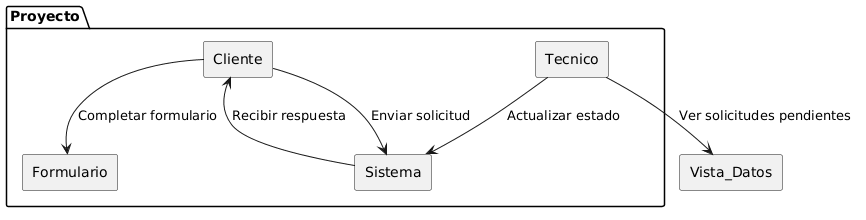

# Disciplina de Requisitos
## Actores
| Diagrama | Código Fuente |
|----------|---------------|
||[Ver Código de Actores](./Actores/codigo/Actores.puml)

El diagrama de actores representa los dos roles principales que interactúan con el sistema: el Cliente y el Técnico. El Cliente es el encargado de iniciar el proceso, generando solicitudes cuando detecta una necesidad y recibiendo posteriormente las respuestas proporcionadas por el sistema. Por otro lado, el Técnico desempeña un papel interno, siendo responsable de gestionar dichas solicitudes, visualizar los formularios pendientes y llevar a cabo su resolución. De este modo, el diagrama refleja de forma clara la relación entre ambos actores y cómo se distribuyen las responsabilidades dentro del sistema.

## Casos De Uso Por Actor

| Cliente | Técnico |
|---------|---------|
|||
|[Ver código](./CdU/CdU_Cliente/codigo/CdU_Cliente.puml)|[Ver código](./CdU/CdU_Tecnico/codigo/CdU_Tecnico.puml)|

## Priorizar Casos de Uso 

| Caso de uso                | Prioridad | Justificación                                                                              |
| -------------------------- | --------- | ------------------------------------------------------------------------------------------ |
| Enviar solicitud           | Alta      | Es el punto de entrada del sistema y condición necesaria para el resto de funcionalidades. |
| Recibir respuesta          | Alta      | Constituye la finalidad principal del sistema: proporcionar respuesta al cliente.          |
| Ver solicitudes pendientes | Media     | Permite la gestión por parte del técnico, pero depende de solicitudes previas.             |
| Actualizar estado          | Media     | Necesario para la gestión interna, ligado al seguimiento de solicitudes.                   |
| Completar formulario       | Baja      | Funcionalidad complementaria para aportar información adicional en casos específicos.      |

## Detallar Casos de Uso

### Caso de Uso - Enviar Solicitud

| Diagrama | Código |
|---------|---------|
||[Ver código](./Detallar_CdU/codigo/EnviarSolicitud.puml)|

Este caso de uso describe el proceso mediante el cual el cliente genera y envía una solicitud al sistema. El flujo comienza cuando el cliente identifica una necesidad, ya sea un problema o una consulta, lo que le lleva a redactar la solicitud.

Antes de enviarla, el cliente revisa su contenido para comprobar que la información es correcta. En caso de no estar conforme, puede modificarla tantas veces como sea necesario. Una vez validada, la solicitud es enviada al sistema.

Este proceso garantiza que las solicitudes recibidas tengan un mínimo nivel de calidad y coherencia, facilitando su posterior procesamiento.

### Caso de Uso - Recibir Respuesta

| Diagrama | Código |
|---------|---------|
||[Ver código](./Detallar_CdU/codigo/RecibirRespuesta.puml)|

Este caso de uso describe el proceso mediante el cual el cliente recibe una respuesta tras haber enviado una solicitud al sistema.

El flujo comienza con el cliente en espera de una respuesta. A continuación, el sistema procesa la solicitud previamente enviada y genera una respuesta, que es posteriormente enviada al cliente.

Finalmente, el cliente recibe y revisa la respuesta. En caso de necesitar aportar información adicional, podrá iniciar un nuevo caso de uso independiente mediante el formulario.

### Caso de Uso - Ver Solicitudes Pendientes

| Diagrama | Código |
|---------|---------|
||[Ver código](./Detallar_CdU/codigo/VerSolicitudesPendientes.puml)|

Este caso de uso describe el proceso mediante el cual el técnico accede y consulta las solicitudes pendientes en el sistema.

El flujo comienza cuando el técnico accede a la vista correspondiente. El sistema recupera la información disponible y la presenta al técnico, quien puede revisar el estado y contenido de las solicitudes.

En caso de producirse un error en la carga de la información, el sistema no podrá mostrar las solicitudes.

### Caso de Uso - Actualizar Estado

| Diagrama | Código |
|---------|---------|
||[Ver código](./Detallar_CdU/codigo/ActualizarEstado.puml)|

Este caso de uso describe el proceso mediante el cual el técnico actualiza el estado de una solicitud en el sistema.

El flujo comienza cuando el técnico selecciona una solicitud pendiente y la marca como resuelta. A continuación, el sistema verifica si existe un formulario asociado a dicha solicitud. En caso de existir, el sistema registra el nuevo estado. Si no existe formulario, el proceso finaliza sin realizar ninguna modificación.

Este comportamiento garantiza la coherencia de los datos y evita cambios innecesarios en el sistema.

### Caso de Uso - Completar Formulario

| Diagrama | Código |
|---------|---------|
||[Ver código](./Detallar_CdU/codigo/CompletarFormulario.puml)|

Este caso de uso describe el proceso mediante el cual el cliente aporta información adicional a través de un formulario.

El flujo comienza cuando el cliente accede al formulario y completa los campos requeridos. A continuación, revisa la información introducida antes de enviarla. Si está conforme, el formulario es enviado al sistema. En caso contrario, puede modificar los datos antes de realizar el envío.

Este proceso permite complementar la información de una solicitud previa de forma estructurada y controlada.

## Prototipar Casos de Uso 

### Caso de Uso - Enviar Solicitud

### Caso de Uso - Recibir Respuesta

### Caso de Uso - Ver Solicitudes Pendientes

### Caso de Uso - Actualizar Estado

### Caso de Uso - Completar Formulario

## Estructurar la Descripción de los Casos de Uso

### Diagrama de Contexto   

| Diagrama | Código |
|---------|---------|
||[Ver código](./DdC/codigo/DdC.puml)|

