# Disciplina de Requisitos
## Actores
| Diagrama | Código Fuente |
|----------|---------------|
|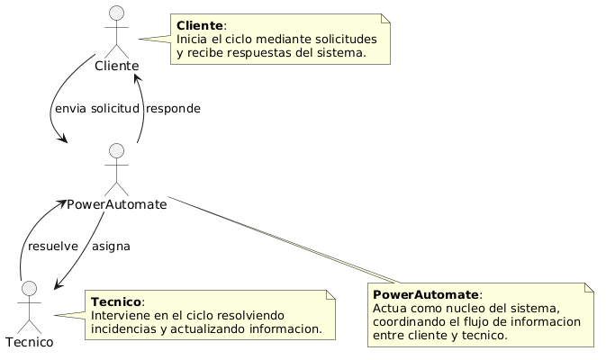|[Ver Código de Actores](./Actores/codigo/Actores.puml)

El diagrama de actores representa los dos roles principales que interactúan con el sistema: el Cliente y el Técnico. El Cliente es el encargado de iniciar el proceso, generando solicitudes cuando detecta una necesidad y recibiendo posteriormente las respuestas proporcionadas por el sistema. Por otro lado, el Técnico desempeña un papel interno, siendo responsable de gestionar dichas solicitudes, visualizar los formularios pendientes y llevar a cabo su resolución. De este modo, el diagrama refleja de forma clara la relación entre ambos actores y cómo se distribuyen las responsabilidades dentro del sistema.

## Casos De Uso Por Actor

| Cliente | Técnico |
|---------|---------|
||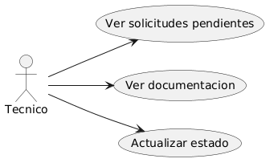|
|[Ver código](./CdU/CdU_Cliente/codigo/CdU_Cliente.puml)|[Ver código](./CdU/CdU_Tecnico/codigo/CdU_Tecnico.puml)|

## Relación Casos de Uso con Requisitos Funcionales

| Caso de Uso                    | Requisitos Funcionales relacionados                                                               |
| ------------------------------ | ------------------------------------------------------------------------------------------------- |
| CA1 Enviar solicitud           | RF1 Enviar solicitud, RF4 Registrar solicitudes                                                   |
| CA2 Recibir respuesta          | RF2 Recibir respuesta, RF8 Procesar solicitudes, RF9 Identificar intención, RF10 Enviar respuesta |
| CA3 Ver solicitudes pendientes | RF5 Ver solicitudes pendientes                                                                    |
| CA4 Actualizar estado          | RF6 Actualizar estado, RF7 Validar existencia de formulario                                       |
| CA5 Completar formulario       | RF3 Completar formulario, RF11 Solicitar información adicional                                    |

## Flujo de Procesos por Entidad

### Solicitud

| Diagrama | Código |
|---------|---------|
||[Ver código](./FlujoEntidades/codigo/Flujo_Solicitud.puml)|

El proceso se inicia cuando el cliente envía una solicitud, pasando esta al estado Enviada. A continuación, el sistema actúa de forma automática, realizando consultas a las bases de datos y procesando la información necesaria, lo que sitúa la solicitud en el estado En proceso.

Una vez finalizado este tratamiento, se genera la respuesta y la solicitud pasa al estado Respondida, momento en el que el cliente recibe la contestación. Tras ello, el flujo finaliza al haberse completado la gestión de la solicitud.

### Formulario

| Diagrama | Código |
|---------|---------|
|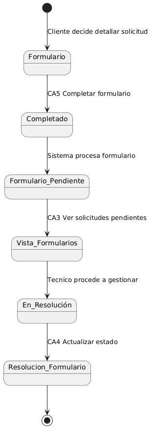|[Ver código](./FlujoEntidades/codigo/Flujo_Formulario.puml)

El proceso comienza cuando el cliente decide aportar información adicional, lo que da lugar a la creación del formulario. A continuación, el cliente completa los campos requeridos, pasando el formulario al estado Completado.

Posteriormente, el sistema procesa la información recibida y el formulario queda en estado Formulario pendiente, quedando disponible para su gestión. En este punto, el técnico puede visualizarlo a través de la vista de formularios pendientes.

Una vez revisado, el técnico inicia su gestión, llevando el formulario al estado En resolución. Finalmente, tras realizar las acciones necesarias, el técnico actualiza su estado, quedando el formulario como resuelto y finalizando el proceso.

## Diagramas de Contexto  

| Diagrama | Código |
|---------|---------|
|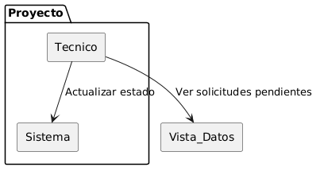|[Ver código](./DdC/codigo/DdC_Tecnico.puml)|

El técnico interactúa con el sistema para llevar a cabo la gestión de las solicitudes. Por un lado, puede actualizar el estado de las mismas a través del sistema, reflejando así su resolución o avance en el proceso. Por otro lado, dispone de una vista de datos externa al sistema principal que le permite consultar las solicitudes pendientes, facilitando su organización y priorización. De este modo, el técnico combina acciones de consulta y gestión para asegurar el correcto tratamiento de las solicitudes.

| Diagrama | Código |
|---------|---------|
|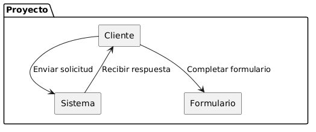|[Ver código](./DdC/codigo/DdC_Cliente.puml)|

El cliente interactúa con el sistema iniciando el proceso mediante el envío de una solicitud, a través de la cual comunica una necesidad o incidencia. El sistema recibe dicha solicitud y, tras su procesamiento, devuelve una respuesta al cliente, manteniendo así el flujo de comunicación.

Además, en aquellos casos en los que se requiere información adicional, el cliente puede interactuar con el formulario, completándolo para aportar datos complementarios que permitan una mejor gestión de la solicitud. De este modo, el cliente participa tanto en la generación inicial de la solicitud como en su posible ampliación mediante información adicional.

## Priorizar Casos de Uso 

| ID  | Caso de uso                | Prioridad | Justificación                                                                              |
| --- | -------------------------- | --------- | ------------------------------------------------------------------------------------------ |
| CA1 | Enviar solicitud           | Alta      | Es el punto de entrada del sistema y condición necesaria para el resto de funcionalidades. |
| CA2 | Recibir respuesta          | Alta      | Constituye la finalidad principal del sistema: proporcionar respuesta al cliente.          |
| CA3 | Ver solicitudes pendientes | Media     | Permite la gestión por parte del técnico, pero depende de solicitudes previas.             |
| CA4 | Actualizar estado          | Media     | Necesario para la gestión interna, ligado al seguimiento de solicitudes.                   |
| CA5 | Completar formulario       | Baja      | Funcionalidad complementaria para aportar información adicional en casos específicos.      |

## Detallar Casos de Uso

### Caso de Uso - Enviar Solicitud

| Diagrama | Código |
|---------|---------|
|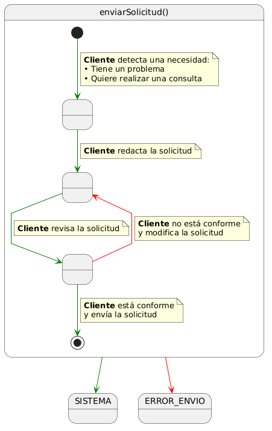|[Ver código](./Detallar_CdU/codigo/EnviarSolicitud.puml)|

Este caso de uso describe el proceso mediante el cual el cliente genera y envía una solicitud al sistema. El flujo comienza cuando el cliente identifica una necesidad, ya sea un problema o una consulta, lo que le lleva a redactar la solicitud.

Antes de enviarla, el cliente revisa su contenido para comprobar que la información es correcta. En caso de no estar conforme, puede modificarla tantas veces como sea necesario. Una vez validada, la solicitud es enviada al sistema.

Este proceso garantiza que las solicitudes recibidas tengan un mínimo nivel de calidad y coherencia, facilitando su posterior procesamiento.

**Criterios de Aceptación**
+ El cliente puede redactar una solicitud con la información necesaria.
+ El cliente puede modificar la solicitud antes de enviarla.
+ El sistema permite el envío únicamente cuando la solicitud contiene información válida.
+ La solicitud queda registrada en el sistema tras su envío.
+ El sistema confirma la recepción de la solicitud al cliente.

### Caso de Uso - Recibir Respuesta

| Diagrama | Código |
|---------|---------|
||[Ver código](./Detallar_CdU/codigo/RecibirRespuesta.puml)|

Este caso de uso describe el proceso mediante el cual el cliente recibe una respuesta tras haber enviado una solicitud al sistema.

El flujo comienza con el cliente en espera de una respuesta. A continuación, el sistema procesa la solicitud previamente enviada y genera una respuesta, que es posteriormente enviada al cliente.

Finalmente, el cliente recibe y revisa la respuesta. En caso de necesitar aportar información adicional, podrá iniciar un nuevo caso de uso independiente mediante el formulario.

**Criterios de aceptación**

+ El sistema procesa la solicitud previamente enviada por el cliente.
+ El sistema genera una respuesta adecuada en función de la solicitud.
+ La respuesta es enviada correctamente al cliente.
+ El cliente puede recibir y visualizar la respuesta.
+ El cliente puede iniciar un nuevo proceso en caso de requerir aportar información adicional.

### Caso de Uso - Ver Solicitudes Pendientes

| Diagrama | Código |
|---------|---------|
|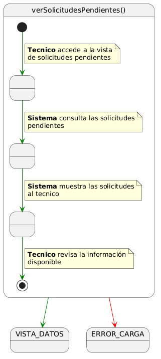|[Ver código](./Detallar_CdU/codigo/VerSolicitudesPendientes.puml)|

Este caso de uso describe el proceso mediante el cual el técnico accede y consulta las solicitudes pendientes en el sistema.

El flujo comienza cuando el técnico accede a la vista correspondiente. El sistema recupera la información disponible y la presenta al técnico, quien puede revisar el estado y contenido de las solicitudes.

En caso de producirse un error en la carga de la información, el sistema no podrá mostrar las solicitudes.

**Criterios de aceptación**

+ El técnico puede acceder a la vista de solicitudes pendientes.
+ El sistema muestra correctamente las solicitudes no resueltas.
+ La información presentada incluye los datos necesarios para su revisión.
+ El sistema gestiona errores en la carga de datos mostrando un mensaje adecuado.
+ Las solicitudes se muestran actualizadas en el momento de la consulta.

### Caso de Uso - Actualizar Estado

| Diagrama | Código |
|---------|---------|
|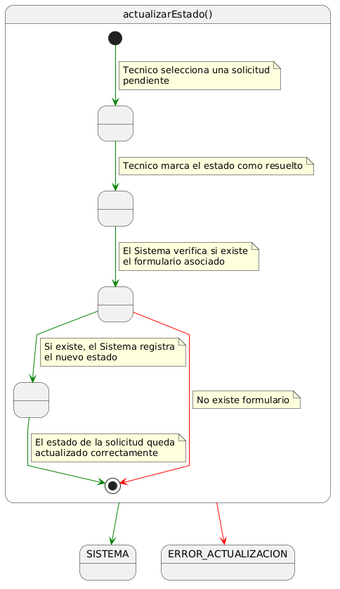|[Ver código](./Detallar_CdU/codigo/ActualizarEstado.puml)|

Este caso de uso describe el proceso mediante el cual el técnico actualiza el estado de una solicitud en el sistema.

El flujo comienza cuando el técnico selecciona una solicitud pendiente y la marca como resuelta. A continuación, el sistema verifica si existe un formulario asociado a dicha solicitud. En caso de existir, el sistema registra el nuevo estado. Si no existe formulario, el proceso finaliza sin realizar ninguna modificación.

Este comportamiento garantiza la coherencia de los datos y evita cambios innecesarios en el sistema.

**Criterios de aceptación**

+ El técnico puede marcar la solicitud como resuelta.
+ El sistema verifica la existencia de un formulario asociado.
+ Si el formulario existe, el estado de la solicitud se actualiza correctamente.
+ Si no existe formulario, el sistema no realiza cambios en el estado.
+ El sistema refleja el estado actualizado de forma correcta tras la operación.

### Caso de Uso - Completar Formulario

| Diagrama | Código |
|---------|---------|
|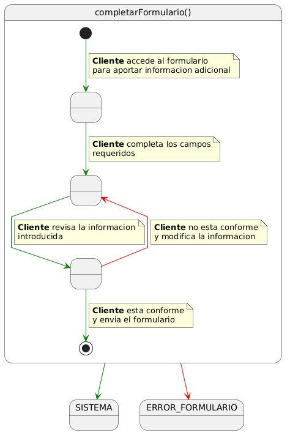|[Ver código](./Detallar_CdU/codigo/CompletarFormulario.puml)|

Este caso de uso describe el proceso mediante el cual el cliente aporta información adicional a través de un formulario.

El flujo comienza cuando el cliente accede al formulario y completa los campos requeridos. A continuación, revisa la información introducida antes de enviarla. Si está conforme, el formulario es enviado al sistema. En caso contrario, puede modificar los datos antes de realizar el envío.

Este proceso permite complementar la información de una solicitud previa de forma estructurada y controlada.

**Criterios de aceptación**

+ El cliente puede crear un formulario para detallar su solicitud.
+ El cliente puede completar los campos requeridos del formulario.
+ El cliente puede revisar y modificar la información antes de enviarla.
+ El sistema valida que los campos obligatorios estén cumplimentados.
+ El formulario es enviado correctamente al sistema.
+ La información adicional queda registrada y asociada a la solicitud correspondiente.

## Prototipar Casos de Uso 

### Caso de Uso - Enviar Solicitud

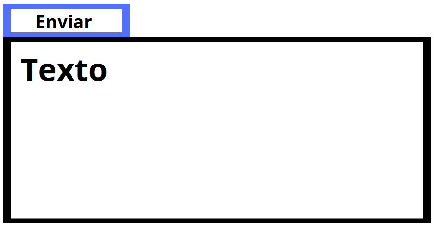

### Caso de Uso - Recibir Respuesta

### Caso de Uso - Ver Solicitudes Pendientes

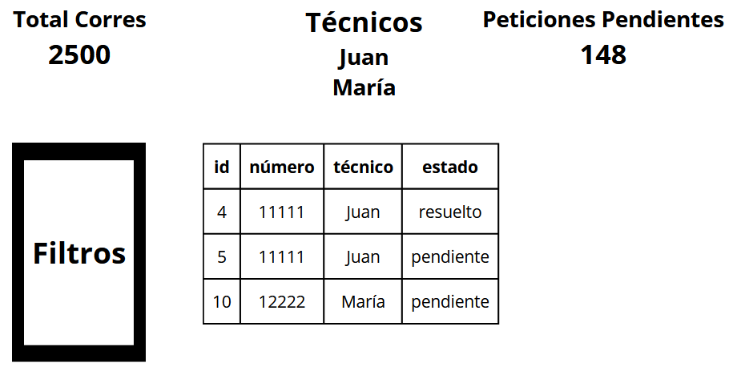

### Caso de Uso - Actualizar Estado

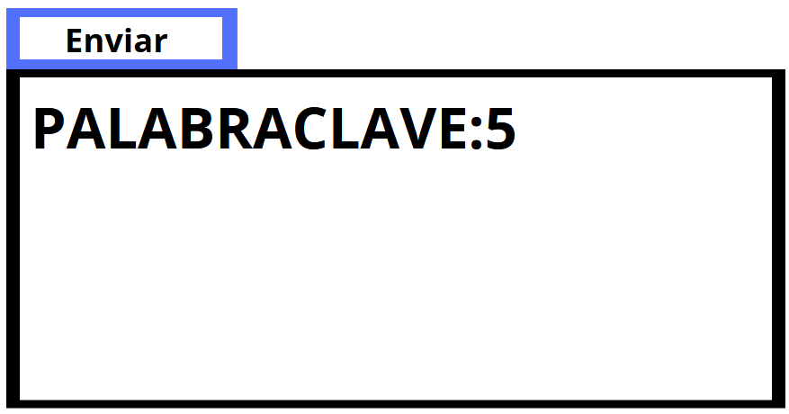

### Caso de Uso - Completar Formulario

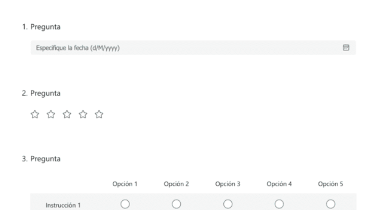

## Estructurar la Descripción de los Casos de Uso

### CA1 – Enviar solicitud

- **Actor:** Cliente  

- **Descripción:**  
El cliente genera y envía una solicitud al sistema para comunicar una necesidad o incidencia.

- **Precondiciones:**  
- El cliente dispone de la información necesaria para redactar la solicitud.  

- **Postcondiciones:**  
- La solicitud queda registrada en el sistema.  

- **Flujo principal:**  
1. El cliente redacta la solicitud.  
2. El cliente revisa la información introducida.  
3. El cliente envía la solicitud.  
4. El sistema registra la solicitud.  

- **Flujos alternativos:**  
- 2a. El cliente detecta errores → modifica la solicitud antes de enviarla.  

- **Criterios de aceptación:**  
- La solicitud contiene información mínima obligatoria.  
- El sistema confirma la recepción de la solicitud.  

### CA2 – Recibir respuesta

- **Actor:** Cliente  

- **Descripción:**  
El cliente recibe la respuesta generada por el sistema tras el procesamiento de su solicitud.

- **Precondiciones:**  
- Existe una solicitud previamente enviada.  

- **Postcondiciones:**  
- El cliente dispone de una respuesta asociada a su solicitud.  

- **Flujo principal:**  
1. El sistema procesa la solicitud.  
2. El sistema genera una respuesta.  
3. El sistema envía la respuesta al cliente.  
4. El cliente recibe y visualiza la respuesta.  

- **Flujos alternativos:**  
- 1a. La información es insuficiente → el sistema solicita información adicional.  

- **Criterios de aceptación:**  
- La respuesta es generada correctamente.  
- El cliente puede visualizar la respuesta.  

### CA3 – Ver solicitudes pendientes

- **Actor:** Técnico  

- **Descripción:**  
El técnico consulta las solicitudes o formularios pendientes para su gestión.

- **Precondiciones:**  
- Existen solicitudes o formularios pendientes en el sistema.  

- **Postcondiciones:**  
- El técnico visualiza la información necesaria para su gestión.  

- **Flujo principal:**  
1. El técnico accede a la vista de datos.  
2. El sistema recupera las solicitudes pendientes.  
3. El sistema muestra la información al técnico.  

- **Flujos alternativos:**  
- 2a. Error en la carga de datos → el sistema muestra un mensaje de error.  

- **Criterios de aceptación:**  
- Solo se muestran solicitudes no resueltas.  
- La información es accesible y está actualizada.  

### CA4 – Actualizar estado

- **Actor:** Técnico  

- **Descripción:**  
El técnico actualiza el estado de un formulario o solicitud en el sistema.

- **Precondiciones:**  
- Existe una solicitud o formulario pendiente.  

- **Postcondiciones:**  
- El estado queda actualizado correctamente o no se modifica si no procede.  

- **Flujo principal:**  
1. El técnico selecciona una solicitud o formulario.  
2. El técnico marca como resuelto.  
3. El sistema verifica si existe formulario asociado.  
4. El sistema actualiza el estado.  

- **Flujos alternativos:**  
- 3a. No existe formulario → el sistema no realiza cambios.  

- **Criterios de aceptación:**  
- El estado se actualiza correctamente si se cumplen las condiciones.  
- El sistema valida la existencia del formulario.  

### CA5 – Completar formulario

- **Actor:** Cliente  

- **Descripción:**  
El cliente completa un formulario para aportar información adicional a una solicitud.

- **Precondiciones:**  
- El sistema ha solicitado información adicional.  

- **Postcondiciones:**  
- La información adicional queda registrada en el sistema.  

- **Flujo principal:**  
1. El cliente accede al formulario.  
2. El cliente completa los campos requeridos.  
3. El cliente revisa la información.  
4. El cliente envía el formulario.  
5. El sistema registra la información.  

- **Flujos alternativos:**  
- 3a. El cliente detecta errores → modifica la información antes de enviarla.  

- **Criterios de aceptación:**  
- Los campos obligatorios están cumplimentados.  
- El formulario se registra correctamente.  