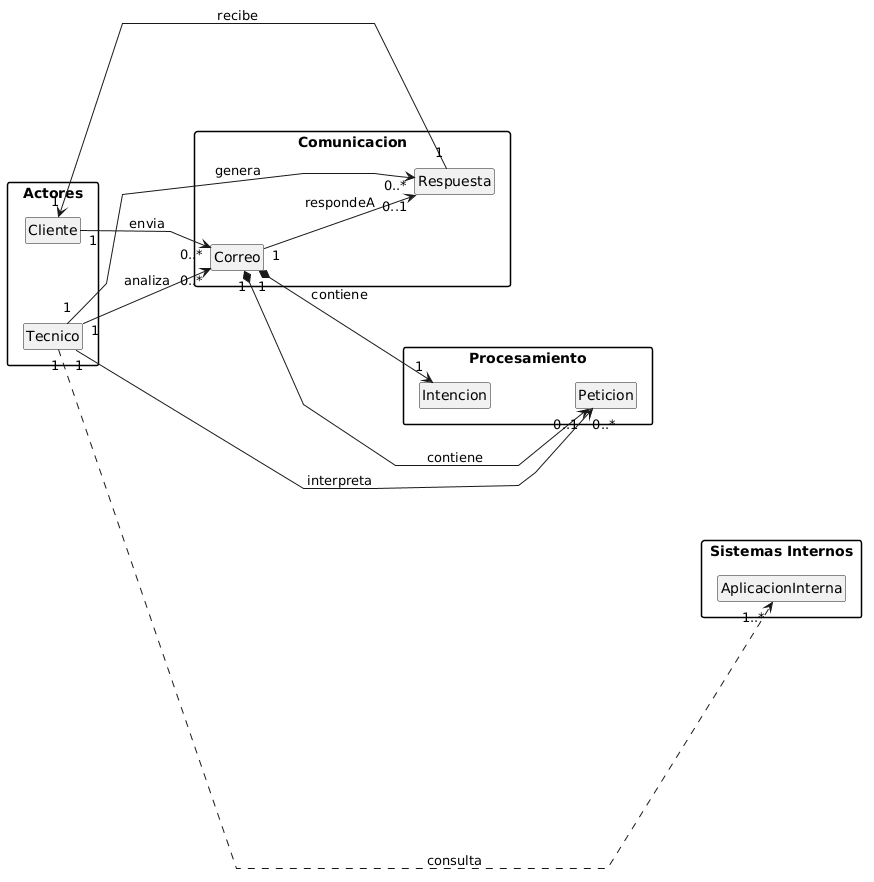
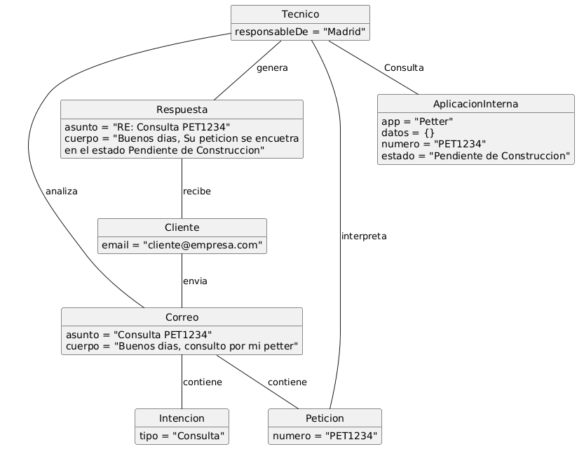

# Modelo de Dominio
## Diagrama de Clases 
| Diagrama | Código Fuente |
|----------|---------------|
||[Ver Código del Diagrama de Clases](./MdD/DdC/codigo/DdC.puml)

El diagrama de clases representa el funcionamiento actual del sistema de gestión del buzón. En él, un cliente envía un correo electrónico, que contiene una intención y, en muchos casos, una petición.

El técnico es el encargado de analizar el correo recibido, identificar su contenido e interpretar la petición. A partir de esta, consulta diferentes aplicaciones internas para obtener la información necesaria.

Finalmente, el técnico genera una respuesta, que es enviada al cliente como contestación a su solicitud.

## Diagrama de Objetos
| Diagrama | Código Fuente |
|----------|---------------|
||[Ver Código del Diagrama de Objetos](./MdD/DdO/codigo/DdO.puml)

El diagrama de objetos representa un caso concreto del funcionamiento del sistema. En él, un cliente envía un correo electrónico con una consulta asociada a una petición identificada por un número. Este correo contiene una intención, en este caso de tipo consulta.

El técnico recibe y analiza el correo, interpreta la petición y accede a una aplicación interna (Petter) para obtener la información correspondiente al número indicado. A partir de estos datos, genera una respuesta informando del estado de la petición, que finalmente es enviada al cliente.