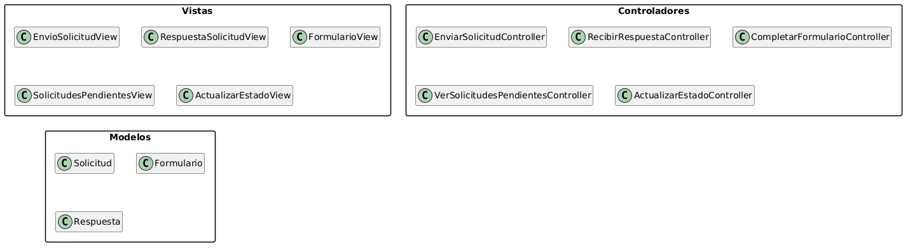
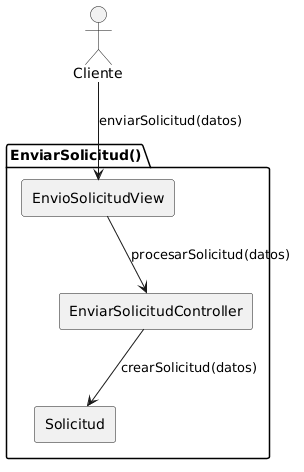
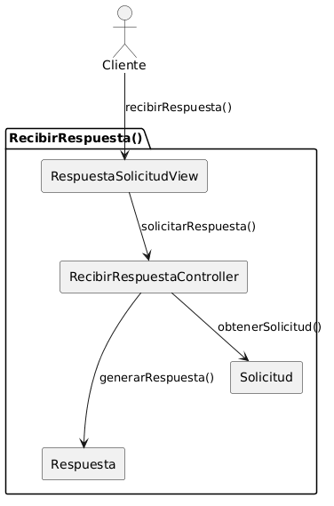
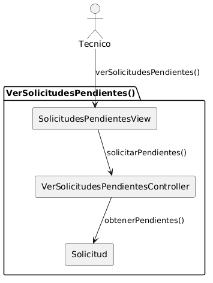
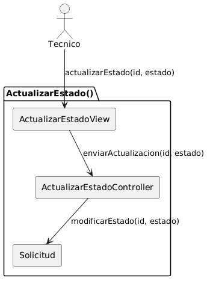
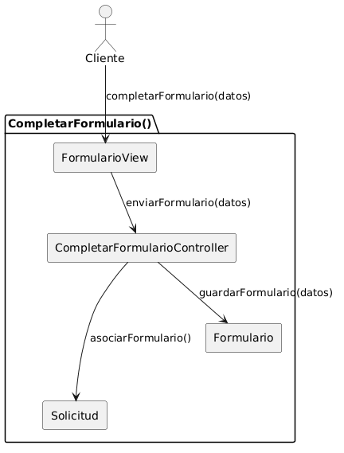
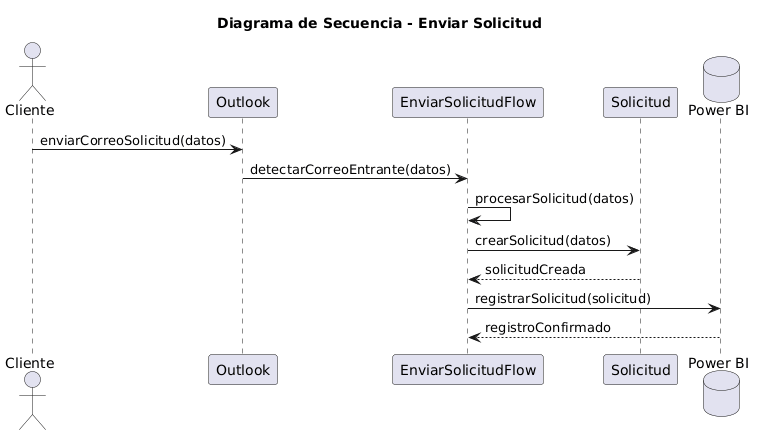
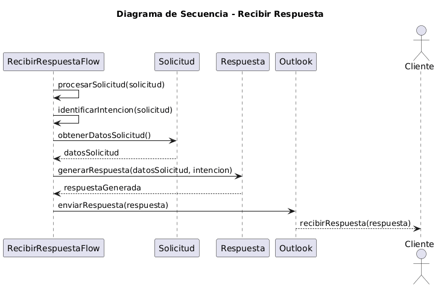
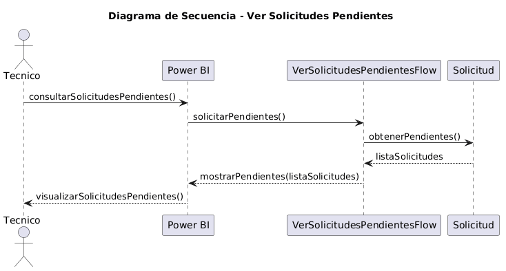
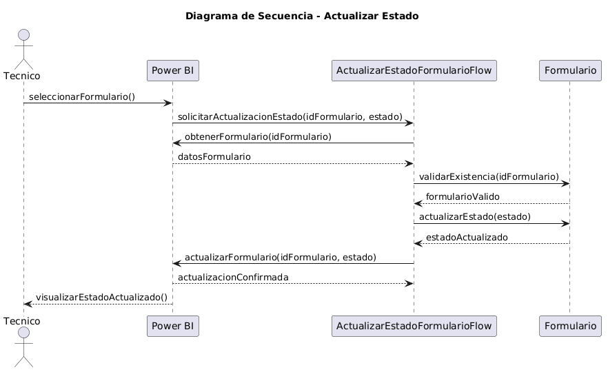

# Análisis y Diseño 

## Introducción

En este capítulo se aborda el análisis y diseño del sistema a partir de los requisitos y casos de uso definidos previamente. En primer lugar, se realiza el análisis mediante la identificación de las clases y sus relaciones siguiendo el patrón arquitectónico Modelo-Vista-Controlador (MVC), así como la elaboración de diagramas de clases y de colaboración. A continuación, se presenta la transición hacia el diseño, donde se concreta la solución tecnológica adoptada y se detallan las clases con un enfoque implementable. Finalmente, se incluyen los diagramas de clases de diseño y los diagramas de secuencia que describen el comportamiento del sistema de forma más precisa.

## Análisis

El análisis del sistema tiene como finalidad definir la estructura lógica de la solución a partir de los requisitos y casos de uso obtenidos en el capítulo anterior. Para ello, se adopta el patrón Modelo-Vista-Controlador (MVC), siguiendo el esquema propuesto en la asignatura: cada caso de uso detallado da lugar a una clase controladora, la interfaz asociada al caso de uso se representa mediante una clase vista, y las entidades del dominio implicadas se modelan como clases del modelo.

De este modo, el análisis permite pasar de una descripción funcional del sistema a una primera organización estructurada de sus elementos, sin entrar todavía en detalles tecnológicos o de implementación. El resultado de esta fase es un diagrama de clases de análisis, complementado con diagramas de colaboración para los casos de uso más representativos.

En el caso de este proyecto, el sistema se centra en la gestión de solicitudes realizadas por el cliente, su posible ampliación mediante formularios, y el seguimiento posterior por parte del técnico. A partir de los diagramas de contexto definidos previamente, se identifican dos actores principales:

+ Cliente, que interactúa con el sistema para enviar solicitudes, recibir respuestas y completar formularios.
+ Técnico, que consulta las solicitudes pendientes y actualiza su estado.

A partir de estas interacciones, se construye el análisis del sistema siguiendo la estructura MVC.

### Identificación de clases de análisis

| Diagrama | Código Fuente |
|----------|---------------|
||[Ver Código](./MVC/codigo/MVC.puml)

El diagrama de clases de análisis representa la estructura lógica del sistema organizada según el patrón Modelo-Vista-Controlador (MVC). En esta fase, el objetivo es identificar las clases principales del sistema y clasificarlas en función de su responsabilidad, sin entrar todavía en detalles de implementación ni en las relaciones específicas entre ellas.

Para facilitar su comprensión, las clases se agrupan en tres paquetes: Vistas, Controladores y Modelos.

El paquete Vistas recoge las clases encargadas de representar los puntos de interacción entre los actores y el sistema. Estas clases abstraen las distintas interfaces a través de las cuales se realizan las operaciones principales, como el envío de solicitudes, la recepción de respuestas, la cumplimentación de formularios o la consulta de solicitudes pendientes. En esta fase de análisis, no se modelan como interfaces gráficas concretas, sino como representaciones conceptuales de dichas interacciones.

El paquete Controladores incluye las clases responsables de gestionar la lógica asociada a cada caso de uso. Siguiendo el enfoque adoptado, cada caso de uso detallado se corresponde con una clase controladora, encargada de coordinar el flujo de información entre las vistas y los modelos. De este modo, los controladores actúan como intermediarios que reciben las acciones desde las vistas y ejecutan las operaciones necesarias sobre las entidades del sistema.

Por último, el paquete Modelos contiene las entidades del dominio que representan la información gestionada por el sistema. En este caso, la clase Solicitud constituye el elemento central, ya que modela las peticiones realizadas por los usuarios y su evolución. La clase Formulario representa la información adicional que puede ser requerida para completar una solicitud, mientras que la clase Respuesta recoge el resultado del procesamiento de dicha solicitud.

### Diagramas de Colaboración

#### Enviar Solicitud

| Diagrama | Código Fuente |
|----------|---------------|
||[Ver Código](./DdC/codigo/EnviarSolicitud.puml)

#### Recibir Respuesta

| Diagrama | Código Fuente |
|----------|---------------|
||[Ver Código](./DdC/codigo/RecibirRespuesta.puml)

#### Ver Solicitudes Pendientes

| Diagrama | Código Fuente |
|----------|---------------|
||[Ver Código](./DdC/codigo/VerSolicitudesPendientes.puml)

#### Actualizar Estado

| Diagrama | Código Fuente |
|----------|---------------|
||[Ver Código](./DdC/codigo/ActualizarEstado.puml)

#### Completar Formulario

| Diagrama | Código Fuente |
|----------|---------------|
||[Ver Código](./DdC/codigo/CompletarFormulario.puml)

## Decisión Tecnológica

Dado que el sistema se basa en la gestión automática de solicitudes a partir de correos electrónicos, se ha optado por utilizar herramientas del ecosistema Microsoft, concretamente Power Automate, Outlook y Power BI.

Esta decisión está alineada con el entorno tecnológico de la organización, ya que Telefónica trabaja de forma habitual con soluciones de Microsoft. En particular, el buzón de correo utilizado para la gestión de solicitudes se encuentra en Outlook, lo que facilita la integración directa del sistema con los procesos existentes sin necesidad de introducir nuevas herramientas o plataformas externas.

Por un lado, Power Automate se utiliza como núcleo del sistema, ya que permite automatizar el procesamiento de los correos entrantes, aplicar lógica de decisión y coordinar las acciones necesarias sin necesidad de desarrollar una aplicación desde cero. Frente al desarrollo de una solución web tradicional, esta alternativa presenta ventajas significativas en términos de tiempo. El desarrollo de una aplicación web en el entorno corporativo requiere la aprobación por parte de gerencia, la validación del presupuesto y el cumplimiento de estrictos requisitos de seguridad, lo que puede alargar el proceso hasta aproximadamente seis meses. En este caso, se prioriza la rapidez de desarrollo, dado que la necesidad del sistema está directamente relacionada con el proceso de ERE previsto para el 1 de marzo. Por ello, se opta por una solución basada en automatización que permite una implementación mucho más ágil.

Outlook se emplea como punto de entrada y salida de información, siendo el canal a través del cual los usuarios envían solicitudes y reciben respuestas. Esto permite integrarse directamente con el flujo de trabajo existente en la organización, evitando cambios en la forma de interacción de los usuarios.

Por otro lado, Power BI se utiliza para la consulta y visualización de datos, facilitando la creación de vistas que permiten al personal técnico acceder a la información de las solicitudes pendientes de forma estructurada. Además, esta herramienta ya se utiliza en otros ámbitos dentro de la organización, por lo que no es necesario adquirir nuevas licencias, lo que reduce el coste de la solución.

En cuanto a la gestión de datos, la solución ideal pasaría por la utilización de Dataverse como base de datos dentro del ecosistema Microsoft. Sin embargo, la creación y configuración de este entorno requiere un proceso adicional. Por este motivo, y como solución temporal, se emplea Power BI como repositorio intermedio de datos, permitiendo almacenar y consultar la información mientras se completa la infraestructura definitiva.

## Diseño 

### Diagrama de Clases de Diseño
| Diagrama | Código Fuente |
|----------|---------------|
||[Ver Código](./DdC_Diseno/codigo/Diagrama_Clases_Diseno.puml)

### Diagramas de Secuencia por Caso de Uso 

#### Enviar Solicitud
| Diagrama | Código Fuente |
|----------|---------------|
||[Ver Código](./DdS/codigo/EnviarSolicitud.puml)

#### Recibir Respuesta
| Diagrama | Código Fuente |
|----------|---------------|
||[Ver Código](./DdS/codigo/RecibirRespuesta.puml)

#### Ver Solicitudes Pendientes
| Diagrama | Código Fuente |
|----------|---------------|
||[Ver Código](./DdS/codigo/VerSolicitudesPendientes.puml)

#### Actualizar Estado
| Diagrama | Código Fuente |
|----------|---------------|
||[Ver Código](./DdS/codigo/ActualizarEstado.puml)

#### Completar Formulario
| Diagrama | Código Fuente |
|----------|---------------|
||[Ver Código](./DdS/codigo/CompletarFormulario.puml)