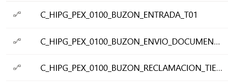
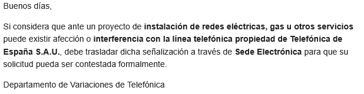
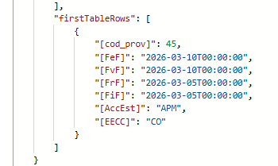
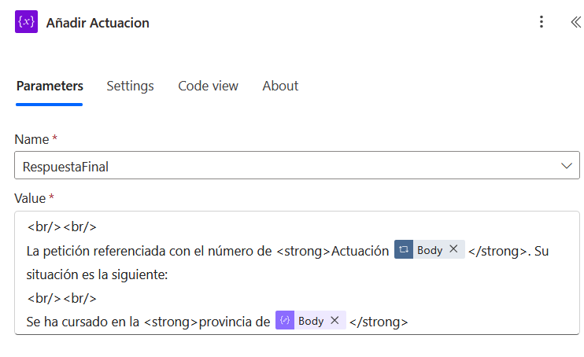
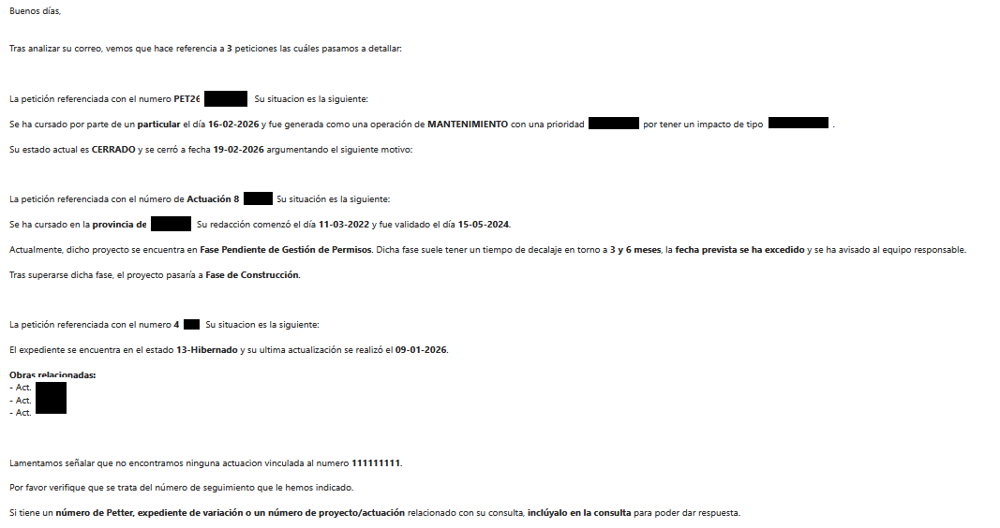
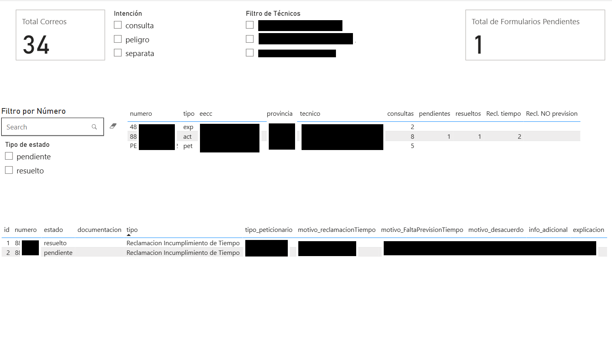
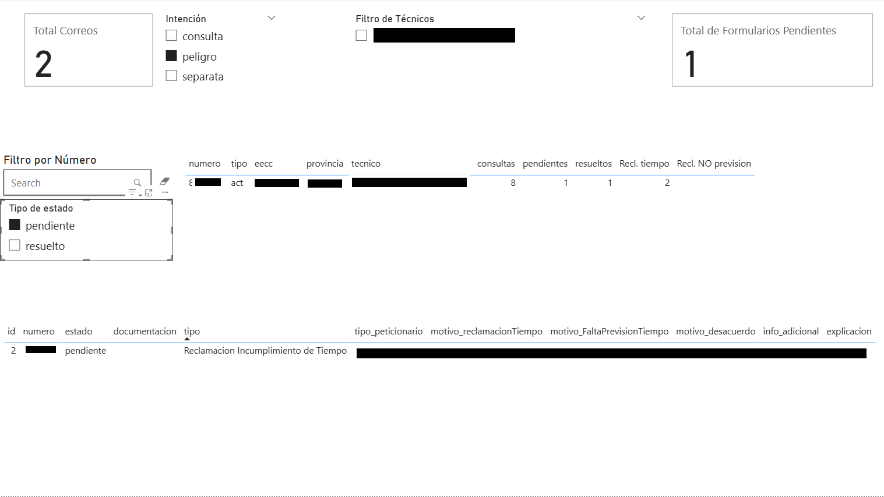

# Descripción del funcionamiento del sistema

En Telefónica, las automatizaciones son supervisadas y gestionadas por el departamento de Hiperautomatización. Por este motivo, el desarrollo de esta solución se llevó a cabo bajo su supervisión y siguiendo las normas y estándares establecidos por dicho departamento.

El desarrollo se realizó inicialmente en el entorno de desarrollo, destinado a la implementación y ejecución de pruebas. En este entorno se establecen convenciones específicas para el nombrado de los flujos, referencias de conexión y demás componentes, incluyendo en la nomenclatura el código MIGA correspondiente, con el fin de mantener una estructura homogénea y facilitar la identificación y mantenimiento de los desarrollos.



Una vez finalizado el desarrollo, la solución pasa por un proceso de revisión y validación por parte del departamento de Hiperautomatización. Si la evaluación es favorable, se procede a su despliegue en el entorno de producción. En este entorno no se permite realizar modificaciones directas; cualquier cambio o mejora debe implementarse nuevamente en el entorno de desarrollo y seguir el mismo proceso de validación antes de ser promovido a producción.

## Caso de Uso - Recibir Solicitud

El proyecto se ha desarrollado utilizando sistemas de Microsoft, aprovechando su compatibilidad con Exchange Online. En este flujo, el actor principal es Exchange Online, que activa el evento inicial del sistema cuando se recibe un correo electrónico. A partir de ese momento, el proceso se ejecuta automáticamente y el sistema genera la respuesta correspondiente según el caso detectado.

El funcionamiento es el siguiente: cuando se recibe un correo dirigido al buzón compartido **VARIACIONES_PLANTA_EXTERIOR**, se dispara el trigger del flujo. La conexión entre **Power Automate** y **Exchange Online** se realiza mediante el conector **Office 365 Outlook**, que comprueba el buzón cada minuto.

El correo recibido se procesa como un JSON que contiene distintos atributos. Uno de los más importantes es `subject`, que se utiliza para determinar la acción que debe realizarse con el correo.


El sistema contempla cuatro casuísticas principales mediante un bloque **Switch**:

## 1. Caso `TE:FORMRESUELTO`

Asunto definido internamente. Un técnico envía este correo al buzón para actualizar el estado del formulario.

Se extrae el ID del formulario a marcar como resuelto  de la siguiente forma:

```text
replace(triggerOutputs()?['body/subject'], 'TE:FORMRESUELTO', '')
```

Se procede a actualizar con la siguiente query sobre el dataset **GestionVariaciones**.

## 2. Caso `Documentacion Desacuerdo con la Solucion`

Correo enviado por un cliente. El sistema mueve el mensaje a la carpeta de documentación de desacuerdo, facilitando al técnico la gestión de dicha documentación.

## 3. Caso `Documentacion Acuerdo`

Correo enviado también por un cliente. El sistema mueve el mensaje a una carpeta específica para que el técnico pueda tratarlo posteriormente.

## 4. Caso Default

Corresponde a cualquier asunto diferente de los anteriores.

## Detalle del caso Defaul

Cuando el asunto no coincide con ninguno de los casos anteriores, el correo es analizado por un agente configurado mediante un prompt. Este agente devuelve un JSON con la intención del mensaje y todos los números de más de cuatro cifras mencionados en el correo.

Modelo IA usado:


El gasto aproximado por correo analizado es variable en función del correo y cuando haya que analizar pero se aproxima a 0,011€ por correo analizado.

El agente está desarrollado en **Power Apps**, herramienta de Microsoft, y se conecta al flujo mediante **Microsoft Dataverse**. 

### Ejemplo de JSON devuelto

```json
{
  "intencion": "consulta",
  "numeros": [
    "8809795",
    "23052900002",
    "48821"
  ]
}
```

A continuación, se almacena la información inicial del correo recibido en el dataset semántico `GestionVariaciones` de **Power BI**. La conexión se realiza mediante el conector oficial de Power BI, que permite insertar información directamente sobre dicho dataset.

Inicialmente, se crea un nuevo registro en la tabla `CorreoRecibido`, almacenando un identificador único autogenerado, junto con la intención detectada y la fecha actual de recepción del correo.

Después, se analiza la intención obtenida, lo que puede dar lugar a diferentes situaciones y consultas posteriores dentro del flujo.

# 1. Intenciones que no requieren consulta en base de datos

Si la intención es:

- `separata`
- `asesoramiento`
- `canalizacion`
- `peligro` (sin número)
- `ajena`

El sistema responde automáticamente con un correo informando de que el buzón no está destinado a atender ese tipo de solicitudes y redirige al remitente al canal correspondiente.

## Caso Ajena


## Caso Separata



# 2. Intenciones que requieren consulta en base de datos

Si la intención es:

- `reclamación`
- `consulta`
- `peligro` (con número)

El sistema consulta las bases de datos disponibles y procesa la información obtenida.

Este proceso se realiza mediante condiciones anidadas, ya que se consultan varias tablas y cada una contiene datos con estructuras diferentes.

# Consulta sobre Actuaciones

La primera consulta se realiza sobre la tabla de **Actuaciones**.

```sql
EVALUATE
SELECTCOLUMNS(
    FILTER(
        sgipe_circuitos,
        sgipe_circuitos[NUMERO] = "@{items('Recorrer_Numeros')}"
    ),
    "cod_prov", sgipe_circuitos[cod_prov],
    "FaF", sgipe_circuitos[FaF],
    "FaLF", sgipe_circuitos[FaLF],
    "FNmF", sgipe_circuitos[FNmF],
    "FeF", sgipe_circuitos[FeF],
    "FvF", sgipe_circuitos[FvF],
    "FPmF", sgipe_circuitos[FPmF],
    "FPMotivo", sgipe_circuitos[FPMotivo],
    "FrF", sgipe_circuitos[FrF],
    "GEF", sgipe_circuitos[GEF],
    "FiF", sgipe_circuitos[FiF],
    "AccEst", sgipe_circuitos[AccEst],
    "EECC", sgipe_circuitos[ContLC]
)
```

Esta consulta devuelve información como la siguiente:



## Traducción de provincia

Por ejemplo, la provincia se almacena en base de datos mediante un código numérico. Posteriormente, dicho código se traduce al nombre correspondiente mediante una tabla de equivalencias.

```text
coalesce(
  variables('provincias')?[string(outputs('Run_a_query_against_a_dataset_ACT')?['body/firstTableRows']?[0]?['[cod_prov]'])],
  'Desconocida'
)
```

## Cálculo del estado del proyecto

Las distintas fases del proyecto (`FaF`, `FaLF`, `FNmF`, `FeF`, `FvF`, `FPmF`, `FrF`, etc.) se utilizan para calcular el estado actual del expediente.

```text
if(
  or(
    not(empty(outputs('Run_a_query_against_a_dataset_ACT')?['body/firstTableRows']?[0]?['[FaF]'])),
    not(empty(outputs('Run_a_query_against_a_dataset_ACT')?['body/firstTableRows']?[0]?['[FaLF]']))
  ),
  'Anulada',

  if(
    not(empty(outputs('Run_a_query_against_a_dataset_ACT')?['body/firstTableRows']?[0]?['[FNmF]'])),
    'Fase de Terminado',

    if(
      not(empty(outputs('Run_a_query_against_a_dataset_ACT')?['body/firstTableRows']?[0]?['[FPmF]'])),

      if(
        equals(outputs('Run_a_query_against_a_dataset_ACT')?['body/firstTableRows']?[0]?['[FPMotivo]'], 'por Permiso Oficial'),
        'Fase Pendiente de Gestión de Permisos',

        if(
          equals(outputs('Run_a_query_against_a_dataset_ACT')?['body/firstTableRows']?[0]?['[FPMotivo]'], 'por Causa Cliente'),
          'Fase Pendiente de aceptación de propuesta por parte del peticionario',
          'Fase de Construcción'
        )
      ),

      if(
        not(empty(outputs('Run_a_query_against_a_dataset_ACT')?['body/firstTableRows']?[0]?['[FeF]'])),
        'Fase de Construcción',

        if(
          and(
            empty(outputs('Run_a_query_against_a_dataset_ACT')?['body/firstTableRows']?[0]?['[FvF]']),
            empty(outputs('Run_a_query_against_a_dataset_ACT')?['body/firstTableRows']?[0]?['[FNmF]']),
            empty(outputs('Run_a_query_against_a_dataset_ACT')?['body/firstTableRows']?[0]?['[FPmF]']),
            not(empty(outputs('Run_a_query_against_a_dataset_ACT')?['body/firstTableRows']?[0]?['[FrF]']))
          ),
          'Fase de validación',

          'Fase de redacción de proyecto'
        )
      )
    )
  )
)
```

Una vez procesados los datos, el sistema construye automáticamente el correo de respuesta en función del estado obtenido.

# Consulta sobre WEPES

Si la consulta anterior no devuelve resultados, el sistema consulta la base de datos de **WEPES**.

```sql
EVALUATE
SELECTCOLUMNS(
    FILTER(
        WEPES_var1_expediente,
        WEPES_var1_expediente[id] = @{items('Recorrer_Numeros')}
    ),
    "Numero",  WEPES_var1_expediente[id],
    "Estado",  WEPES_var1_expediente[Estado_logico],
    "Ultima_mod", WEPES_var1_expediente[ultima_modificacion.fecha],
    "Provincia", WEPES_var1_expediente[nom_prov],
    "tecnico", WEPES_var1_expediente[TECNICO],
    "Fecha_cambio",
        COALESCE(
            WEPES_var1_expediente[InicioEstadoLogico02],
            WEPES_var1_expediente[InicioEstadoLogico01]
        )
)
```

# Consulta sobre PETTER

Si la consulta sobre WEPES también devuelve resultados vacíos, se realiza una última consulta sobre **PETTER**.

```sql
EVALUATE
SELECTCOLUMNS(
    ADDCOLUMNS(
        FILTER(
            'pett Incidencia',
            'pett Incidencia'[codigo] = "PET@{items('Recorrer_Numeros')}"
        ),
        "EECC",
        VAR IncActualId = 'pett Incidencia'[id]
        RETURN
            MAXX(
                TOPN(
                    1,
                    FILTER(
                        'pett Incidencia_Eecc',
                        'pett Incidencia_Eecc'[id_incidencia] = IncActualId &&
                        ISBLANK('pett Incidencia_Eecc'[fecha_baja])
                    ),
                    'pett Incidencia'[fecha_creacion],
                    DESC
                ),
                RELATED('pett Tm_Eecc'[valor])
            )
    ),
    "codigo", [codigo],
    "codigo_tipo", [codigo_tipo],
    "codigo_impacto", [codigo_impacto],
    "codigo_prioridad", [codigo_prioridad],
    "codigo_estado", [codigo_estado],
    "codigo_peticionario_tipo", [codigo_peticionario_tipo],
    "descripcion", [descripcion],
    "fecha_resolucion_estimada", [fecha_resolucion_estimada],
    "fecha_creacion", [fecha_creacion],
    "fecha_cierre", [fecha_cierre],
    "EECC", [EECC]
)
```

# Formación del Correo 

A la hora de generar el contenido del correo, se decidió implementar una construcción dinámica mediante algoritmo, en lugar de utilizar una plantilla estática. Esta decisión se tomó debido a la gran variedad de casuísticas que pueden producirse en función de los resultados obtenidos durante las consultas realizadas por el sistema.

Para ello, se emplea una variable encargada de almacenar el contenido del correo. A medida que el flujo procesa la información recibida, se van añadiendo diferentes fragmentos de texto de forma progresiva. Cada frase o bloque de contenido se incorpora en función de las condiciones y datos obtenidos, permitiendo construir respuestas personalizadas y adaptadas a cada situación específica.

La construcción del mensaje se realiza mediante estructuras de control como switch e if, que permiten evaluar las distintas condiciones del flujo y añadir el contenido correspondiente en cada caso. De esta forma, el texto final se genera dinámicamente según la lógica definida y la información obtenida durante el proceso, tal y como se muestra en la siguiente imagen:



Este enfoque aporta una mayor flexibilidad al sistema, facilita el mantenimiento de la lógica de negocio y permite gestionar de forma eficiente múltiples escenarios sin necesidad de definir una plantilla independiente para cada caso.

# Registro de información procesada

Tras finalizar la consulta y antes de comprobar el siguiente número, el sistema almacena la información procesada en la tabla `Numero` del dataset semántico `GestionVariaciones` de **Power BI**.

En dicha tabla se registra:

- El número consultado.
- La empresa colaboradora traducida.
- La provincia.
- El técnico responsable.
- El número de veces que se ha consultado dicho identificador.

Este almacenamiento permite mantener trazabilidad sobre todas las consultas realizadas y facilita posteriormente la explotación analítica de los datos desde Power BI.

# Caso sin resultados

Si ninguna de las consultas devuelve resultados, el sistema informa en la respuesta de que el número indicado no existe en las bases de datos y solicita que se revise si es correcto.

# Ejemplo de respuesta



## Caso de uso - Recibir formulario

El actor principal de este caso de uso es **Microsoft Forms**, ya que es el sistema encargado de registrar el envío del formulario y desencadenar automáticamente el flujo de procesamiento.

En caso de que el cliente necesite adjuntar documentación, reclamar por exceso sobre la fecha prevista o reclamar sobre la solución propuesta, deberá rellenar un formulario desarrollado en **Microsoft Forms**.

Una vez completado y enviado el formulario, se activa automáticamente el siguiente flujo de **Power Automate**, encargado de analizar la información recibida y ejecutar las acciones correspondientes.

# Activación del flujo

El flujo comienza mediante el trigger:

- `When a new response is submitted`

Este trigger pertenece al conector de **Microsoft Forms** y se encarga de detectar automáticamente cuándo un usuario envía una nueva respuesta en el formulario configurado.

Internamente, el trigger mantiene una conexión permanente entre Microsoft Forms y Power Automate. Cada vez que un usuario pulsa el botón **Enviar** en el formulario, Microsoft Forms genera un evento que es recibido por Power Automate, iniciando así la ejecución automática del flujo.

El trigger devuelve información básica relacionada con el envío realizado, principalmente:

- Identificador del formulario.
- Identificador único de la respuesta generada.
- Fecha de envío.
- Usuario que realizó la respuesta, si aplica.

Un ejemplo simplificado de los datos recibidos por el trigger sería el siguiente:

```json
{
  "formId": "f3b2f2aa-92f0-4f13-81ab-xxxxxxxx",
  "responseId": "125",
  "responder": "cliente@correo.com",
  "submitDate": "2025-01-18T10:25:43Z"
}
```

El dato más importante recibido es `responseId`, ya que permite recuperar posteriormente toda la información rellenada por el cliente dentro del formulario.

# Obtención de datos del formulario

Una vez activado el trigger, el flujo ejecuta la acción:

- `Get response details`

Esta acción utiliza el identificador `responseId` generado anteriormente para consultar directamente la respuesta almacenada en Microsoft Forms.

En este punto, el sistema recupera todos los campos rellenados por el usuario, incluyendo:

- Datos identificativos.
- Número de expediente o actuación.
- Tipo de solicitud.
- Comentarios escritos por el cliente.
- Respuesta seleccionada en preguntas de opción.
- Archivos adjuntos, en caso de existir.

La información se recibe estructurada en formato JSON, permitiendo posteriormente trabajar cada campo de manera independiente dentro de Power Automate.

Un ejemplo simplificado de la respuesta obtenida sería:

```json
{
  "responseId": "125",
  "nombre": "Juan Pérez",
  "correo": "cliente@correo.com",
  "telefono": "600123123",
  "numero_expediente": "23052900002",
  "tipo_solicitud": "Desacuerdo con solucion",
  "comentarios": "No estoy conforme con la solucion propuesta.",
  "hay_documentacion": true,
}
```

Gracias a esta estructura JSON, Power Automate puede acceder individualmente a cada dato utilizando expresiones dinámicas, condiciones y variables internas del flujo.

# Comprobación de documentación

Posteriormente, el flujo realiza una comprobación denominada:

- `Hay Documentacion`

Esta condición permite verificar si el cliente ha adjuntado documentación adicional.

Después, el sistema evalúa si el cliente acepta la solución propuesta mediante la condición:

- `Es aceptación de acuerdo`

## Caso aceptación de acuerdo

Si el cliente acepta la solución propuesta, el sistema ejecuta automáticamente las siguientes acciones:

1. Envío de un correo electrónico desde el buzón compartido mediante:

   - `Send an email from a shared mailbox (V2)`

2. Actualización de variables internas del flujo para registrar el estado del expediente y el resultado del proceso.

El correo enviado confirma la recepción de la aceptación y deja constancia del acuerdo alcanzado.

## Caso desacuerdo con documentación

Si el cliente indica desacuerdo con la solución propuesta y además adjunta documentación, el flujo accede a la condición:

- `Es desacuerdo con documentacion`

En este caso, el sistema realiza automáticamente las siguientes acciones:

1. Envío de un correo desde el buzón compartido notificando la recepción de la reclamación y de la documentación aportada.

2. Actualización de las variables internas necesarias para identificar el estado del proceso y facilitar posteriormente el trabajo del técnico responsable.

# Registro de información de formularios

Una vez finalizadas las validaciones y ejecutadas las acciones correspondientes, el flujo procede a almacenar toda la información procesada en el dataset semántico `GestionVariaciones` de **Power BI**.

La conexión entre **Power Automate** y **Power BI** se realiza mediante el conector oficial de Power BI, que permite insertar información directamente sobre dicho dataset.

El almacenamiento de la información se realiza sobre la tabla `Formulario` mediante la acción:

- `Add a row into a table`

Esta acción inserta automáticamente un nuevo registro en la tabla `Formulario` del dataset `GestionVariaciones`.

La tabla está configurada con un identificador autogenerado, funcionando de manera similar a una base de datos SQL con campos autoincrementales. Por ello, no es necesario obtener manualmente el último identificador almacenado, ya que Power BI genera automáticamente un ID único para cada nuevo registro insertado.

Los datos almacenados corresponden a toda la información obtenida y procesada desde Microsoft Forms. Únicamente se insertan aquellos campos que han sido rellenados por el usuario durante el formulario. Los campos no informados se almacenan con valor `null`, permitiendo mantener una estructura homogénea dentro de la tabla `Formulario`.

Gracias a este registro automático, el sistema mantiene la trazabilidad completa de todas las solicitudes recibidas desde Microsoft Forms, permitiendo posteriormente realizar consultas, auditorías, generación de informes y análisis estadísticos directamente desde Power BI.

# Caso de uso - Ver solicitudes

El actor principal de este caso de uso es el **técnico**, que utiliza una vista desarrollada en **Power BI** para consultar las solicitudes recibidas y gestionar aquellas que se encuentran pendientes de revisión o resolución.

La información mostrada en esta vista procede del dataset semántico `GestionVariaciones`, el cual centraliza los datos almacenados desde los distintos flujos de Power Automate.

La finalidad principal de esta pantalla es permitir al técnico:

- Consultar solicitudes asociadas a expedientes concretos.
- Visualizar el estado de cada reclamación o formulario.
- Filtrar información por intención o técnico responsable.
- Identificar solicitudes pendientes.
- Analizar métricas relacionadas con consultas y reclamaciones.

## Vista general

La vista se compone de distintos paneles de información y tablas dinámicas que permiten navegar y filtrar los datos almacenados.



# Indicadores principales

En la parte superior de la pantalla se muestran distintos indicadores generales calculados automáticamente desde Power BI.

## Total Correos

Muestra el número total de correos procesados y almacenados en el sistema.

## Total de Formularios Pendientes

Indica el número de formularios cuyo estado continúa pendiente de revisión o resolución.

# Filtros disponibles

La vista incorpora distintos filtros dinámicos que permiten segmentar la información mostrada.

## Filtro por intención

Permite visualizar únicamente los registros asociados a una intención concreta detectada por el sistema.

Entre las intenciones disponibles se encuentran:

- `consulta`
- `peligro`
- `separata`

Al seleccionar una intención, todas las tablas e indicadores de la vista se actualizan automáticamente mostrando únicamente los datos relacionados.

## Filtro de técnicos

Permite filtrar la información según el técnico responsable asignado al expediente o solicitud.

Esto facilita que cada técnico pueda consultar únicamente los casos asociados a su gestión.

## Filtro por número

Incluye un buscador que permite localizar directamente un expediente, actuación o incidencia concreta mediante su identificador.

## Filtro por estado

Permite filtrar los formularios según su estado actual:

- `pendiente`
- `resuelto`



# Tabla principal de números

La tabla central muestra la información consolidada de cada número procesado por el sistema.

Entre los datos visualizados se encuentran:

- Número de expediente o incidencia.
- Tipo de expediente.
- Empresa colaboradora.
- Provincia.
- Técnico responsable.
- Número total de consultas recibidas.

Además, esta tabla incorpora distintos campos calculados automáticamente mediante medidas DAX.

# Datos calculados

La vista contiene cuatro métricas calculadas dinámicamente a partir de los registros almacenados en la tabla `Formulario`:

- Formularios pendientes.
- Formularios resueltos.
- Reclamaciones por tiempo.
- Reclamaciones por falta de previsión.

Estas métricas se calculan utilizando relaciones entre tablas y expresiones DAX.

## Ejemplo de cálculo

Para calcular el número de formularios pendientes asociados a un número concreto, se utiliza una medida DAX similar a la siguiente:

```DAX
Pendientes_por_numero =
COUNTROWS(
    FILTER(
        RELATEDTABLE(Formulario),
        Formulario[estado] = "pendiente"
    )
)
```

Esta medida funciona de la siguiente manera:

1. `RELATEDTABLE(Formulario)` obtiene todos los formularios relacionados con el número seleccionado.

2. `FILTER(...)` filtra únicamente aquellos formularios cuyo estado es `pendiente`.

3. `COUNTROWS(...)` cuenta el número total de registros resultantes.

El valor calculado se muestra automáticamente en la tabla principal de Power BI para cada expediente.

De forma similar, se calculan las métricas de:

- Formularios resueltos.
- Reclamaciones por tiempo.
- Reclamaciones por falta de previsión.

# Tabla de detalle de formularios

En la parte inferior de la vista se muestra una segunda tabla con el detalle de los formularios asociados al número seleccionado.

Entre los datos visualizados se encuentran:

- Identificador del formulario.
- Número asociado.
- Estado.
- Tipo de solicitud.
- Tipo de peticionario.
- Motivos de reclamación.
- Información adicional.
- Explicación aportada por el cliente.

Esta tabla permite al técnico consultar rápidamente toda la información introducida por el usuario desde Microsoft Forms y proceder a su gestión o resolución.
