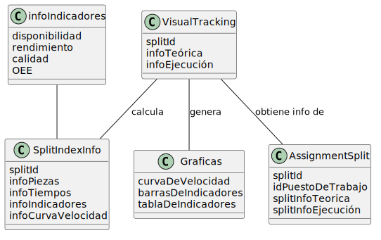
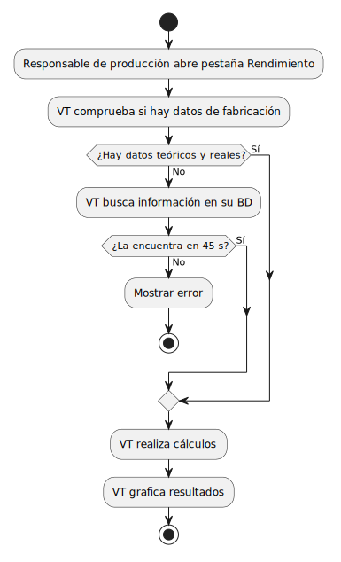

# Modelo del dominio

El modelo del dominio permite representar los principales elementos que intervienen en el sistema y las relaciones existentes entre ellos. 

En este caso, el dominio se sitúa en el entorno de producción de Visual Tracking, donde conviven datos teóricos definidos durante la planificación y datos reales generados durante la ejecución.

## Diagrama de clases
#### Cálculo de indicadores de OEE en VT

## Diagrama de objetos
#### OEE en gráfica de barra horizontal

#### Rendimiento en tabla comparativa

## Diagrama de estados de partición

## Diagrama de estados de gráfica

## Diagrama de actividad

